# Aggregation by Administrative Regions

* *Degree of Difficulty*: **

* *Goal*: Explore the different types of administrative aggregation available through the `STYLE` tab in BUILDER

* *Features Highlighted*:
	* Style: aggregations
	* Widgets: filtering

* *Datasests needed*:
	* ne_10m_populated_places_simple dataset from CARTO [Data Library](https://carto.com/dataset/ne_10m_populated_places_simple)

<!-- MarkdownTOC -->

- 1. Import and create map
- 2. Visualize the different aggregations
- 3. Other aggregations
- 4. Style the aggregation

<!-- /MarkdownTOC -->

## 1. Import and create map
### 1. 1. Use the link above to download the dataset and import it to the account.
* Just drag and drop the file into the CARTO Maps interface and wait for the dataset to be imported. The map should be automatically created.

## 2. Visualize the different aggregations
### 2. 1. Select an aggregated visualization
* Click on the layer and then on `STYLE` to access the visualization properties.
* Scroll horizontally on the first section to find the `ADM. REGIONS` aggregation method

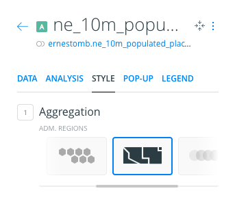

* This will create an aggregated visualization using the world borders polygons.
* By default, it will use countries and `COUNT` aggregation method

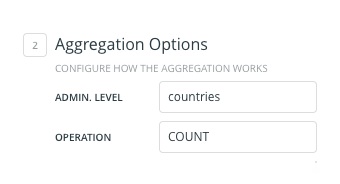

* It means that each country will be assigned a color depending on the number of populated places that lie inside their territory

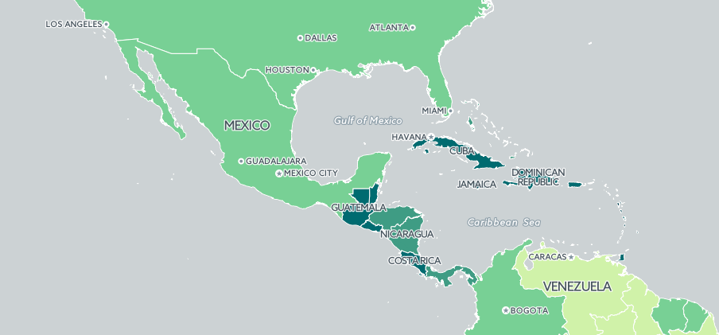

* Note that the aggregation is already normalized. There are certainly more cities in México than in Guatemala, but the density is higher in the latter, thus the darker color.

#### 2. 2. Exploring other possibilities
* Use the `OPERATION` input field to select `SUM` and `pop_max` in the columns' dropdown

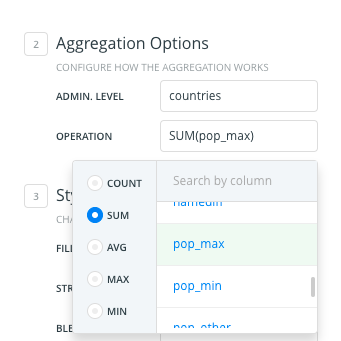

* With those settings, we're aggregating the cities inside each country, but also aggregating the population of each city with a sum. The result of that sum will be the citie's population in each country, and of course, the map will be styled according to that.

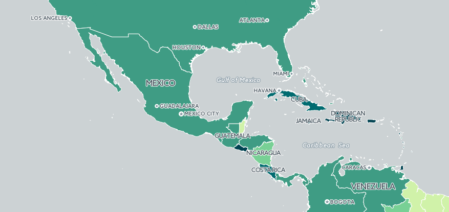

* Note the difference between this one and the previous aggregation
* We could apply any aggregation function in the list:
	* `COUNT`: Will count the number of features aggregated
	* `SUM`: Will sum the value in the selected column for the aggregated features
	* `AVG`: Will calculate an arithmetic average of the value in the selected column for the aggregated features
	* `MAX`: Will select the maximum value in the column for the aggregated features
	* `MIN`: Will select the minimum value in the column for the aggregated features

* **Exercise:** Create a choropleth map that shows which country has the most populated city

### 2. 3. Aggregation by provinces

For some countries, CARTO has geometries of their administrative level 1. That usually match provinces, states or other administrative levels superior to the local scale

* Use the `ADMIN. LEVEL` input to select `provinces`

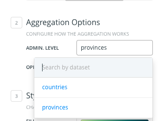

* Wait for the map to be calculated and see how the choropleths have been created using the selected aggregation function. In this case, same as before: `SUM(pop_max)` (or _sum the population in the aggregated cities_)

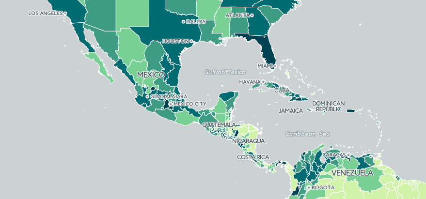

## 3. Other aggregations
There are also other possibilities when it comes to visualizing aggregated data with Builder. Let's make a quick overview of them
### 3. 1. Squares aggregation
* Use the `Aggregation` selector, scrolling horizontally to find the `SQUARES` method

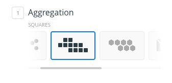

* You could use the other parameters to configure the size of the grid, as well as the aggregation method, same as we already saw with the Admin. Region aggregation. 

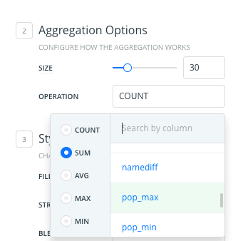

* Note that currently in Builder, the size of the grid is set in pixels for the zoom level at the moment of the setting. Zooming in or out won't make the grid readapt, but will have the same fixed size across different zoom levels.

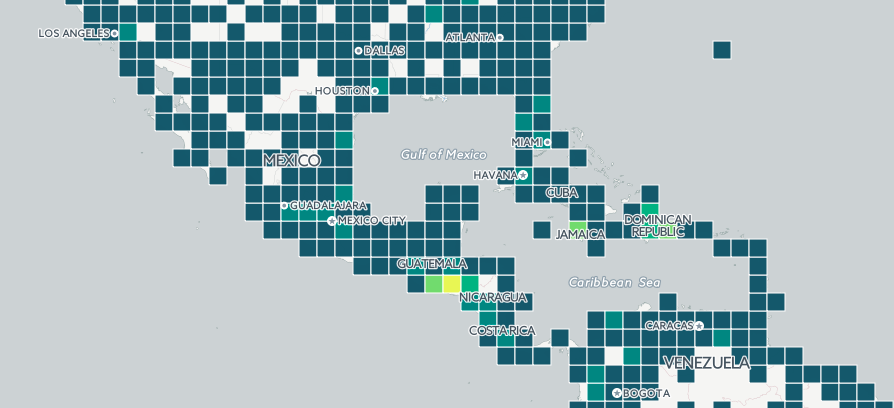

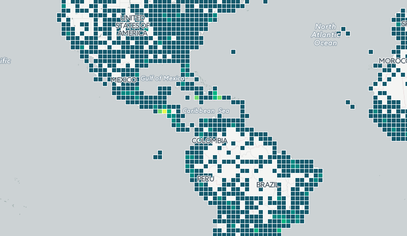

### 3. 2. Hexabins aggregation

* Use the `Aggregation` selector to find the `HEXBINS` method.  

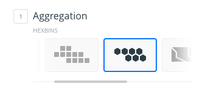

* This method will create an hexagonal grid to aggregate the features in the map.

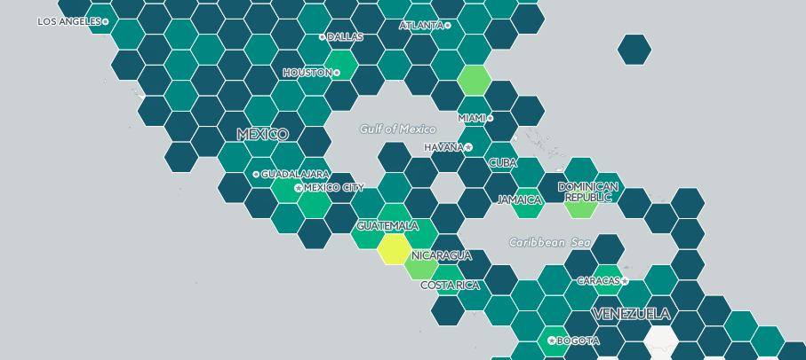

* Apart from the different shape of the grid, there isn't any other difference bettween this aggregation method and the `SQUARES` one.
* Same as before, the size of the grid is set in pixels for the zoom level at the moment of the setting. Zooming in or out won't make the grid readapt, but will have the same fixed size across different zoom levels.

## 4. Style the aggregation
### 4. 1. Use the `Style` options
* After selecting any kind of `Admin. Region` aggregation, it's possible to style it as it would be with any other layer

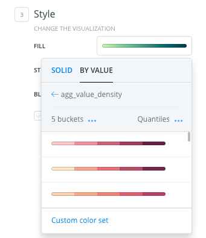

* We could play with different ramps, number of buckets and classification methods to get the map that suits our needs.

* **Exercise:** Create a grid map of your choice to show the average world citie's population. 