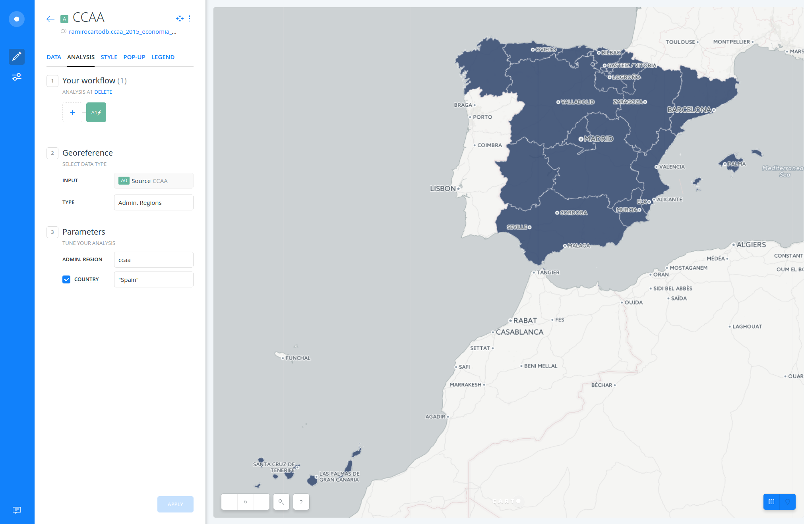
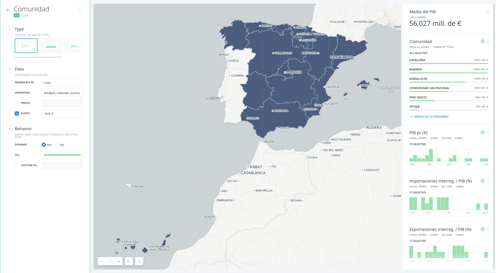
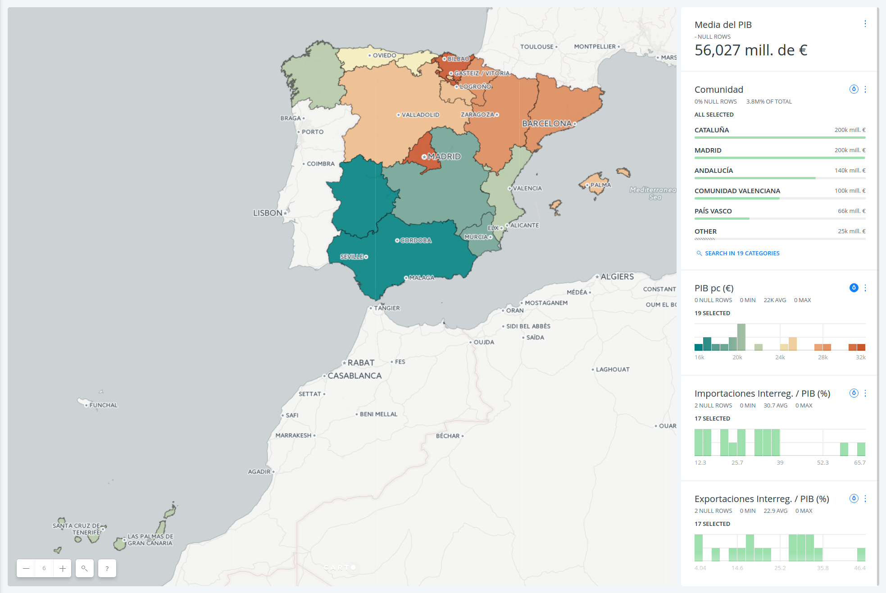
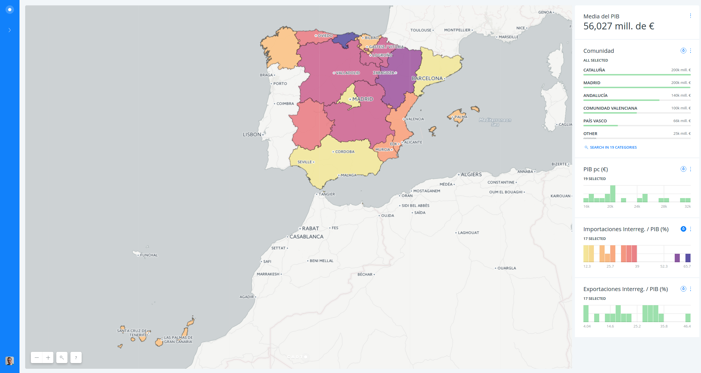

# San Francisco tree map

* *Degree of Difficulty*: **
* *Goal*: How to display several thematic maps in the same visualization thanks to BUILDER auto-style feature
* *Features Highlighted*:
  * Analysis: `Georeference` by `Admin. Regions`.
  * Widgets: category, formula and histograms.
  * Auto-style
* *Datasests needed*:
  * `ccaa_2015_economia_comercio` dataset: data from Spanish CCAAs from 2015 about economy and commerce.

1. [Import and create map](#map)  
2. [Georeference](#geo)  
3. [Widgets](#widgets)  
4. [Autostyle](#auto)  
5. [Public and share map](#public)  

## 1. Import and create map  

### 1. 1. Import the `ccaa_2015_economia_comercio` as a `xlsx` file into your DATASETS dashboard.

* Download the dataset from [here]()
* Go to your account and import it using the *NEW DATASET* options
* Select **CONNECT DATASET**
* Drag and drop the file

### 1. 2. Dataset view 

* Take a look on the dataset
* Switch between the metadata and the SQL view, try any simple query like limiting the result.

### 1. 3. Click on **CREATE MAP**

* Change the name of the map to **Spanish CCAA Economic and Commerce Data (2015)** (double click!)
* Change the name of the layer to **Spanish CCAA**

## 2. Georeference  

### 2. 1. Georeference by Admin. Regions

* After clicking on **Spanish CCAA** layer, it will direct you to the `STYLE` tab. But because the layer has not geometries, it is not possible to style it.
* So we will click on **Georefence** and set the following parameters as follow:
  * **TYPE**: `Admin. Regions`
  * **ADMIN. REGION**: `ccaa`
  * **COUNTRY**: click on the checkbox, type `Spain` and select this option
  * Click on **APPLY**.

* A new layer node was created: `A1 Georefence`.

## 3. Widgets  

### 3. 1. Add widgets

* Navigate back to  `WIDGETS` pane and click on *ADD WIDGET*.
  * In the options of the *CATEGORY* tab, check the *ccaa*. Make sure you are adding a widget from the `A1` layer node.
  * In the options of the *HISTOGRAM* tab, check `pib_per_capita_euros`, `importaciones_interregionales_porcentaje_pib` and `exportaciones_porcetaje_pib`.
  * In the options of the *FORMULA* tab, check `pib_millones_euros`.
  * Click on **CONTINUE**.

### 3. 2. Order and edit widgets

* Reorder the position of widgets.
* Double click on the widget title in order to change the title name.
* Edit the category widget as follow:
  * **OPERATION**: `AVG(pib_millones_euros)`
  * **SUFFIX**: `mill. €`.

## 4. Autostyle  

### 4. 1. How to use auto-style

* Click on the droplet button at the right upper coner of a category or histogram widget.

*If you want to know more about auto-style feature, check [this blog post](https://carto.com/blog/data-driven-maps-auto-style).

## 5. Public and share map  

* At the bottom of the main menu, click on **SHARE** at the right button corner.
* Go to **PUBLISH** tab and click on *PUBLISH* button that is below the Map name in order to share our map.
* After clicking on *P*UBLISH**, we can select the options that we want to share our map.
  * Get the link URL and paste it on other browser tab: https://team.carto.com/u/ramirocartodb/builder/b976e446-33c9-11e7-9d09-0e3ff518bd15/embed

