# Categories + Bubble visualization

* *Degree of Difficulty*: **

* *Goal*: Create a bivariate visualization with BUILDER

* *Features Highlighted*:
	* Style: Advanced use of `BY VALUE` visualizations
	* Widgets: Formulas + Histograms

* *Datasests needed*:
	* ne_10m_populated_places_simple dataset from CARTO [Data Library](https://carto.com/dataset/ne_10m_populated_places_simple)

## Contents

<!-- MarkdownTOC -->

- 1. Import and create map
	- 1. 1. Import from the Data Library
- 2. Style the map
	- 2. 1. Categories visualization
- 3. Widgets
	- 3. 1. Add and configure widgets to explore your data
- 4. Exercise

<!-- /MarkdownTOC -->

## 1. Import and create map

### 1. 1. Import from the Data Library

Look for the dataset named `ne_10m_populated_places_simple` on the Data Library and import it on your account, then you can create a map with it. Alternatively you can directly create a new map and then search for the dataset.

## 2. Style the map
### 2. 1. Categories visualization
* Select `NONE` in the aggregation selector and go directly to the `Style` section

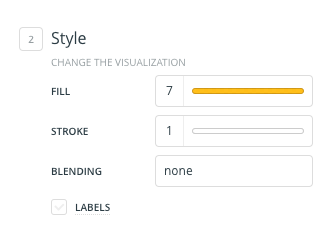

* Click on the color bar and select `BY VALUE`. Then scroll down to find `featurecla` column. It has information about the kind of places there are.

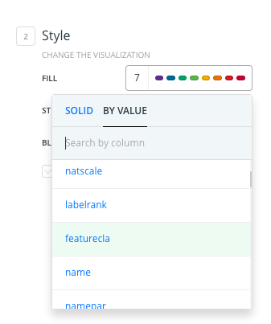

* You'll see that a legend has automatically been generated
* Click on the three points next to the layer name to change the layer name and see how it updates in the legend

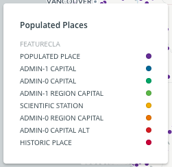

* Now click on the number that sets the marker size and choose `BY VALUE`
* Use the search bar to find `pop_max` column

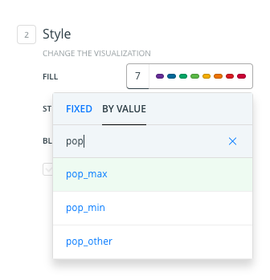

* Use the controls to set the number of buckets, classification method and minimum/maximum size.

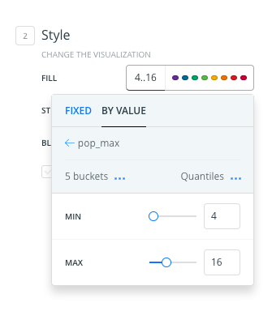

* We could also add labels with the name of each place. Set `Overlap` option to `false` to avoid the labels overlap each other.

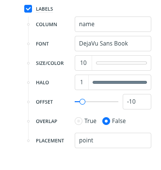

## 3. Widgets
### 3. 1. Add and configure widgets to explore your data
* Go back to the layer list and click on `WIDGETS` tab

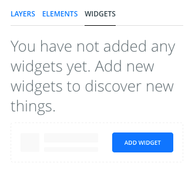

* From `CATEGORY` section select `adm0name`
* Switch to `HISTOGRAM` and select `pop_max`
* On `FORMULA` select also `pop_max`

* Click on continue
* Use the menu to enter each widget configuration and set it as follows:

* For the **category** widget:

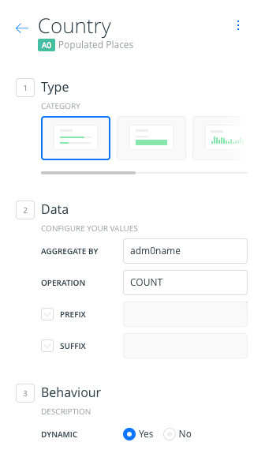

* For the **histogram** widget:

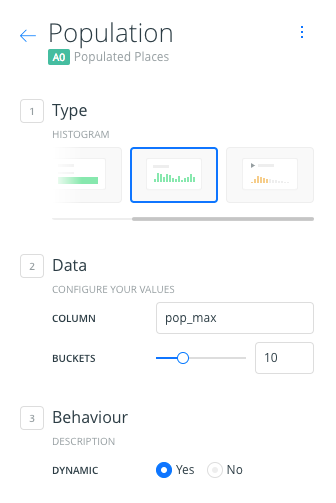

* The **formula** widget requires a bit more of attention, as we need to select which calculation will be done.
* In order to get the total population that lives in the cities in the current map view, we need to select `poo_max` as column and `sum` as operation.

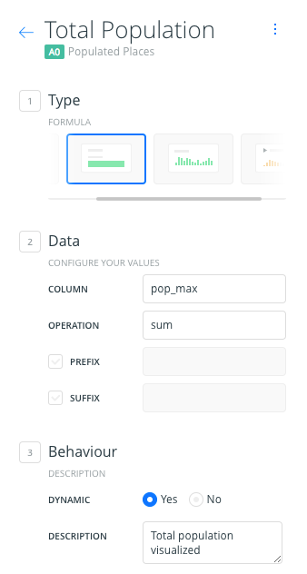

* We could use the widget list to reorder them

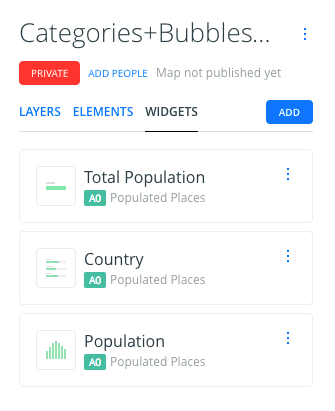

* And check the results. Note how the widgets react to the map view, as well as to filters applied through other widgets.

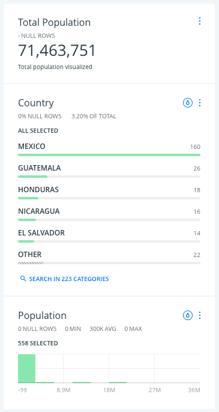

## 4. Exercise

Use the widgets to find the average population of the most populated places in Mexico. **Tip:** you may need to change some parameter from the widgets settings.