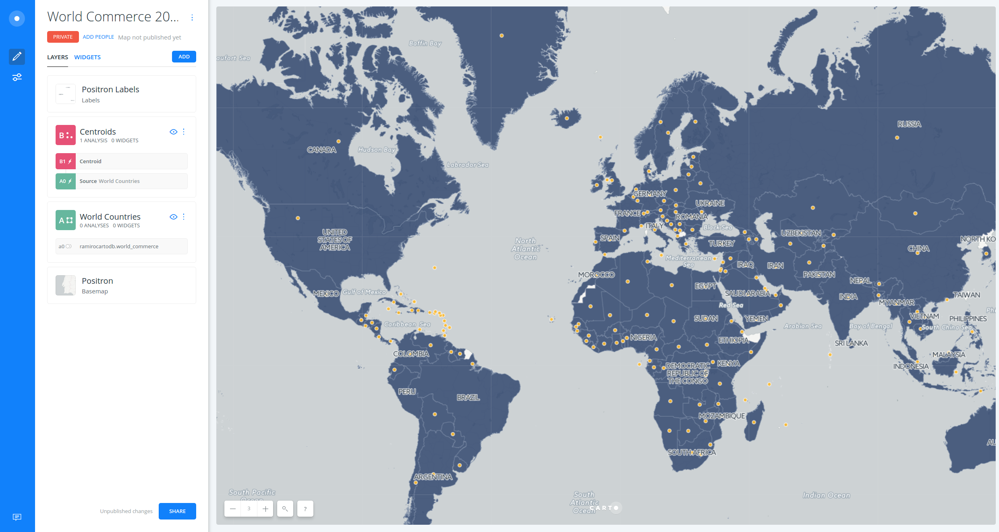

# How to show two symbologies in the same layer

* *Degree of Difficulty*: **
* *Goal*: How to display two different symbologies in the same layer
* *Features Highlighted*:
  * Analysis: `Find centroids of geometries`
  * Layers: how to work with layer nodes
  * Style: choropleth and bubble maps
* *Datasests needed*:
  * `world_commerce` dataset: world country data from 2015 about economy and commerce.

1. [Import and create map](#map)  
2. [Get centroids](#centroids)  
3. [Style](#style)  
4. [Public and share map](#public)  

## 1. Import and create map  

### 1. 1. Import `world_commerce` file into your DATASETS dashboard.

* Download the dataset from [here](https://builder-demo.carto.com/api/v2/sql?q=SELECT+*+FROM+world_commerce&format=geojson&filename=world_commerce)
* Go to your account and import it using the **NEW DATASET** options
* Select **CONNECT DATASET**
* Drag and drop the file

### 1. 2. Dataset view 

* Take a look on the dataset
* Switch between the metadata and the SQL view, try any simple query like limiting the result.

### 1. 3. Click on **CREATE MAP**

* Change the name of the map to **World Economic and Commerce Data (2015)** (double click!)
* Change the name of the layer to **World Countries**

## 2. Get centroids  

### 2. 1. `Find centroids of geometries` analysis

* Click on **World Countries** layer and go to `ANALYSIS` tab
* Click on `ADD ANALYSIS` button
* Select `Find centroids of geometries` analysis
* Click on `ADD ANALYSIS` button and set the analysis parameters as follow:
  * **CATEGORIZE..**: `country`
  * **AGGREGATE...**: `SUM(exports_total)`
* Click on **APPLY**

### 2. 2. Recover the original layer

* Go back to the main menu and click and drag the `A1 Centroid` analysis node out (on top)
* Now there are two layers*: 
  * `A World Countries` (connected to the original dataset) - POLYGONS
  * `B Wolrd Countries` (conneceted to `A0` as the original layer in which the centrodis has been generated) - POINTS
* Rename `B` layers to `Centroids`.

*To know more about map layers, check [this guide](https://carto.com/learn/guides/intro/understanding-map-layers-in-builder).

## 3. Style  

### 3. 1. Style centroids as bubbles

* Click on `Centroids` layer
* Click on marker width (is showing `7` by default), select `BY VALUE` and choose `value`.
* Set the **MIN** and **MAX** as `5` and `20` respectively, and `jenks` as classification method.

### 3. 2. Style polygons as thematic choropleth

* Click on color fill (is showing yellow/orange by default), select `BY VALUE` and choose `gdp`.
* Choose a color scheme and set `jenks` as classification method.

* You can edit the legend and add widgets and popups.

*To know more about style maps by value, check [this guide](https://carto.com/learn/guides/styling/style-by-value).

## 4. Public and share map  

* At the bottom of the main menu, click on **SHARE** at the right button corner.
* Go to **PUBLISH** tab and click on **PUBLISH** button that is below the Map name in order to share our map.
* After clicking on **PUBLISH**, we can select the options that we want to share our map.
  * Get the link URL and paste it on other browser tab: https://team.carto.com/u/ramirocartodb/builder/f434a3ce-33e3-11e7-9d60-0e05a8b3e3d7/embed

