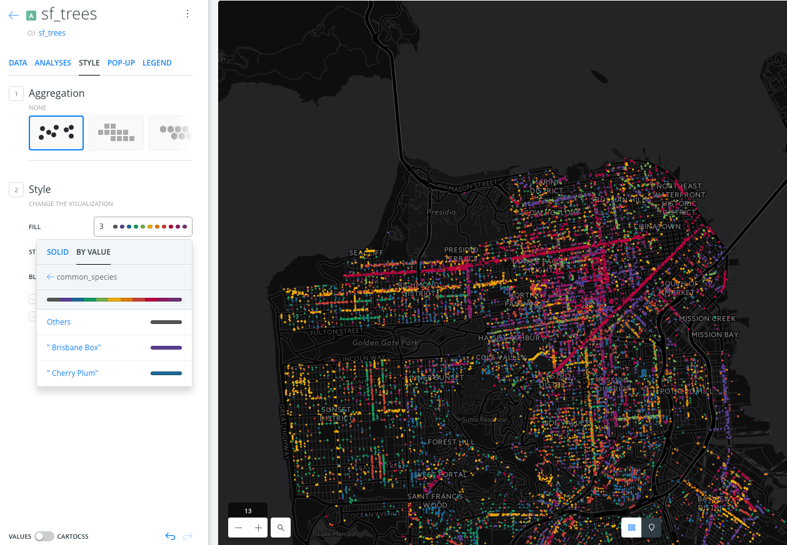
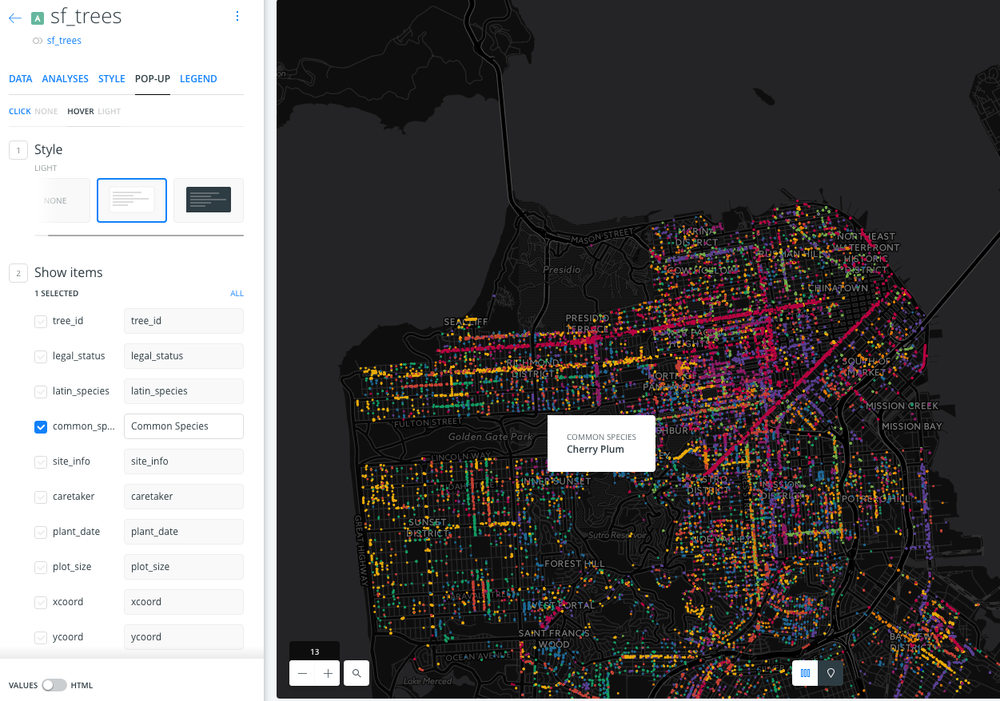
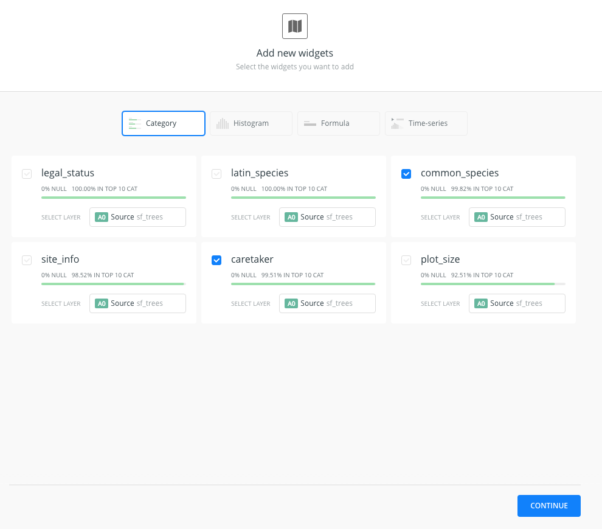
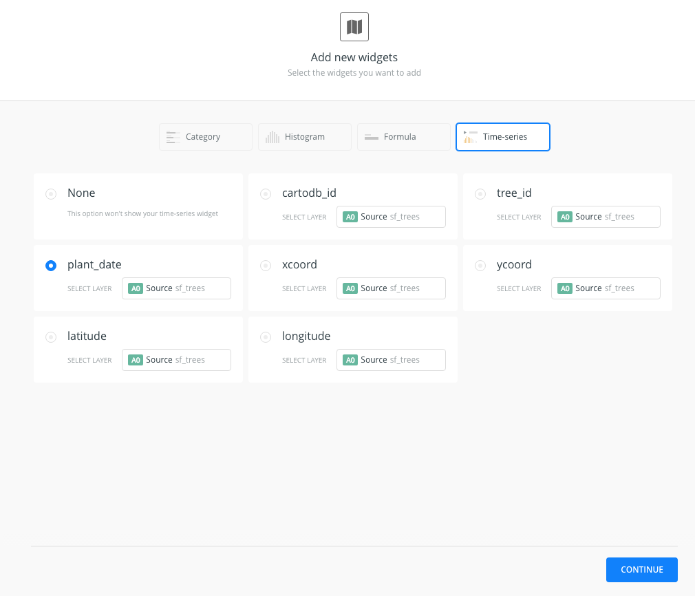
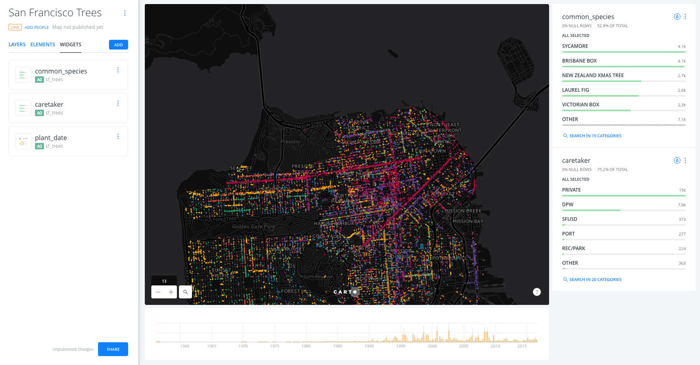
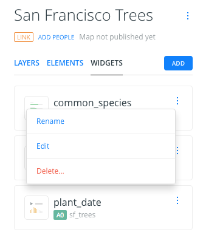
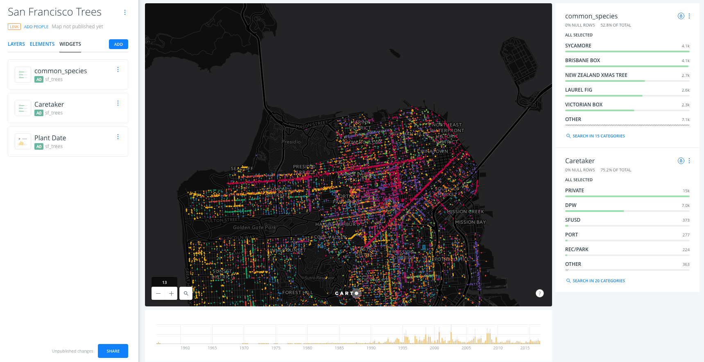
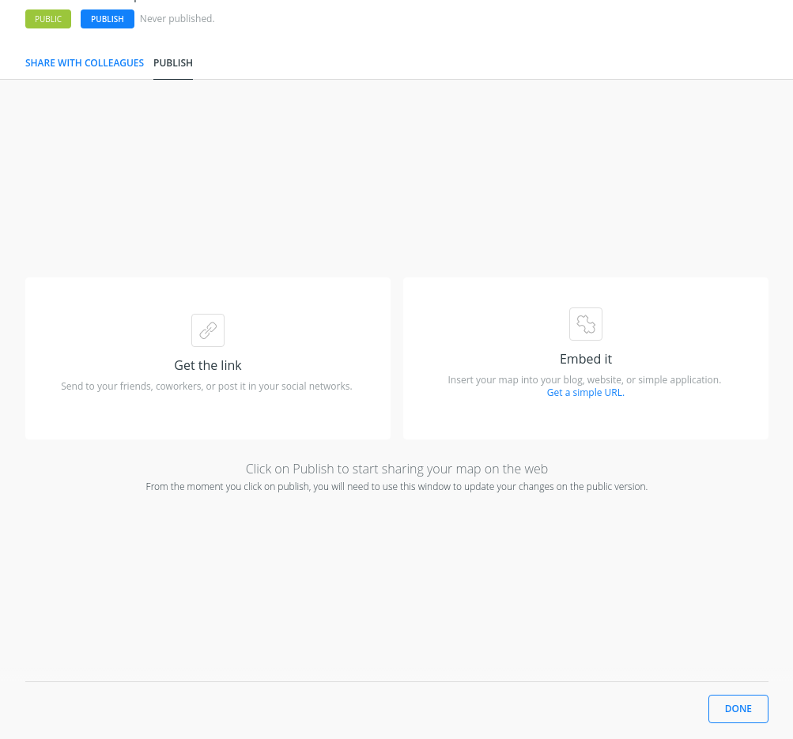
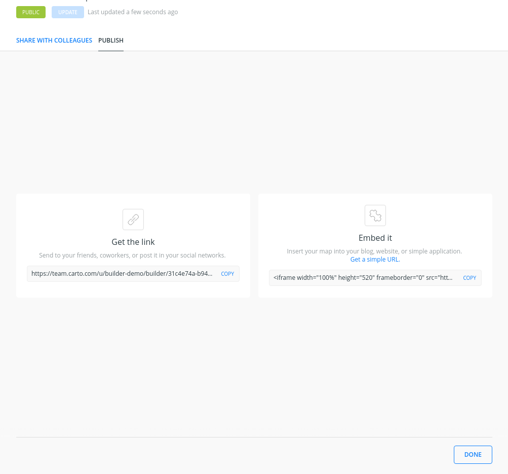

# San Francisco tree map

* *Degree of Difficulty*: **
* *Goal*: Display the different kinds of trees in San Francisco and when they were planted.
* *Features Highlighted*:
  * Widgets: Category and time-series widget.
* *Datasests needed*:
  * sf_trees dataset from the [San Francisco Trees map](https://team.carto.com/u/builder-demo/viz/10be49bc-6683-466e-8cbe-c11d4ef4aa95/public_map)

<!-- MarkdownTOC -->

- 1. Import and create map
  - 1. 1. Import the ``Street Tree List`` as a csv file into your dataset dashboard.
  - 1. 2. Dataset view
  - 1. 3. Click on ``CREATE MAP`` from the ``Street Tree List`` dataset.
- 2. Layers and styles
  - 2. 1. Ordering of the layers in the Builder
  - 2. 2. Layer options
- 3. Widgets
  - 3. 1. Category Widget
  - 3. 2. Time series widget
  - 3. 3. Change order and name of widgets
- 4. Share map

<!-- /MarkdownTOC -->

## 1. Import and create map

### 1. 1. Import the ``Street Tree List`` as a csv file into your dataset dashboard.

* Go to https://team.carto.com/u/builder-demo/tables/sf_trees/public/map
* Download the dataset as a CSV
* Go to your account and import is using the `NEW DATASET` wizard

### 1. 2. Dataset view

* Take a look on the dataset
* Switch between the metadata and the SQL view, try any simple query like limiting the result.
* Take a look on the spatial distribution using the `PREVIEW` window.

### 1. 3. Click on ``CREATE MAP`` from the ``Street Tree List`` dataset.

* Change the name of the map to ``San Francisco Trees``

> **Warning**: after renaming a layer a error could pop up saying "the map cannot be rendered", don't worry about this. Refresh the page and it will dissapear.

## 2. Layers and styles

### 2. 1. Ordering of the layers in the Builder

* Change the basemap to the dark_matter (labels below) basemap and check the different basemaps options.

* Note how the layer we added gets the `a0` identifier. This is not important now but it will be later when adding analysis and widgets.

### 2. 2. Layer options

* `DATA`:
  * This interface gives a general view of the fields the layer, its name and its data type but also from there you can add them as widgets.
  * Switch to `VALUES` to `SQL`. The SQL panel allows more advanced users to manage data in a more precise way.
  * Finally, use the button in the bottom center of the map to switch between the table and the map view.

* `STYLE`:
  * In the ``Aggregation menu``, select the ``None`` option.
  * In the ``Fill`` options, select the ``By Value`` option and then choose the ``common_species`` option to color the dots depending on the values of the ``common_species`` values.
  * Change the size of the dots to 3 and change the stroke value of the points to 0.

* `POP-UPS`:
  * Select the Hover tab and the light style for the hover infowindow.
  * In the ``Show Items`` section of the hover menu, select the ``common_species`` field and change its name to *Common Species*.
  * By doing this, a pop-up will appear when we hover over the points on the map.

## 3. Widgets

### 3. 1. Category Widget

* Back to the main menu, select the ``WIDGETS`` tab and select the ``ADD WIDGET``.
* In the options of the ``Category`` tab, select the ``common_species`` and ``caretaker`` checkboxes in order to have widgets that display the different categories of the ``common_species`` and ``caretaker`` fields. Click ``CONTINUE``to add the widgets on the map.

### 3. 2. Time series widget

* Back to the main menu, select the ``WIDGETS`` tab and select the ``ADD WIDGET``.
* In the options of the ``Time-series`` tab, select the ``plant_date`` checkbox in order to display the dates were the trees were planted. Click ``CONTINUE``to add the widgets on the map.

### 3. 3. Change order and name of widgets

* Back to the main menu, select the ``WIDGETS`` tab to see a list with the widgets that we have added.
* We can drag and drop the widgets in the widget menu to change their order.

* We can change the name of our widgets by selecting the ``rename`` option of the widget menu or by doing a double click on the widget name in the widgets menu.

* Change the name of the ``common_species`` widget to ``Common Species``, the name of the ``caretaker`` widget to ``Caretaker`` and the name of the ``plant_date`` widget to ``Plant Date``.

## 4. Share map

* At the bottom of the main menu, click the ``Share`` button.
* Select the ``Publish`` tab and click on the ``Publish`` button that is below the Map title in order to share our map.

* After clicking the ``Publish`` button, we can select the option that we want to share our map.

