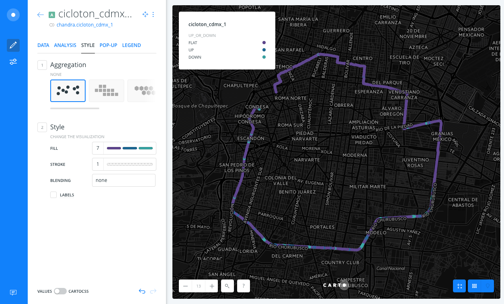

# Animated map

* *Degree of Difficulty*: **

* *Goal*: Create a map based on animated data with BUILDER

* *Features Highlighted*:
	* Style: animated map, category map
	* Widgets: time series, histograms

* *Datasests needed*:
	* A [cycling race track](https://github.com/CartoDB/cdmx-training/blob/master/01-builder-visualization/exercises/maps/cicloton_cdmx.gpkg?raw=true) from Mexico City

<!-- MarkdownTOC -->

- Import and create map
- Change base map
- Animated map
- Positions layer
- Widgets
- Adding category style

<!-- /MarkdownTOC -->

## Import and create map

* Use the link above to download the dataset and import it to the account.
* Just drag and drop the file into the CARTO Dashboard and wait for the dataset to be imported. The map should be automatically created.

## Change base map

* Select *Dark Matter* basemap

## Animated map

* Select the layer and move to the *STYLE* tab
* Scroll horizontally on the *Aggregation* section to find *ANIMATED*
* Select `time` on the *COLUMN* parameter in order to animate your map by the timestamp of the position
* Experiment with the rest of the parameters and see how they affect your map visualization
  * Point properties: *FILL*, *STROKE* and *BLENDING*
  * *DURATION*
  * *NUMBER OF STEPS* (what happens with just `1` step?)
  * Accumulative or not?
  * Number of *TRAILS*
  * *RESOLUTION* (hint: make it really big)

## Positions layer

* Add again the dataset so you can have the track as a static image
* Style it in a way it's easy to view. You probably want to remove the stroke, select a light color, etc.
* Add a pop up on hover to render speed and elevation.

## Widgets

Add the following widgets using the mentioned fields:

* Total number of positions (`cartodb_id`)
* Average speed (`speed_kmh`)
* Average elevation (`ele`)
* Speed histogram (`speed_kmh`)
* Elevation difference (`diff_ele`)

Tweak the labels, suffixes, number of bins, etc so you get a nice map of the track.

## Adding category style

Besides styling data by a time field, you can also style data by a column value. Select the data layer you styled as an animated map:

* Navigate to the *STYLE* tab
* Select on the *Aggregation* section, choose "none" for the aggregation
* Click on the color fill bar next to "FILL" on the *Style* section
* In the upper left hand side of the color picker, select "BY VALUE" (not "SOLID"). Choose the "up_or_down" column from the column list that appears.
* To see your data values better, select the color bar next to *Stroke*. In the color picker, change the opacity from "1" (located in the lower right hand side) to "0"

