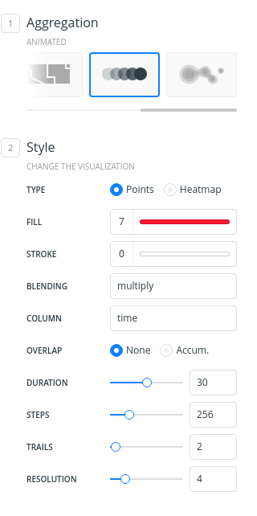
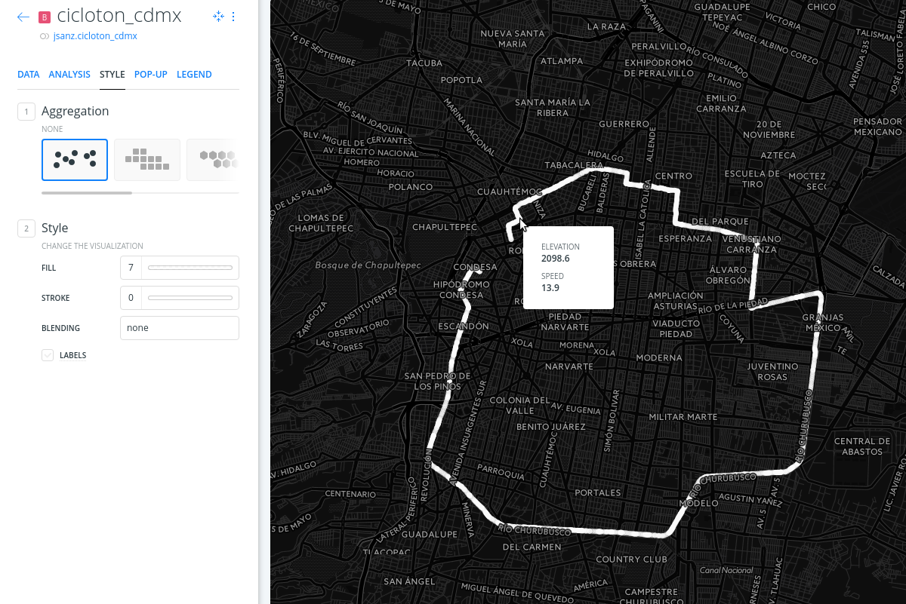
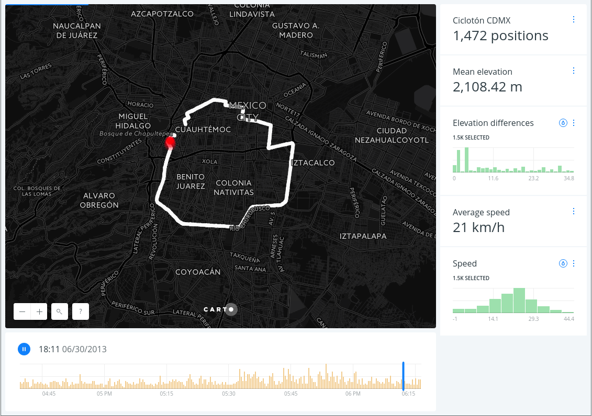

# Animated map

* *Degree of Difficulty*: **

* *Goal*: Create a map based on animated data with BUILDER

* *Features Highlighted*:
	* Style: animated map
	* Widgets: time series, histograms

* *Datasests needed*:
	* A [cycling race track](https://github.com/CartoDB/cdmx-training/blob/master/01-builder-visualization/exercises/maps/cicloton_cdmx.gpkg?raw=true) from Mexico City

<!-- MarkdownTOC -->

- 1. Import and create map
- 2. Change base map
- 3. Animated map
- 4. Positions layer
- 5. Widgets

<!-- /MarkdownTOC -->

## 1. Import and create map

* Use the link above to download the dataset and import it to the account.
* Just drag and drop the file into the CARTO Dashboard and wait for the dataset to be imported. The map should be automatically created.

## 2. Change base map

* Select *Dark Matter* basemap

## 3. Animated map

* Select the layer and move to the *STYLE* tab
* Select `time` on the *COLUMN* parameter in order to animate your map by the timestamp of the position
* Experiment with the rest of the parameters and see how they affect your map visualization
  * Point properties: fill, stroke and blending
  * Duration
  * Number of steps (what happens with 1 step?)
  * Accumulative or not?
  * Number of trails
  * Resolution (hint: make it really big)

## 4. Positions layer

* Add again the dataset so you can have the track as a static image
* Style it in a way it's easy to view. You probably want to remove the stroke, select a light color, etc.
* Add a pop up on hover to render speed and elevation.

## 5. Widgets

Add the following widgets using the mentioned fields:

* Total number of positions (`cartodb_id`)
* Average speed (`speed_kmh`)
* Average elevation (`ele`)
* Speed histogram (`speed_kmh`)
* Elevation difference (`diff_ele`)

Tweak the labels, suffixes, number of bins, etc so you get a nice map of the track.

