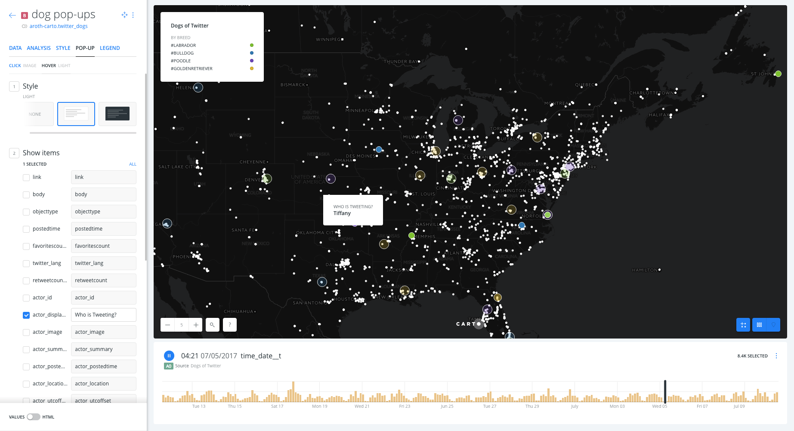

# Twitter Pop-Ups & Time Slider Visualization

* *Degree of Difficulty*: :star::star::star:
* *Goal*: Create a time-enabled visualization that includes useful pop-ups using data pulled from Twitter with BUILDER.
* *Features Highlighted*:
  * Style:
    - Enabling time-based elements of your data for advanced visualization;
    - Making the most of your data by adding and altering pop-ups to display useful information at a glance.
  * Layers: how to work with layer nodes
  * Widgets: Formulas + Histograms
* *Datasests needed*:
  * `twitter_dogs` dataset: twitter data on based on dog breed search terms from 6/11/2017 - 7/10/17.


1. [Import and create map](#map) <br>
2. [Style](#sty) <br>
3. [Widgets](#widgets) <br>
4. [Publish and share map](#pub) <br>

<hr>

## 1. Import and create map <a name="map"></a>

### 1. 1. Import `twitter_dogs` file into your DATASETS dashboard.

* Download the dataset from [here](https://builder-demo.carto.com/api/v2/sql?q=SELECT+*+FROM+twitter_dogs&format=csv&filename=twitter_dogs).
* Go to your account and import it using the **NEW DATASET** options.
* Select **CONNECT DATASET**.
* Drag and drop the file.

### 1. 2. Dataset view

* Take a look on the dataset.
* Take note of which columns seem to be the most useful/interesting things in the dataset.

### 1. 3. Click on **CREATE MAP**

* Change the name of the map to `Dogs of Twitter`.
  - To change the name of the map, double click the title, enter your new title, and hit enter to save the new title.
* Change the name of the layer to `Dogs of Twitter`.
  - To change the name of the layer, double click the title, enter your new title, and hit enter to save the new title.
* Click on the **Basemap** layer. Change the **STYLE** to `Dark Matter (Labels Below)`.
* In the top left corner, press the back arrow to navigate back to the **LAYERS** pane.

<hr>

## 2. Style <a name="sty"></a>

### 2. 1. Styling Time-Based Elements

* After clicking on the **Dogs of Twitter** layer, it will direct you to the **STYLE** tab.
* Change the **aggregation style** to `Animated`.
* Set the style options as follows:
  * **FILL**: click on the orange color bar, in the color wheel that opens, select `BY VALUE`, style by `category_terms`. Color these as you see fit by clicking on the color in line with the term you want to change.
  * **COLUMN**: `postedtime`.


* Click on the **LEGEND** tab. Set the style to `CUSTOM`. Check the box to add title and enter `By breed` to give your legend enough detail to be useful.

### 2. 2. Styling Pop-ups

* Pop ups can't be added to animated map layer, so we will need to add our `twitter_dogs` layer again in order to enable pop ups in the new layer.
* In the top left corner, press the back arrow to navigate back to the **LAYERS** pane.
* Click on **ADD**.
* Click on `twitter_dogs`, click **ADD LAYER** in bottom right.
* A new layer **B** has been added.
* Click into this new layer, rename it `dog pop-ups`
* Set the **FILL SIZE** to `4`, set the **FILL COLOR HEX** to `#ffffff` (white).


* Click on the **POP-UP** tab
* In the **CLICK** pop-up menu, set style to `IMAGE`
* Check off the following items, and drag them into the order they are listed:
  * `actor_image`
    - This field needs to be first to make sure that it is read first as the image URL.
  * `actor_displayname`
  * `actor_preferredusername`
  * `body`
  * `link`


* In the **HOVER** pop-up menu, set style to `LIGHT`
* Check the box for `actor_displayname` and change the type field next to it to `Who is Tweeting?`



* Go back to the `CLICK` pop-up menu, and use the bottom toggle to switch to HTML mode

##### Deleting the heading "actor_preferredusername" and adding an @ before the user name

* Find this piece of code:
```
<div class="CDB-infowindow-listItem CDB-infowindow-listItem--order2">
    <h5 class="CDB-infowindow-subtitle">actor_preferredusername</h5>
    <h4 class="CDB-infowindow-title">{{actor_preferredusername}}</h4>
```
and alter it as follows:
```
<div class="CDB-infowindow-listItem CDB-infowindow-listItem--order2">
    <h5 class="CDB-infowindow-subtitle"></h5>
    <h4 class="CDB-infowindow-title">@{{actor_preferredusername}}</h4>
```

##### Deleting the heading "body"

* Find this piece of code:
```
<div class="CDB-infowindow-listItem CDB-infowindow-listItem--order3">
<h5 class="CDB-infowindow-subtitle">body</h5>
<h4 class="CDB-infowindow-title">{{body}}</h4>
```
and alter it as follows:
```
<div class="CDB-infowindow-listItem CDB-infowindow-listItem--order3">
<h5 class="CDB-infowindow-subtitle"></h5>
<h4 class="CDB-infowindow-title">{{body}}</h4>
```

##### Making a clickable hyperlink that will open the linked tweet in a new browser tab

* Find this piece of code:
```
<div class="CDB-infowindow-listItem CDB-infowindow-listItem--order4">
    <h5 class="CDB-infowindow-subtitle">link</h5>
    <h4 class="CDB-infowindow-title">{{link}}</h4>
```
and alter it as follows:
```
<div class="CDB-infowindow-listItem CDB-infowindow-listItem--order4">
    <h5 class="CDB-infowindow-subtitle"></h5>
    <h4 class="CDB-infowindow-title"><a href="{{link}}" target="_blank">View Tweet</a></h4>
```

* Click `APPLY`.


<hr>

## 3. Widgets <a name="widgets"></a>

### 3. 1. Add widgets

* Navigate to  the **WIDGETS** pane.
  * You will notice that your time slider is already present.
* Click `ADD`.
  * In the options of the **CATEGORY** tab, check the *category_terms* widget. Make sure you are adding a widget from the `A0` layer node.
  * In the options of the **FORMULA** tab, check `retweetcount` and `actor_followerscount`, again making sure you are adding the widget with the source as `A0`.
* Click on `CONTINUE`.

### 3. 2. Order and edit widgets

* Navigate back to the **WIDGETS** pane.
* **Click the *time_date_t* widget.**
  - Change the title to **When are people tweeting?**.
    - To change the name of the widget, double click the title, enter your new title, and hit enter to save the new title.
  - You can also change the color of the widget time series bars if you would like by selecting the **FILL** color option at the bottom of the widget pane

* **Click the *retweetcount* widget.**
  - Change the title to **How popular are these tweets?**
  - Make sure the type is set to `FORMULA`.
  - Change the **OPERATION** to `SUM(retweetcount)`
  - Add the **SUFFIX**: ` retweets` to let your viewers know what the number they are looking at means.
    - Be sure to include a space before `retweets` so your values will read `12345 retweets`, not `12345retweets`.
  - Widgets are only as good as the data you provide to them. You don't always want the viewers to interpret what each item means. Go ahead and add a description for the widget. In this case, I am going to explain the purpose of a retweet. Here's what I am saying:
    - `A tweet's life cycle isn't done  after it's been sent. Someone who sees a tweet and likes it can retweet it, and share it with all of their followers too! Talk about exponential spread!`

* **Click the *category_terms* widget.**
  - Change the title to **What breed is most popular?**
  - Make sure the type is set to `CATEGORY`.
  - Make sure your settings for the following are correct:
    - **AGGREGATE BY**: `category_terms`
    - **OPERATION**: `COUNT`
  - You can change the color of the widget bars now too if you'd like.

* **Click the *actor_followerscount*  widget.**
  - Change the title to **How many people saw these?**
  - Make sure the type is set to `FORMULA`.
  - Change the **OPERATION** to `SUM(actor_followerscount)`.
  - Add the **SUFFIX**: ` people`.
  - Add a helpful description, here is mine:
    - `If someone sends out a tweet, all of their followers get to see it on their timelines.`

* From the widgets pane, you can reorder the widgets and how they are displayed on the map by dragging and dropping each widget option in the pane.


<hr>

## 4. Publish and share map <a name="pub"></a>

* At the bottom of the layer pane, click on **SHARE** at the right button corner.
* Click on **PUBLISH** below the map name, then navigate to the **PUBLISH** tab in order to share our map.
* Once in the **PUBLISH** tab, we can see the different options for sharing the map, including a URL to a public map page and iframe embed code for sharing the map on an external website.
  * Get the link URL and paste it on other browser tab: https://team.carto.com/u/aroth-carto/builder/d2dc57b2-017f-46d7-a9b5-5236ac1dfdda/embed


<hr>
