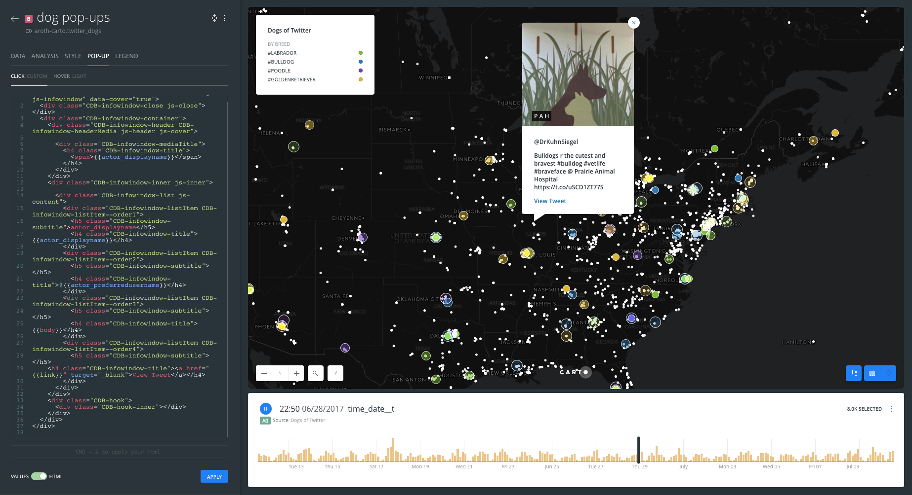

# Twitter Pop-Ups & Time Slider Visualization

* *Degree of Difficulty*: **
* *Goal*: Create a time-enabled visualization that includes pop-ups using data pulled from Twitter with BUILDER
* *Features Highlighted*:
  * Style:
    - Enabling time-based elements of your data for advanced visualization;
    - Making the most of your data by adding and altering pop-ups to display useful information at a glance
  * Layers: how to work with layer nodes
  * Widgets: Formulas + Histograms
* *Datasests needed*:
  * `twitter_dogs` dataset: twitter data on based on dog breed search terms from 6/11/2017 - 7/10/17.


1. [Import and create map](#map) <br>
2. [Style](#sty) <br>
3. [Widgets](#widgets) <br>
4. [Autostyle](#auto) <br>
5. [Public and share map](#public) <br>

<hr>

## 1. Import and create map <a name="map"></a>

### 1. 1. Import `twitter_dogs` file into your DATASETS dashboard.

* Download the dataset from [here](https://builder-demo.carto.com/api/v2/sql?q=SELECT+*+FROM+ccaa_2015_economia_comercio&format=csv&filename=ccaa_2015_economia_comercio)
// ***UPDATE THIS LINK***
* Go to your account and import it using the **NEW DATASET** options
* Select **CONNECT DATASET**
* Drag and drop the file

### 1. 2. Dataset view

* Take a look on the dataset
* Take note of which columns seem to be the most useful/interesting things in the dataset

### 1. 3. Click on **CREATE MAP**

* Change the name of the map to **Dogs of Twitter** (double click!)
* Change the name of the layer to **Dogs of Twitter**
* Change the Basemap to **Dark Matter (Labels Below)**

<hr>

## 2. Style <a name="sty"></a>

### 2. 1. Styling Time-Based Elements

* After clicking on **Dogs of Twitter** layer, it will direct you to the `STYLE` tab.
* Change the **aggregation style** to `Animated`
* Set the style options as follows:
  * **FILL**:click on the color, click on `BY VALUE`, style by `category_terms`. Color these as you see fit by clicking on the color in line with the term you want to change.
  * **COLUMN**: `postedtime`
  * **DURATION**: `30`
  * **STEPS**: `256`
  * **TRAILS**: `2`
  * **RESOLUTION**: `4`


* Click on the `LEGEND` tab. Set the style to `CUSTOM`. Check the box to add title and enter `By breed` to give your legend enough detail to be useful.

### 2. 2. Styling Pop-ups

* In order to add pop-ups to our map, we will need to add the `twitter_dogs` layer again. In the top left corner, press the back arrow to navigate back to the `LAYERS` menu.
* Click on `ADD`
* Click on `twitter_dogs`, click `ADD LAYER` in bottom right.
* A new layer `B` has been added.
* Click into this new layer, rename it `dog pop-ups`
* set the **FILL SIZE** to `4`, set the **FILL COLOR HEX** to `#ffffff`.


* Click on the `POP-UP` tab
* In the `CLICK` pop-up menu, set style to `IMAGE`
* Check off the following items, and drag them into the order they are listed:
  * `actor_image`
  * `actor_displayname`
  * `actor_preferredusername`
  * `body`
  * `link`


* In the `HOVER` pop-up menu, set style to `LIGHT`
* Check the box for `actor_displayname` and change the type field next to it to `Who is Tweeting?`


* Go back to the `CLICK` pop-up menu, and use the bottom toggle to switch to HTML mode

##### Deleting the heading "actor_preferredusername" and adding an @ before the user name

* Find this piece of code:
```
<div class="CDB-infowindow-listItem CDB-infowindow-listItem--order2">
    <h5 class="CDB-infowindow-subtitle">actor_preferredusername</h5>
    <h4 class="CDB-infowindow-title">{{actor_preferredusername}}</h4>
```
and alter it as follows:
```
<div class="CDB-infowindow-listItem CDB-infowindow-listItem--order2">
    <h5 class="CDB-infowindow-subtitle"></h5>
    <h4 class="CDB-infowindow-title">@{{actor_preferredusername}}</h4>
```

##### Deleting the heading "body"

* Find this piece of code:
```
<div class="CDB-infowindow-listItem CDB-infowindow-listItem--order3">
<h5 class="CDB-infowindow-subtitle">body</h5>
<h4 class="CDB-infowindow-title">{{body}}</h4>
```
and alter it as follows:
```
<div class="CDB-infowindow-listItem CDB-infowindow-listItem--order3">
<h5 class="CDB-infowindow-subtitle"></h5>
<h4 class="CDB-infowindow-title">{{body}}</h4>
```

##### Making a clickable hyperlink that will open the linked tweet in a new browser tab

* Find this piece of code:
```
<div class="CDB-infowindow-listItem CDB-infowindow-listItem--order4">
    <h5 class="CDB-infowindow-subtitle">link</h5>
    <h4 class="CDB-infowindow-title">{{link}}</h4>
```
and alter it as follows:
```
<div class="CDB-infowindow-listItem CDB-infowindow-listItem--order4">
    <h5 class="CDB-infowindow-subtitle"></h5>
    <h4 class="CDB-infowindow-title"><a href="{{link}}" target="_blank">View Tweet</a></h4>
```

* Click `APPLY`.



<hr>

# HAVE NOT EDITED BELOW THIS - ASR 7/11/17


## 3. Widgets <a name="widgets"></a>

### 3. 1. Add widgets

* Navigate back to  **WIDGETS** pane and click on **ADD WIDGET**.
  * In the options of the **CATEGORY** tab, check the *ccaa*. Make sure you are adding a widget from the `A1` layer node.
  * In the options of the **HISTOGRAM** tab, check `pib_per_capita_euros`, `importaciones_interregionales_porcentaje_pib` and `exportaciones_porcetaje_pib`.
  * In the options of the **FORMULA** tab, check `pib_millones_euros`.
  * Click on **CONTINUE**.

### 3. 2. Order and edit widgets

* Reorder the position of widgets.
* Double click on the widget title in order to change the title name.
* Edit the category widget as follow:
  * **OPERATION**: `AVG(pib_millones_euros)`
  * **SUFFIX**: `mill. €`.


<hr>

## 4. Autostyle <a name="auto"></a>

### 4. 1. How to use auto-style

* Click on the droplet button* at the right upper coner of a category or histogram widget.

*If you want to know more about auto-style feature, check [this blog post](https://carto.com/blog/data-driven-maps-auto-style).


<hr>

## 5. Public and share map <a name="public"></a>

* At the bottom of the main menu, click on **SHARE** at the right button corner.
* Go to **PUBLISH** tab and click on **PUBLISH** button that is below the Map name in order to share our map.
* After clicking on **PUBLISH**, we can select the options that we want to share our map.
  * Get the link URL and paste it on other browser tab: https://team.carto.com/u/ramirocartodb/builder/b976e446-33c9-11e7-9d09-0e3ff518bd15/embed


<hr>
