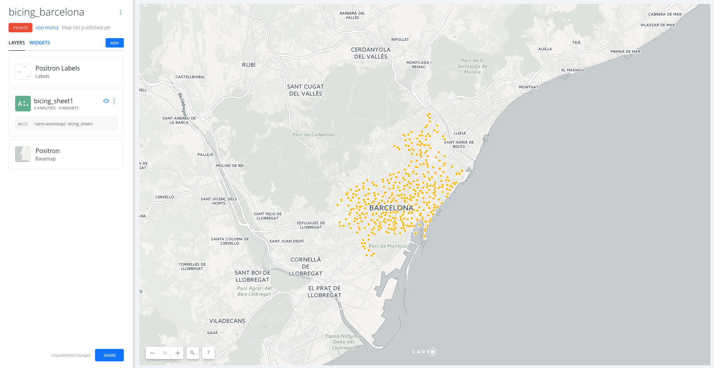
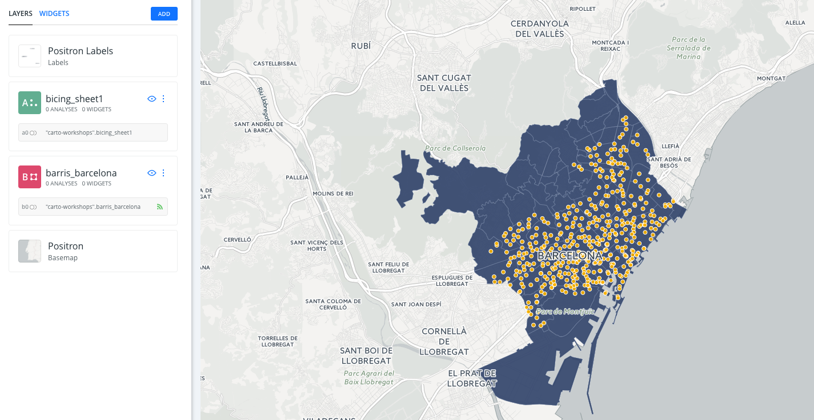
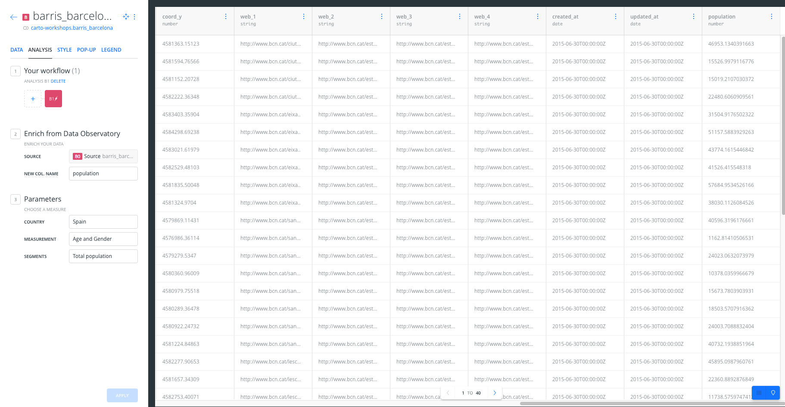
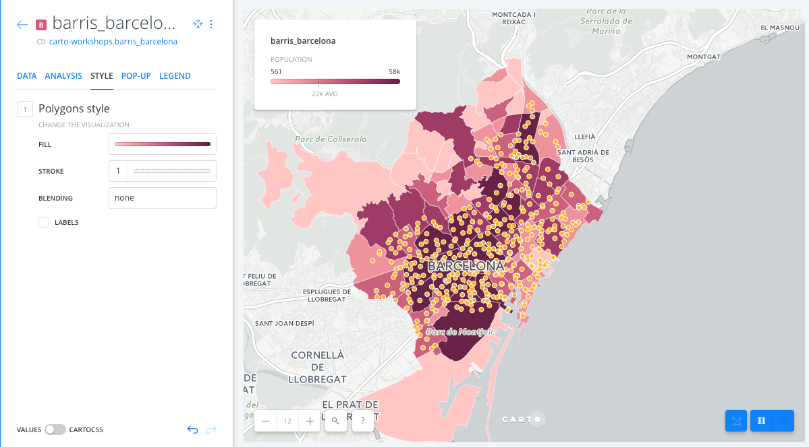
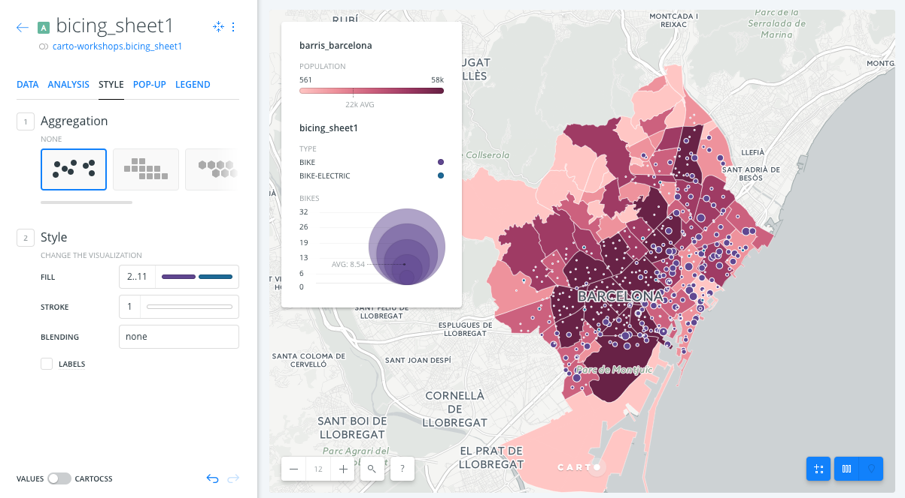

# Bicing Barcelona

* *Degree of Difficulty*: ***
* *Goal*: Getting started with CARTO BUILDER.
* *Features Highlighted*:
  * Basic features
  * Data observatory analysis
  * Widgets
* *Datasests needed*:
  * New York subway stations: `bicing_sheet1`. You can download it from [here](https://carto-workshops.carto.com/api/v2/sql?q=SELECT+*+FROM+bicing_sheet1&format=gpkg&filename=bicing_sheet1).

>  In order to download them to your local machines, you are using [CARTO SQL API](https://carto.com/docs/carto-engine/sql-api) behind the scenes.

## Contents

1. [Create a map](#map)
2. [Layers](#layers)
3. [Analysis](#analysis)
4. [Styling](#styling)
5. [Widgets](#widgets)
6. [Publish](#publish)

### 1. Create a map 

* Click on **`NEW MAP`**.
* Click on **`CONNECT DATASET`**.
* Drag and drop `bicing_sheet1`.
* Click on **`CONNECT DATASET`**.
* Click on `Don't show me this again` to avoid modals.
* You can rename the map title as "Bicing Barcelona" by double-clicking on it.

### 2. Layers 

* Add new layer:
  * We are going to click on the button `ADD` in order to add a new layer on the map. In the add layer menu, we will click on the `DATA LIBRARY` and will look for `barcelona`. We will seelct the `Barris of Barcelona` dataset. Finally we will drag and drop layer B below layer A in order to have the Bicing stations as the top layer and the neighbourhoods of Barcelona as a low layer.

* Click on one of the layers to show its components:
  * **`DATA` tab**: an overview of your table schema, from here you can also add widgets. If you want to have a look at your dataset, click the Data View icon, located on the bottom right of Builder when a map layer is selected.
  * **`ANALYSIS`**: Add analysis.
  * **`STYLE`**: Change styles.
  * **`POP-UP`**: Add pop-up.
  * **`LEGEND`**: Add legend

> Have a look at the letter and number the layers card has (`A` or `B`). This would be very useful for adding widgets and analysis. Depending on the order in which you added your data, your layer letters could be different than the screenshots. In this example, bicing stations were layer A, and neighbourhouds of Barcelona are layer B.

### 3. Analysis 

#### 3.1 Data observatory

* Go to the edit pane.
* Click layer `barris_barcelona` and then select the `Analysis` tab. Finally, click on the **`ADD ANALYSIS`** button in order to add the analysis.
* Select **`Enrich from Data Observatory`** analysis.
* Click on **`ADD ANALYSIS`**.
* Set the parameters as follows:
  * `New COL. NAME`: `population`.
  * `COUNTRY`: `SPAIN`.
  * `MEASUREMENT`: `Age and Gender`.
  * `SEGMENTS`: `Total Population`.
* Now click on **`APPLY`** to see the result of the analysis. If we open the table view of the layer `population` we will see the new column added to the layer.

### 4. Styling 

* Go to the edit pane, click on the `barris_barcelona` layer *B* and select the `STYLE` tab. Set the `Fill` color `BY VALUE` and select the `population` column to style the polygons using the population.

* Then, go to the edit pane, click on the `bicing_sheet1` layer *A* and select the `STYLE` tab. Set the `Fill` color to `BY VALUE` and select the `type` column. Finally, set the `Fill` size to `BY VALUE` and select the `bikes` column to see the number of bikes for each station visually.

### 5. Widgets 

* Go to the edit pane and click on the `widgets` tab.
* Click on `ADD WIDGET` button.
  * Under the `CATEGORY` tab, click on the check box of variables `street_name` and `status`
  * Under the 'HISTOGRAM' tab, click on the check box of variables `population`
  * Under the 'FORMULA' tab, click on the check box of variable `point_count`.
* Click on `CONTINUE`

 

#### 5.1 Customize widgets

* Reorder widgets: From `WIDGET` tab, drag and drop them into your preferred order.
* Rename widgets: From `WIDGET` tab, rename each widget by clicking on its three blue dots and selecting the option to `Rename`.

### 6. Publish 

* Click on **`SHARE`**.
* Set the map's privacy to `LINK` or `PUBLIC`.
* Click on **`PUBLISH`**.
* Now you can share the map:
  * Link: https://cartoworkshops.carto.com/u/carto-workshops/builder/b82ea094-3fc0-11e7-bfd7-0e3ff518bd15/embed
  * iframe: `<iframe width="100%" height="520" frameborder="0" src="https://cartoworkshops.carto.com/u/carto-workshops/builder/b82ea094-3fc0-11e7-bfd7-0e3ff518bd15/embed" allowfullscreen webkitallowfullscreen mozallowfullscreen oallowfullscreen msallowfullscreen></iframe>`

> Remember to update your map every time you make a change. To see those changes refresh your embed, or the web page where your map is hosted.

