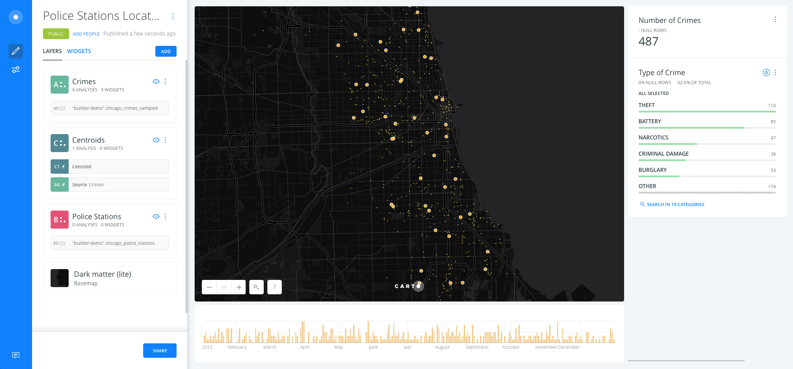
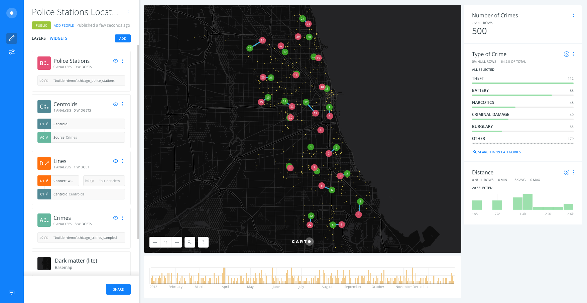

# Police Stations Location Demo

* *Degree of Difficulty*: **

* *Goal*: explore how far police stations locations are from crimes centroids per district in the city of Chicago.

* *Features Highlighted*:
  * Widgets: Category, Time Series & Formula.
  * Analysis: Find centroid from geometries & Connect with lines.

* *Datasests needed*:
  * Chicago Crimes (**`chicago_crimes`**): download it [from the `builder-demo` CARTO account](https://builder-demo.carto.com:443/api/v2/sql?q=select+*+from+chicago_crimes_sampled&format=gpkg&filename=chicago_crimes_sampled.gpkg) and import it into CARTO from your local machine..
  * Chicago Police Stations (**`chicago_police_stations`**): download it [from the `builder-demo` CARTO account](https://builder-demo.carto.com:443/api/v2/sql?q=select+*+from+chicago_police_stations&format=gpkg&filename=chicago_police_stations.gpkg) and import it into CARTO from your local machine.

<!-- MarkdownTOC -->

  - 1. Import datasets and create a map
    - 1. 1. Import datasets into CARTO
    - 1. 3. Rename map title and layers
  - 2. Layers and widgets
    - 2. 1. Show the different options layers have
    - 2. 2. Add widgets in order to explore crimes layer
  - 3. Add Analysis and styles
    - 3. 0. Optional: sample the dataset
    - 3. 1. Create crimes centroids for district
    - 3. 2. Style crimes layer
    - 3. 3. Connect police stations with centroids and calculate distances
    - 3. 4. Style police stations, centroids and lines layers
  - 4. Add a histogram widget for filtering by distance
    - 4. 1. Add a widget for filtering by store id
- 5. Extension

<!-- /MarkdownTOC -->

## 1. Import datasets and create a map

### 1. 1. Import datasets into CARTO

* It's easy to import files into CARTO! Drag and drop in CARTO Datasets dashboard, first **`chicago_crimes`**, and then **`chicago_police_stations`** csv files. Explain the viewer the wide diversity of geodata supported in CARTO during the importing.

* Select `chicago_crimes_sampled` and `chicago_police_stations`, click on `Create map`.

### 1. 3. Rename map title and layers

* Rename map title to **`Police Stations Location Demo`**.
* Rename layers:
  1. `chicago_crimes_sampled` as `Crimes`,
  2. `chicago_police_stations` as `Police Stations`,

## 2. Layers and widgets

### 2. 1. Show the different options layers have

* Click on the `Positron` basemap and select `Dark Matter Lite`.
* Each layer has 5 options: `DATA`, `ANALYSES`, `STYLE`, `POP-UPS` and `LEGENDS`.

### 2. 2. Add widgets in order to explore crimes layer

* Back to the main menu, click on `Crimes` layer.
* In the `DATA` view. Activate the checkbox options on `point count`, `date` and `primary_type`.
* Rename them as "Number of Crimes", "Date" and "Type of Crime" respectively.

## 3. Add Analysis and styles

### 3. 0. Optional: sample the dataset

You can add the **Subsample percent of rows** analysis to the crimes dataste. This way you can design the analysis working with for example a 10% of the dataset and when you finish it then upgrade to the 100%.

### 3. 1. Create crimes centroids for district

* Back to the main menu, click on `ADD ANALYSIS` just below `Crimes` layer.
* Select `Find centroid from geometries` analysis.
* Click on `ADD ANALYSIS`.
* Set the parameters as follows:
  * `CATEGORIZE...`: `district_c`.
* Click on `APPLY`.

### 3. 2. Style crimes layer

* After applying the analysis, drag and drop out the original node layer. Rename the analysis node layer as `Centroids`.

> Now you should have a mess of points, three layers equally styled.

* In order to style the `Crimes` layer follow these steps:
  * Click on `Crimes` layer.
  * Click on `STYLE`:
    * `FILL`: set the marker size value to `2` and color to yellow (`#FFE95C`).
    * `STROKE`: set stroke width to `0`.
    * `BLENDING`: `multiply`.

### 3. 3. Connect police stations with centroids and calculate distances

* Add a new analysis (to the `Centroids` layer).
* Select `Connect with lines`.
* Click on `ADD ANALYSIS`.
* Set the parameters as follows:
  * `TYPE`: `To Source`
  * `TARGET`: `Police Stations`
  * Check the `GROUP BY` option:
    * `SOURCE COL.`: `category`.
    * `TARGET COL.`: `district_char`.

> Click on `DATA` and change to table view to see how the new fields have been created from this analysis, being specially interesting the `length` column.

### 3. 4. Style police stations, centroids and lines layers

* After applying the analysis, drag and drop out the "Connect..." analysis node layer, on top of Crimes but below `Police Stations` and `Centroids`. Rename the analysis node layer as `Lines`.

#### Lines style

* In order to style the `Lines` layer follow these steps:
  * Click on `Lines` layer.
  * Click on `STYLE`:
    * `FILL`: set the line width value to `3` and color blue (`#40B4E5`).

#### Centroids style

* In order to style the `Centroids` layer follow these steps:
  * Click on `Centroids` layer.
  * Click on `STYLE`:
    * `FILL`: set the marker size value to `20` and color to wageningen green (`#3FAE29`).
    * `STROKE`: set stroke width to `0`.
    * Check the `Labels` option:
      * `COLUMN`: `category`.
      * `SIZE`: `8`.
      * `HALO`: `0`.
      * `OFFSET`: `0`.

#### Police Stations style

* In order to style the `Police Stations` layer follow these steps:
  * Click on `Police Stations` layer.
  * Click on `STYLE`:
    * `FILL`: set the marker size value to `20` and color to dark pink (`#EA526F`).
    * `STROKE`: set stroke width to `0`.
    * Check the `Labels` option:
      * `COLUMN`: `district_char`.
      * `SIZE`: `8`.
      * `HALO`: `0`.
      * `OFFSET`: `0`.

## 4. Add an histogram widget for filtering by distance

### 4. 1. Add a widget for filtering by store id

* Back to the main menu, click on `Lines` layer.
* In the `DATA` view. Activate the checkbox option on `length`.
* Rename them as "Distance".

[Link](https://builder-demo.carto.com/builder/0876e726-e73f-11e6-82a3-0e233c30368f) to the map.

# 5. Extension

This demo can be improved:

* With the **Filter by layer** analysis to link police stations and crime locations

* Adding **areas of interest** to the centroids and police stations and check which crimes are less than certain distance to both locations.

