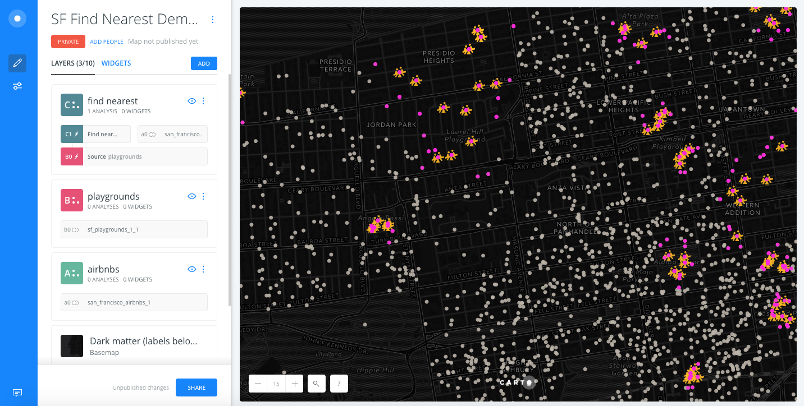

# Find Nearest Demo

* *Degree of Difficulty*: **
* *Goal*: Find the nearest AirBnB listings to playgrounds in San Francisco
* *Features Highlighted*:
  * Analysis
* *Datasests needed*
  - San Francisco AirBnBs: download it from the [builder-demo](https://builder-demo.carto.com:443/api/v2/sql?q=select+*+from+san_francisco_airbnbs&format=gpkg&filename=san_francisco_airbnbs.gpkg) CARTO account
  - San Francisco Playgrounds: download it from the [builder-demo](https://builder-demo.carto.com:443/api/v2/sql?q=select+*+from+san_francisco_playgrounds&format=gpkg&filename=san_francisco_playgrounds.gpkg) CARTO account

> San Francisco Airbnb dataset was downloaded from the [Inside Airbnb](http://insideairbnb.com/get-the-data.html) website. In order to download them to your local machines, you are using [CARTO SQL API](https://carto.com/docs/carto-engine/sql-api) behind the scenes.
> San Francisco playground datasets was downloaded from the [City and County of San Francisco](www.sfgov.org)

## Contents

<!-- MarkdownTOC -->

- Import Datasets and Create Map
- Analysis 1: Apply `find nearest analysis` to find closest AirBnB listings to San Francisco playgrounds
- Analysis 2: Apply `connect with lines` analysis to draw a line from each playground to the closest AirBnB listings
- Widgets
- Map options and publish

<!-- /MarkdownTOC -->

## 1. Import datasets and create a map

### 1. 1. Import datasets into CARTO

* It's easy to import files into CARTO! Drag and drop the `san_francisco_airbnbs` csv file in your CARTO Datasets dashboard first, then the `san_francisco_playgrounds` csv. 

* Select `san_francisco_airbnbs` and `san_francisco_playgrounds`, click on `Create map`.

### 1. 2. Rename Map Title and Layers

* Rename map title to `SF Find Nearest Demo`.
* Rename layers:
  1. `san_francisco_airbnbs` as `airbnbs`,
  2. `san_francisco_playgrounds` as `playgrounds`

### 1. 3. Change the Basemap

* Click on the `Positron Basemap` layer in the layer panel 
* Select the `Dark Matter (Labels Below)` basemap
* Click on the back arrow button in the upper left hand side of the `Basemap` panel to navigate back to the layer panel

## 2. Analysis 1: Apply `find nearest analysis` to find closest AirBnB listings to San Francisco playgrounds

### 2. 1. Apply `find nearest` analysis to `playgrounds` layer

* Click on the `playgrounds` layer in the layer panel
* Click on the `ANALYSIS` tab and ```ADD ANALYSIS```
* Select `Find nearest` analysis
* Click on `ADD ANALYSIS`
* Set the parameters as follows:
  * `TARGET`: `A0 Source airbnbs`.
  * `MAX RESULTS`: `5`
* Click on `APPLY`

### 2. 2. Style Your Map

* After applying the analysis, drag and drop out the original node layer. Rename the analysis node layer as `find nearest`.

> Now you should have a mess of points, three layers equally styled.

* Begin by styling the `airbnbs` layer:
  * Click on `airbnbs` layer.
  * In the `STYLE` tab:
    * `FILL`: set the marker size value to `7` and color to #bcb5aa (`#bcb5aa`).
    * `STROKE`: set stroke width to `0`.
    * Use the zoom control panel in the lower left of the map to zoom in to zoom 15

* Style the `playgrounds` layer next:
  * Click on `playgrounds` layer.
  * In the `STYLE` tab:
    * `FILL`: click on the color bar and choose `IMG`, select `Show full collections`, choose the seesaw Maki icon, click on `SET IMAGE`
    * `FILL`: set the marker icon size to `22`
    * `STROKE`: set stroke width to `0`.

* Style the `find nearest` layer next:
  * Click on `find nearest` layer.
  * In the `STYLE` tab:
    * `FILL`: set the marker size value to `7` and color to #ff27db (`#ff27db`).
    * `STROKE`: set stroke width to `0`.



### 3. Analysis 2: Apply ```connect with lines``` analysis to draw a line from each playground to the closest AirBnB listings

### 3. 1. Apply `find nearest` analysis to `find nearest` layer

* Click on the `find nearest` layer in the layer panel
* Click on the `ANALYSIS` tab
* Under `YOUR WORKFLOW`, select the plus icon to add an analysis to the find nearest analysis
* Select `Connect with lines` analysis
* Click on `ADD ANALYSIS`
* Set the parameters as follows:
  * `TYPE`: `To Source`.
  * `TARGET`: `B0 Source playgrounds`
  * `CLOSEST`: `To closest`
* Click on `APPLY`

### 3. 2. Style Your Map
* After applying the analysis, drag and drop out the `connect with lines` node layer. Rename the analysis node layer as `connect with lines`.

* After dragging out the layer, you may need to reapply your styles:

* Style the `find nearest` layer first:
  * Click on `find nearest` layer.
  * In the `STYLE` tab:
    * `FILL`: set the marker size value to `7` and color to #ff27db (`#ff27db`).
    * `STROKE`: set stroke width to `0`.

* Style the `connect with lines` layer next: 
  * Click on `connect with lines` layer.
  * In the `STYLE` tab:
    * `STROKE`: set color to #3e7db (`#3e7db`).

## 4. Filter your map with widgets to gain more insight into your analysis

### 4. 1. Add a histogram widget to filter by the airbnb score rating distribution

* Back to `LAYERS` pane on main Builder interface, click on `airbnbs` layer.
* In the `DATA` tab. Activate the *Add as a widget* checkbox on `review_scores_rating` column.
* Click on blue `edit` link
* Rename the widget to `AirBnB Rating`

### 4. 2. Add a category widget to filter by the airbnb cancellation policies

* Back to `LAYERS` pane on main Builder interface, click on `airbnbs` layer.
* In the `DATA` tab. Activate the *Add as a widget* checkbox on `cancellation_policy` column.
* Click on the blue `edit` link
* Rename the widget to `Cancellation Policy`

### 4. 3. Add a formula widget to see the average distance from playgrounds to airbnbs

* Back to `LAYERS` pane on main Builder interface, click on `connect with lines` layer.
* In the `DATA` tab. Activate the *Add as a widget* checkbox on the `length` column.
* Click on the blue `edit` link
* Rename the widget to `Distance`
* Under `Type`, change the widget type to `FORMULA`
* Under Data, click on the `OPERATION` form option:
  * In the left column, select `AVG`
  * In the right column, choose the `length` column


## 5. Publish and share your  map

### 5. 1. In the main menu, check the publish options of your map

* Below the map title it should show *PRIVATE*, *ADD PEOPLE* and *Map not published yet*. Let's change that.
  * First, click on *PRIVATE*, and again. Select *Link*.
  * Secondly, click on *SHARE* (at the bottom of the *LAYERS* pane). Click on *PUBLISH*, and then *DONE*.
  * Get the link and past it into your browser.

