# The L line and demographics

* *Degree of Difficulty*: ***
* *Goal*: Getting started with CARTO BUILDER.
* *Features Highlighted*:
  * Basic features
  * Filter by column analysis
  * Areas of Influence analysis
  * Intersect second layer analysis
  * Widgets and autostyling
* *Datasests needed*:
  * New York subway stations: `subway_nycstations_l`. You can download it from [here](https://builder-demo.carto.com/api/v2/sql?q=SELECT * FROM subway_nycstations_l&format=gpkg&filename=subway_nycstations_l).
  * New York subway lines: `nyc_subway_lines`. You can download it from [here](https://builder-demo.carto.com/api/v2/sql?q=SELECT * FROM nyc_subway_lines&format=gpkg&filename=nyc_subway_lines`).
  * New York block group census: `nyc_block_group_census`. You can download it from [here](https://builder-demo.carto.com/api/v2/sql?q=SELECT * FROM nyc_block_group_census&format=gpkg&filename=nyc_block_group_census).

>  In order to download them to your local machines, you are using [CARTO SQL API](https://carto.com/docs/carto-engine/sql-api) behind the scenes.

## Contents

1. [Create a map](#map)
2. [Layers](#layers)
3. [Analysis](#analysis)
4. [Styling](#styling)
5. [Widgets](#widgets)
6. [Publish](#publish)

### 1. Create a map 

* Click on **`NEW MAP`**.
* Clik on **`CONNECT DATASET`**.
* Drag and drop.
* Click on **`CREATE MAP`**.
* Click on `Don't show me this again` to avoid modals.
* You can rename the map title as "The L line and demographics" doing double click over it.

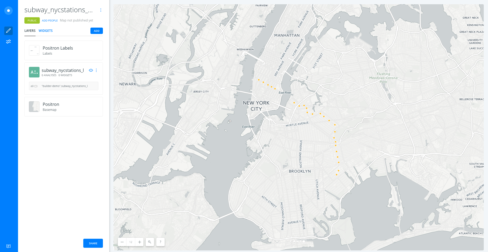

### 2. Layers 

* Add new layers:
  * Click on **`ADD`**.
  * Clik on **`CONNECT DATASET`**.
  * Copy and paste this url `https://builder-demo.carto.com/api/v2/sql?q=SELECT * FROM nyc_subway_lines&format=gpkg&filename=nyc_subway_lines` and click on **`SUBMIT`**.
  * Click on **`ADD LAYER`**.
  * Reapeat the previous steps but adding a dataset from this URL: `https://builder-demo.carto.com/api/v2/sql?q=SELECT * FROM nyc_block_group_census&format=gpkg&filename=nyc_block_group_census`

* Now, by moving the layers using drag and drop we can change the order in which the layers are being displayed. We move `subway_nycstations_l` to the top and `nyc_subway_lines` in the second position. The layer `nyc_block_group_census` woudl stay at the bottom of the map.

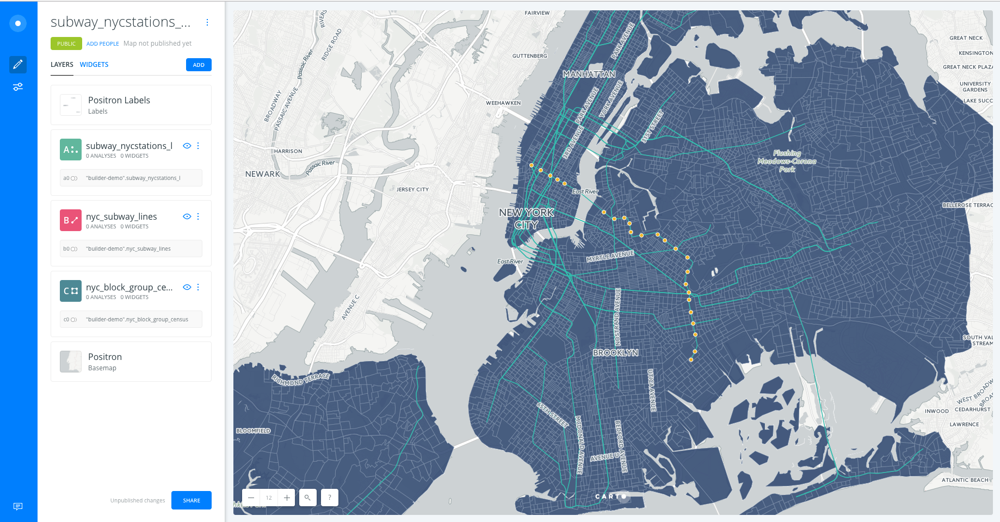

* Click on one of the layers to show its components:
  * **`DATA`**: an overview of your table schema, from here you can also add widgets. If you want to have a look at your layer table, click on the table icon at the right bottom corner of BUILDER.

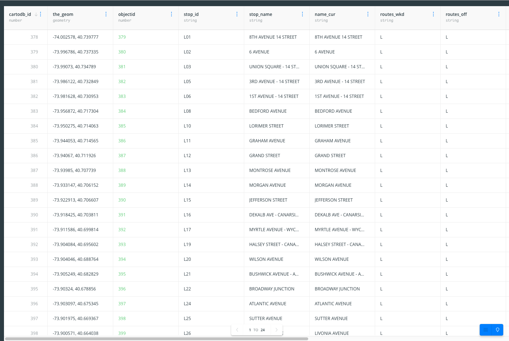
<figcaption>A view of BUILDER layer table mode</figcaption>

 

  * **`ANALYSIS`**
  * **`STYLE`**
  * **`POP-UP`**
  * **`LEGEND`**

 

> Have a look at the letter and number the layers card has (`A`, `B` or `C`). This would be very useful for adding widgets and analysis. Depending on the order in which you added your data, your layer letters could be different than the screenshots. In this example, subway stations were layer A, subway lines layer B, and block groups layer C.

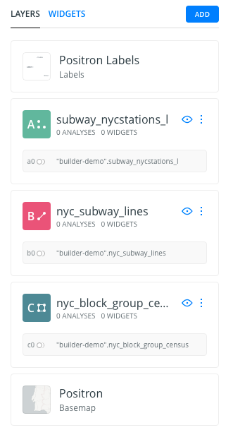

### 3. Analysis 

#### 3.1 Filter by column value

* Go to the edit pane.
* Click layer `nyc_subway_lines` and then select the `Analysis` tab. Finally, click on the **`ADD ANALYSIS`** button in order to add the analysis.
* Select **`Filter by column value`** analysis.
* Click on **`ADD ANALYSIS`**.
* Set the parameters as follows:
  * `COLUMN`: `route_id`.
  * `INPUT`: `L`.
  * `RESULT`: `show`.
* Now click on *APPLY* to see the result of the filtering. This is the L lines of the subway.

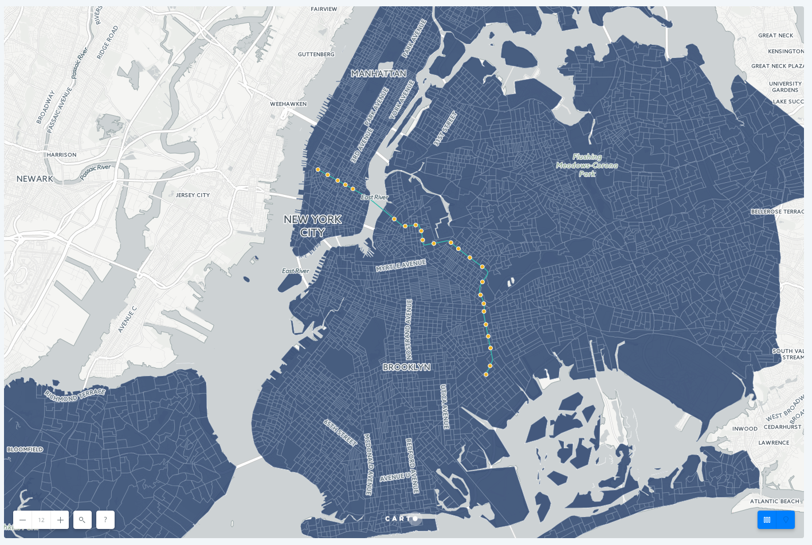

#### 3.2 Areas of Influence analysis

* We will apply the analysis to the layer `subway_nycstations_l`. We will go back to **LAYERS** pane on Builder interface and click on **`ADD ANALYSIS`**.
* We will select the *Create areas of influence* analysis.
* In the *ANALYIS* tab of the layer, we have three sections:
  * *Your workflow*: Now, due to we are a first analysis to the `subway_nycstations_l` layer, node *A*, the analysis layer will be the node *A1* .
  * *Create areas of influence*:
    * *Input*: Should be the layer `subway_nycstations_l`, node *A*.
    * *Parameters*: define the distance of the area of influence, the type of units, the radius and the boundaries. The boundaries might be *Intact* or *Dissolved*. If we choose the *Intact* option, that means that if our areas of influence polygons overlap, then they will keep their original polygon borders. On the other hand, if we choose the *Dissolved* option, if the areas of influence polygons overlap, they will be merged so the result will be one big polygon with the outer shape of all AOIs polygons. We set the units to *mi*, set the radius to *1* and choose the *Intact* option for the *BOUNDARIES* parameter.
* After clicking *APPLY*, we should see the result: areas of influence of 1 mile around the subway stations.

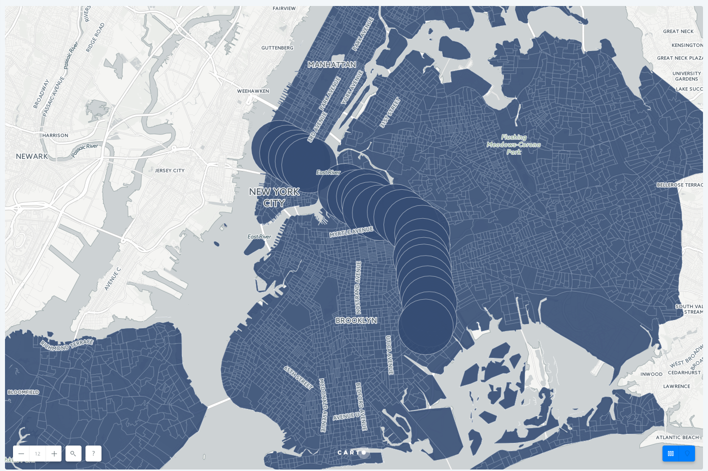

#### 3.3 Intersect second layer analysis

* Go to the edit pane.
* Click layer `nyc_block_group_census` and then select the `Analysis` tab. Finally, click on the `ADD ANALYSIS` button in order to add the analysis.
* Select **`Intersect second layer`** analysis.
* In the *ANALYIS* tab of the layer, we have three sections:
  * *Your workflow*: Now, due to we are a first analysis to the `nyc_block_group_census` layer, node *C*, the analysis layer will be the node *C1* .
  * *Intersect second layer*:
    * *Base Layer*: By default the base layer would be `nyc_block_group_census`.
    * *Intersect Layer*: select the result layer of the Area of Influence analysis *A1*
* After clicking *APPLY*, we should see the result:

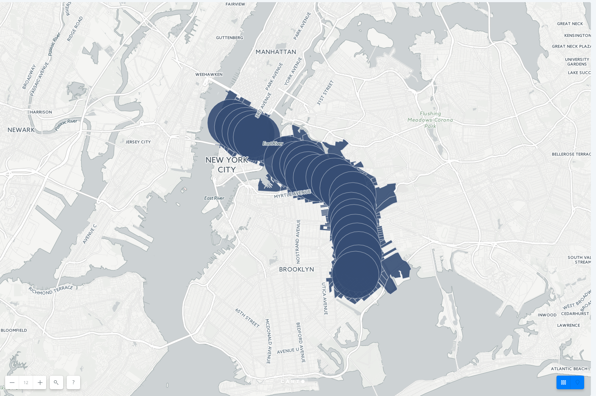

#### 3.4 Extract and reorder AOI analysis layer

Since we used our subway station layers as the input for the AOI analysis, the view of the data that we see are polygons. We want the AOI's to be underneath the subway lines and extract the original subway station points for display.

* From the `subway_stations_l` layer, drag out the AOI sublayer and place it under the `nyc_subway_lines`
* This will create a new layer D and you will see the subway stations drawing on top of the AOI and block group layers

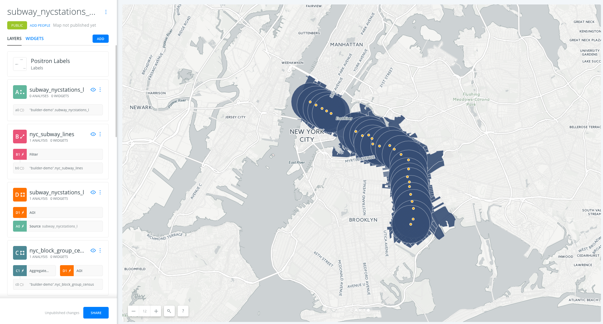

### 4. Styling 

* Go to the edit pane, click on the `AOI` layer *D* and select the `STYLE` tab. Set the `Fill` color into a grey one and with high opacity and also set the stroke line to color grey.

* Go to the edit pane, click on the `nyc_block_group_census` layer *D* and select the `STYLE` tab. Set the `Fill` color into a grey one that blends with the basemap layer.

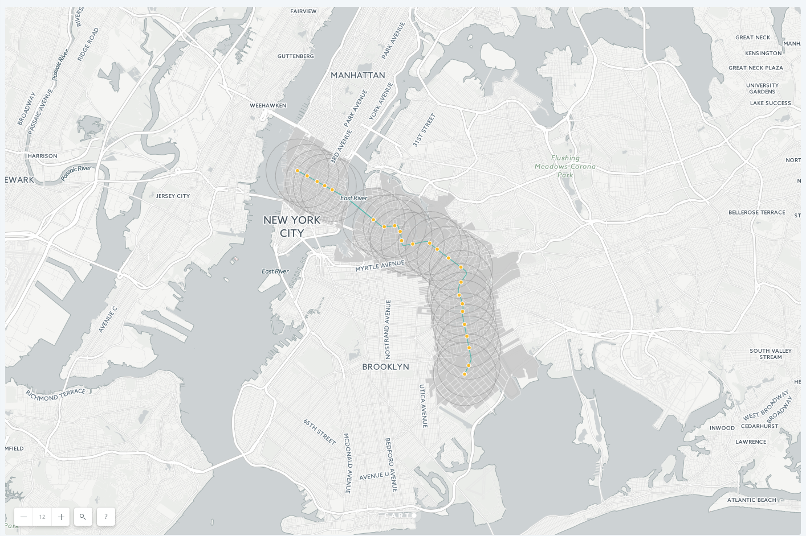

### 5. Widgets 

* Go to the edit pane and click on the `widgets` tab.
* Click on `ADD WIDGET` button.
  * Under the `CATEGORY` tab, click on the check box of variables `stop_name` and `ethnic_1st`
  * Under the 'HISTOGRAM' tab, click on the check box of variables `median_household_income` and `median_age`
  * Under the 'FORMULA' tab, click on the check box of variable `total_pop`.
* Click on `CONTINUE`

 

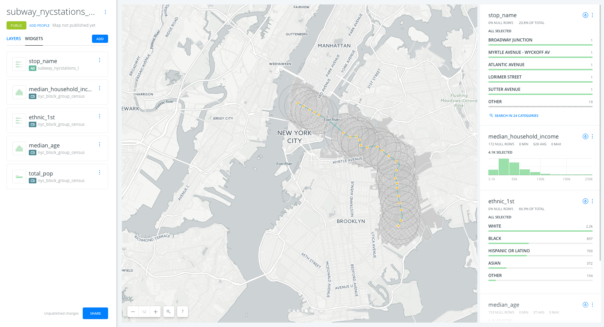

#### 5.1 Explore and style data with Widgets

* Click on the tear drop icon inside of each widget to see Auto-style feature.
* Filter the data by interacting with the category and histogram widgets.

#### 5.2 Customize widgets

* Reorder widgets: From `WIDGET` tab, drag and drop them into your preferred order.
* Rename widgets: Rename each widget by clicking on the three blue dots on each widget and selecting the option to `Rename`.
* Formula widget calculation:
  * By default, the formula widget for Total Population is calculating the avg we want to see the total population within our map view and of our filtered results.
  * Click on the three blue dots next to the Total Population widget and select the option to 'Edit'
  * In the `OPERATION` parameter, select `sum`.

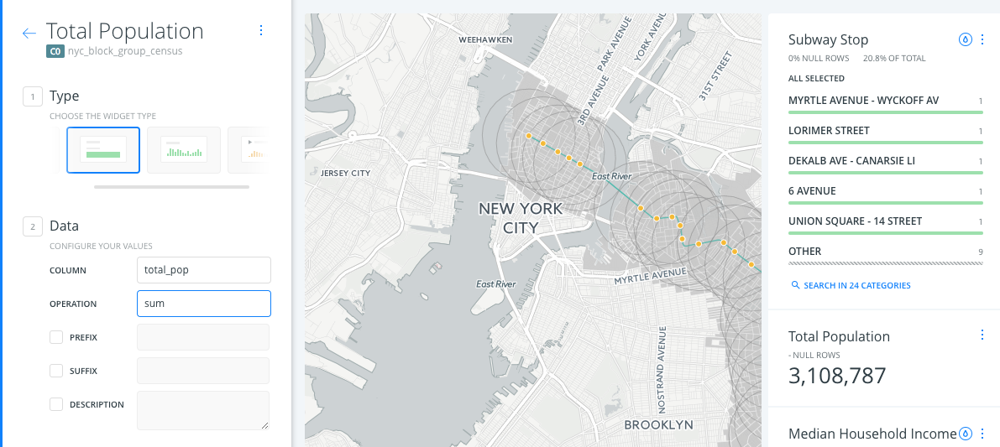  

### 6. Publish 

* Click on **`SHARE`**.
* Set to `LINK` or `PUBLIC`.
* Click on **`PUBLISH`**.
* Now you can share the map:
  * Link: https://team.carto.com/u/builder-demo/builder/144826d6-0982-11e7-bdeb-0e233c30368f/embed
  * iframe: `<iframe width="100%" height="520" frameborder="0" src="https://team.carto.com/u/builder-demo/builder/144826d6-0982-11e7-bdeb-0e233c30368f/embed" allowfullscreen webkitallowfullscreen mozallowfullscreen oallowfullscreen msallowfullscreen></iframe>`

> Remember to update your map everythime you make a change. Then refresh your embed or website where the map is hosted to see those changes.

