# Madrid Airbnb Demo

* *Degree of Difficulty*: **
* *Goal*: select Airbnb houses/rooms within 250 m from a Madrid metro line.
* *Features Highlighted*:
  * Data edition and filter:
    * SQL console.
    * Dynamic filtering by widgets.
  * Data Visualization:
    * Style `marker-width` by value (_bubbles_).
    * Style `marker-fill` by value (_choropleth_).
    * CartoCSS and TurboCARTO console.
  * Geospatial analysis:
    * Create areas of influence analysis (_buffers_).
    * Filter points in polygons analysis.
* *Datasests needed*:
  * Madrid Airbnb data: `listings_madrid`. You can download it from [here](https://builder-demo.carto.com/api/v2/sql?q=SELECT+*+FROM+listings_madrid&format=csv&filename=listings_madrid).
  * Madrid metro lines: `lineas_madrid`. You can download it from [here](https://builder-demo.carto.com/api/v2/sql?q=SELECT+*+FROM+lineas_metro&format=shp&filename=lineas_madrid).

> Both datasets were originally downloaded from the [Inside Airbnb](http://insideairbnb.com/get-the-data.html) and [Nomecalles](http://www.madrid.org/nomecalles/DescargaBDTCorte.icm) websites, respectively. In order to download them to your local machines, you are using [CARTO SQL API](https://carto.com/docs/carto-engine/sql-api) behind the scenes.

<hr>

## Contents

1. [Create a map](#map)
2. [Layers](#layers)
3. [Data](#data)
4. [Styling](#styling)
5. [Widgets](#widgets)
6. [Analysis](#analysis)
7. [Publish](#publish)

<hr>

### 1. Create a map <a name="map"></a>

* Click on **`NEW MAP`**.
* Clik on **`CONNECT DATASET`**.
* Drag and drop `listings_madrid` file.
* Click on **`CREATE MAP`**.

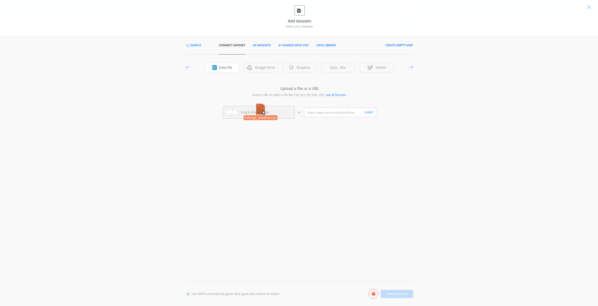

* Click on `Don't show me this again` to avoid modals.
* You can rename the map and layer title as "Madrid Airbnb Demo" and "Airbnb" respectively, doing double click over them.

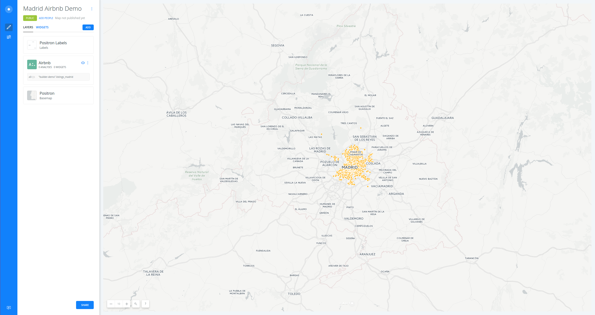

<hr>

### 2. Layers <a name="layers"></a>

* Add a new layer:
  * Click on **`ADD`**.
  * Clik on **`CONNECT DATASET`**.
  * Drag and drop `lineas_madrid` file.
  * Click on **`ADD LAYER`**.
* You can rename the title of this new layer as "Metro Lines".

> You can order your layers. For instance, try to drag the "Airbnb" layer on top of the "Metro Lines" layer.

* Click on any of the layers to show its components:
  * **`DATA`** 
  * **`ANALYSIS`**
  * **`STYLE`** 
  * **`POP-UP`**
  * **`LEGEND`**

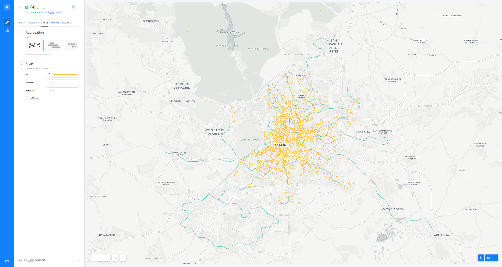

> Have a look at the letter and number the layer card has (`A`). This would be very useful for adding widgets and analysis.

<hr>

### 3. Data <a name="styling"></a>

* The layer **`DATA`** tab shows you an overview of your table schema, from here you can also add widgets. If you want to have a look at your layer table, click on the table icon at the right bottom corner of BUILDER.

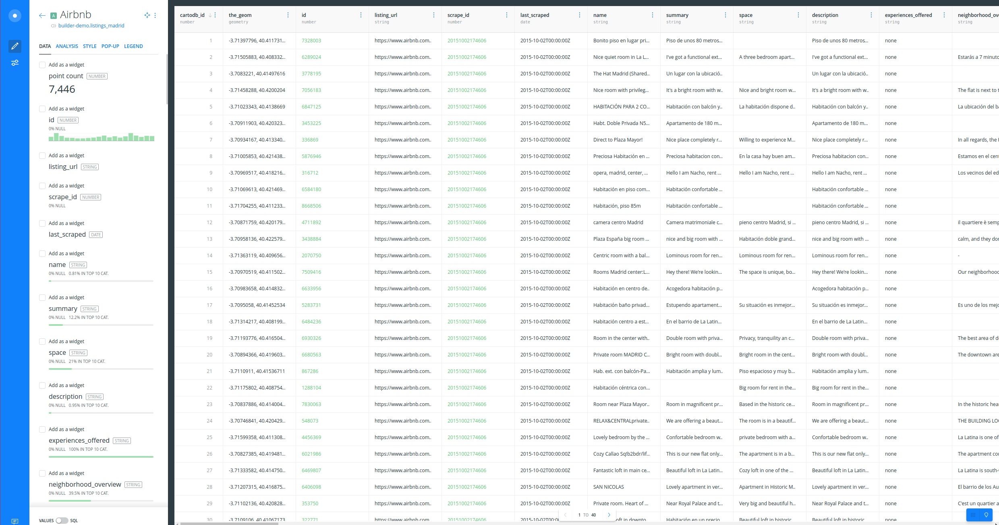

* We can check that the `price` column contains values like `$60`. In order to remove the dollar sign and convert the field into a numeric one, we need to use the **`DATA`** advanced mode.
* Open the SQL panel clicking the switch at the bottom left corner of BUILDER:

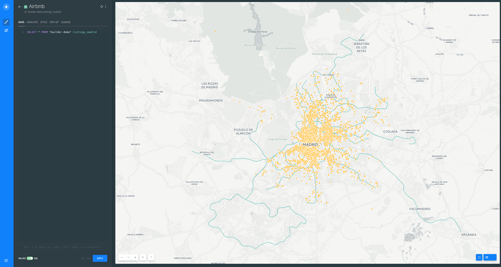

* Type the following query on your console in order to create a new numeric field called `price_num`:

```sql
SELECT 
  *, 
  substring(price FROM '[0-9]+')::numeric as price_num 
FROM 
  listings_madrid
```

<hr>

### 4. Styling <a name="styling"></a>

* In order to style our layer with this new field, click on the **`STYLE`** tab.
* Create a bubble (proportional symbols) map:
  * Click on the point-size number (`7` is the default fixed value).
  * Select `BY VALUE`.
  * Select `price_num` column.
  * Set buckets to `7` and the classification method to `Jenks`.
  * Change the `min` to `3` and `max` to `15`

> Check how the legend is dynamically generated.

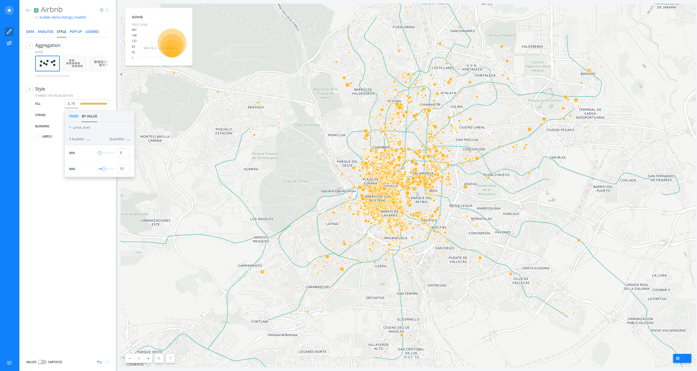

* Create a chroropleth map:
  * Go back to the main menu.
  * Click on "Countries" layer.
  * Click on the color bar (yellow/orange is the default fixed color for points).
  * Select `BY VALUE`.
  * Select `price_num` column.
  * Set buckets to `7` and the classification method to `Jenks`.
  * Last, remove the `STROKE`.

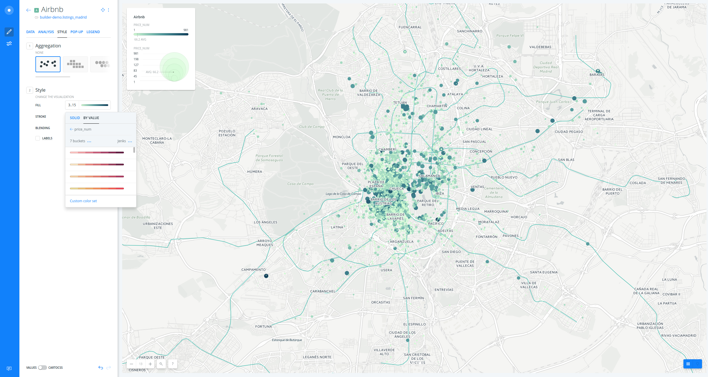

> You can customize your map further changing (and flipping) a different [CARTOcolors](https://carto.com/carto-colors/), the number of buckets and quantification method.

* Time to style "Metro Lines" layer. 
* Go back to the main menu.
* Click on "Metro Lines" layer.
* Create a category map:
  * Click on the color bar (ligth blue is the default fixed color for lines).
  * Select `BY VALUE`.
  * Select `name` column.

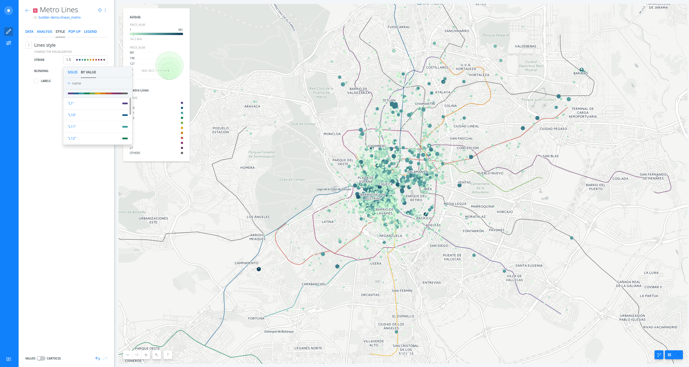

* As you can see the lines are color based on the `name` column. But we want to be colored according to the real Madrid Metro Lines colors. In order to achieve this we are going to use the **`STYLE`** advanced mode.
* Open the CartoCSS panel clicking the switch at the bottom left corner of BUILDER: 

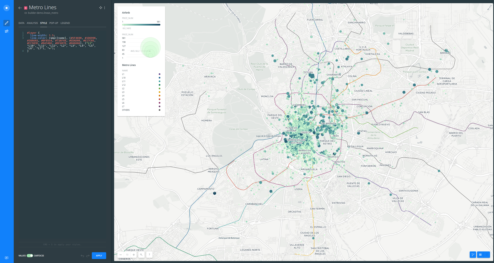

* Type the following CartoCSS style to change the default colors to the ones you need:

```css
#layer {
  line-width: 1;
  line-color: ramp([name], (#01bff5, #014ea5, #01836b, #849a01, #fe1225, #fed201, #a75608, #34c83a, #949492, #fe862d, #fe82b0, #b91a8d, #014ea5, #b91a8d, #fe1225, #000000), category);
}

#layer [name = 'ML1']{
	line-dasharray: 10, 4;
}
#layer [name = 'ML2']{
	line-dasharray: 10, 4;
}
#layer [name = 'ML3']{
	line-dasharray: 10, 4;
}
```

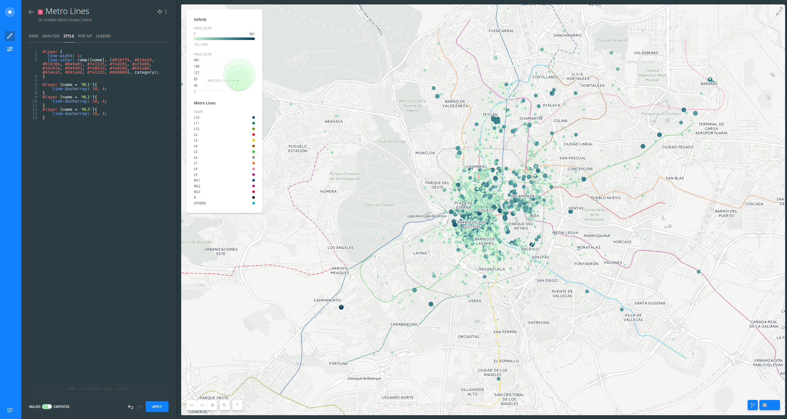

<hr>

### 5. Widgets <a name="widgets"></a>

* In order to add widgets to "Airbnb" layer, go back to the main menu:
  * Click on **`DATA`**.
  * Activate the checkbox at the upper left side from the following fields: `point_count`, `price_num`,  `square_feet`, `street`, `neighbourhood` and `property_type`.
* Go to the main menu.
* Click on **`WIDGETS`**.

> In this menu you can see the list of all widgets you have just added.

* Click on `ADD`.
* Click on `FORMULA`.
* Check `price_num`.

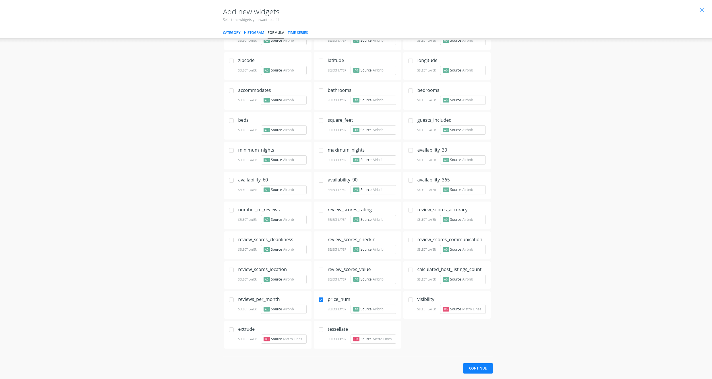

* Click on `CONTINUE`.
* Edit widgets names and prefixes (adding a dollar sign). 
* You can order the values from the category widgets with `AVG(price_num)` instead of `COUNT`.

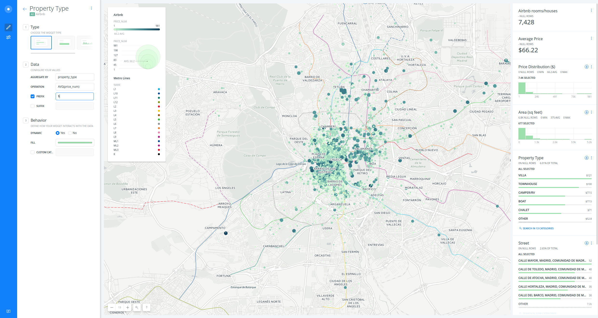

* Now you can filter and display aggregate information with widgets.

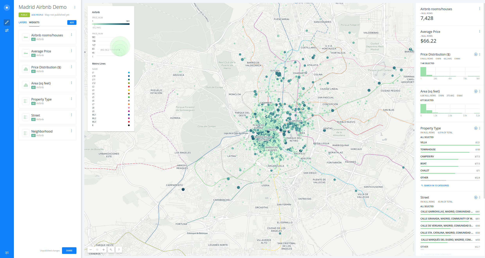

* Add a last widget for `name` field from "Metro Lines" layer.

<hr>

### 6. Analysis <a name="analysis"></a>

* In order to select the rooms or houses within 250 m from a metro line, first we need to create an area of 250 meters surrounding each line.
* Go back to the main menu.
* Click on "Metro Lines" layer.
* Go to the `ANALYSIS` tab.
* Click on `ADD ANALYSIS`.
* Select `Create areas of influence` analysis.
* Click on `ADD ANALYSIS`.

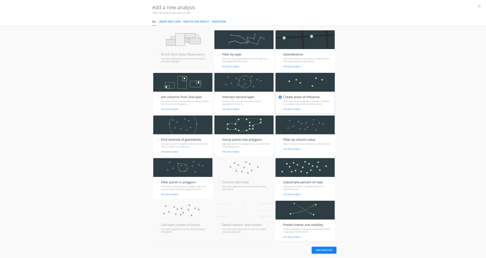

* Change `RADIUS` to `250` meters and `BOUNDARIES` to `Dissolve`.
* Click on `APPLY`

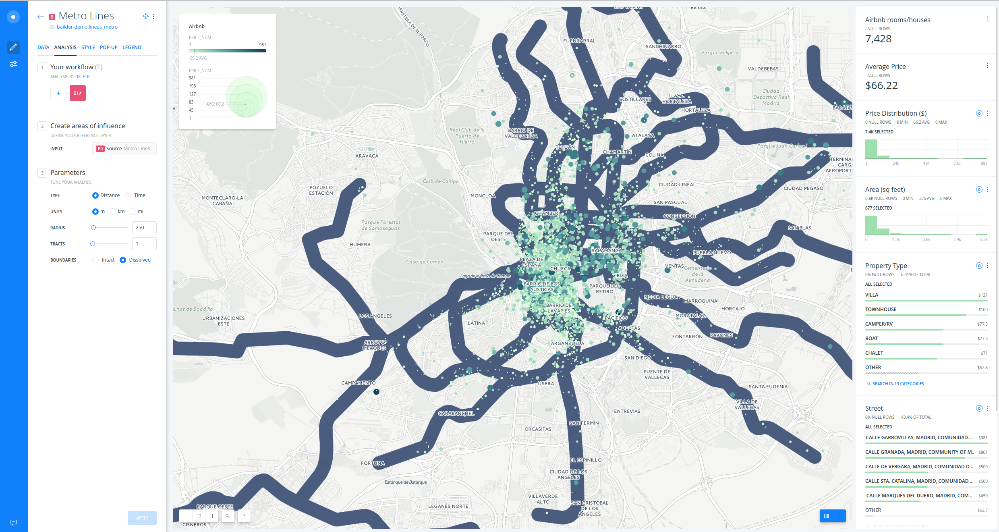

* Secondly, we have to filter the points within those new areas.
* Click on `+` to concatenate a new analysis.
* Select `Filter points in polygons` analysis.
* Click on `ADD ANALYSIS`.
* Set "Airbnb" layer as `FILTERING LAYER`.
* Click on `APPLY`.

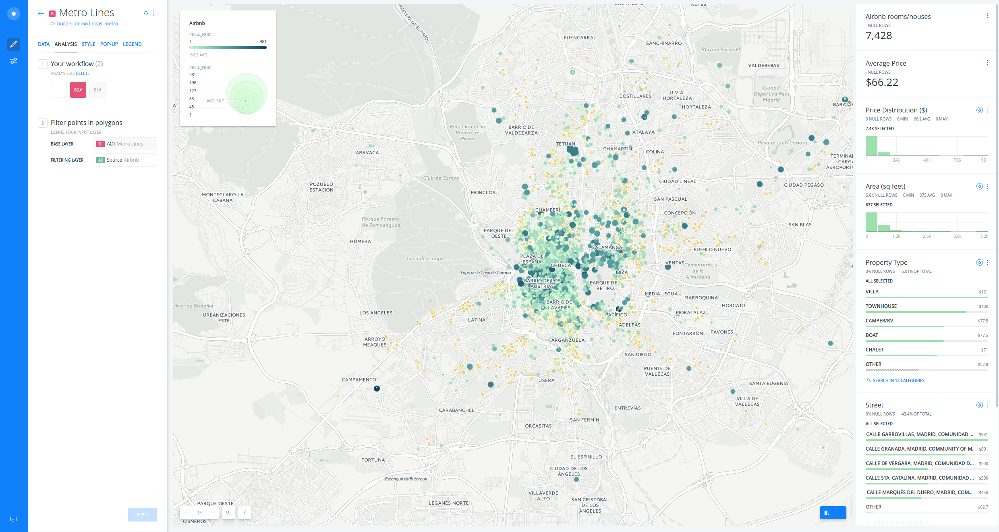

* In order to recover the "Metro lines" original layer, drag the source node out.

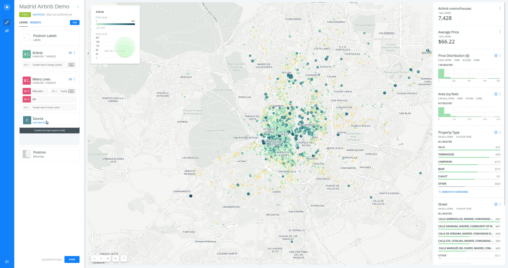

* Rename the layer with the analysis attached as "Airbnb houses".
* We can quickly restyle again copying, pasting and applying the CartoCSS code we have used before.

> In order to display the legends, first change the styles from the UI and secondly apply the custom CartoCSS from the panel. Also, you can go to `LEGEND` tab and customize the legends information.

* Now if you fiter by one line, you only get the Airbnb houses closer to that line.

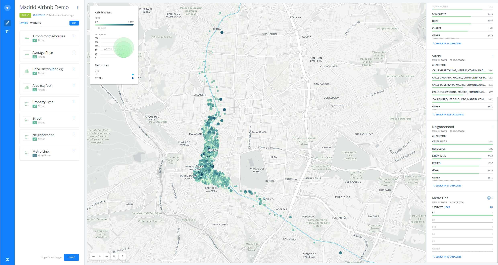

<hr>

### 7. Publish <a name="publish"></a>

* Click on `SHARE` blue bottom at the bottom left corner of BUILDER.
* Set to `LINK` or `PUBLIC`.
* Click on `PUBLISH`.

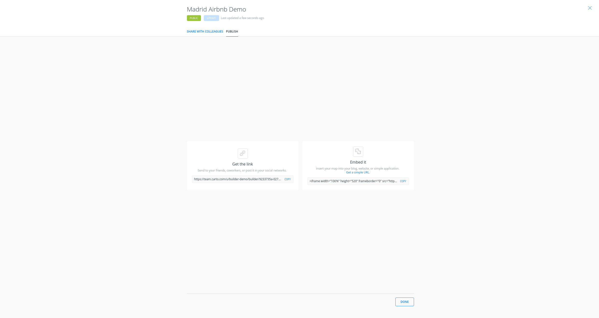

* Now you can share the map:
  * Link: https://team.carto.com/u/builder-demo/builder/9233735a-0272-11e7-a028-0ecd1babdde5/embed
  * iframe: `<iframe width="100%" height="520" frameborder="0" src="https://team.carto.com/u/builder-demo/builder/9233735a-0272-11e7-a028-0ecd1babdde5/embed" allowfullscreen webkitallowfullscreen mozallowfullscreen oallowfullscreen msallowfullscreen></iframe>`

> Remember to update your map everythime you make a change. Then refresh your embed or website where the map is hosted to see those changes.


<hr>
