# Analysis exercise: sales territories 

* *Degree of Difficulty*: ***.
* *Goal*: Find the best place to create a store near the customers.
* *Features Highlighted*:
  * Analysis: Cluster Analysis, Weight Centroid Analysis, Area of influence analysis and Filter Points in polygons analysis.
  * Widgets: Formula widget and histogram widget.
* *Datasests needed*:
  * Customer locations dataset *customer_home_locations* from [Sales Territories (Portland) Demo](https://team.carto.com/u/builder-demo/tables/customer_home_locations/public).

<!-- MarkdownTOC -->

- 1. Import and create map
- 2. Layer styling: first view
- 3. Analysis
- 4. Widgets
- Extension

<!-- /MarkdownTOC -->

## 1. Import and create map

### 1. 1. Import *customer_home_locations* csv.

* Use the *NEW DATASET* wizard on *Your datasets* dashboard to import the table.

### 1. 2. Select *customer_home_locations* and click on *CREATE MAP*

### 1. 3. Rename the layer from *customer_home_locations* to *Customer Home Locations* and update the map name to *Sales Territories (Portland) Demo*.

> **Warning**: after renaming a layer a error could pop up saying *the map cannot be rendered*, don't worry about this. Refresh the page and it will dissapear.

* You should have a dashboard like this:

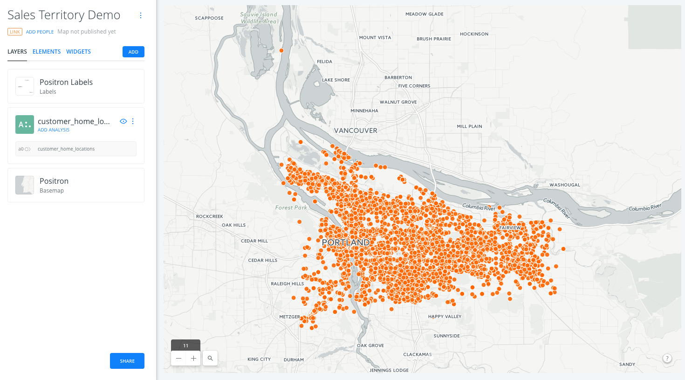

## 2. Layer styling: first view

On this example we will start with a single color styling and fixed marker size.

* Change the *FILL* color to `#cc1035` and set the size of the markers to `7`.
* Set the *STROKE* of the points to `0`.
* Click the slider button from *VALUES* to *CARTOCSS*. Take a look on the CartoCSS view and try to change any of them like increasing the width of the marker.

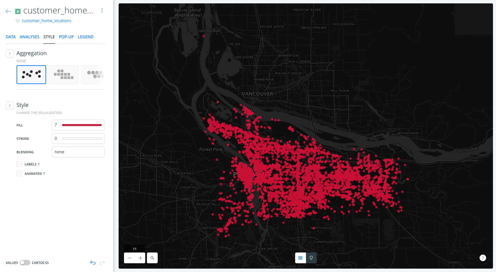

## 3. Analysis

### 3. 1. Cluster Analysis

* Back to *LAYERS* pane on Builder user interface, select *Customer Home Locations* and click on *ADD ANALYSIS*.

* From the analyses options, select *Calculate clusters of points* analysis and click on *ADD ANALYSIS*.

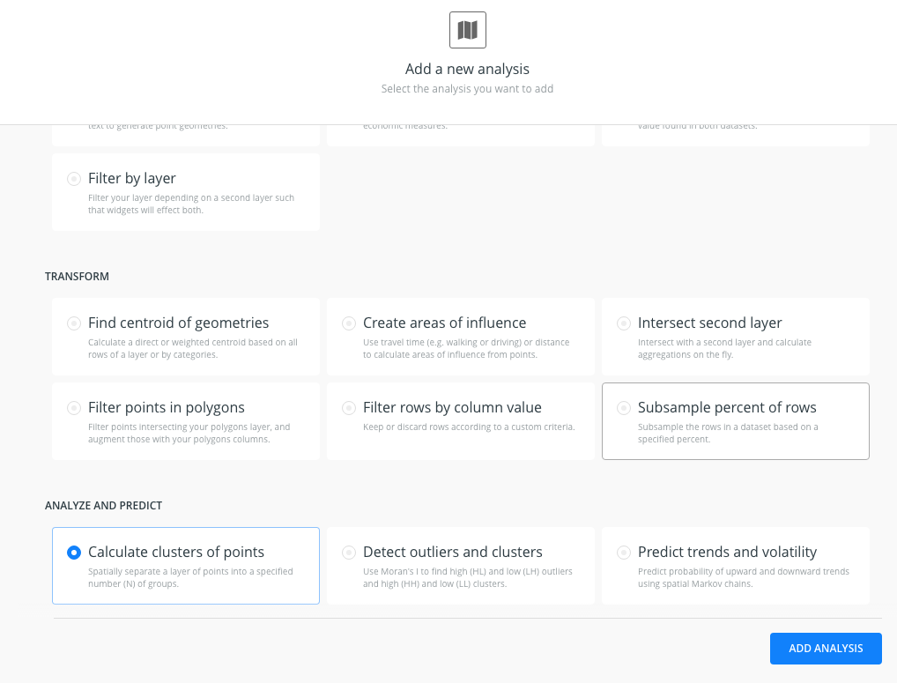

* From *ANALYSES* tab, we have three sections:
  * *Your workflow*: Is an overview of the analysis that we apply to the layer, so you can have more than one. The analysis should have the name *A1* to indicate that is the first analysis applied to the layer.
  * *Source*: asks for the geometry column from which we will calculate the clusters.
  * *Parameters*: Define the number of possible stores that you want. We set the number of clusters to `6`.

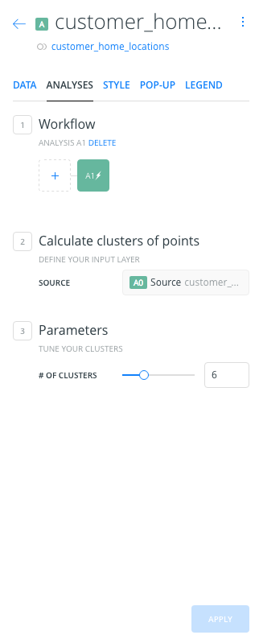

* After clicking *APPLY*, CARTO will return the result of the analysis. The result should have the same number of points on the map, but with an extra column called `cluster_no`.
* In order to have a better understanding of the result of the analysis and see how the points are grouped, we should change the *FILL* option of the points (in *STYLE* tab) according to the value of `cluster_no` column using *BY VALUE* options:

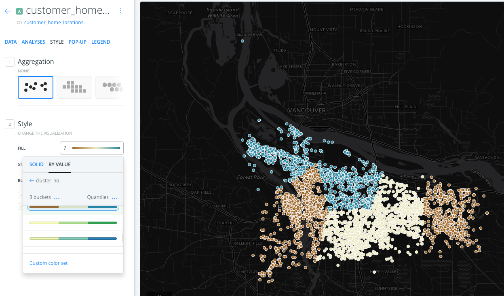

### 3. 2. Weighted Centroid Analysis

* Click on *Customer Home Locations*, go to *ANALYSIS* tab and click on *ADD ANALYSIS*.
* Select the *Find centroid of geometries* analysis.

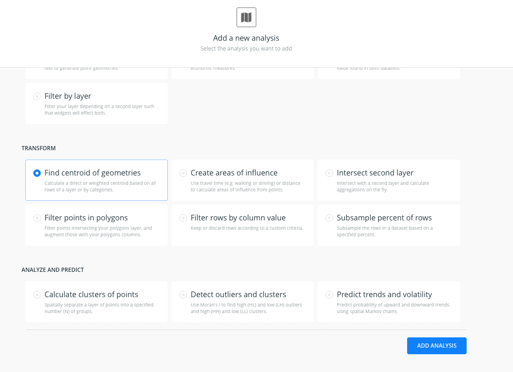

* In the *ANALYSES* tab of the layer, we have two sections:
  * *Your workflow*: Now, because we are applying a second analysis to the *Customer Home Locations* layer, the workflow has changed. *A1* node represents the cluster analysis, but now we have a new analysis named *A2* to indicate that is the second analysis applied to the layer.
  * *Centroid*:
    * *Source*: we indicate that we are using as the source, the results from the *Calculate clusters of points*  analysis. The source is the result from *Calculate cluster points*  analysis.
  * *Parameters*: to set how we want to calculate the centroids of the cluster data. We will select the  *Categorized by* option using the `cluster_no` column, we will also select the *Aggregated by* parameter to aggregate the result by `customer_value` average value. Finally, we will select the *Weigthted by* parameter using the `customer_value` column to indicate the column that we want to use to calculate the centroids of the clustered regions.

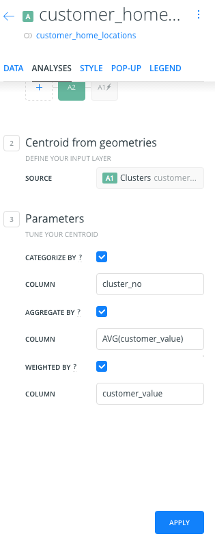

* After clicking *APPLY* we should see the result, which should be the centroids of the clustered areas.

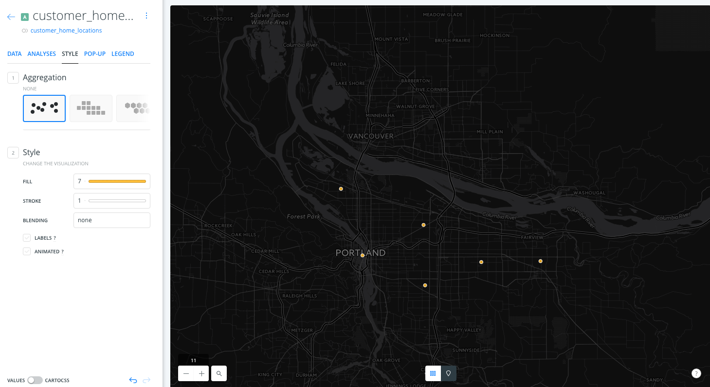

#### 3. 2. 1. Improve visualization

* We could style our resulting points by changing the size and the color according to the resulting aggregated values.

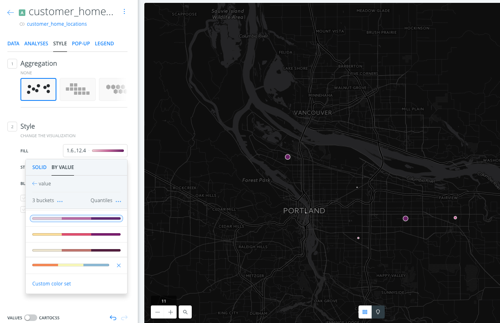

* We also could add a popup to the layer, so for each point we can display its value. In order to do this we need open the *POP-UP* tab and select the *HOVER* option to display the pop-up when we mouse over the centroids.
We select the column *value* to display its values in the pop-up.  We will also change the name that will be displayed on the pop-up to *AVG. CUSTOMER VALUE*.

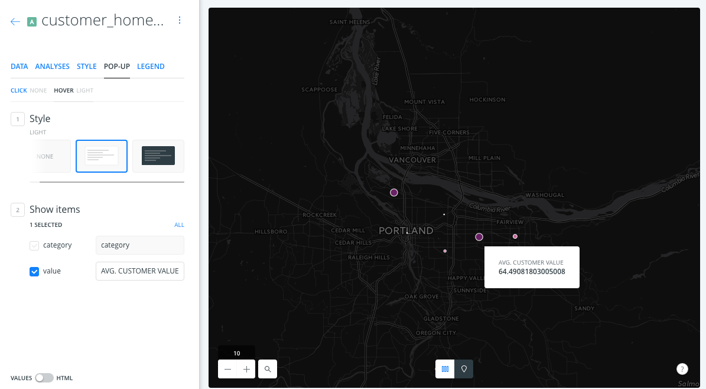

* Back to the main menu, in the *Layers* tab, we drag and drop the clusters' node analysis outside of layer *A1* to create a new data layer with the customer locations (*B*).

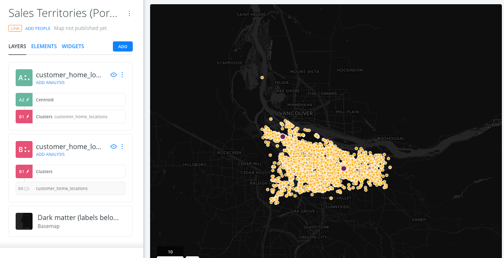

* Now, we change the name of the layers. The name of Layer *A* will be *Centroids* and the name of layer *B* will be *Customer Locations*. Then, we change the style of the *Customer Locations* layer using the values from the column `cluster_no` in order to style the points depending on the cluster they belong to.

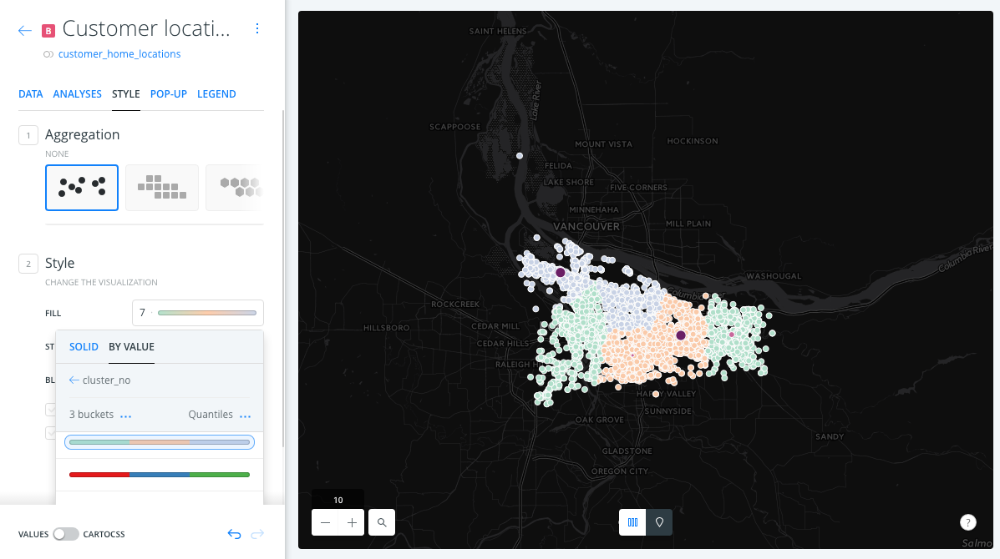

### 3. 3. Area of influence analysis

* We will apply the analysis to the result of the centroid analysis. We will go back to *LAYERS* pane on Builder interface and click *ADD ANALYSIS* on *Centroids* layer (*A*).
* We will select the *Create areas of influence* analysis.

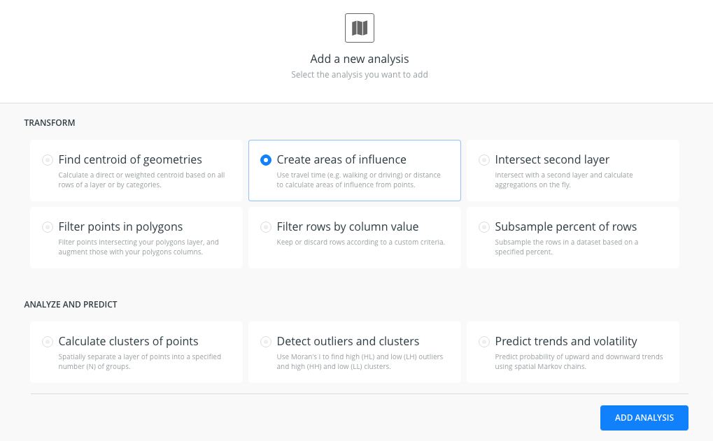

* In the *ANALYSES* tab of the layer, we have three sections:
  * *Your workflow*: Now, as we are applying a third analysis to *Centroids* layer, the workflow has changed. *A1* represents the cluster analysis, *A2* represents the centroid analysis and *A3* indicates the third analysis applied to the layer.
  * *Create areas of influence*:
    * *Input*: Should be the result of centroid analysis, node *A2*.
  * *Parameters*: define the distance of the area of influence, the type of units, the radius and the boundaries. The boundaries might be *Intact* or *Dissolved*. If we choose the *Intact* option, that means that if our areas of influence polygons overlap, then they will keep their original polygon borders. On the other hand, if we choose the *Dissolved* option, if the areas of influence polygons overlap, they will be merged so the result will be one big polygon with the outer shape of all AOIs polygons. We set the units to *km*, set the radius to *1* and choose the *Intact* option for the *BOUNDARIES* parameter.
* After clicking *APPLY*, we should see the result: areas of influence of 100 meters around the subway stations

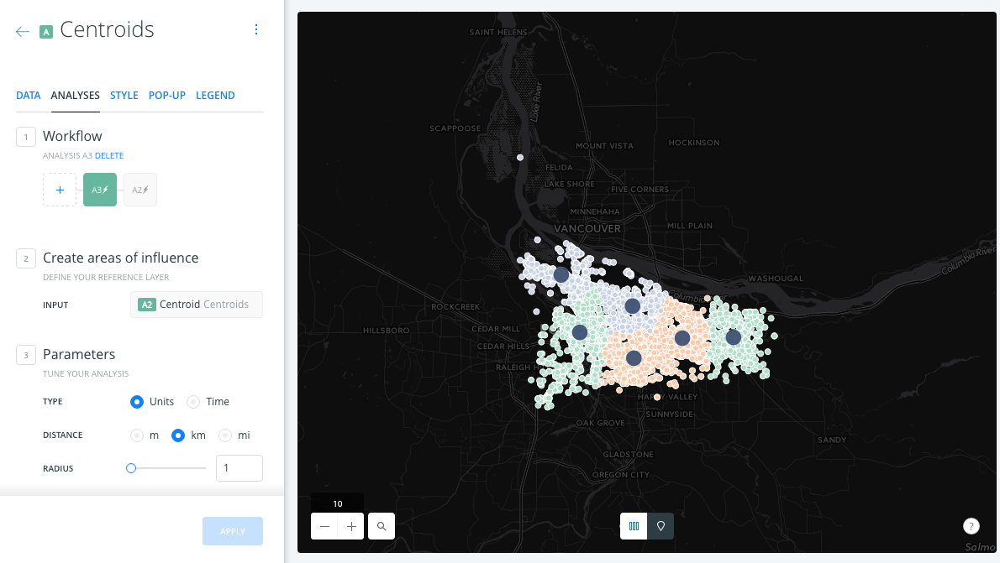

#### 3. 3. 1. Improve visualization

* Back to *LAYERS* pane, we drag and drop the Area of influence node analysis outside of layer *A3* to create a new layer *C* with the areas of influence. Change the name of layer *C* to *Areas of Influence*.

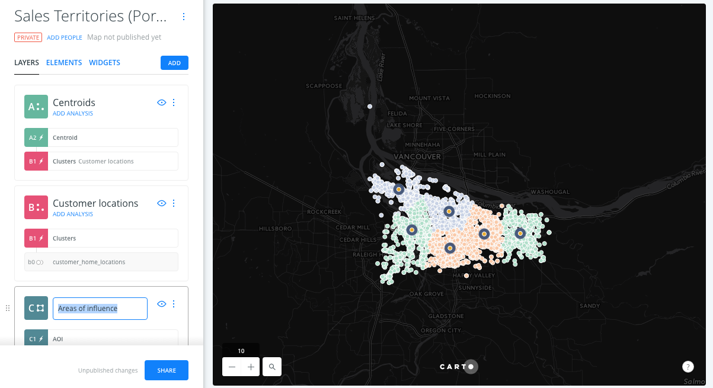

### 3. 4. Filter Points in polygons analysis

* We will apply the analysis to the *Areas of Influence* layer, so we click *ADD ANALYSIS* option of that layer and select the *Filter points in polygons* option.

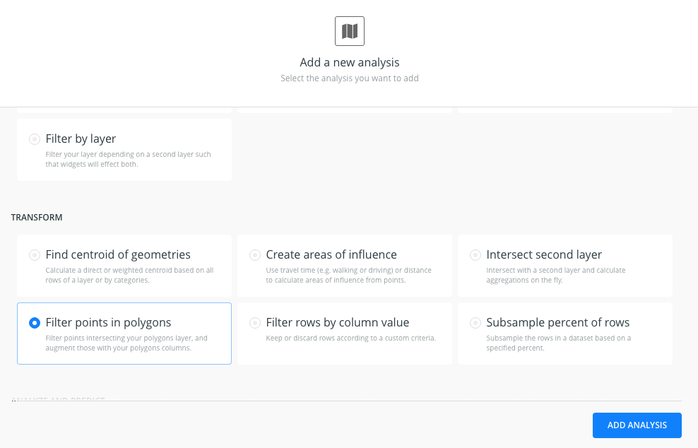

* In the *ANALYSES* tab of the layer, we have two sections:
  * *Workflow*: Now, because we are applying a second analysis to *Areas of Influence*, the workflow has changed. *C1* represents the area of influence analysis, but now we have a new analysis named *C2* to indicate that is the second analysis applied to the layer.
  * *Filter points in polygons*:
    * *Source*: we indicate that we are using as the source, the results from the AOIs analysis. The source should be *B1*
    * *Target Layer*: is the *Clusters* layer (*B1*).

* After clicking *APPLY*, we should see a result where instead of the circles we had before on our *Areas of Influence* Layer, we should have now points referring to customers within those areas. The result is indicating which customers are closer to each store.

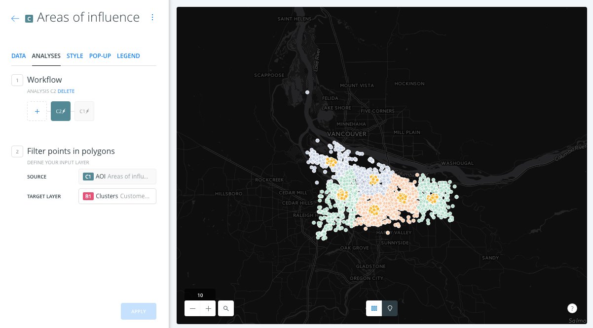

## 4. Widgets

### 4. 1. Formula widget

* Go to *WIDGETS* pane on the Builder interface and click on *ADD WIDGET*.
* In the options of the *FORMULA* tab, select the `cartodb_id` column of the *B1* layer and we click on *CONTINUE*.

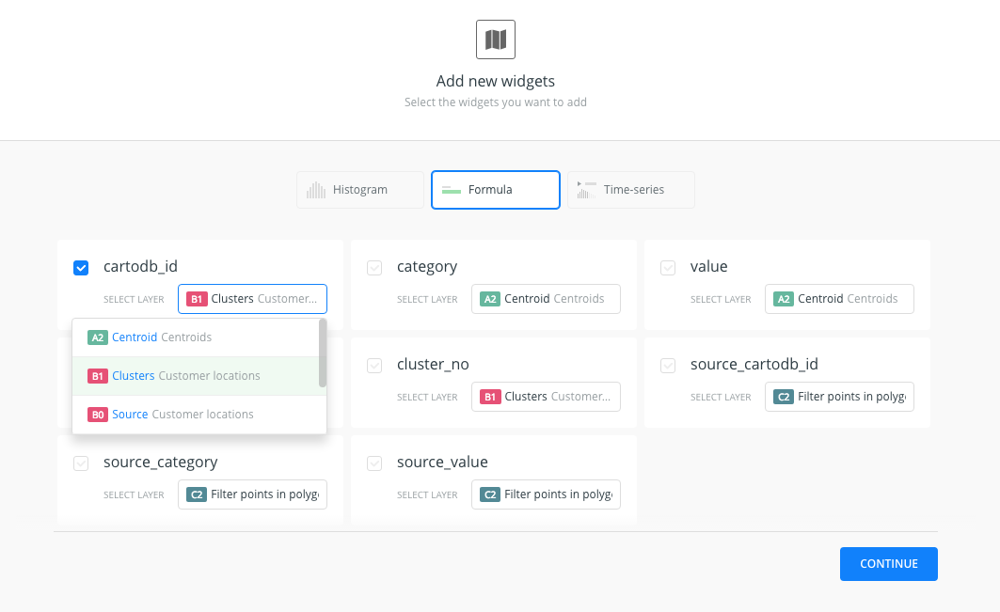

* In the widget menu, we set the *OPERATION* parameter to *COUNT* and we change the name of the widget to *Total Customers*.

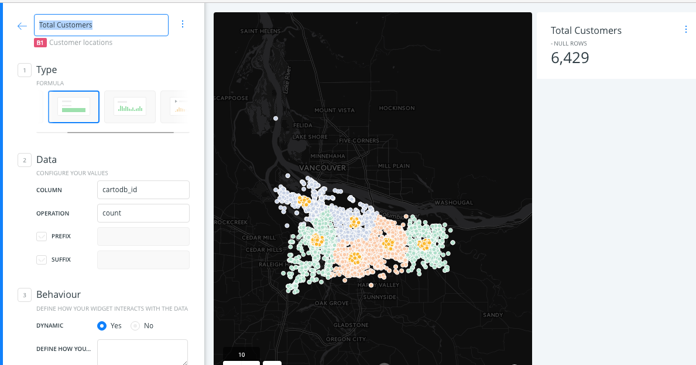

* Go to *WIDGETS* pane on the Builder interface and click on *ADD WIDGET*.
* In the options of the *FORMULA* tab, select the `cartodb_id` column of the *C2* layer and we click on *CONTINUE*.

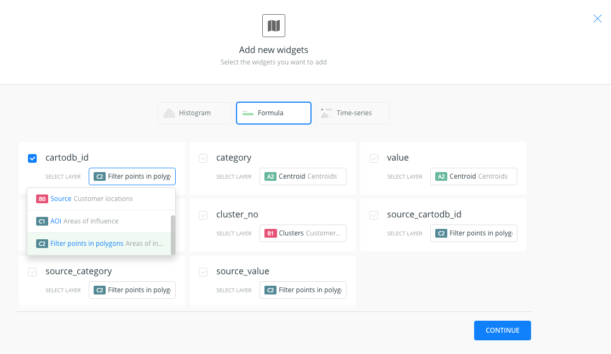

* In the widget menu, we set the *OPERATION* parameter to *COUNT* and we change the name of the widget to *Customers within Areas of influence*.

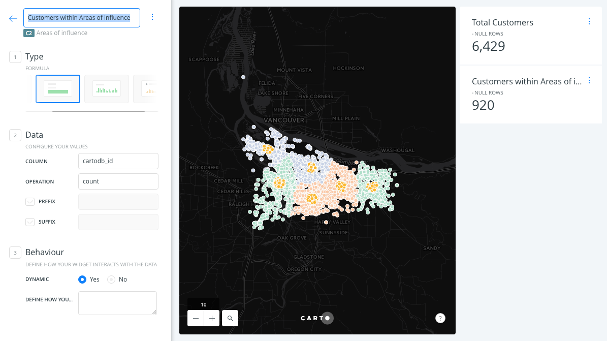

### 4. 2. Histogram widget

* Go to *WIDGETS* pane on the Builder interface and click on *ADD WIDGET*.
* In the options of the *HISTOGRAM* tab, select `customer_value` column from *B1* layer and click on *CONTINUE*.

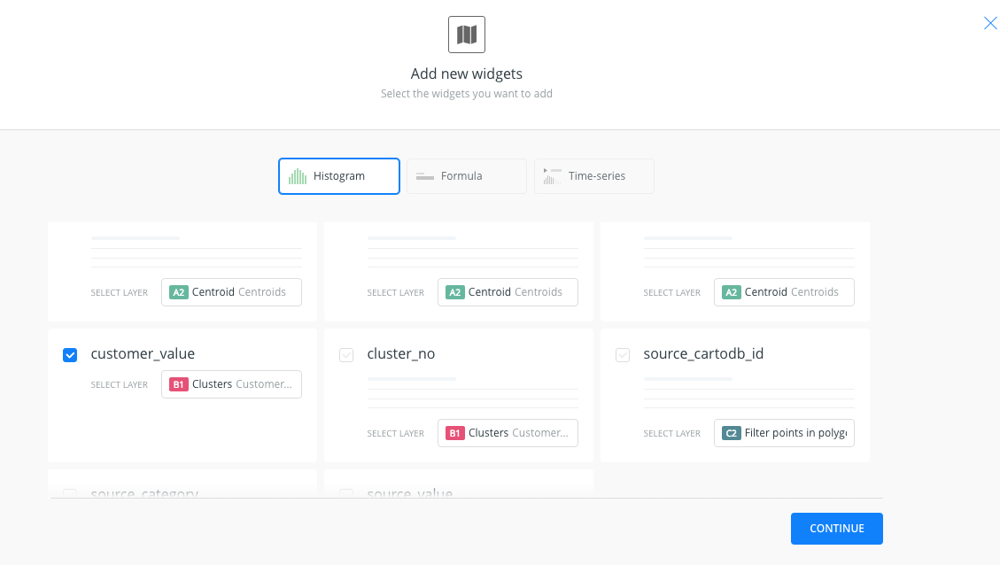

* We should get a "U shape" histogram:

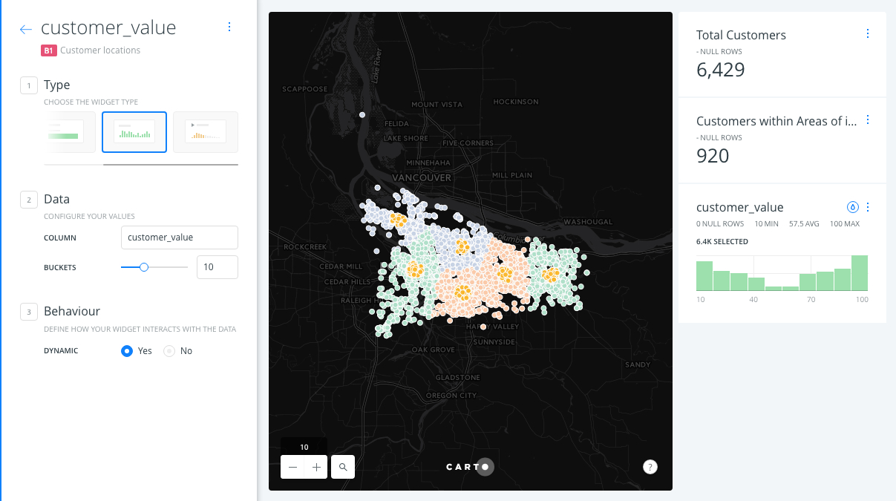

* Go back to the main menu, and filter your map with the histogram. Watch how the map changes !

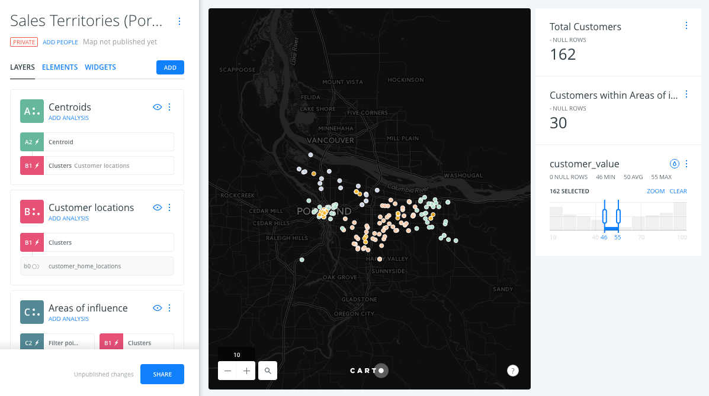

## Extension

Check this screenshot carefully and see the different analysis and widgets applied. Can you get something like this?

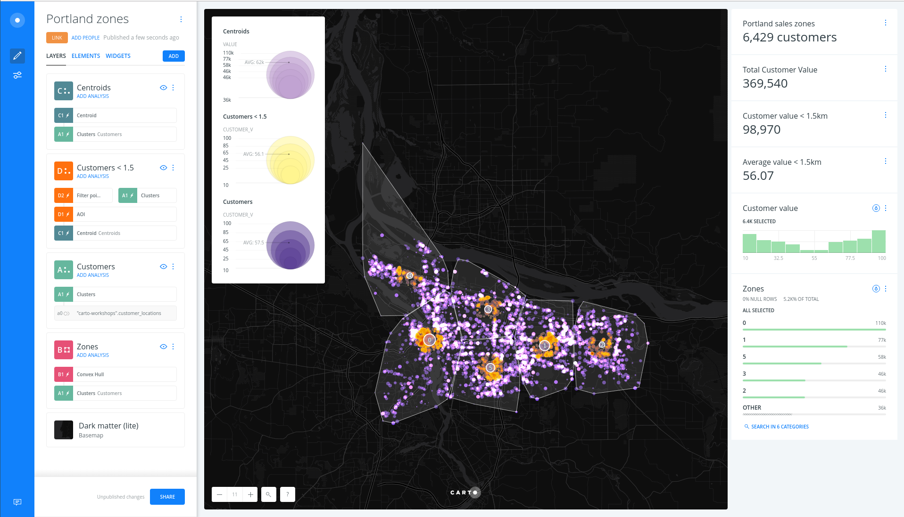
