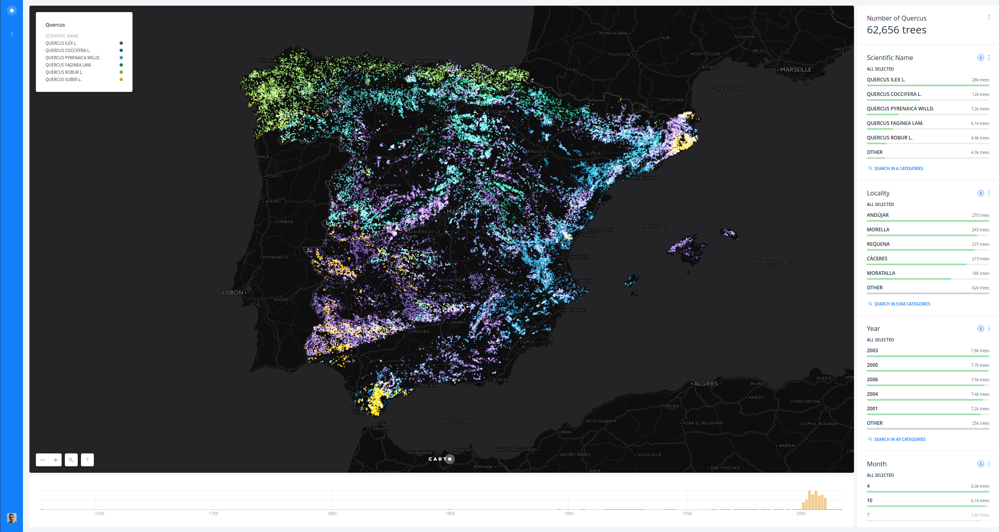
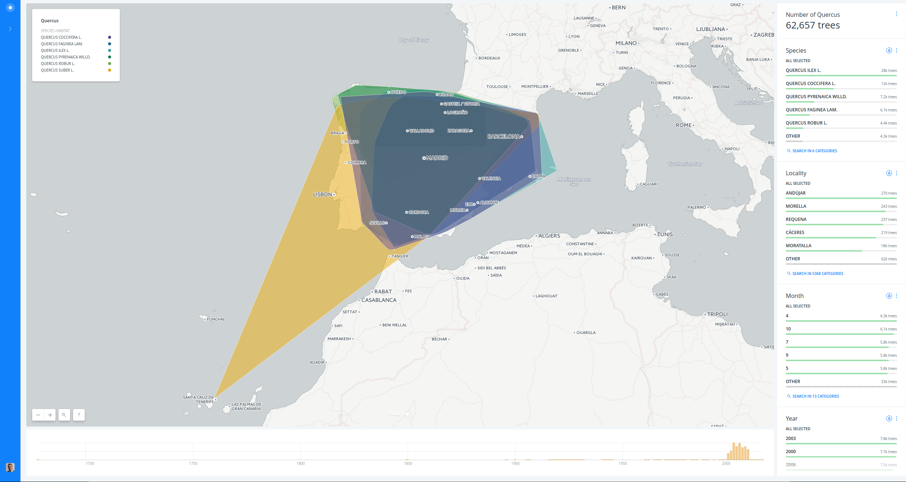

# Quercus diversity, habitat and distribution 

* *Degree of Difficulty*: **
* *Goal*: visualize Quercus spatial distribution, diversity and habitats in Spanish territory.
* *Features Highlighted*:
  * Widgets: Category and time-series widgets.
  * Analysis: Georeferencing and Group points into polygons (Convex Hull).
  * Visualization: blending methods, category  and choropleth maps.
* *Datasests needed*:
  * `quercus` point dataset from [here](https://team.carto.com/u/builder-demo/tables/quercus/public), the data source is from [GBIF database](http://datos.gbif.es/).
  * `ign_spanish_adm3_municipalities` dataset from CARTO Data Library.

## Sections

A. [Quercus diversity](#diversity)  
B. [Quercus habitat](#habitat)  
C. [Quercus distribution](#distribution)

## A. Quercus diversity  

1. Create a map connecting `quercus` dataset.
2. Rename map title and layer name.
3. Change basemap from "Positron" to "Dark Matter".
4. Add `Georeference` analysis to the layer, using `latitude___processed` and `longitude___processed` fields.
5. Change layer style, setting the marker width to `3`, removing the marker `STROKE` and setting the `BLENDING` method to `screen`.
6. Add some widgets: `point count`, `scientific_name`, `locality`, `event_date___parsed`.
7. Publish and share your map.

https://team.carto.com/u/ramirocartodb/builder/6c54e318-0a5f-11e7-9ccc-0e05a8b3e3d7/embed

## B. Quercus habitat  

1. Create a map connecting `quercus` dataset.
2. Rename map title and layer name.
3. Add `Georeference` analysis to the layer, using `latitude___processed` and `longitude___processed` fields.
4. Add some widgets: `locality`, `event_date___parsed`, `month` and `year` (edit these last two from histograms to categories).
5. Add `Group points into polygons` analysis to the layer, grouping by `scientific_name` and leaving the `OPERATION` as `COUNT`.
6. Add some widgets: `count_vals` (change it from `avg` to `sum`) and `category`.
7. Change layer style, make a category map using the `category` field. To make the visualization better, go to the CartoCSS view and set the `polygon-opacity` to `0.5`.
8. Publish and share your map.

https://team.carto.com/u/ramirocartodb/builder/eacad866-0a63-11e7-8675-0e233c30368f/embed

## C. Quercus distribution  

1. Create a map connecting `quercus` dataset.
2. Rename map title and layer name.
3. Change basemap from "Positron" to "Dark Matter".
4. Add `Georeference` analysis to the layer, using `latitude___processed` and `longitude___processed` fields.
5. Add some widgets: `point count` and `scientific_name`.
6. Add `ign_spanish_adm3_municipalities` layer form CARTO Data Library.
7. Rename municipality layer name.
8. Add `Intersect with second layer` analysis to the municipalities layer, setting the quercus layer as `INTERSECT LAYER` and leaving `COUNT` as `OPERATION`.
9. Disable the view of quercus layer.
10. Add some widgets: `nameunit` and `count_vals`.
11. Change municipality style, make a choropleth map using the `count_vals_density` field. To make the visualization better, go to the CartoCSS and add some custom properties.
12. Publish and share your map.

https://team.carto.com/u/ramirocartodb/builder/6873b688-0aec-11e7-b9c4-0e3ff518bd15/embed

