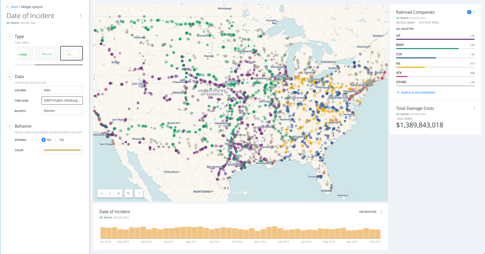

# Analysis exercise: railways risk analysis

* *Degree of Difficulty*: ***
* *Goal*: what US counties have higher risk for insuring railroad companies.
* *Features Highlighted*:
  * Widgets: Category, Formula and Time Series.
  * Analysis: Intersect, Outliers & Cluster analysis.
* *Datasests needed*:
  * Railroad accidents (*railroad_data*): download it [from the `builder-demo` CARTO account](https://team.carto.com/u/builder-demo/tables/railroad_data/public/map?redirected=true) and import it into CARTO from your local machine. Or use [this url](https://builder-demo.carto.com/api/v2/sql?q=select%20*%20from%20%22builder-demo%22.railroad_data&format=gpkg&filename=railroad_data) directly.
  * US counties (*cb_2013_us_county_500k*): search and connect via Data Library.

## Contents

<!-- TOC depthFrom:1 depthTo:6 withLinks:1 updateOnSave:1 orderedList:0 -->

- [Analysis exercise: railways risk analysis](#analysis-exercise-railways-risk-analysisa-namerailwaysa)
	- [Contents](#contents)
	- [1. Import and create a map](#1-import-and-create-a-map)
	- [2. Styling](#2-styling)
		- [2. 1.  *SIZE/COLOR*:](#2-1-sizecolor)
		- [2. 2. *STROKE*:](#2-2-stroke)
		- [2. 3. Exploring the cartoCSS](#2-3-exploring-the-cartocss)
	- [3. Widgets](#3-widgets)
		- [3. 1. Adding Widgets](#3-1-adding-widgets)
		- [3. 2. Customizing Widgets](#3-2-customizing-widgets)
			- [*Railroad Companies* Category Widget:](#railroad-companies-category-widget)
			- [*Total Damage Costs* Formula Widget:](#total-damage-costs-formula-widget)
			- [*Date* Time Series Widget:](#date-time-series-widget)
	- [4. Analysis Add US counties layer, start the analysis](#4-analysis-add-us-counties-layer-start-the-analysis)
		- [4. 1. Adding Layers](#4-1-adding-layers)
		- [4. 2. Perform Analysis](#4-2-perform-analysis)
			- [*Intersect second layer* Analysis:](#intersect-second-layer-analysis)
			- [*Sum Total Damage Histogram Widget*:](#sum-total-damage-histogram-widget)
			- [*Detect outliers and clusters* Analysis:](#detect-outliers-and-clusters-analysis)
			- [*Sum Total Damage* Histogram Widget:](#sum-total-damage-histogram-widget)
	- [5. Publishing](#5-publishing)
		- [5. 1. Exporting Data](#5-1-exporting-data)
		- [5. 2. Publish Map](#5-2-publish-map)

<!-- /TOC -->

## 1. Import and create a map

* Import the *dot_rail_safety_data* csv file into _Your datasets_ dashboard.
* Create a new map with it
* You should have a dashboard like this:

## 2. Styling

Click on layer A (our only layer) and navigate to the *STYLE* pane.

### 2. 1.  *SIZE/COLOR*:

* Click on the marker size (number). At the top of the pop-up, select *BY VALUE*, select `total_damage` as the variable. Set *MIN* to `2` and set *MAX* to `12`.
* Click on the color selector (bar). Select any color. Set the opacity slider (or use the *A* text field) to be between `.5` and `.4`

### 2. 2. *STROKE*:

* Click on the stroke width (number). Set to `0`.

### 2. 3. Exploring the cartoCSS

More advanced users can access the cartoCSS of their map by clicking on the slider at the bottom of the style pane to toggle from `VALUES` to `CARTOCSS`.

Switch to the cartoCSS view and check how the quantitative map has been defined. You'll see a `ramp()` function. This is TurboCARTO, our cartoCSS pre-processor that helps creating parametric symbolization based on column values. Learn more about TurboCARTO in this [awesome blog post](https://carto.com/blog/styling-with-turbo-carto/) by our senior cartographer [Mamata Akella](https://mamataakella.carto.com).

## 3. Widgets

Click the *Back* button to navigate to the layers pane, and switch to the widgets pane

### 3. 1. Adding Widgets

Click on *ADD NEW WIDGET* and add the following:

* *CATEGORY*: `railroad`
* *FORMULA*: `total_damage`
* *TIME SERIES*: `date`

Click on *CONTINUE*

### 3. 2. Customizing Widgets

Click the *Back* button to navigate to the widgets pane. From here, you can drag the widgets into the order you would like them to appear on your map. To rename a widget, either double click on it's name, alter the text and hit enter, or click the three buttons on the right of the widget tiles and select `Rename`. Give the widgets meaningful names:
* `railroad` -> `Railroad Companies`
* `total_damge` -> `Total Damage Costs`
* `date` -> `Date of Incident`

Customize the widgets in the following ways:

#### *Railroad Companies* Category Widget:
* Notice how CARTO Builder relates map visualizations to widgets. This connection is bidirectional, the map changes widgets values and clicking on categories changes the map.
* Click on the *Auto style* droplet button to see how each dot is colored according to its category.
* Disable the *Auto style* to come back to the default visualization.

#### *Total Damage Costs* Formula Widget:
* Set *OPERATION* to *SUM* and add `$` as *PREFIX*.
* Again, take note of the relationship between map visualization and widgets.
* Try to filter by company by clicking on a category from the `Railroad Companies` widget and see how the `Total Damage Costs` widget is updated automatically.

#### *Date* Time Series Widget:
* Set *COLUMN* to `date`
* Set *BUCKETS* to `month`

You can now explore how filtering widgets can quickly provide powerful insights.

## 4. Analysis Add US counties layer, start the analysis

Click the *Back* button to navigate to the layers pane, then click *ADD*

### 4. 1. Adding Layers

* In order to add a common dataset, such as USA Counties, use the data library.
* From the dataset selection window, click on *DATA LIBRARY*
* Click on the magnifying glass while in the data library tab in order to expand the search bar and search within the library.
* Type `counties` in the *SEARCH* bar
* Select the *cb_2013_us_county_500k* (it may be called USA Counties) dataset. Click *ADD LAYER*.
* Rename the new layer to `US Counties`.
* Drag `US Counties` below `Railroad Accidents`.

### 4. 2. Perform Analysis

* Click on *US Counties* layer
* Navigate to the *ANALYSIS* tab
* Click *ADD NEW ANALYSIS*

#### *Intersect second layer* Analysis:
* Select `Intersect second layer`: this analysis performs a spatial intersection and aggregates the geometry values from the target layer that intersect with the geometry of the source layer.
* Click *ADD ANALYSIS*
  * Set *TARGET LAYER* to `A0 Source railroad_data`
  * Set *OPERATION* to `SUM(total_damage)`
  * Click *APPLY*.

* Notice that only the counties overlapping with data points are showed. Switch to the Data View to see the new column created with the analysis, `sum_total_damage`.

#### *Sum Total Damage Histogram Widget*:

* Navigate to the *DATA* pane
* Click the *Add as a widget* checkbox of the *sum_total_damage* field, click the *EDIT* button that appears.
  * Set the *BUCKETS* to `7`
  * Rename widget to `Sum Total Damage`.

* Click the eye icon to hide `Railroad Accidents`
* Click on the *Auto style* droplet button to see how each polygon is colored according to its value.

#### *Detect outliers and clusters* Analysis:

* Click the *Back* button to navigate to the layers pane
* Click on *US Counties* layer
* Navigate to the *ANALYSIS* pane
* Click *ADD NEW ANALYSIS*, near the top of the pane
* Select *Detect outliers and clusters*: this analysis finds areas in your data where clusters of high values or low values exist, as well as areas which are dissimilar from their neighbors.
  * Set *TARGET COLUMN* to `sum_total_damage`
  * Click *APPLY*.

* First, using the map show the viewer the results of the analysis: only the counties considered by the analysis as outliers or clusters are showed. Secondly, switch to the Data View to see the new columns created with the previous analysis, `quad` is the more interesting column because it contains the groups resulting from the analysis:

* `HH` and `LL`: clusters of high or low values surrounded by similar values
* `HL` and `LH`: outliers of high or low values surrounded by opposite values

#### *Sum Total Damage* Histogram Widget:
* Navigate to the *DATA* pane
* Click the *Add as a widget* checkbox of the *quads* field, click the *EDIT* button that appears.
* Rename widget to `Groups`.

* Filter by `HH` and `HL` counties. Those are counties with high value of total damage surrounded by counties with also high values, and counties with high value of total damage surrounded by counties with low values.
* Click on the *Auto style* droplet button to see how each polygon is colored according to its category.

## 5. Publishing

### 5. 1. Exporting Data

* Click the *Back* button to navigate to the layers pane
* On the *US Counties* layer tile, click the three vertical dots `More options` button
* Select *Export data*, choose *CSV*.
* Open (with Excel or another similar software) the csv file you just download *US_Counties.csv*. Collapse `the_geom` column. You should have 39 counties/rows, containing only `HH` and `HL` values.

### 5. 2. Publish Map

* On the left blue bar, click on the *switches* button.
* Click the *LAYER SELECTOR* checkbox. A floating layer selector box will appear in the top left of your map.
* On the left blue bar, click on the *pencil* button.
* Below the map title should show *PRIVATE*, *ADD PEOPLE* and *Unpublished map*. Let's change that.
  * First, click on *PRIVATE*, and again. Select `Link`.
  * Secondly, click on *SHARE* (at the bottom of the *LAYERS* pane). Click on *PUBLISH*, and then *DONE*.
  * Get the link and past it into your browser.

Notice that the state your map is published in will be the default view that the link for the map opens as. If you alter your map (try changing the zoom level, pan the map around, turn off a layer) and do not republish your map, your link will remain the same as when you initially published. However, next to the *PUBLISH* button, you will see text that says *Unpublished changes* to let you know you have altered your map. When you republish your map, the link will automatically update to match your latest changes. 
