# Spies in the sky Demo

* *Degree of Difficulty*: ***

* *Use case*: This use case is based on a data journalism research published in [buzzfeed in April](https://www.buzzfeed.com/peteraldhous/spies-in-the-skies?utm_term=.hn2ryrBLb#.fgjgag9vG). The authors used data from [FlighRadar24](https://www.flightradar24.com/how-it-works), where thousands of collaborators upload flight information using automatic dependent surveillance-broadcast (ADS-B) technology. You can have a look at how they built the dataset in this github repository. The research reveals that each weekday, dozens of U.S. government aircraft (from FBI and DHS agencies) take to the skies and slowly circle over American cities. Back in the day, the authors used CARTO Editor SQL and CartoCSS. Now because of BUILDER, you can do the same but in just a few minutes!

* *Features Highlighted*:
	* Analysis: Filter by column, Connect with lines,Find centroid of geometries.
	* Widgets: timeseries, point count(formula), altitude (histogram), avergage speed (formula).

* *Datasests needed*:
	* [`flights` dataset](https://builder-demo.carto.com/api/v2/sql?q=select+*+from+flights&format=gpkg&filename=flights.gpkg).

<!-- MarkdownTOC -->

- 1. Import and create map
	- 1. 1. Import ``flights`` geopackage.
	- 1. 2. Dataset view
	- 1. 3. Click on ``CREATE MAP`` from ``flights``
- 2. Layers and styles
	- 2. 1. Show the new ordering of the layers in the Builder
	- 2. 2. Show the different options layers have
- 3. Analysis
	- 3. 1. Filter by column Analysis
	- 3. 2. Connect with lines Analysis
	- 3. 3. Find centroid of geometries analysis
- 4. Widgets
	- 4. 1. Timeseries widget
	- 4. 2. Histogram widget
	- 4. 3. Formula widget
	- 4. 4. Modify widgets
- 5. Publish
- 6. Extension

<!-- /MarkdownTOC -->

## 1. Import and create map

### 1. 1. Import ``flights`` geopackage.

* Don't download the dataset, instead you can directly put the url above into the URL box and CARTO will download an import it in one single step.

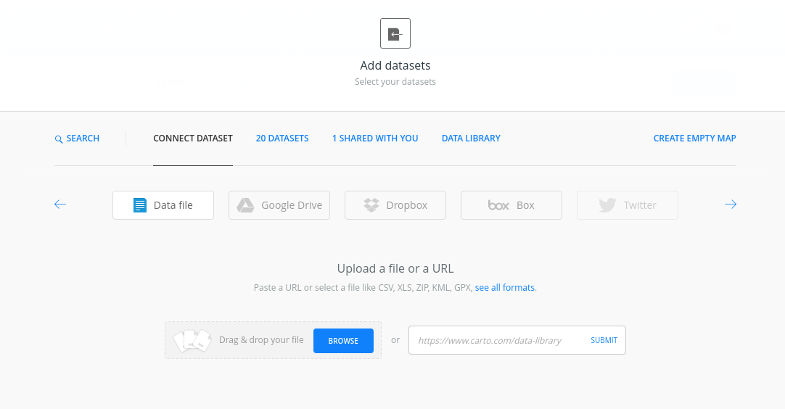

### 1. 2. Dataset view

Take a look on the dataset schema, the relevant fields are: `flight_id`, `timestamp`, `altitude` and `speed`

### 1. 3. Click on ``CREATE MAP`` from ``flights``

> Explore the visualization. Could you observe any clear pattern? The expected pattern are straight lines, but what about the circles?

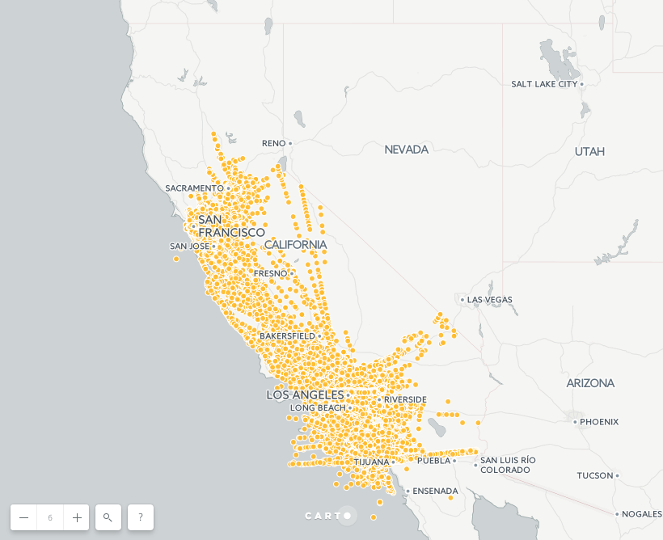

**Hint**: try to use the `multiply` composite operation to see more clearly some patterns on the dataset.

## 2. Layers and styles

### 2. 1. Show the new ordering of the layers in the Builder

* Every layer has a source. For instance, the source of the ``flights`` layer is the **``flights``** table, identified here as ``A0``. This will be very important when adding analysis and widgets.

* Change basemap from Positron to Positron (labels below)

### 2. 2. Show the different options layers have

Each layer has 5 options: `DATA`, `ANALYSES`, `STYLE`, `POP-UPS` and `LEGENDS`.

* `DATA`:
  * This interface gives a general view of the fields the layer, its name and its data type but also from there you can add them as widgets.
  * Switch to `VALUES` to `SQL`. The SQL command line allows more advanced users to manage data in a more precise way.
  * Finally, it's easy to change from map view to dataset view.

* `STYLE`:
  * Change the fill color to ``#f20000`` and set the size of the markers to 7.
  * Switch to `VALUES` to `CARTOCSS`. CartoCSS panel allows more advanced users to layer style in a more precise way.

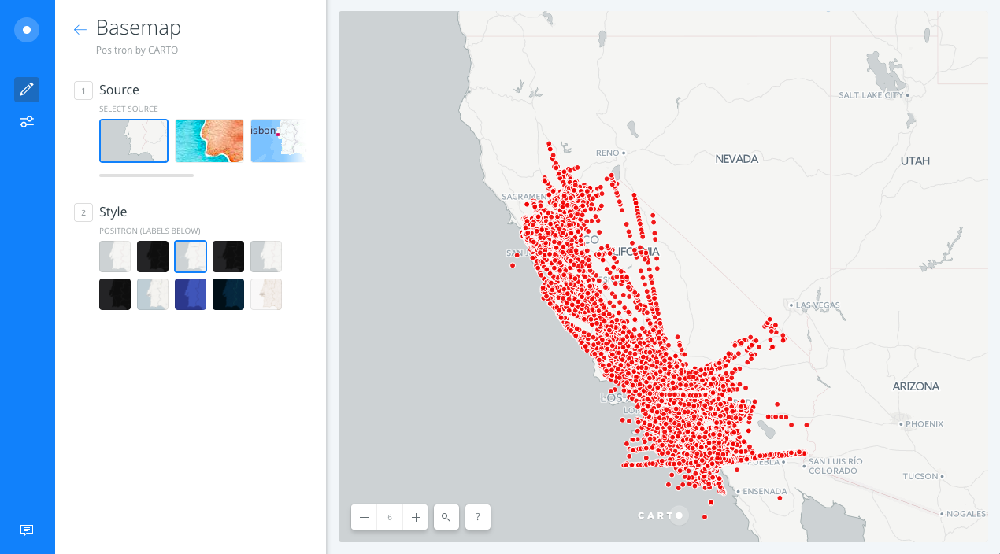

## 3. Analysis

### 3. 1. Filter by column Analysis

* Back to the main menu of the layers, select the ``flights`` layer and click on ``ADD ANALYSIS`` option.

* From the analysis menu, select the ``Filter by column`` analysis and click on ``ADD ANALYSIS``.

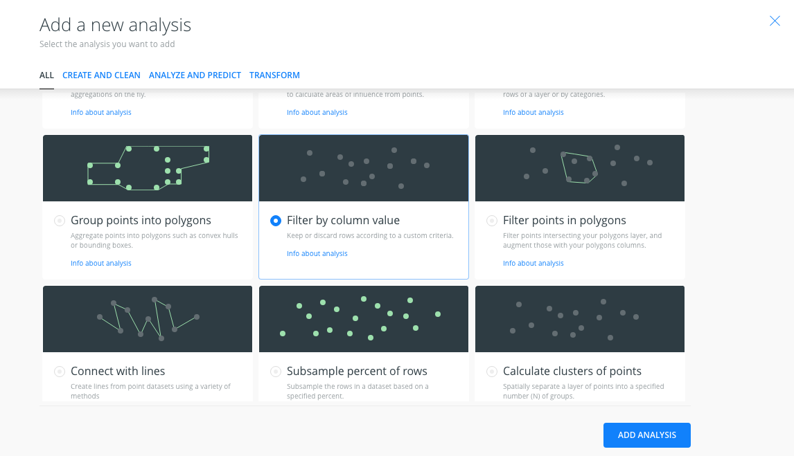

* In the ``ANALYSES`` tab of the layer, we have several sections:
	* **Workflow**: Is an overview of the analysis that we apply to the layer, so you can have more than one. The analysis should have the name ``A1`` to indicate that is the first analysis applied to the layer.
	* **Filter by column value**: asks for the source layer where are the columns that you want to use to filter (**input parameter**) and the column that you want to use to filter. We select the column `flight_id`. A new section **Parameters** appears in the analysis menu.
	* **Parameters**: We select the value of the column that we want to use to filter our data.
	We select/write the value ``8366cde``.

* After clicking ``Apply``, CARTO will return the result of the ``Filter by column`` analysis. After finishing the analysis, CARTO will return the number of points that have the flight_id value equal to ``8366cde``.

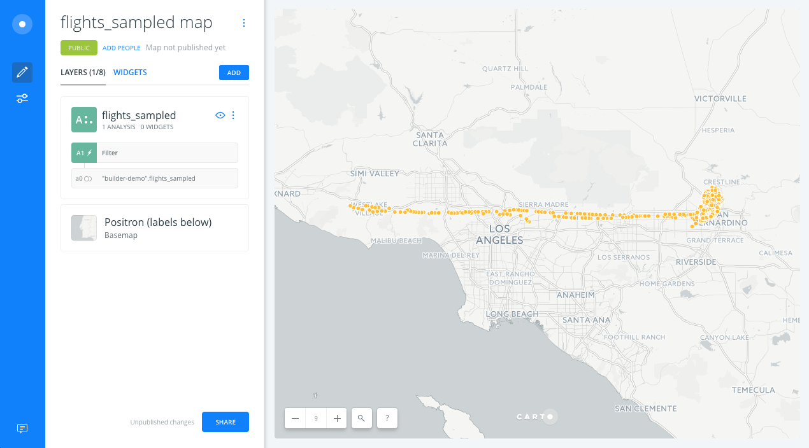

### 3. 2. Connect with lines Analysis

* We will apply the analysis to the  result of the ``Filter by column``  analysis, so we will go back to the main menu and we will  click on the ``ADD ANALYSIS`` option of the ``flights`` layer.
* We will select the ``Connect with lines`` analysis.

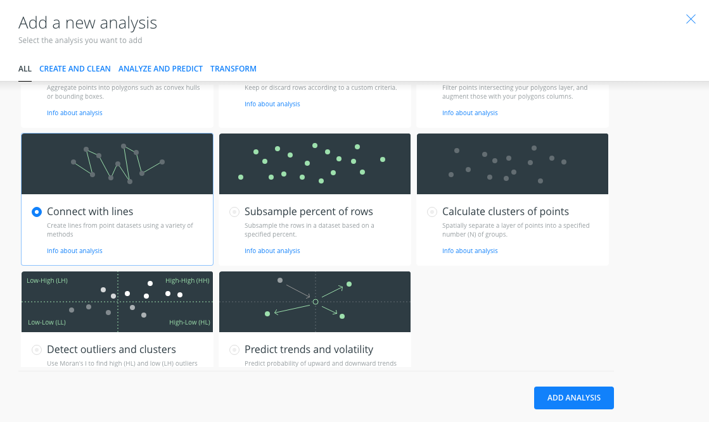

* In the ``ANALYSES`` tab of the layer, we have two sections:
	* **Workflow**: Now, because we are applying a second analysis to the ``flights`` layer, the workflow has changed. ``A1`` represent the filter analysis, but now we have a new analysis named ``A2`` to indicate that is the second analysis applied to the layer.
	* **Connect with lines**:
		* *Source*: we indicate that we are using as the source, the results from the ``Filter by column``  analysis. The source is not the original points of the layer, but the points that we got after the ``Filter by column``  analysis (A1).
		* *Type*: we indicate how we want to connect our points. We select the ``sequential`` option.
		* *Order by*: we indicate the column that we will use to define the order in which the points will be connected. We will use the ``timestamp`` column, to order our data by date.

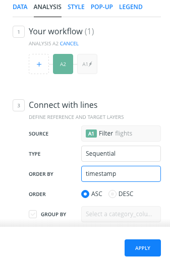

* After clicking ``Apply``, we should see a result where we can see the lines of the filtered points from the ``Filter by column`` analysis.

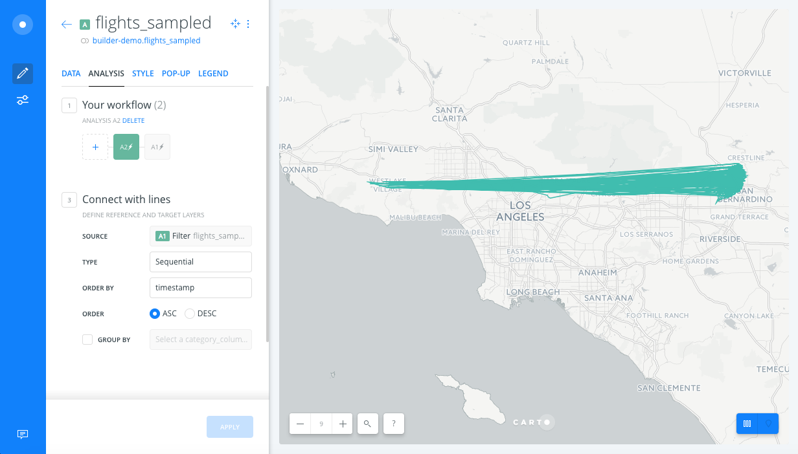

#### 3. 2. 1. Improve visualization

* Back to the main menu, in the ``Layers``tab,we drag and drop the ``Connect with lines`` node analysis outside of the layer (layer A2) to create a new data layer with lines (layer B).By doing this, we will have on the map a layer with the filtered points and a layer with lines that represent those connected points.

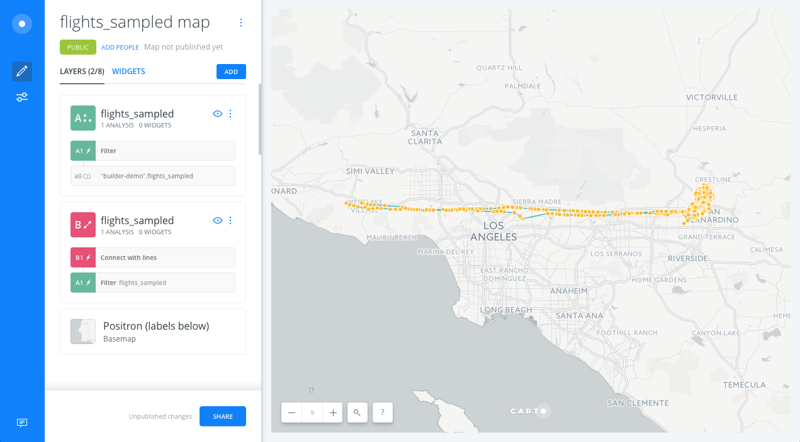

* Now, we change the name of the layers.The name of Layer A will be ``Flights`` and the name of layer B will be ``Routes``.

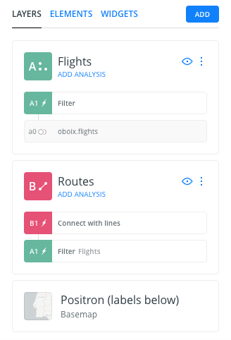

### 3. 3. Find centroid of geometries analysis

* We will apply the analysis to the  result of the Filter by column Analysis.We will go back to the main menu and we will  click on the ``ADD ANALYSIS`` option of the ``flights`` layer (A).
* We will select the ``Find centroid of geometries`` analysis.

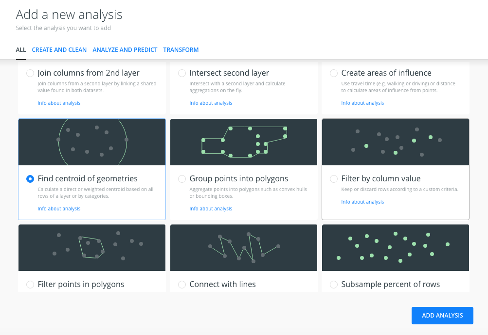

* In the ``ANALYSES`` tab of the layer, we have three sections:
	* **Workflow**: Now, because we are applying a second analysis to the ``filter`` layer, the workflow has changed. ``A1`` represent the filter by column analysis, ``A2`` represent the new analysis that we are adding.
	* **Centroid from geometries**:
		* *Source*: we indicate that we are using as the input, the results from the ``Filter by column`` analysis. The input is not the original points of the layer, but the points that we got after the ``Filter by column`` analysis.
		* *Categorize*: we leave this checkbox uncheched.
		* *Weighted by*: we don't want weighted centroids, so we leave this checkbox uncheched.
	* **Value aggregation**: we don't aggregate the values, we don't check the ``aggregate`` checkbox.

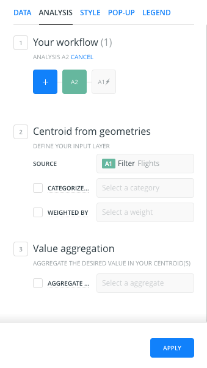

* After clicking ``Apply``, we should see a result where we can see the centroid od our filtered data:

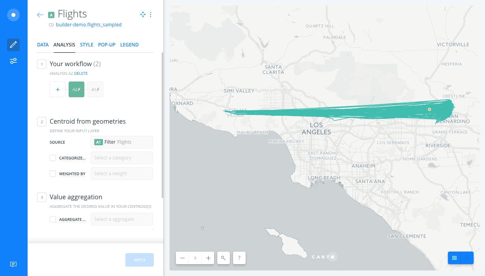

#### 3. 3. 1. Improve visualization

* Back to the main menu, in the ``Layers``tab,we drag and drop the Centroid node analysis outside of layer (A) to create a new Data layer with the areas of influence (C). The new layer (C) will have the same name as the layer A, we will change the name of layer C to ``Centroid``.

* We also change the styles of the Centroid layer and Flights layer to highlight the points and their centroid.

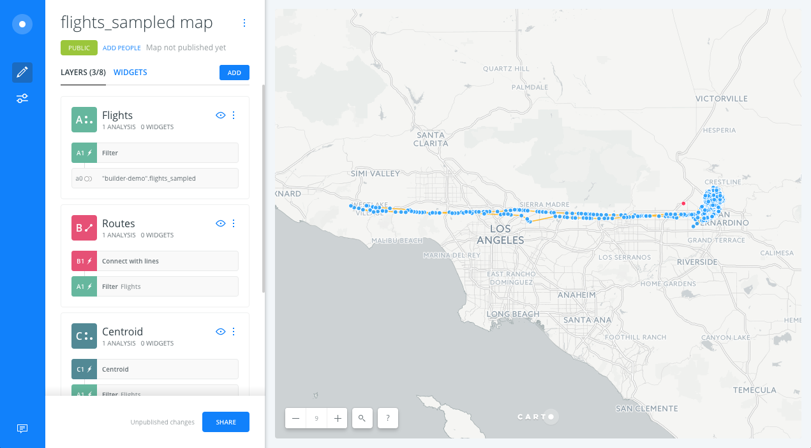

## 4. Widgets

### 4. 1. Timeseries widget

* Back to the main menu, select the WIDGETS tab and select the ADD WIDGET option.
* In the options of the Timeseries tab, select the ``timestamp``column of the A1 layer and we click on ``CONTINUE``.

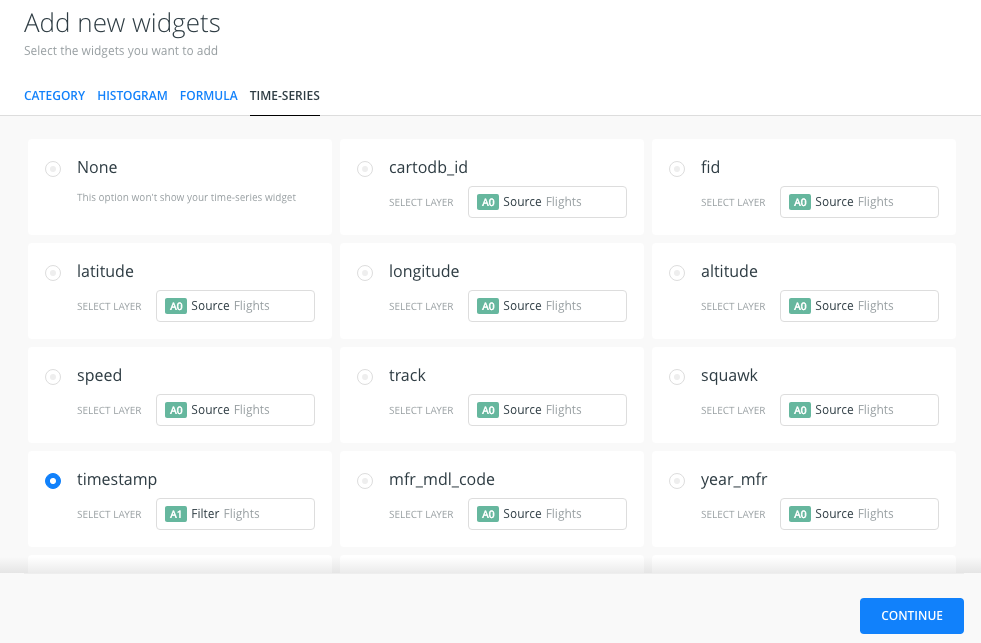

* We will see the timeseries widget on the map, we can filter by time using the widget.

### 4. 2. Histogram widget

* Back to the main menu, select the WIDGETS tab and select the ADD WIDGET option.
* In the options of the Histogram tab, select the ``altitude`` of the A1 layer and we click on ``CONTINUE``.

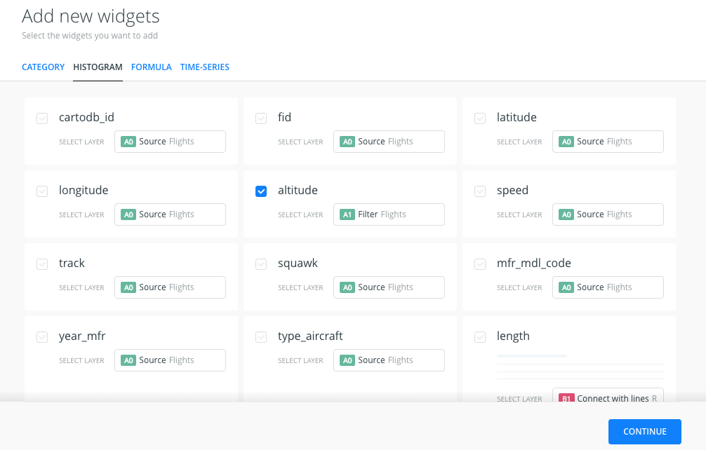

* We should get a histogram with the distribution of the altitude values. Click on the histogram to filter your data:

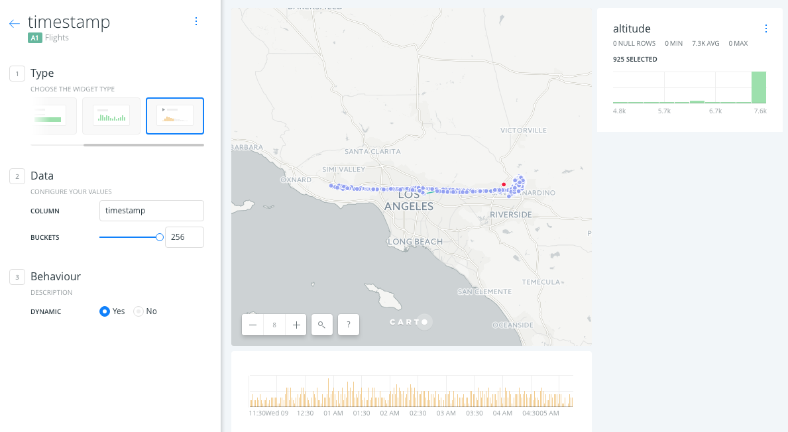

### 4. 3. Formula widget

* Back to the main menu, select the WIDGETS tab and select the ADD WIDGET option.
* In the options of the Formula tab, select the ``point_count`` of the A1 layer and we click on ``CONTINUE``.

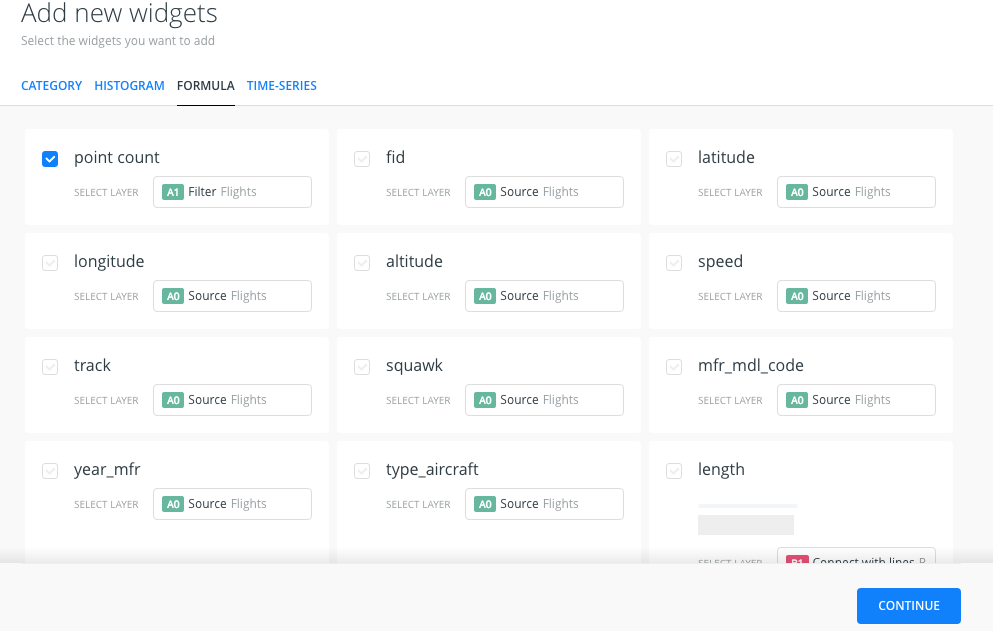

* We will get a widgets that counts the number of points that are displayed on the map.

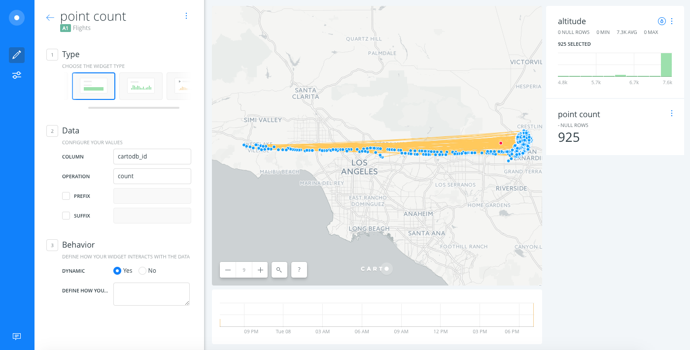

* Back to the main menu, select the WIDGETS tab and select the ADD WIDGET option.
* In the options of the Formula tab, select the ``speed`` of the A1 layer and we click on ``CONTINUE``.

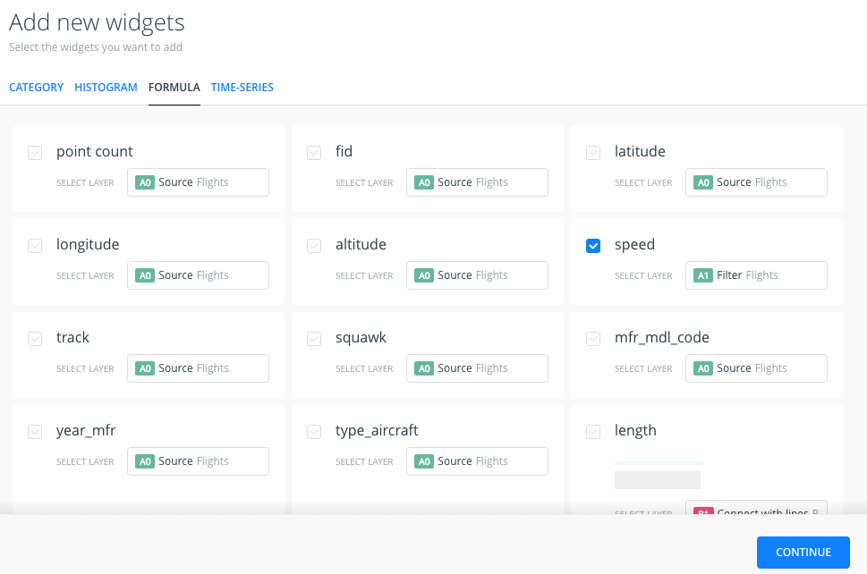

* We will get a widgets that calculates the avergage speed of the number of points that are displayed on the map.

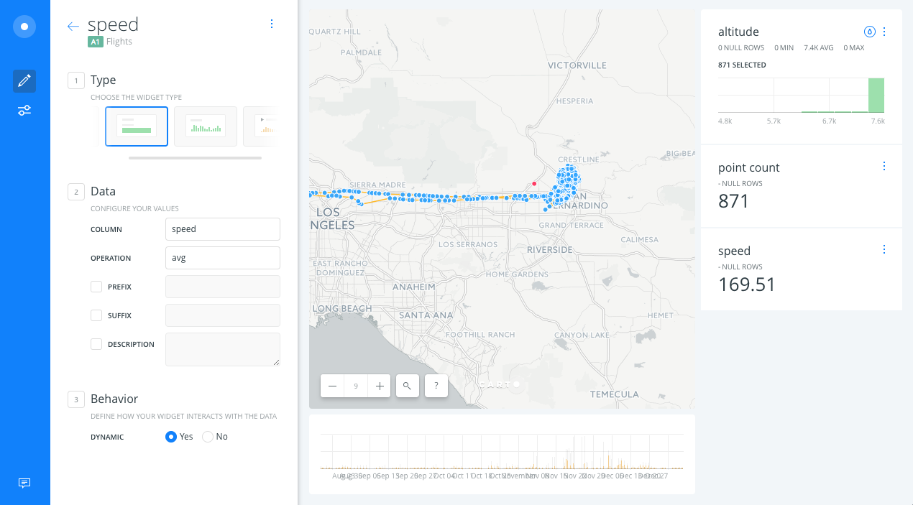

### 4. 4. Modify widgets

* We will change the name of the widgets. In order to do this go back to the main menu and select one of the widgets of the list.

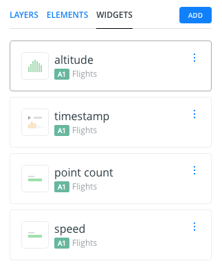

* Click on the icon with three dots and a new dropdown menu will appear will appear. Select Rename widget and change the name of widgets.

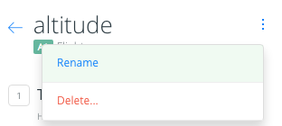

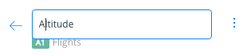

* By doing a drag and drop operation we can change the order in which the widgets are displayed.

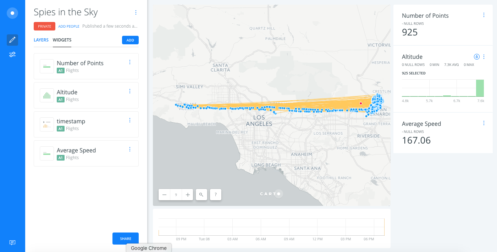

## 5. Publish

* At the bottom of the main menu, click the Share button.

* Change the privacy of the map to "Only accessible with link".

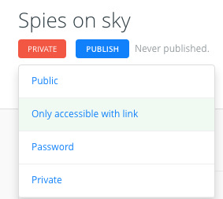

* Select the Publish tab and click on the Publish button that is below the Map title in order to share our map.

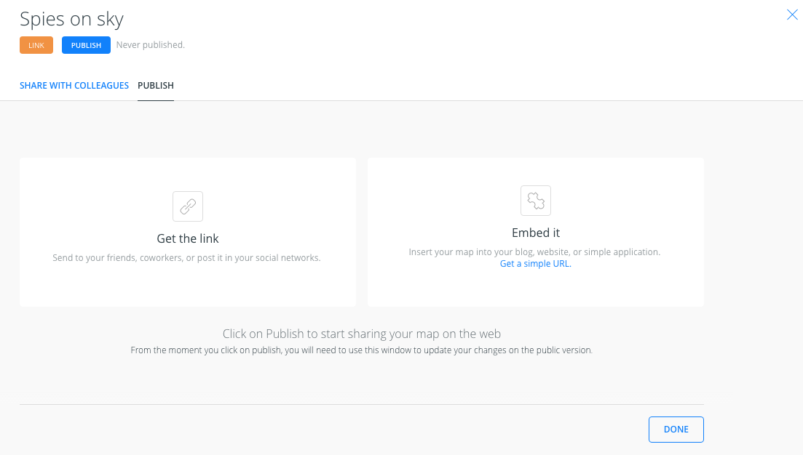

* After clicking the Publish button, we can select the option that we want to share our map.

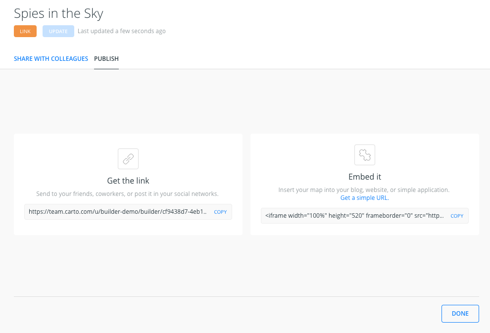

## 6. Extension

An extension of this exercise would be to add another analysis to the filtered points: connect them with the centroid. This is another version of the **Connect with lines** analysis where you use the `Source` option so all the points are connected to a different source, in this case the _Centroid_ layer. This analysis also gives to the resulting dataset a new field named `Length` that can be added as a histogram to be able to find that as our planes are doing circles we have a significant number of lines with the same length.

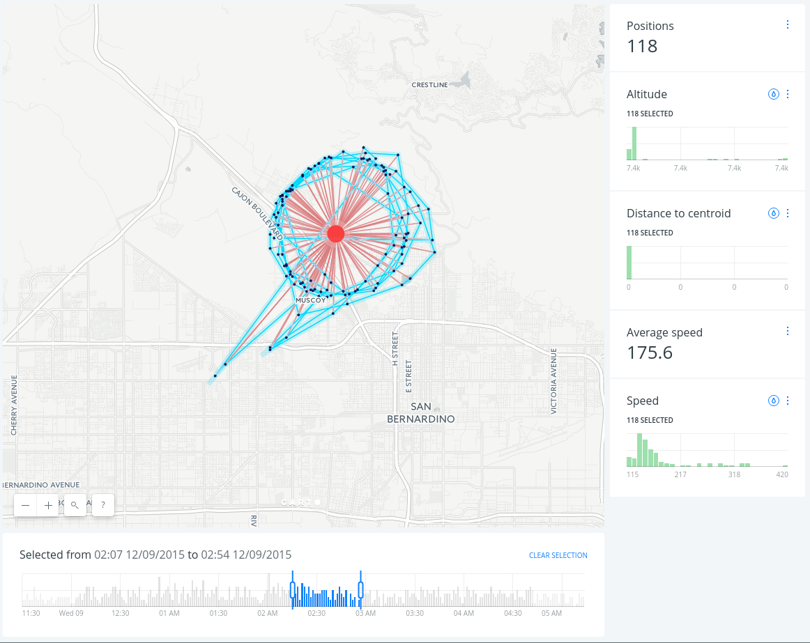

