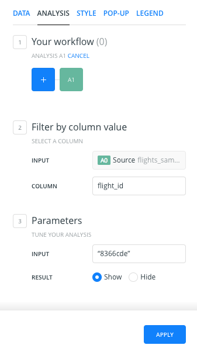
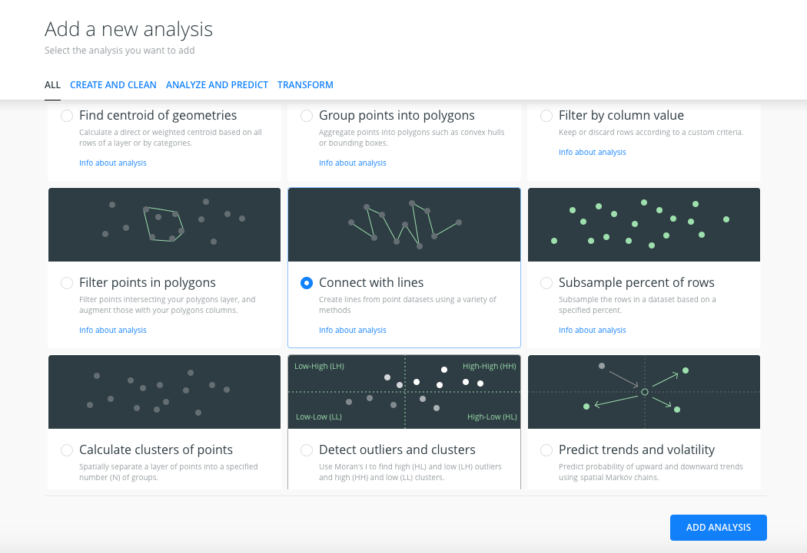
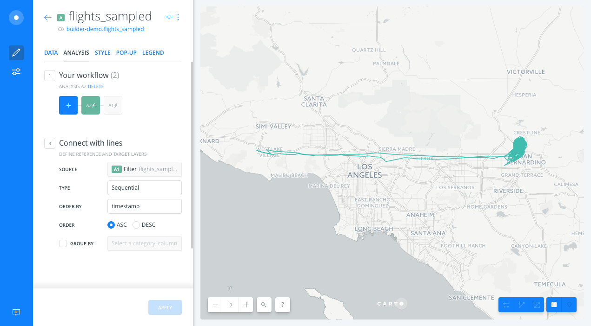
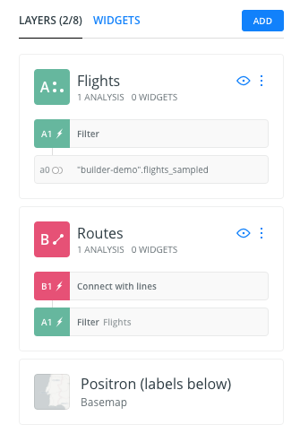
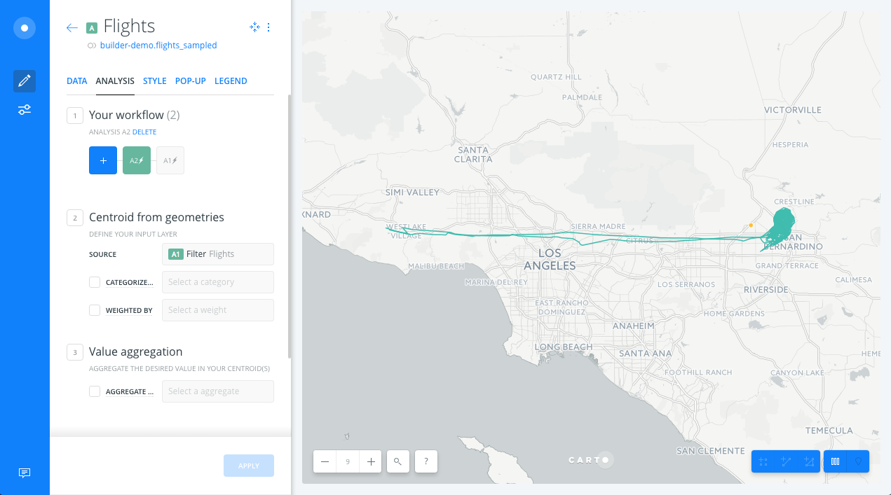
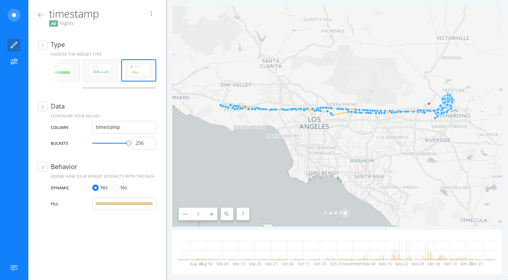
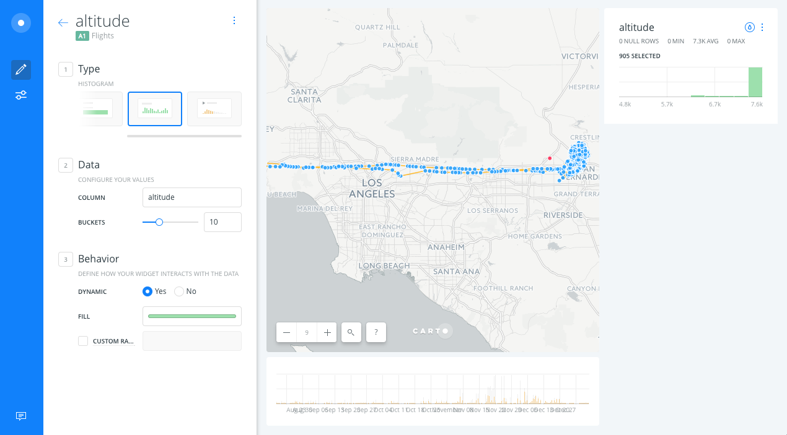
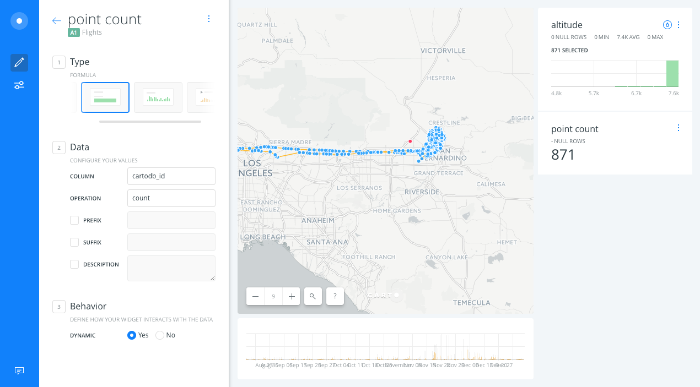
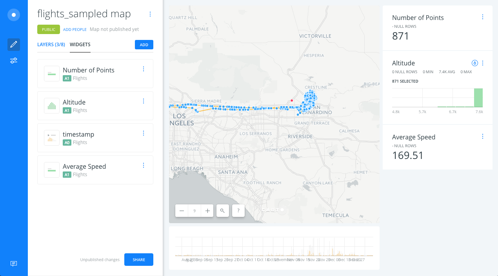

# Spies in the Sky Demo

* *Degree of Difficulty*: ***

* *Use case*: This use case is based on data journalism research published in [buzzfeed in April](https://www.buzzfeed.com/peteraldhous/spies-in-the-skies?utm_term=.hn2ryrBLb#.fgjgag9vG). The authors used data from [FlighRadar24](https://www.flightradar24.com/how-it-works), where thousands of collaborators upload flight information using automatic dependent surveillance-broadcast (ADS-B) technology. You can have a look at how they built the dataset in this github repository. The research reveals that each weekday, dozens of U.S. government aircraft (from FBI and DHS agencies) take to the skies and slowly circle over American cities. Back in the day, the authors used CARTO Editor SQL and CartoCSS. Now because of BUILDER, you can do the same but in just a few minutes!

* *Features Highlighted*:
	* Analysis: Filter by column, Connect with lines, Find centroid of geometries.
	* Widgets: timeseries, point count(formula), altitude (histogram), average speed (formula).

* *Datasets needed*:
	* [`flights_sampled` dataset](https://builder-demo.carto.com/api/v2/sql?q=select+*+from+flights_sampled&format=gpkg&filename=flights_sampled.gpkg).

<!-- MarkdownTOC -->

- 1. Import and create map
	- 1. 1. Import ``flights_sampled`` geopackage.
	- 1. 2. View _Your datasets_ dashboard
	- 1. 3. Click on ``CREATE MAP`` from ``flights_sampled``
- 2. Layers and styles
- 3. Analysis
- 4. Widgets
- 5. Publish
- 6. Extension

<!-- /MarkdownTOC -->

## 1. Import and create map

### 1. 1. Import ``flights_sampled`` geopackage.

* Don't download the dataset, instead you can put the url above directly into the URL box and CARTO will download and import it in one single step.

### 1. 2. View Dataset from Your datasets dashboard

Take a look at the dataset schema, the relevant fields are: `flight_id`, `timestamp`, `altitude` and `speed`

### 1. 3. Click on ``CREATE MAP`` from ``flights_sampled``

> Explore the visualization. Could you observe any clear pattern? The expected patterns are straight lines, but what about the circles?

**Hint**: try to use the *multiply* composite operation to see dataset patterns more clearly.

## 2. Layers and styles

### 2. 1. Show the new ordering of the layers in the Builder

* Every layer has a source. For instance, the source of the ``flights_sampled`` layer is the **``flights_sampled``** table, identified here as ``A0``. This will be very important when adding analysis and widgets.

* Change basemap from Positron to Positron (labels below)

### 2. 2. Show the different options layers have

Each layer has 5 options: *DATA*, *ANALYSES*, *STYLE*, *POP-UPS* and *LEGENDS*.

* *DATA*:
  * This interface gives a general view of the layer's fields, its name and data type. Also you can add layer fields as widgets from here.
  * Click the slider button from *VALUES* to *SQL*. The SQL view allows more advanced users to manage data in a more precise way.
  * Finally, it's easy to change from Map view to Data view.

* *STYLE*:
  * Change the FILL color to `#f20000` and set the size of the markers to `7`.
  * Click the slider button from *VALUES* to *CARTOCSS*. CartoCSS view allows more advanced users to style a layer in a more precise way.

## 3. Analysis

### 3. 1. Filter by column Analysis

* Back in the main menu of layers, select the ``flights_sampled`` layer and click on the ``ADD ANALYSIS`` option.

* From the analysis menu, select the *Filter by column* analysis and click on *ADD ANALYSIS*.

* In the *ANALYSES* tab of the layer, we have several sections:
	* *Workflow*: Is an overview of the analysis we apply to the layer. You can have more than one. The analysis should have the name *A1* to indicate that it's the first analysis applied to the layer.
	* *Filter by column value*: asks for the source layer containing the column you want to use to filter (**input parameter**), and the column name. We select the column `flight_id`. A new section *Parameters* appears in the analysis menu.
	* *Parameters*: We select the column value that we want to filter our data by.
	We select/write the value `8366cde`.

* After clicking *APPLY*, CARTO will return the result of the *Filter by column* analysis. After finishing the analysis, CARTO will return all of the points that have the flight_id value equal to ``8366cde``.

### 3. 2. Connect with lines Analysis

* We will apply the analysis to the  result of the ``Filter by column value``  analysis, so we will go back to the main menu and we will click on the ``ADD ANALYSIS`` option of the ``flights_sampled`` layer.
* We will select the *Connect with lines* analysis.

* There are two sections in the ``ANALYSES`` layer tab:
	* **Workflow**: Now, because we are applying a second analysis to the ``flights_sampled`` layer, the workflow has changed. ``A1`` represents the filter analysis, but now we have a new analysis named ``A2``, indicating the second analysis applied to the layer.
	* **Connect with lines**:
		* *Source*: we indicate that we're using the *Filter by column* analysis results as the source. The source is not the original layer points; it's the points that we got after the *Filter by column value* analysis (A1).
		* *Type*: we indicate how we want to connect our points. We select the ``sequential`` option.
		* *Order by*: we indicate the column we'll use to define the order in which the points will be connected. We will use the ``timestamp`` column, to order our data by date.

* After clicking *APPLY*, we should see the lines of the filtered points from the *Filter by column value* analysis.

#### 3. 2. 1. Improve visualization

* Back to the main menu, in the *Layers* tab, drag and drop the *Connect with lines* node analysis outside of the layer (node *A2*) to create a new data layer with lines (layer *B*). By doing this, we will have a map layer with the filtered points and a layer with lines representing those connected points.

* Now, we change the name of the layers. The name of Layer A will be ``Flights`` and the name of layer B will be ``Routes``.

### 3. 3. Find centroid of geometries analysis

* We will apply the analysis to the result of the *Filter by column values* analysis. We will go back to the main menu and click on the ``ADD ANALYSIS`` option of the ``Flights`` layer (A).
* We will select the *Find centroid of geometries* analysis.

* In the ``ANALYSES`` tab of the layer, we have three sections:
	* **Workflow**: Now, because we are applying a second analysis to the ``filter`` layer, the workflow has changed. ``A1`` represents the *Filter by column* analysis, ``A2`` represents the new analysis we're adding.
	* **Centroid from geometries**:
		* *Source*: we indicate that we're using the *Filter by column values* analysis results as the input. The input is not the original layer points; it is the points that we got after the *Filter by column values* analysis.
		* *Categorize*: we leave this checkbox uncheched.
		* *Weighted by*: we don't want weighted centroids, so we leave this checkbox uncheched.
	* *Value aggregation*: we don't aggregate the values, we don't check the *AGGREGATE* checkbox.

* After clicking *APPLY*, we should see the centroid of our filtered data:

#### 3. 3. 1. Improve visualization

* Back to the main menu, in the *LAYERS* pane, we drag and drop the Centroid node analysis outside of layer (*A*) to create a new Data layer containing the areas of influence (*C*). The new layer (*C*) will have the same name as layer *A*, so we will change the name of layer *C* to *Centroid*.

* We also change the styles of the Centroid, Flights and Routes layers to highlight the lines, points and their centroid.

## 4. Widgets

### 4. 1. Timeseries widget

* Open *WIDGETS* pane and select the *ADD WIDGET* option.
* In the options of the *TIMESERIES* tab, select the `timestamp` column of the *A1* layer and we click on *CONTINUE*.

* We will see the timeseries widget on the map, we can filter by time using the widget.

### 4. 2. Histogram widget

* Open *WIDGETS* pane and select the *ADD WIDGET* option.
* Within *HISTOGRAM* tab options, select *altitude* from *A1* layer and click on *CONTINUE*.

* We should get a histogram with the distribution of the altitude values. Click on the histogram to filter your data:

### 4. 3. Formula widget

* Open *WIDGETS* pane and select the *ADD WIDGET* option.
* Within *FORMULA* tab options, select *point_count* of the *A1* layer and we click on *CONTINUE*.

* We will get a widget that counts the number of points displayed on the map.

* Open *WIDGETS* pane and select the *ADD WIDGET* option.
* Within *FORMULA* tab options, select *speed* from *A1* layer and we click on *CONTINUE*.

* We will get a widget that calculates the average speed of the points displayed within the map view.

### 4. 4. Modify widgets

* We will rename the widgets. To do this go back to the main menu and select one of the widgets in the list.

* Click on the icon with three dots and a new dropdown menu will appear will appear. Select *Rename widget* and change the widget name.

* By doing a drag and drop operation we can change the widget display order.

## 5. Publish

* At the bottom of the main menu, click the *SHARE* button.

* Change the privacy of the map to *Only accessible with link*.

* Navigate to *PUBLISH* tab and click on *PUBLISH* below the Map title to share our map.

* After clicking *PUBLISH*, we can select the option to share our map.

## 6. Extension

An extension of this exercise would be to add another analysis to the filtered points: connect them with the centroid. This is another version of the *Connect with lines* analysis, using the *Source* option to connect all the points to a different source, in this case the *Centroid* layer. This analysis also gives to the resulting dataset a new field named `length` that can be added as a histogram, to be able to find that as our planes are doing circles we have a significant number of lines with the same length.

