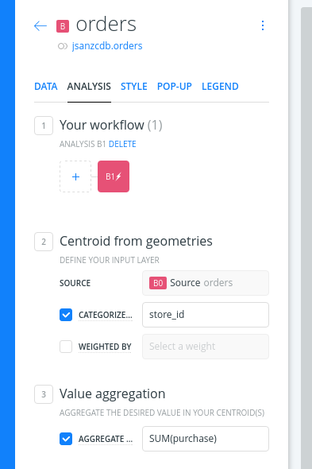

# Analysis exercise: referencing and grouping stores data

* *Degree of Difficulty*: **
* *Goal*: report the sum of purchases sold by a chain of stores
* *Features Highlighted*:
  * Widgets: Category, Formula and Histogram
  * Analysis: Georeference and join.
* *Datasests needed*:
  * *Stores* and *Sales* CSVs stored in a [single zip](https://github.com/CartoDB/carto-workshop/raw/master/02-builder-analysis/exercises/maps/stores.zip)

## Contents

<!-- MarkdownTOC -->

- Import and create a map
- Georeference stores layer
- Compute the total sales per store
- Join both layers.
- Style
- Add widgets

<!-- /MarkdownTOC -->

## Import and create a map

Drag and drop the zip file on your dashboard and both CSV files will be converted into two different alphanumeric tables. You can create a map selecting both datasets, don't worry if you don't see anything on your map yet.

## Georeference stores layer

* Select the stores layer and add the *Georeference* analysis
* Use the *City names* option, select the `name` column for the city names and write on the *COUNTRY* manually as `México`.
* Click *APPLY* and the geocoder will give geometries for our stores layer.

## Compute the total sales per store

* We want to group all the sales into a summarized table that we can join with the stores.
* To do so use the Centroids analysis and aggregate the purchases by `store_id`

This will produce a new table with null geometries (obviously) but with two fields:

* `category`: the store identifier
* `value`: the sum of the purchases

## Join both layers.

* Select the *Orders* layer and add the *Join columns from 2nd layer* analysis
* Set as *INPUT #2* the georeferenced layer (probably *B1*)
* We want a inner join so only common rows to both datasets will show up
* Select on both tables the same foreign key: `category` and `store_id`
* On the next section be sure to take the geometries from the georeferenced layer
* Finally select the desired columns from both datasets:
  * *ORDERS*: you want `value`
  * *STORES* : you want `store_id`, `name`, `founded`, and `owner`

## Style

Now you have the total sales for your stores, and you could use a simple bubble symbology to easily find those which have sold more.

## Add widgets

Finally you could add some widgets to finish your dashboard:

* Count of stores
* Sum of the purchases
* Category showing the name of the owners by the sum of purchases
* Category showing the name of the cities by the sum of purchases
* Histogram with the year of funding

