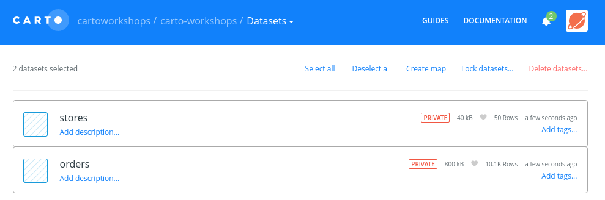
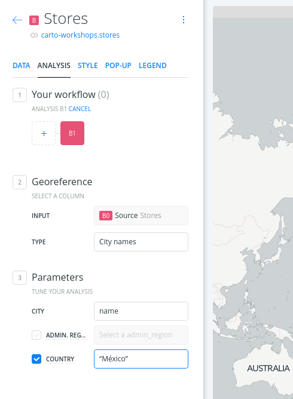
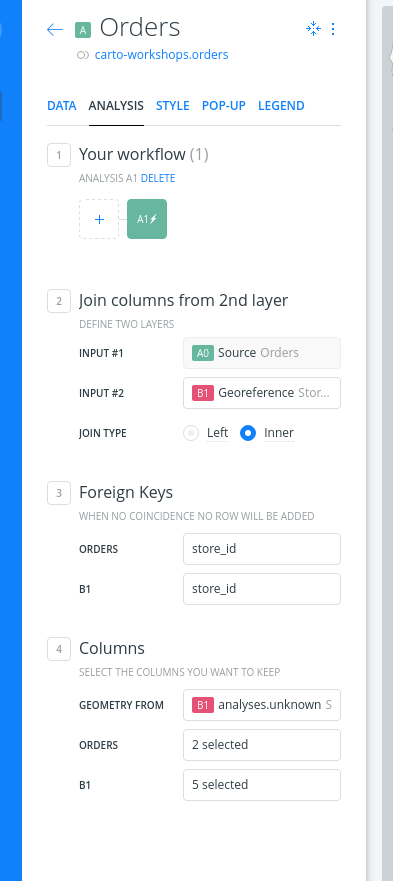
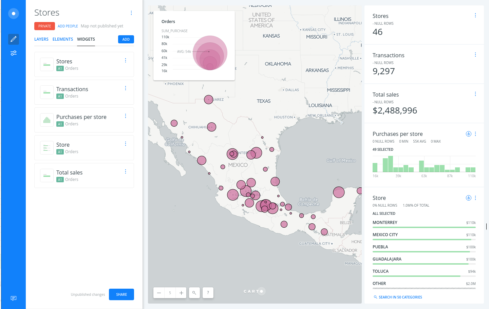

# Analysis exercise: referencing and grouping stores data

* *Degree of Difficulty*: **
* *Goal*: report the sum of purchases sold by a chain of stores
* *Features Highlighted*:
  * Widgets: Category, Formula and Histogram
  * Analysis: Georeference and join.
* *Datasests needed*:
  * Stores and Sales CSVs stored in a [single zip](https://github.com/CartoDB/cdmx-training/raw/master/02-builder-analysis/exercises/maps/stores.zip)

## Contents

<!-- MarkdownTOC -->

- 1. Import and create a map
- 2. Georeference stores layer
- 3. Process the sales table to group the data
- 4. Join both layers.
- 5. Style
- 6. Add widgets

<!-- /MarkdownTOC -->


## 1. Import and create a map

Drag and drop the zip file on your dashboard and both CSV files will be converted into two different alphanumeric tables. You can create a map selecting both datasets, don't worry if you don't see anything on your map yet.



## 2. Georeference stores layer

* Select the stores layer and add the *Georeference* analysis
* Use the `City names` option, select the `name` column for the city names and write on the *COUNTRY* manually as `México`.
* Click *APPLY* and the geocoder will give geometries for our stores layer.



## 3. Process the sales table to group the data

* We want to group all the sales into a summarised table that we can join with the stores.
* To do so go to the *Sales* layer and on the *DATA* tab open the SQL view and paste the following code:

```sql
SELECT
  min(cartodb_id) as cartodb_id,
  null::geometry as the_geom,
  null::geometry as the_geom_webmercator,
  store_id,
  sum(purchase) as sum_purchase,
  count(1) as counts
FROM "carto-workshops".orders
GROUP by store_id
```

Don't worry too much about it as we'll cover SQL extensively on another lesson but this sentence groups our sales per store and gives us the total purchases made as well as the counts. The rest of the fields are required by the BUILDER but we won't use them.

## 4. Join both layers.

* Select the *Orders* layer and add the *Join columns from 2nd layer* analysis
* Set as *INPUT #2* the georeferenced layer (probably `B1`)
* We want a inner join so only common rows to both datasets will show up
* Select on both tables the same foreign key: `store_id`
* On the next section be sure to take the geometries from the georeferenced layer
* Finally select the desired columns from both datasets:
  * *ORDERS*: you want `sum_purchase` and `counts`
  * *STORES* : you want `cartodb_id`, `store_id`, `name`, `founded`, and `owner`



## 5. Style

Now you have the total sales for your stores, and you could use a simple bubble symbology to easily find those which have sold more.


## 6. Add widgets

Finally you could add some widgets to finish your dashboard:

* Count of stores
* Sum of the counts for the total number of transactions
* Sum of the purchases
* Histogram of the purchases per store
* Category showing the name of the cities by the sum of purchases



