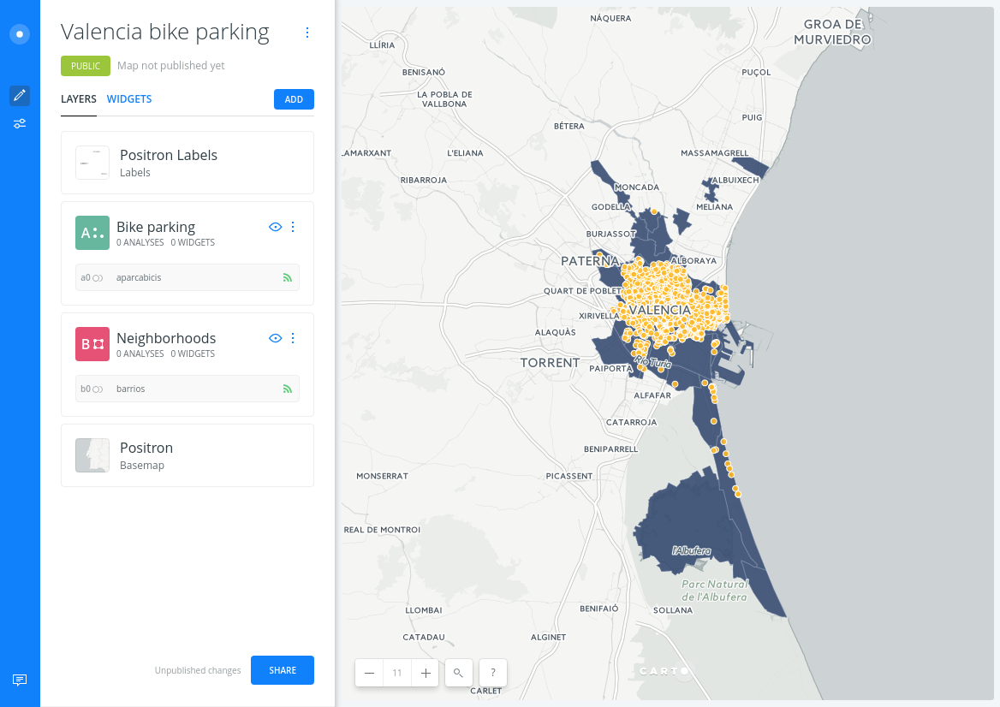
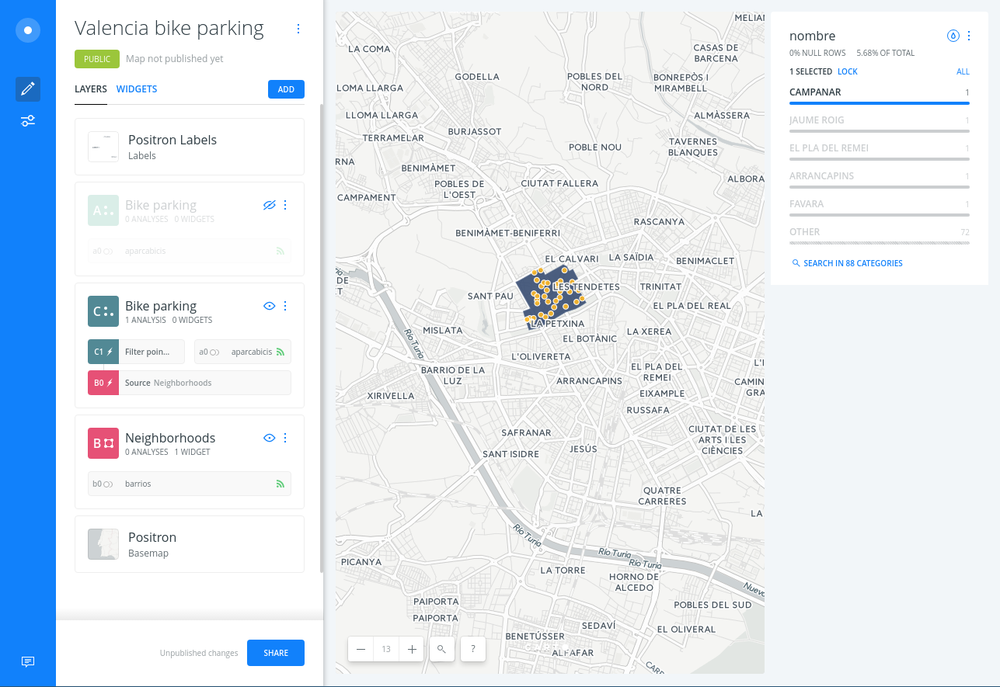
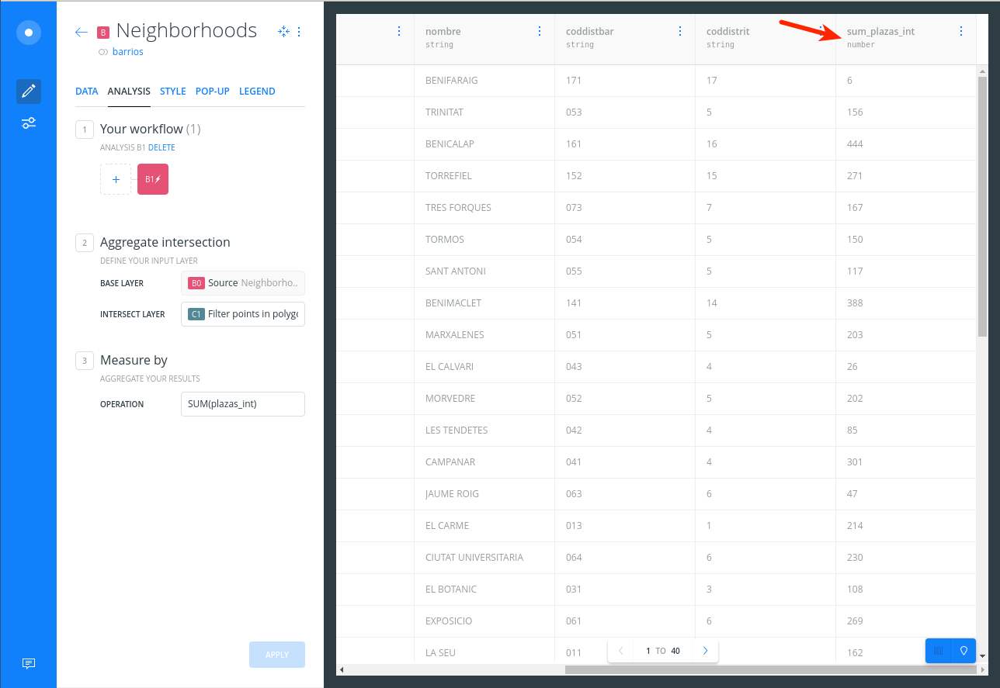
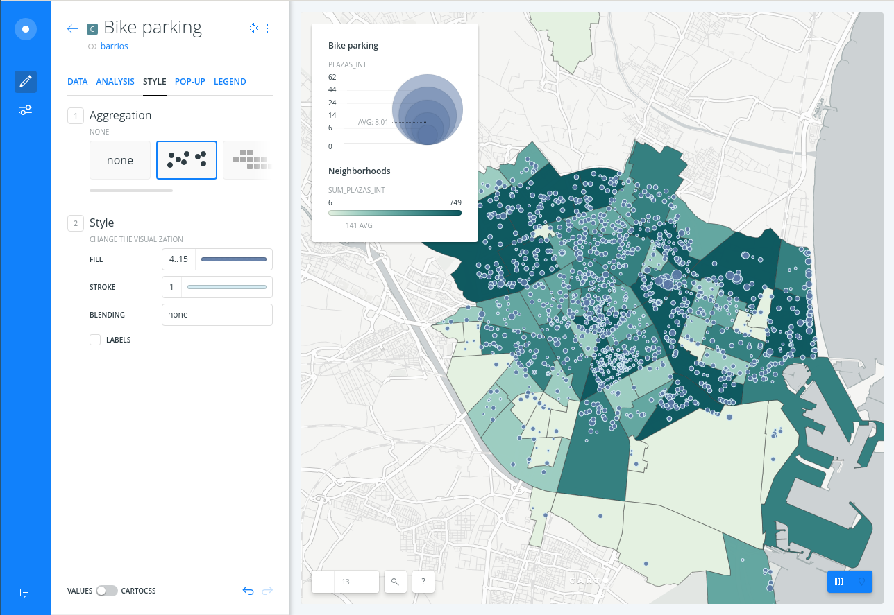
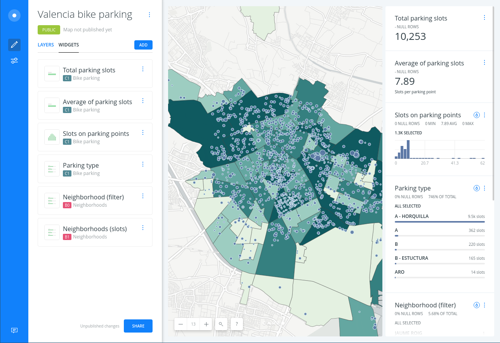
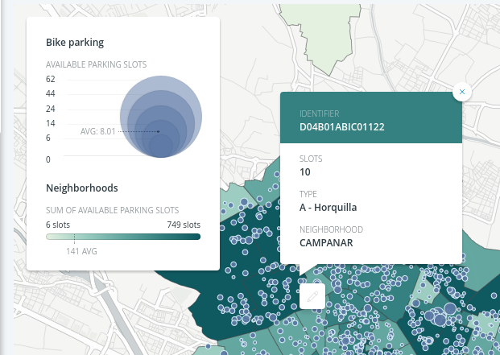
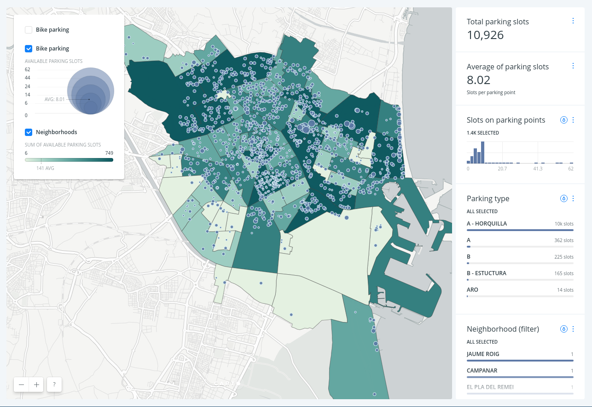

# Valencia Bikes

* *Degree of Difficulty*: **
* *Goal*: Getting started with CARTO BUILDER.
* *Features Highlighted*:
  * Analysis
* *Datasests needed*. Connect to your account the GeoJSON files provided at these pages:
  - [Barrios](http://gobiernoabierto.valencia.es/en/resource/?ds=barrios&id=15befdeb-83ac-4b0f-98f6-0e17ea68ce37)
  - [Aparcabicis](http://gobiernoabierto.valencia.es/en/resource/?ds=aparcabicis&id=6c38de72-598c-4e83-a093-73b17b08bbe1)

## Contents

<!-- MarkdownTOC -->

- Create a map
- Adding a virtual field to a source layer
- Analysis 1: Filter the bike parkings inside the neighborhoods
- Analysis 2: Intersect bikes and neighborhoods
- Styling
- Widgets
- Legends and interactivity
- Map options and publish

<!-- /MarkdownTOC -->

## Create a map <a name="map"></a>

* Click on **`NEW MAP`**.
* Add the `barrios` dataset connecting to a new dataset on this url: http://mapas.valencia.es/lanzadera/opendata/Barrios/JSON
* Click on **`CREATE MAP`**.
* Add the `aparcabicis` dataset connecting to a new dataset on this url: http://mapas.valencia.es/lanzadera/opendata/aparcabicis/JSON
* You can rename the map and layer titles as "Bike parking" and "Neighborhoods" doing double click over them.


<figcaption>A view of BUILDER main dashboard</figcaption>


## Adding a virtual field to a source layer

* Select the original parkings dataset (`A0` or `B0`)
* Click on the `DATA` tab
* Click on the `SQL` switch
* Put a query like this to add an integer version for the number of slots on the parking point and check on the table view that `plazas_int` is there.

```sql
SELECT *,
       plazas::int as plazas_int
  FROM aparcabicis
```

## Analysis 1: Filter the bike parkings inside the neighborhoods

* Select the Neighborhoods layer
* Add a `Filter points in polygons` analysis
* Select the parkings layer as the `Filtering layer`
* Hide the original Parkings layer
* Drag the analysis to see again the neighborhoods
* Add a widget for the neighborhoods names (`nombre`) and check how it filters also the parking points


<figcaption>Filtering parking points by neighborhood</figcaption>


## Analysis 2: Intersect bikes and neighborhoods

* Select the Neighborhoods layer again
* Add a `Intersect second layer` analysis
* Select the `Filter points in polygons` node
* Sum the number of available slots
* You should have a new `sum_plazas_int` field on your table aggregating the number of parking slots.


<figcaption>Aggregating data from points into polygons</figcaption>


## Styling

* Create a choropleth map of neighborhoods by the number of parking slots
* Create a bubble map for the points dataset using the number of parking slots as a measure
* To learn more about how this works behind the scenes check out the CartoCSS panel and consider doing the [cartography lesson](https://github.com/CartoDB/carto-workshop/tree/master/03-cartography) of our workshop.


<figcaption>Styling the datasets</figcaption>


## Widgets

Consider adding the following widgets:

* formula widget for the sum of parking slots
* formula widget for the average of parking slots per point
* histogram for the parking slots
* category for the parking types
* category for the original neighborhoods dataset
* category for the aggregated neighborhoods dataset so you can order by number of parking slots


<figcaption>Widgets layout</figcaption>


## Legends and interactivity

To finish the map you can work a bit on the legends and interactivity (pop ups).

* Customize legend titles and labels
* Set up a tooltip (hover pop up) for the neighborhoods dataset and an infowindow (click pop up) for the parking dataset.


<figcaption>Legends and popups</figcaption>


## Map options and publish

* Go to the map options (second switch on the blue side bar)
  * Remove the search box
  * Add a layer selector
  * Remove the side bar
* Publish the map
  * Click on **`SHARE`**.
  * Set to `LINK` or `PUBLIC`.
  * Click on **`PUBLISH`**.
  * Now you can share the map as [link](https://xurxosanz.carto.com/builder/e5e528b0-2f75-11e7-a6ef-0e3ebc282e83/embed) or embed.


```html
<iframe width="100%" height="520" frameborder="0"
  src="https://xurxosanz.carto.com/builder/e5e528b0-2f75-11e7-a6ef-0e3ebc282e83/embed"
  allowfullscreen webkitallowfullscreen mozallowfullscreen
  oallowfullscreen msallowfullscreen>
</iframe>
```



<figcaption>Final result</figcaption>