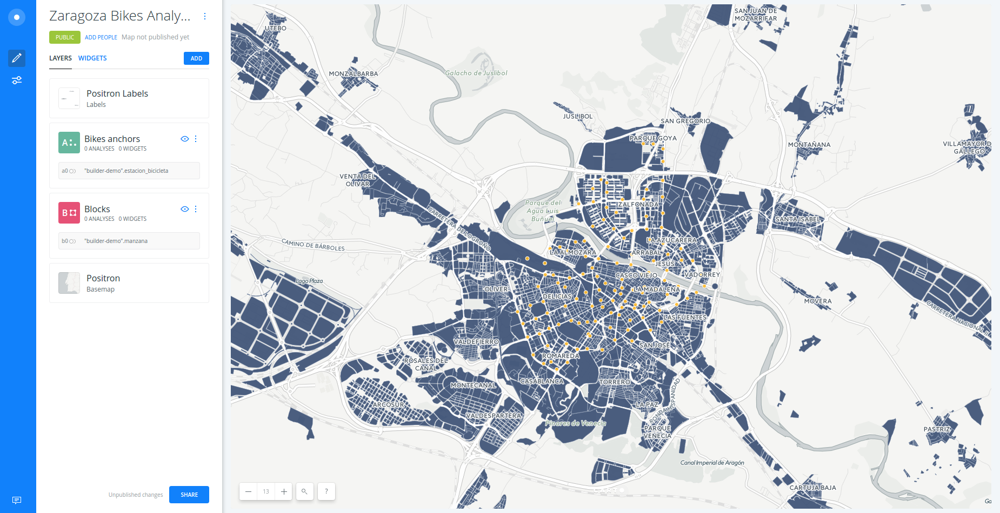
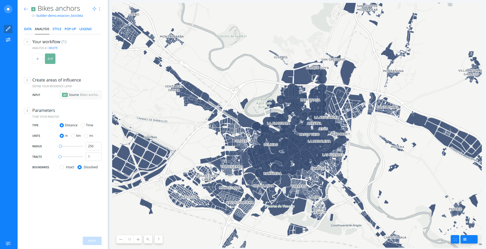
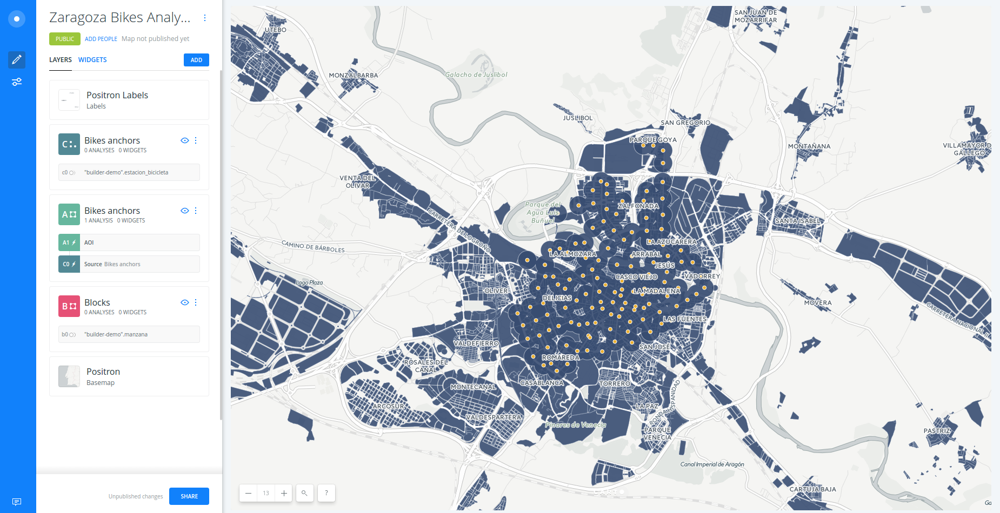
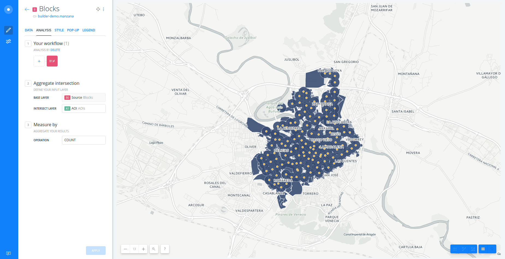
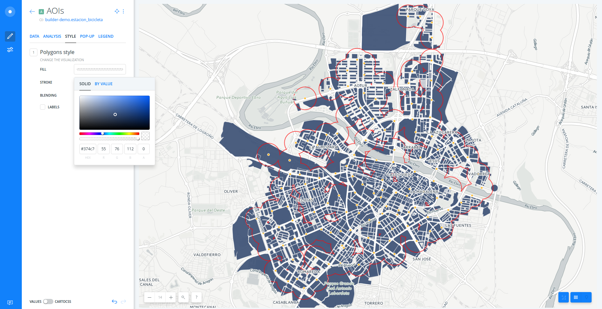
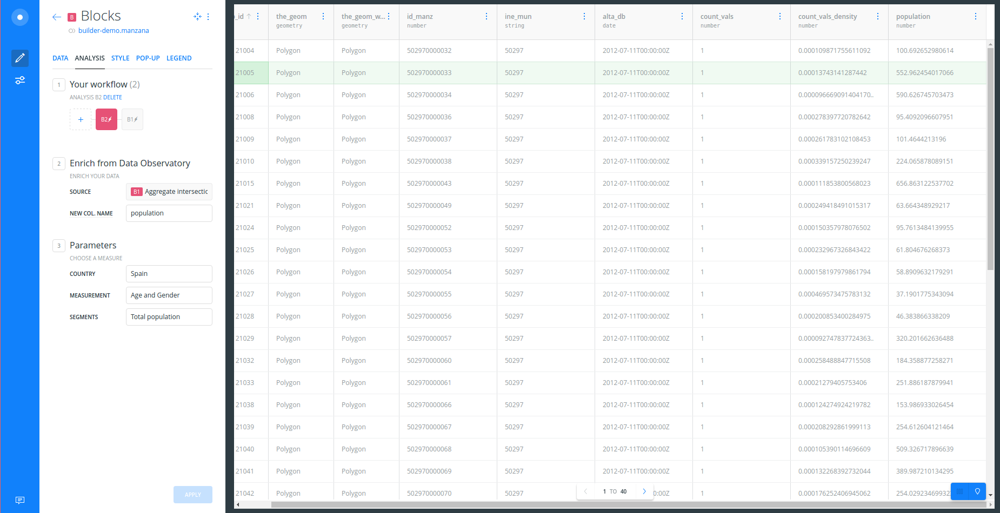
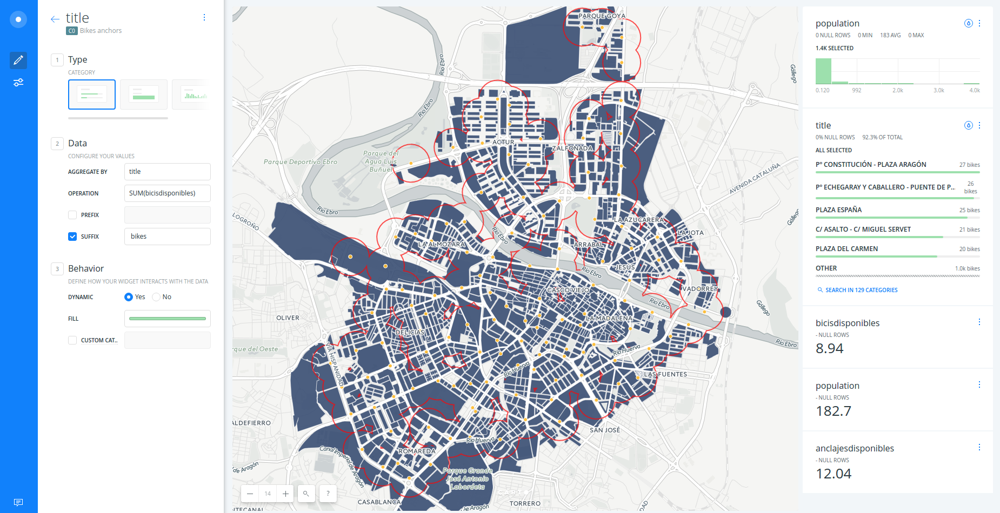
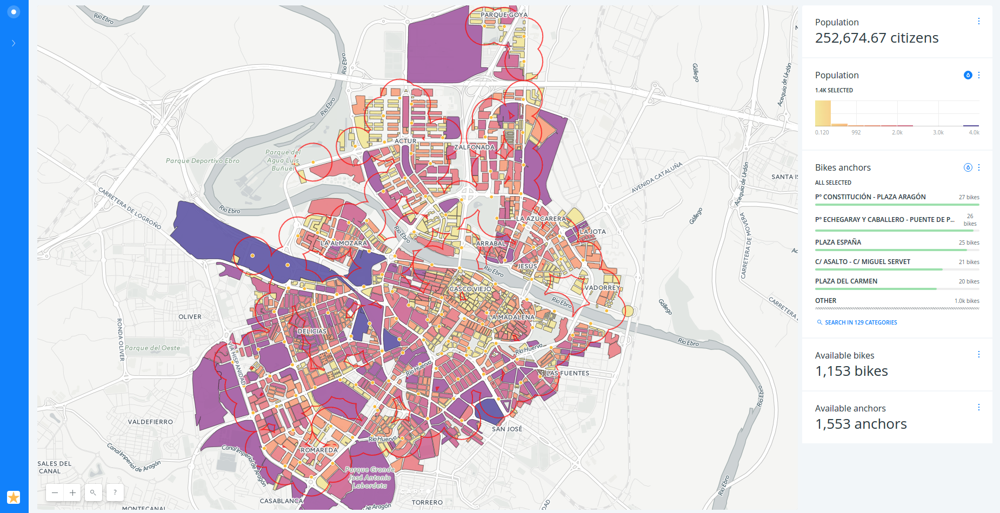

# Zaragoza Bikes

* *Degree of Difficulty*: ***
* *Goal*: Getting started with CARTO BUILDER.
* *Features Highlighted*:
  * Import: connect datasets from links
  * Analysis: Create areas of influence, Intersect with second layer, Enrich with Data Observatory.
  * Cartography: auto-style.
* *Datasests needed*:
  - Zaragoza blocks: [https://builder-demo.carto.com/api/v2/sql?q=SELECT+*+FROM+manzana&format=shp&filename=manzanas](https://builder-demo.carto.com/api/v2/sql?q=SELECT+*+FROM+manzana&format=shp&filename=manzanas), the original data source can be download it from [CartoCiudad](http://datos.gob.es/es/catalogo/e00125901-cartociudad).
  - Public bikes anchors: [http://www.zaragoza.es/api/recurso/urbanismo-infraestructuras/estacion-bicicleta.geojson?rf=html&results_only=false&srsname=wgs84&rows=129](http://www.zaragoza.es/api/recurso/urbanismo-infraestructuras/estacion-bicicleta.geojson?rf=html&results_only=false&srsname=wgs84&rows=129), you can check what the API call returns copying [this url](http://www.zaragoza.es/api/recurso/urbanismo-infraestructuras/estacion-bicicleta?rf=html&results_only=false&srsname=wgs84&rows=129) into your browser.

## Contents

- [Create a map](#map)
- [Analysis 1: Create areas of influence from bikes anchors](#aoi)
- [Analysis 2: Intersect areas and city blocks](#intersect)
- [Analysis 3: Assign total population to city blocks](#do)
- [Widgets and auto-styling](#widgets)
- [Publish](#publish)

<hr>

## Create a map <a name="map"></a>

* Click on **`NEW MAP`**.
* Click on **`CONNECT DATASET`**. Submit this url, choose any `Sync my data` option if sync table feature is available for your account, and make sure the `Let CARTO automatically guess data types and content on import` box is checked: [http://www.zaragoza.es/api/recurso/urbanismo-infraestructuras/estacion-bicicleta.geojson?rf=html&results_only=false&srsname=wgs84&rows=129](http://www.zaragoza.es/api/recurso/urbanismo-infraestructuras/estacion-bicicleta.geojson?rf=html&results_only=false&srsname=wgs84&rows=129). Click **`CONNECT DATASET`** button.
* Click on **`CREATE MAP`**.
* From the map's **`LAYERS`** pane click **`ADD`**. Click **`CONNECT DATASET`**. Connect the `Zaragoza blocks` dataset using the same steps as above, with this url: [https://builder-demo.carto.com/api/v2/sql?q=SELECT+*+FROM+manzana&format=shp&filename=manzanas)
* Double-click on the map layer titles to rename them "Bike anchors" and "Blocks". You can also rename the map this way.




## Create areas of influence from bikes anchors <a name="aoi"></a>

* Click on "Bike anchors" layer.
* Go to **`ANALYSIS`** tab.
* Click on **`ADD ANALYSIS`**.
* Select `Create areas of influence` analysis and click on **`ADD ANALYSIS`**.
* Set `RADIUS` to `250` meters and `BOUNDARIES` to `Dissolved`, and click on **`APPLY`**.



* In order to recover our points layer, go to the main menu and drag the layer source node out.



* Rename the other layer to "AOI" to distinguish the areas of influences and the original points.


## Intersect areas and city blocks <a name="intersect"></a>

* Click on "Blocks" layer.
* Click it's **`ANALYSIS`** tab, and click on **`ADD ANALYSIS`**. Select the `Intersect second layer` analysis and click **`ADD ANALYSIS`**.
* In the `INTERSECT LAYER` field, select the `AOI` node
* Let the rest of parameters as default.
* Click on **`APPLY`**.



* To improve the visualization, we will remove the fill from the "AOIs" layer.
* Go back to the main menu and select "AOIs" layer.
* Go to the **`STYLE`** tab, click on the color `FILL` and set the opacity parameter (`A`) to `0`).
* You can set the `STROKE` color to red.



## Assign total population to city blocks <a name="do"></a>

* Go to the main menu and click on the "Blocks" layer.
* Click it's **`ANALYSIS`** tab, and click on **`+`** to add a new analysis to the workflow chain. Select the `Enrich with Data Observatory` analysis and click **`ADD ANALYSIS`**.
* Type "population" into the `NEW COL. NAME`, and select `Spain`, `Age and Gender` and `Total population` from the other parameters forms.
* Click on **`APPLY`**.




*If your account is free, this analysis would not be available.

## Widgets and auto-styling <a name="widgets"></a>

* Go to the main menu and click on **`WIDGETS`**.
* Click on **`ADD WIDGET`**.
* Consider adding the following widgets:

  * formula widget for the sum of `population` from `Age and Gender` analysis node,
  * formula widget for the sum of `anclajesdisponibles` from the original `Bikes anchors` layer node,
  * formula widget for the sum of `bicisdisponibles` from the original `Bikes anchors` layer node,
  * histogram widget for `population` from `Age and Gender` analysis node,
  * category widget for `title` from the original `Bikes anchors` layer node.
* Click on **`CONTINUE`**.
* Go back to the widgets layout and select the `title` category widget. Set the `OPERATION` to `SUM(bicisdisponibles)` in order to order it based on the number of available bikes. You can add a suffix.



* Order, rename and edit the rest of the widgets. 
* Now, if you click on the **`Auto style`** buttom at the upper right corner of the histogram widget to show the population variability* amongst city blocks from a 250m distance from a public bike anchor.


*This is a exploratory visualization, a better practice would be visualizing population divided by the block area.

## Publish and share options <a name="publish"></a>

* Publish the map
  * Click on **`SHARE`**.
  * Set privacy to `LINK` or `PUBLIC`.
  * Click on **`PUBLISH`**.
  * Now you can share the map as a [link](https://team.carto.com/u/builder-demo/builder/a50792fa-3fbb-11e7-a868-0ee66e2c9693/embed) or embed it.


```html
<iframe width="100%" height="520" frameborder="0"
  src="https://team.carto.com/u/builder-demo/builder/a50792fa-3fbb-11e7-a868-0ee66e2c9693/embed"
  allowfullscreen webkitallowfullscreen mozallowfullscreen
  oallowfullscreen msallowfullscreen>
</iframe>
```




<hr>
