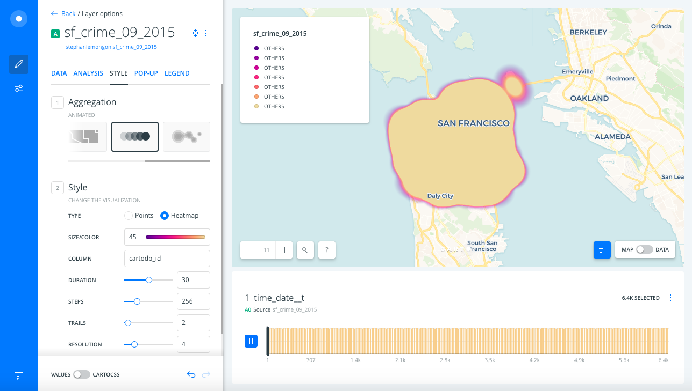
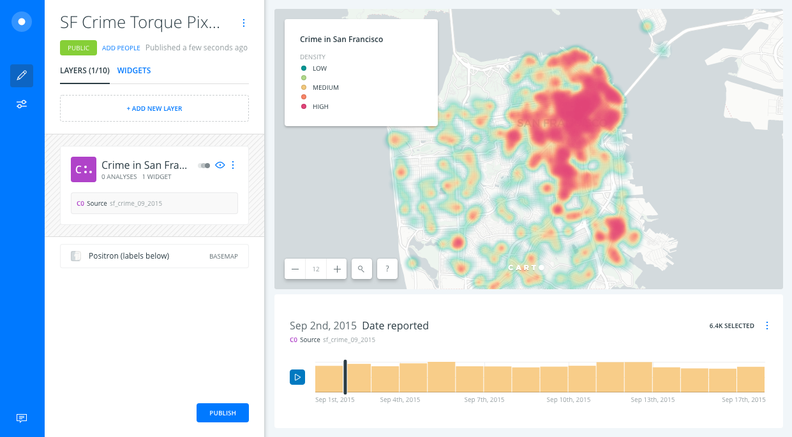
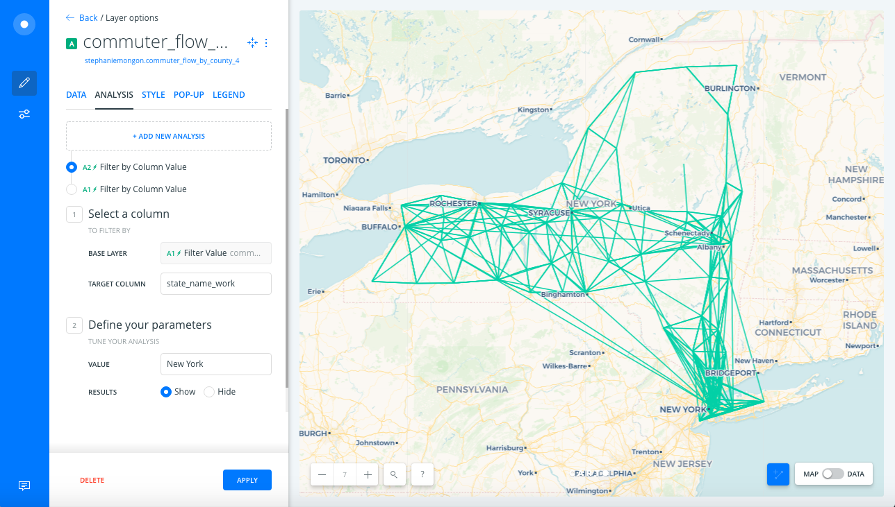
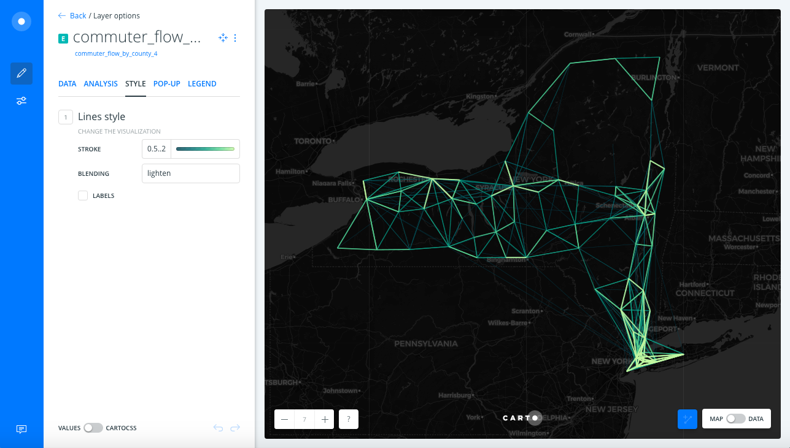
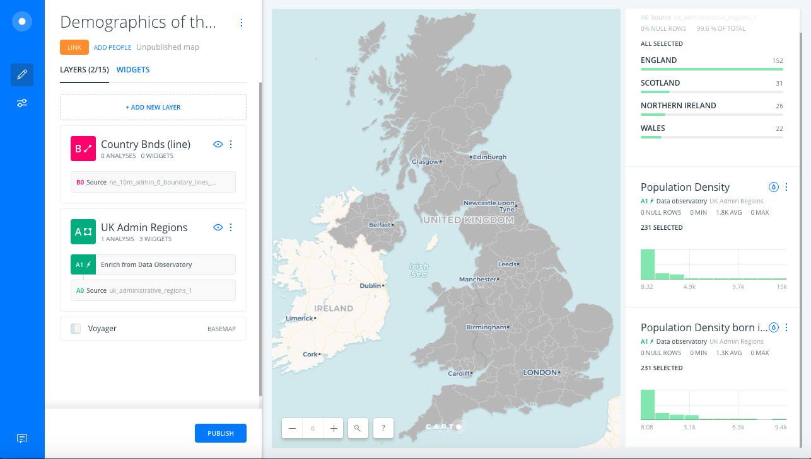
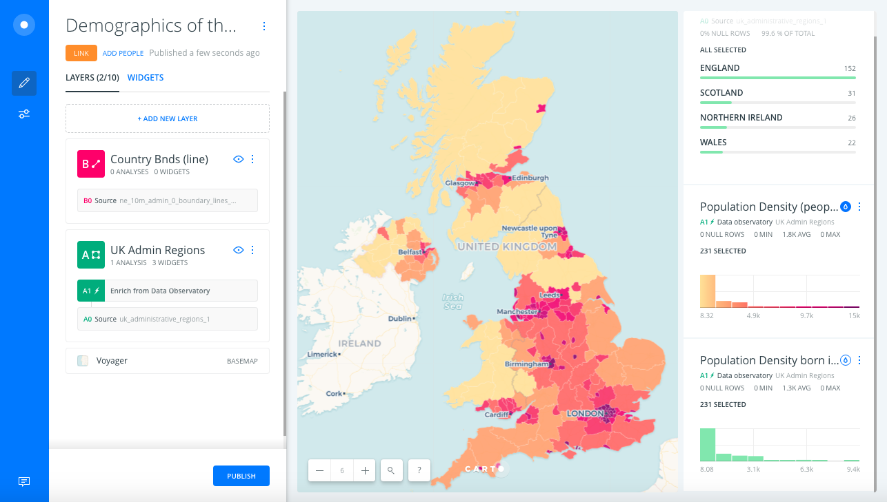
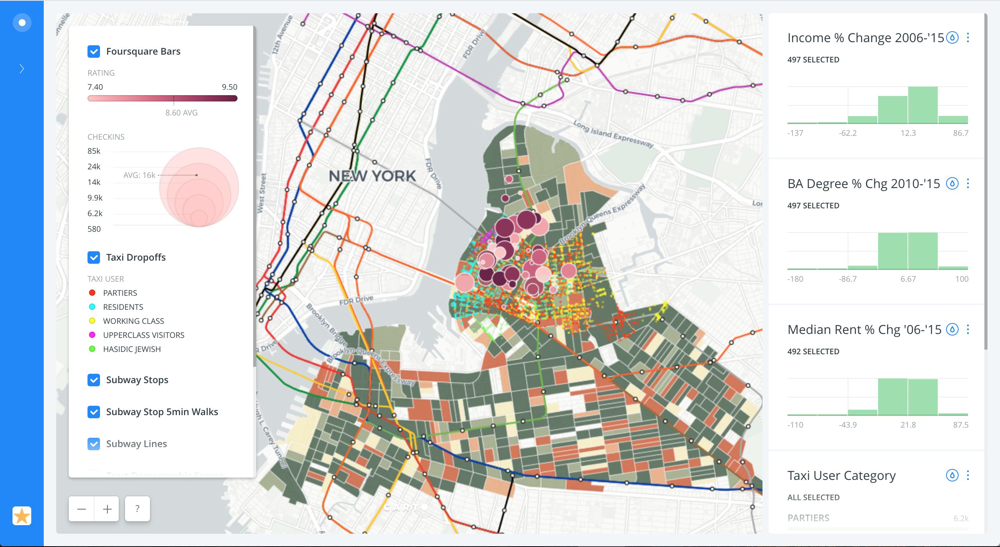
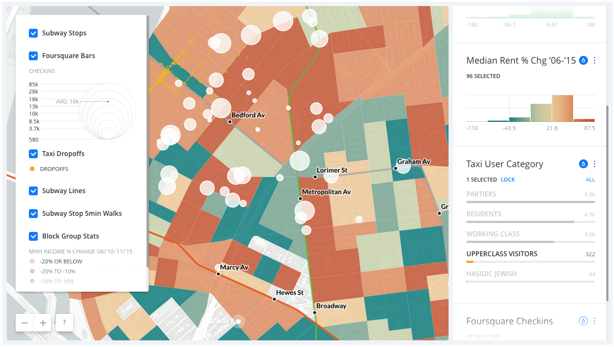

# Customize Builder Styles for More Meaningful Maps

## Index

1. [Introduction](#intro)
2. [Which basemap to use?](#basemap)
3. [How to separate signal from noise](#lines) 
4. [Communicate Effectively](#communicate) 

## 1. Introduction 

This workshop will demonstrate how Builder map default cartography can be adjusted to be more meaningful with a few customizations.

CARTO Builder dashboards are a holistic experience, so their elements should be balanced visually. We will cover examples of how to do that, and topics like assigning widget names, custom legends, and popups...all with the goal of not using Builder style defaults as-is.

## 2. Which basemap to use?

[SF Crime Heatmap](https://cartoworkshops.carto.com/u/carto-workshops/builder/3d71c79c-2616-4974-8e61-7cb10c3c0f6f/embed)

### Which basemap should you use?

* Consider labels on top or under geometry
* Consider Voyager, Positron, Dark Matter

### Consider symbology + basemap

* How can you make symbology emphasize the data's insights?

*Default:*

* Basemap labels can cover point data.
* Default settings = one big "blob" of heat. Adjust size, duration, steps & resolution to make the data legible.
* Since this is crime, think of changing the color scheme to something that shows the high in red and lows in a cooler color like green.
  * [CARTOColors](https://carto.com/carto-colors/) `Temps` divergent scheme
* Grays of Positron basemap are closer in color to low crime/green heat, so high crime/red heat is emphasized even more.
* Don't forget you can customize the Legend!

*Adjusted:*

## 3. How to separate signal from noise

[NY Commuter Flow Map](https://cartoworkshops.carto.com/u/carto-workshops/builder/1b59856b-e4d4-4bdc-abe6-d993e1eb5b89/embed)

### How can you pick out information from this many lines?

* Use classed line symbology
* Use a CARTOColor scheme
* Use redundant symbology
* [Again] Consider the symbology + basemap

*Default:*

* All lines look equal by default
* It's nearly impossible to pick out one line from another where many are located, for example New York City

*Adjusted:*

* Try different classification methods and class breaks based on your data's distribution to bring out the patterns
* Test different [CARTOColor schemes](https://carto.com/carto-colors/)
  * Depending on the variation in the data, a color scheme that has a strong difference between light and dark and/or multi-hue might be best suited
* Use redundant symbology to reinforce the map's message
  * Notice that we used BY VALUE styling to categorize lines by color and by width
* Use a blending mode to highlight areas where many lines overlap
* Tips when using a dark basemap
  * Flip the color scheme so light represents "more" — you will achieve a higher contrast this way against the dark basemap
  * Since we can't control the drawing order of an analysis node with custom SQL, take advantage of other symbology tricks
    * If you flip the color scheme and lighter colors are still drawing under darker ("less") values, use a blending mode like lighten to bring the lighter pixels to the foreground

## 4. Leverage Autostyling

[Demographics of the United Kingdom Map](https://cartoworkshops.carto.com/u/carto-workshops/builder/a4bdb947-60e3-4ee6-89e0-ac887e0db262/embed)

*Default:*

* The polygons are the same color
  * Which Population Density metric should we style the map by since we have a couple to choose from?

*Adjusted:*

* Take advantage of Autostyle
  * Use the option to customize the color scheme for a thematic variable
  * If you are showing two related variables like population density and density born in the UK, keep the color schemes and classification methods consistent so people can visually compare the two variables more easily
  * Autostyle acts as your legend
* Make widget titles descriptive
  * What are we measuring? (people/sqkm)

## 5. Communicate Effectively

*Default:*

* This map is not communicating effectively
  * Overlapping markers obscure data
  * Too many default colors

*Adjusted:*

* Rely on a Layer Selector and Autostyles to declutter the map
  * For example we used one default color for taxi drop offs to minimize the amount of default color on the map
  * Because we can use auto-styling to color the drop offs by category when we need to differentiate them
* Notice we used size only to style Foursquare bars by value
  * So the marker color does not distract from other data
* Center the map on the area of interest where the story is taking place
