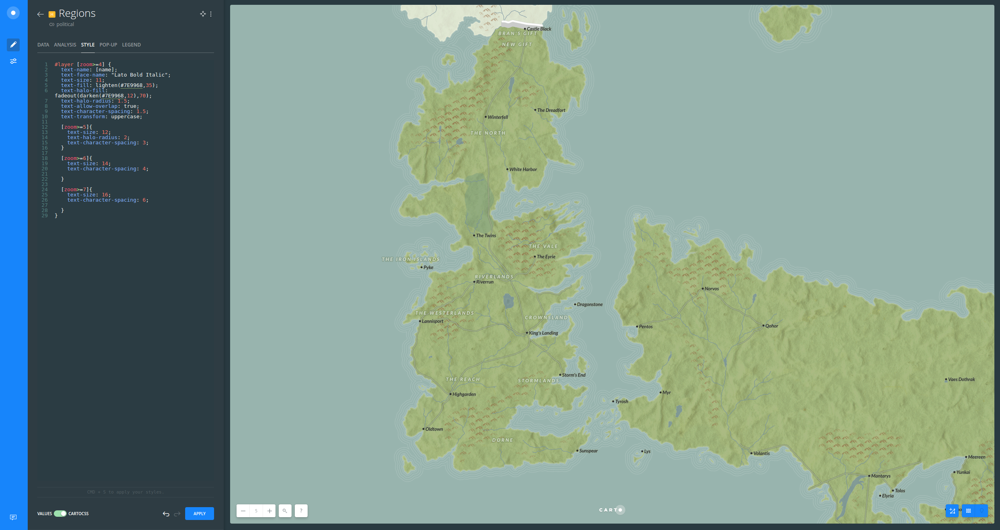

# How to create a Game of Thrones basemap

* Goal: create a basemap based on Game of Thrones world.
* Based on [*Our Game of Thrones Basemap is here to unite the Seven Kingdoms* blogpost](https://carto.com/blog/game-of-thrones-basemap/).

## Guide

0. [Resources](#resources)
1. [Getting started](#getting-started)
2. [Ocean and ripples](#ocean)
3. [Continents and islands](#continents)
4. [Mountains and lakes](#mountains)
5. [Rivers and roads](#rivers)
6. [The Ice Wall and beyond](#wall)
7. [Regions and towns](#locations)
8. [You know nothing!](#basemap)

### 0. Resources <a name="resources"></a>

* [Template .carto file](https://drive.google.com/file/d/0B9k_lcYQZACgOVJsRlQ3ZUZQeGM/view?usp=sharing)
* [Final .carto file](https://drive.google.com/file/d/0B9k_lcYQZACgMHU1aXlmdW9ac00/view?usp=sharing)

*All thematic data was built from the gvSIG’s ebook, [*Learning GIS with Game of Thrones*](http://downloads.gvsig.org/download/documents/books/GoT_book_GIS_gvSIG.pdf). Textures and icons were made from [Textures](https://www.textures.com/) and [The Noun Project](https://thenounproject.com/) websites.

### 1. Getting started <a name="getting-started"></a>

* Import the template .carto file into your account.
* Open the map.
* Rename your map as *Game of Thrones Basemap*.
* Make sure that the order and names of your layers are as follows:<br>
  1. `locations` > *Locations*
  2. `wall` > *The Ice Wall*
  3. `political` > *Regions*
  4. `rivers_and_roads` > *Rivers and roads*
  5. `mountains_lakes` > *Mountains and lakes*
  6. `political` > *Beyond the Wall*
  7. `continents_and_islands` > *Continents and islands*
  8. `continents_and_islands` > *Ripples*


### 2. Ocean and ripples <a name="ocean"></a>

* First, change the basemap:
  1. Click on the *Positron* basemap
  2. Select `COLOR`
  3. Replace the default color with `#98b4ae`


* In order to create a coastal ripple effect, follow these instructions:
  1. Click on the *Ripples* layer and go to the ANALYSIS tab
  2. Click on ADD ANALYSIS button to add a new analysis 
  2. Select *Create Areas of influence*
  3. Click on ADD ANALYSIS
  4. Set parameters as folows:
      * *TYPE*: `Distance`
      * *UNITS*:  `mi` (miles)
      * *RADIUS*: `60`
      * *TRACTS*: `4`
      * *BOUNDARIES*: `Dissolved`
  5. Hit on APPLY
  6. Go to the STYLE tab and switch from VALUES to CARTOCSS
  7. Replace the default style with the following one:

```css
#layer {
  line-width: 1;
  line-color: #FFF;
  line-opacity: 0.2;
  line-comp-op: soft-light;
}
```

  8. Hit on APPLY


### 3. Continents and islands <a name="continents"></a>

* Disable the view from all your layers but *Continents and islands*
* In order to style the land, follow these steps:
  1. Click on *Continents and islands* layer
  2. Switch from VALUES to CARTOCSS
  3. Replace the default style with the following one:

```css
#layer {
  polygon-pattern-file:
  url('https://s3.amazonaws.com/com.cartodb.users-assets.production/production/mamataakella/assets/20170822202613TexturesCom_PaperDecorative0061_1_seamless_S.jpg');
  polygon-pattern-opacity: 0.4;
  polygon-fill:mix(#6ea92f,#CCBE9A,40);
  polygon-opacity: 0.8;
  polygon-comp-op: multiply;
  line-width: 5;
  line-color: fadeout(#fff,85);

  [zoom<=4]{line-width: 2.5;}
}
```

  4. Hit on APPLY


### 4. Mountains and lakes <a name="mountains"></a>

* Enable the view from the *Mountains and lakes* layer
* Again, follow these instructions to style this layer:
  1. Click on *Continents and islands* layer
  2. Switch from VALUES to CARTOCSS
  3. Replace the default style with the following one:

```css
#layer [type = 'mountain']{
  polygon-pattern-file: url('https://s3.amazonaws.com/com.cartodb.users-assets.production/production/mamataakella/assets/20170823212836mountain-range.png');
  polygon-pattern-opacity: 0.3;
}

#layer[type='lake'] {
  polygon-fill: #718c9f;
  polygon-opacity: 0.7;
  line-width: 1;
  line-color: rgba(255,255,255,0.1);
}

#layer[type='swamp']{
  polygon-opacity: 0.4;
  polygon-fill: mix(#6ea92f,#718c9f,30);
}
```

  4. Hit on APPLY


### 5. Rivers and roads <a name="rivers"></a>

* Enable the view from the *Rivers and roads* layer
* Again, follow these instructions to style this layer:
  1. Click on *Rivers and roads* layer
  2. Switch from VALUES to CARTOCSS
  3. Replace the default style with the following one:

```css
#layer {
  [type='river']{
    line-width: 1;
    line-color: #718c9f;
    line-opacity: 0.9;

    [zoom<=4]{line-width: 0.5;}
    [zoom>=6]{line-width: 1.5;}
}
 [type='road']{
    ::case {
      line-width: 4;
      line-color: #3b3b3b;
      line-opacity: 0.3;

        [zoom<=4]{line-width: 0;}
        [zoom>=6]{line-width: 5;}
      }

    ::fill{
      line-width: 2;
      line-color: lighten(#8C9F71,10);
      line-opacity: 0.9;

        [zoom<=4]{line-width: 0;}
        [zoom>=6]{line-width: 3;}
    }
  }
}
```

  4. Hit on APPLY


### 6. The Ice Wall and beyond <a name="wall"></a>

* In order to create a 2.5 effect, follow these instructions:
  1. Click on the *The Ice Wall* layer and go to the ANALYSIS tab
  2. Click on ADD ANALYSIS button to add a new analysis 
  2. Select *Create Areas of influence*
  3. Click on ADD ANALYSIS
  4. Set parameters as folows:
      * *TYPE*: `Distance`
      * *UNITS*:  `km` (kilometers)
      * *RADIUS*: `9`
      * *TRACTS*: `1`
      * *BOUNDARIES*: `Intact`
  5. Hit on APPLY
  6. Go to the STYLE tab and switch from VALUES to CARTOCSS
  7. Replace the default style with the following one:

```css
#layer {
  line-width: 0.25;
  line-color: #FFF;
  line-opacity: 0.5;
  building-fill: #ffffff;
  building-fill-opacity: 1;
  building-height: 55000;
}
```

  8. Hit on APPLY


* Enable the view from the *Beyond the Wall* layer
* Again, follow these instructions to style this layer:
  1. Click on *Beyond the Wall* layer
  2. Switch from VALUES to CARTOCSS
  3. Replace the default style with the following one: 

```css
#layer[cartodb_id=3] {
  polygon-fill: #fff;
  polygon-opacity: 0.65;
}
```

    4. Hit on APPLY


### 7. Regions and towns <a name="locations"></a>

* Enable the view from the *Locations* layer
* Again, follow these instructions to style this layer:
  1. Click on *Locations* layer
  2. Switch from VALUES to CARTOCSS
  3. Replace the default style with the following one:

```css
Map{
  buffer-size: 512;
}
#layer[type='City'][zoom>=4]{
  ::inner{
    marker-fill-opacity: 1;
    marker-fill:#2b2b2b;
    marker-line-width: 0;
    marker-line-opacity: 0.65;
    marker-placement: point;
    marker-type: ellipse;
    marker-width: 5;
    marker-line-color: #2b2b2b;
    marker-allow-overlap: true;
  } 
  ::labels {
    text-name: [name];
    text-face-name: "Lato Bold Italic";
    text-size: 11;
    text-fill: #2b2b2b;
    text-halo-fill:fadeout(lighten(#7E9968,12),70);
    text-halo-radius: 1.5;
    text-placement-type: simple;
    text-placements: "E,W,NW,NE,SE,8";
    text-dx:-5;
    text-dy:-4;
    text-character-spacing: 0;

      [zoom>=5]{text-size: 12;}
      [zoom>=6]{text-size: 13;}
      [zoom>=7]{text-size: 15;}
  }
}
```

  4. Hit on APPLY


* Enable the view from the *Locations* layer
* Again, follow these instructions to style this layer:
  1. Click on *Locations* layer
  2. Switch from VALUES to CARTOCSS
  3. Replace the default style with the following one:

```css
#layer [zoom>=4] {
  text-name: [name];
  text-face-name: "Lato Bold Italic";
  text-size: 11;
  text-fill: lighten(#7E9968,35);
  text-halo-fill: fadeout(darken(#7E9968,12),70);
  text-halo-radius: 1.5;
  text-allow-overlap: true;
  text-character-spacing: 1.5;
  text-transform: uppercase;
  
  [zoom>=5]{
    text-size: 12;
    text-halo-radius: 2;
    text-character-spacing: 3;
  }
  
  [zoom>=6]{
    text-size: 14;
    text-character-spacing: 4;

  }
  
  [zoom>=7]{
    text-size: 16;
    text-character-spacing: 6;

  }
}
```

  4. Hit on APPLY



### 8. You know nothing! <a name="basemap"></a>

* Share your map following these instructions:
  1. Click on SHARE
  2. Click on PUBLISH

    a. Share the URL of your map: `https://team.carto.com/u/ramirocartodb/builder/155a1d3a-1a49-4cbc-8908-1a648cb3d5c5/embed`

    b. Embed the iframe into your website: `<iframe width="100%" height="520" frameborder="0" src="https://team.carto.com/u/ramirocartodb/builder/4dd30d45-4fb8-4dd5-ba4a-f7a92c6c16ac/embed" allowfullscreen webkitallowfullscreen mozallowfullscreen oallowfullscreen msallowfullscreen></iframe>`


* As a bonus, we are going to convert this BUILDER map into a basemap. This will allow us to put on top character thematic data:
  1. Open the `Network` tab from your browser developer tools console.
  2. Look for the call that starts with `json` and get the template id from the `Request URL`:


  3. Replace your user name and template id in the following URL:

  `https://cartocdn-ashbu.global.ssl.fastly.net/USERNAME/api/v1/map/named/TEMPLATE_ID/all/{z}/{x}/{y}.png`

  4. You will end up with a URL similar to this one:

  `https://cartocdn-ashbu.global.ssl.fastly.net/ramirocartodb/api/v1/map/named/tpl_4dd30d45_4fb8_4dd5_ba4a_f7a92c6c16ac/all/{z}/{x}/{y}.png`

* Finally, you can add this custom basempa following [this guide](https://carto.com/learn/guides/styling/inserting-external-basemaps).