# How (not) to lie with CARTO

## http://bit.ly/171017-carto-geoinq

## Slides

[How (not) to lie with CARTO](https://docs.google.com/presentation/d/19a5e7SlAkPKjL1u_S7NuacBLhOcHEPG-MmYma8darPo/edit?usp=sharing)

### Index

1. [Projections](#projections)
2. [Choropleth maps](#choropleths)
3. [TurboCARTO and CARTOcolors](#carto)<br>
	3.1. [TurboCARTO](#turbo)<br>
	3.2. [CARTOcolors](#colors)<br>
4. [Interactivity](#interactivity)<br>
	4.1. [Widgets](#widgets)<br>
	4.2. [Legends](#legends)<br>
	4.3. [Popus](#popups)

### 1. Projections <a name="projections"></a>

* [Free your maps from web mercator!](https://carto.com/blog/free-your-maps-web-mercator/)
* CARTO map projections: [application](https://ramiroaznar.github.io/labs-carto-proj/) & [block](https://bl.ocks.org/ramiroaznar/raw/6d19c773bb2764837c285c89da984c1d/)
* Other useful resources: [Compare Map Projections](https://map-projections.net/index.php) & [MAPfrappe](http://mapfrappe.com/)

> Be careful when making world maps!


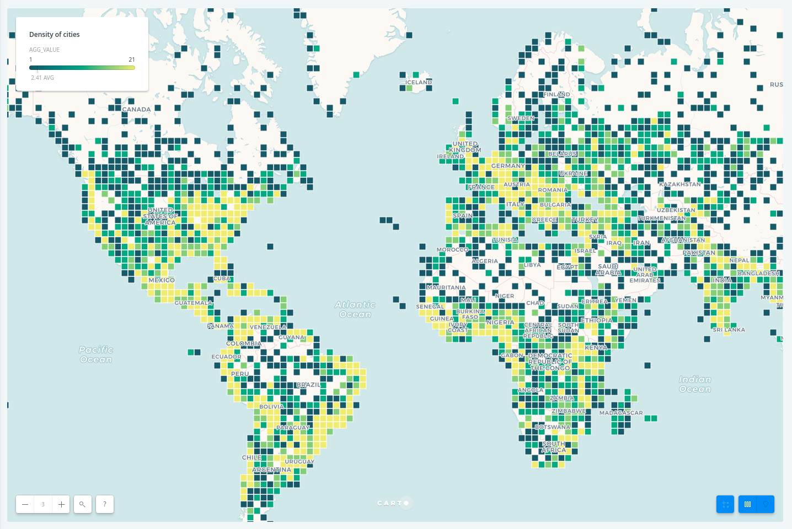

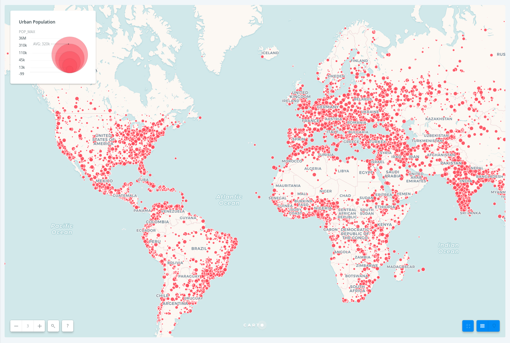

> **Tip**: try not to use bubble maps or square/hexbins with world maps, use it for areas sharing the same latitude.


### 2. Choropleth maps <a name="choropleths"></a>

* Useful resources: [style by value guide](https://carto.com/learn/guides/styling/style-by-value)

a. Making maps counting points within polygons:

> Choropleths should always be normalized!

* Non normalized maps

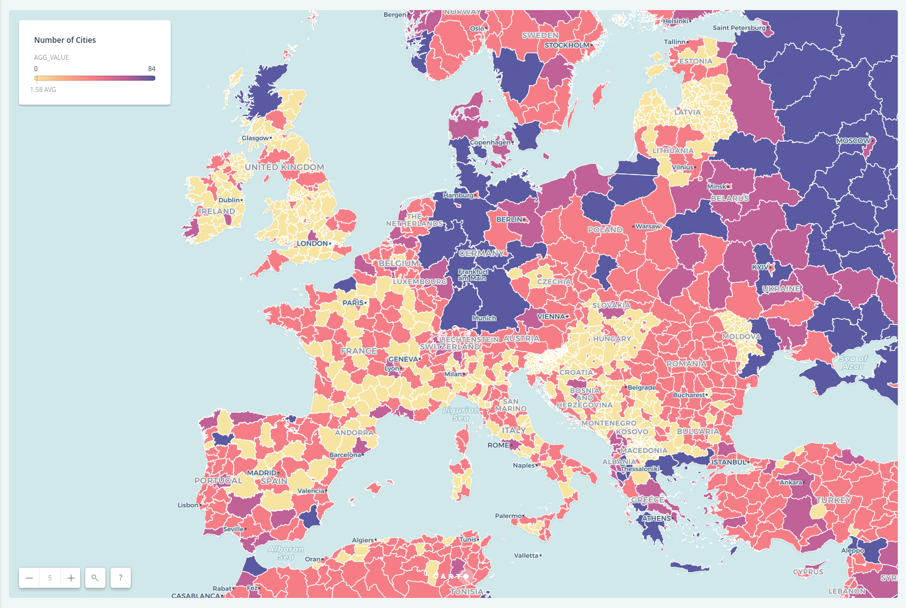

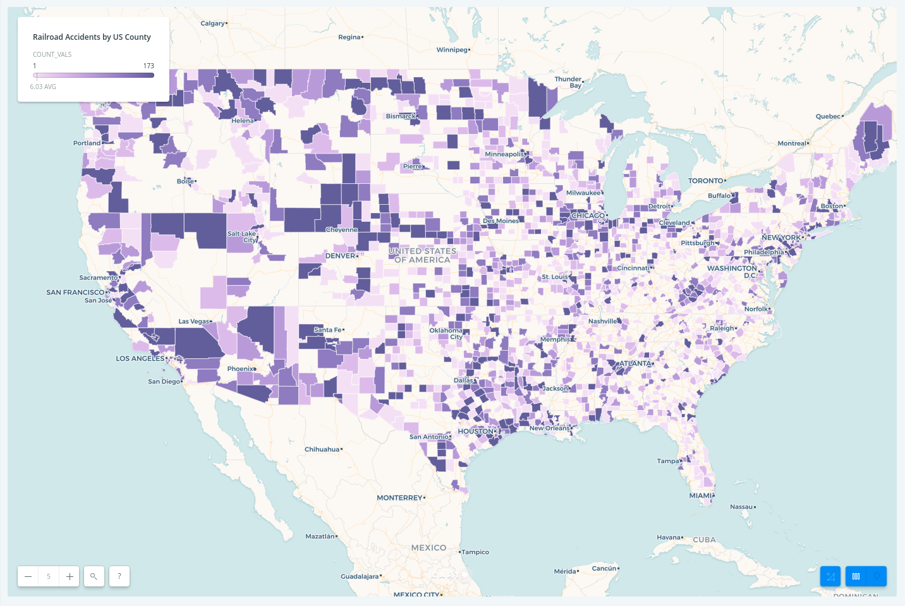

> **Tip**: Intersect with second layer and Style by Adm. Region Agg. method returns an aggregation/count and an aggregation/count density values, always choose the later.

* Normalized maps

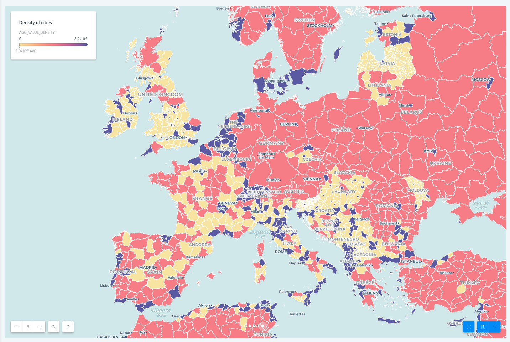

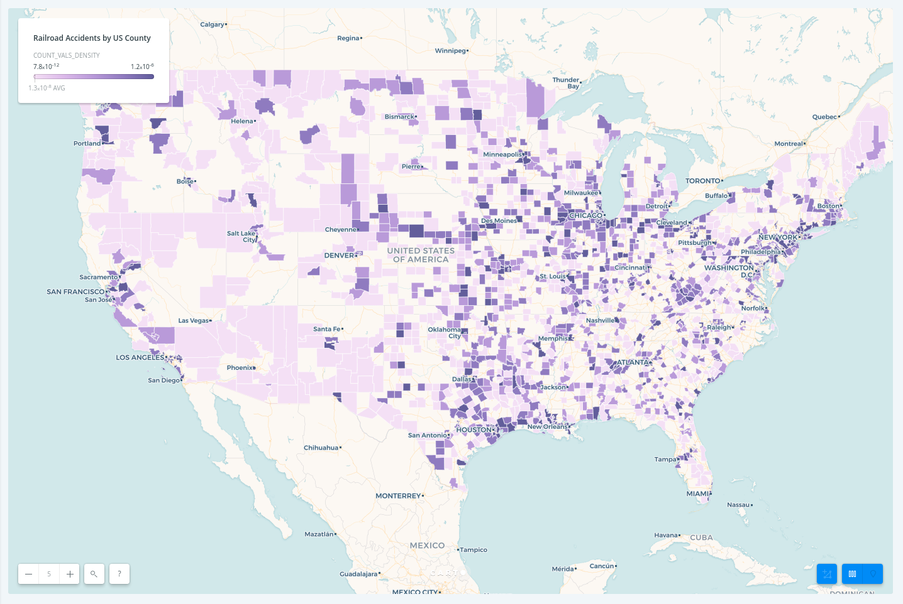

b. Making maps aggregating custom fields within polygons:

> Again, choropleths should always be normalized!

* Non normalized maps:

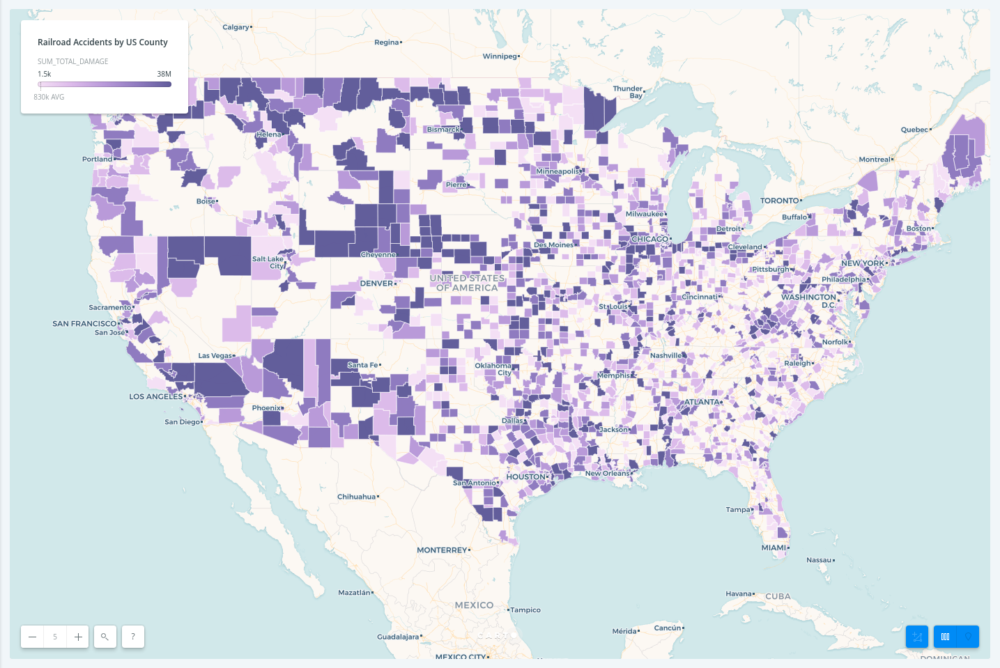

> **Tip**: Normalize your field using something like `ST_Area(the_geom)`, `ST_Length(the_geom)`, population...

* Normalized maps:

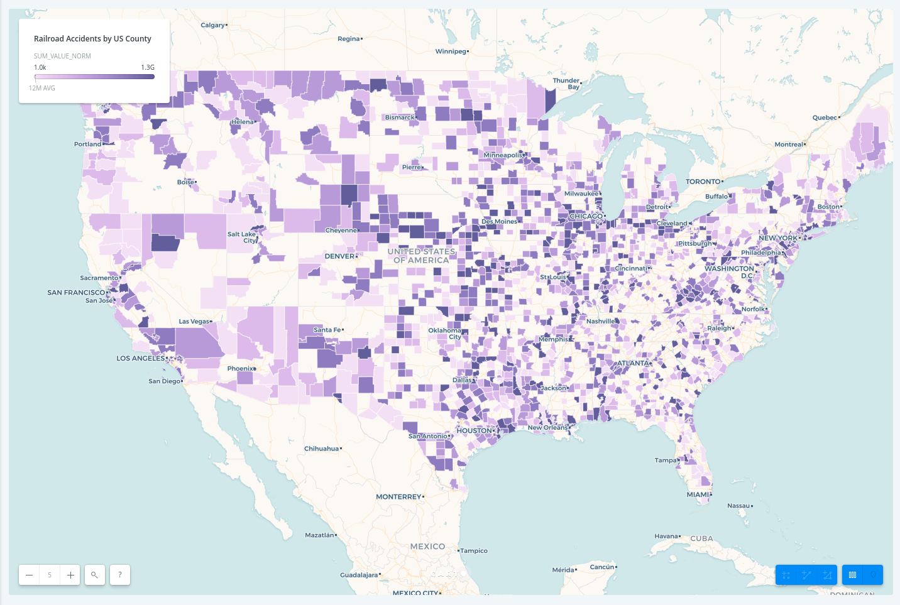


### 3. TurboCARTO and CARTOcolors <a name="carto"></a>

#### 3.1. TurboCARTO <a name="turbo"></a>

* Next-Gen Styling for Data-Driven Maps, AKA CartoCSS preprocessor. Turbo-Carto high-level API for ramps is as follows:

```css
#selector {
    property: ramp([attribute], (...values), (...filters), mapping);
}
```

Where:
 - `property` is the CartoCSS property you want to create.
 - `[attribute]` usually is a column/key name from your dataset.
 - `(...values)` is **what** `property` is gonna get for different filters.
 - `(...filters)` is **how** `property` is gonna get the different values.
 - `mapping` is the type of filter that will be applied: <, <=, >, >=, =.

* Useful resources: [GitHub repository](https://github.com/CartoDB/turbo-carto), guides ([basic](https://carto.com/learn/guides/styling/style-thematic-maps-with-turbocarto) & [advanced](https://carto.com/learn/guides/styling/turbocarto-by-geometries)) & [workshop](https://gist.github.com/ramiroaznar/ec736a5db4a16b436290b25a2ec3c34b)

> **Tip**: TurboCARTO is very useful when making bivariate or multivariate map, using color, opacity and width ramps give you a wide diversity of options.

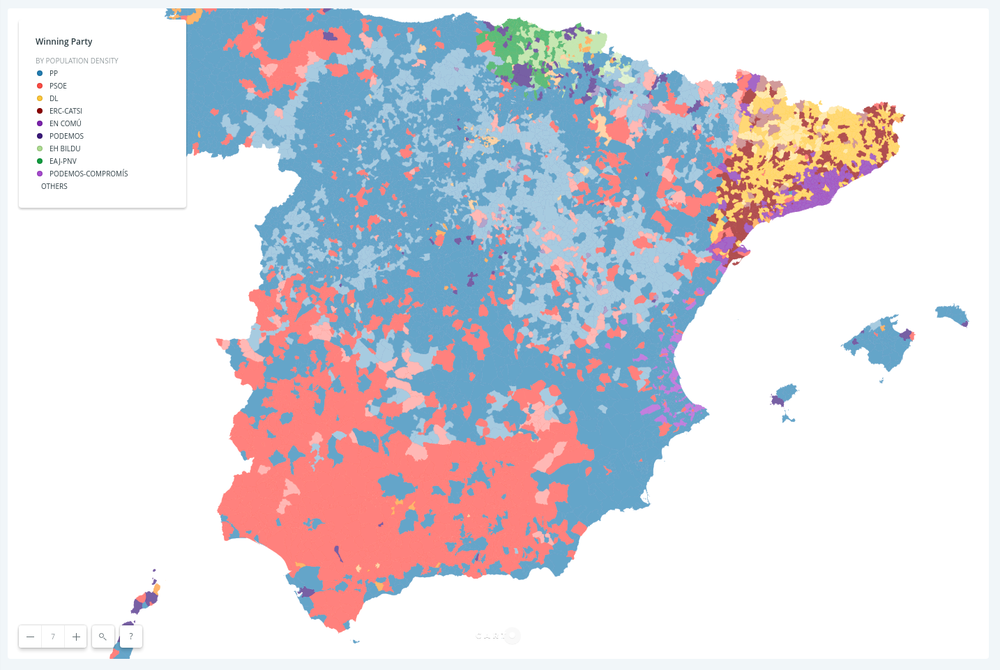

```css
#layer {
  line-color: #FFF;
  line-width: 0.25;
  line-opacity: 0.5;
  polygon-gamma: 0.5;
  polygon-fill: #ff9900;
  polygon-opacity: ramp([pop_density], (0.4, 0.7), quantiles(5));
  polygon-fill: ramp([partido_ga], (#3e7bb6, #f84f40, #ffcc00, #850200, #7b00b4, #3b007f, #B2DF8A, #33A02C, #a53ed5), category(9));
}
```

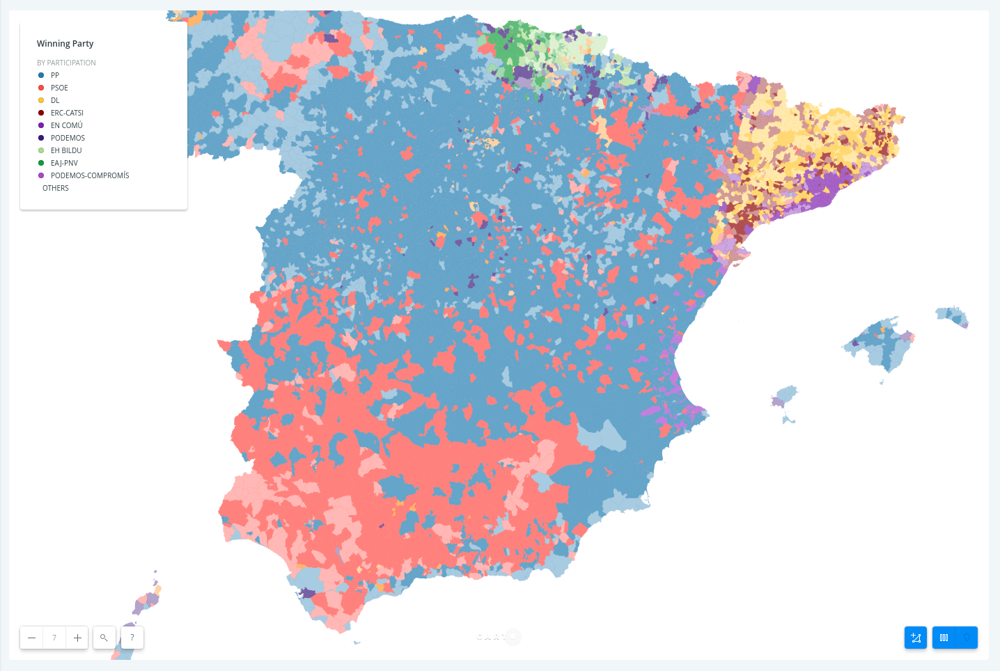

```css
#layer {
  line-color: #FFF;
  line-width: 0.25;
  line-opacity: 0.5;
  polygon-gamma: 0.5;
  polygon-fill: #ff9900;
  polygon-opacity: ramp([participation], (0.4, 0.7), quantiles(5));
  polygon-fill: ramp([partido_ga], (#3e7bb6, #f84f40, #ffcc00, #850200, #7b00b4, #3b007f, #B2DF8A, #33A02C, #a53ed5), category(9));
}
```

> **Tip**: you can also style polygons, lines and/or marker strokes width, color and/or opacity as done in [this guide](https://carto.com/learn/guides/styling/turbocarto-by-geometries).

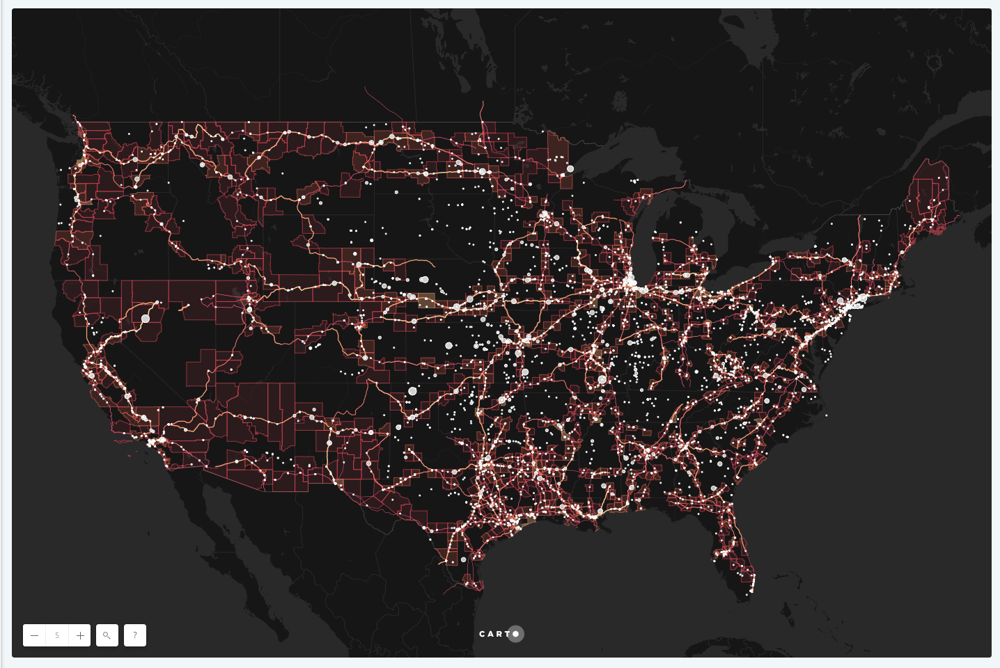


#### 3.2. CARTOcolors <a name="colors"></a>

a. ColorBrewer: 

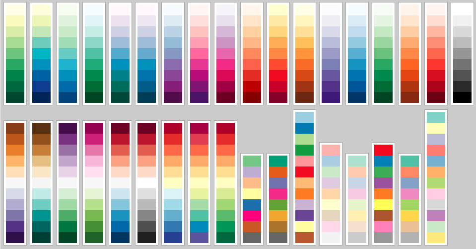

* Useful resources: [ColorBrewer2](http://colorbrewer2.org/#type=sequential&scheme=BuGn&n=3) & [every ColorBrewser scale](https://bl.ocks.org/mbostock/5577023)

b. CARTOcolors:


* Designed for web maps, work nicely with CARTO basemaps.
* Useful resources: [CARTOcolors landing page](https://carto.com/carto-colors/) & [GitHub repository](https://github.com/CartoDB/CartoColor)

> **Tip**: you should take into account what the thematic data represents, the interaction between other layers and basemap, the visual hierarchy, your audience, the device where the map will be shared...

#### 4. Interactivity <a name="interactivity"></a>

#### 4.1. Widgets <a name="widgets"></a>

#### 4.2. Legends <a name="legends"></a>

#### 4.3. Popups <a name="popus"></a>

##### Click

##### Hover
