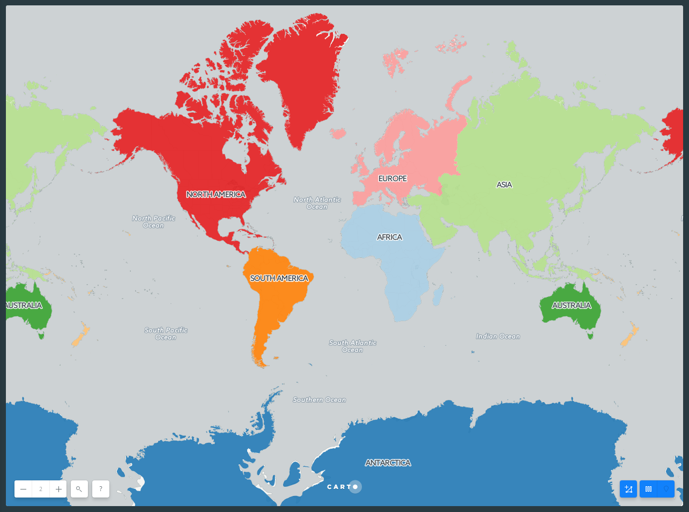
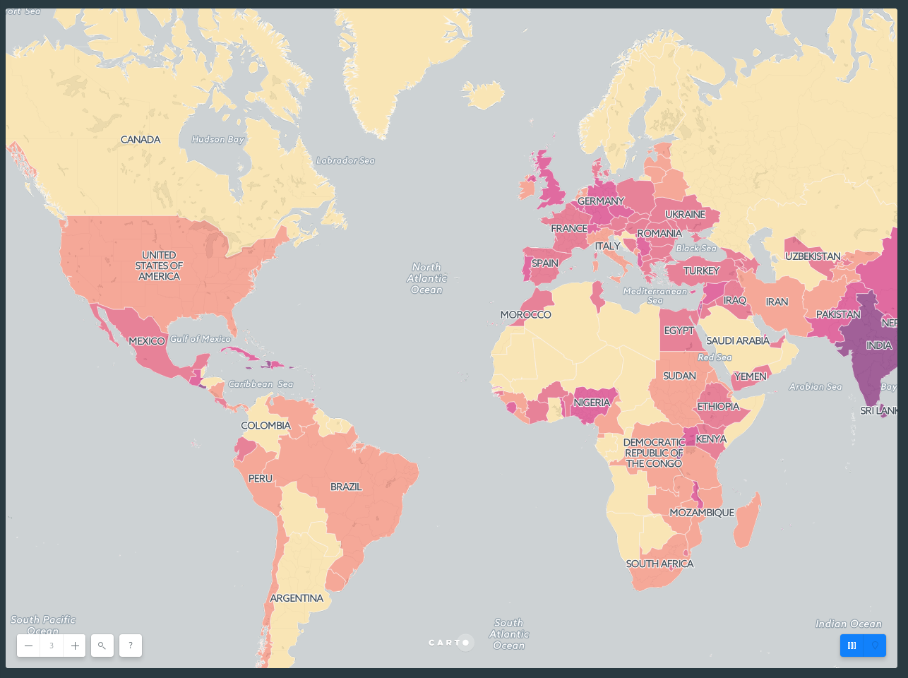
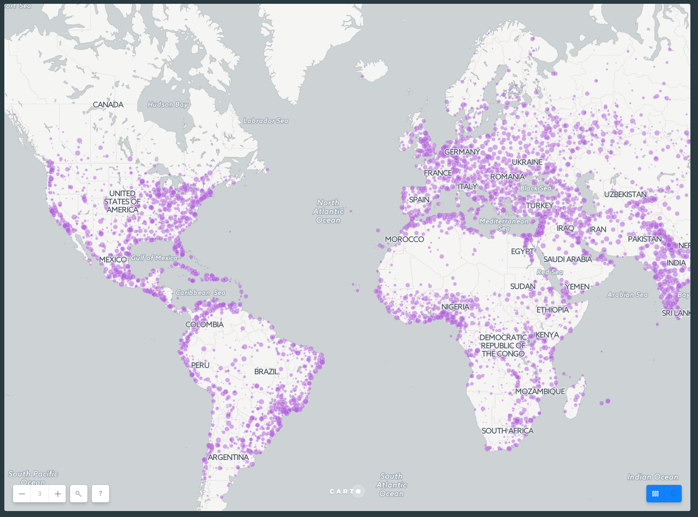
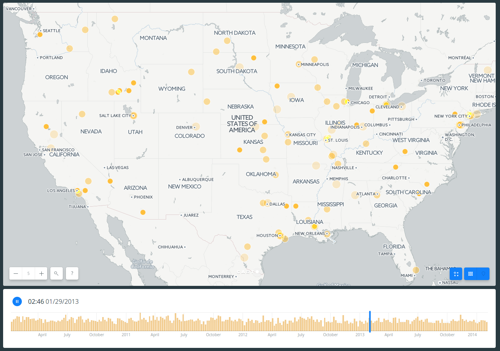
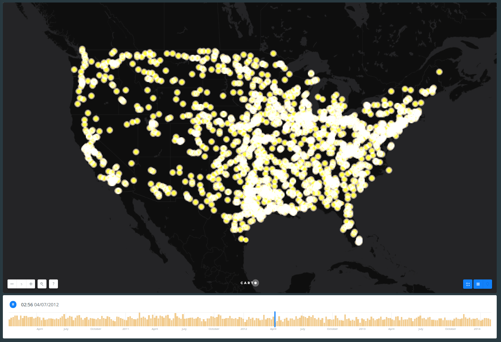

# CartoCSS basics

## Category

In the following block of code polygon opacity is applied to the overall style of the map. While `polygon-fill` is removed from the overall map style, since the default values for these properties do not render any styling effects, they are not necessary.

*Tip*: In some cases, default values for CartoCSS properties render no styling effects on your map. If you apply CartoCSS syntax with the default values `none``undefined`, the map appears the same with or without these properties. Ensure to define values for properties that apply no default styling.

Each point is categorized as `[continent="name"] {` and contains its own polygon-fill style. You do not need to preface each point with the `#layer` label.

### Style continents by categories

* Data Source: `continents` from *DATA LIBRARY*

* SQL query:

  ```sql
  SELECT
    *
  FROM
    continents
  ```

* CartoCSS code

  ```css
  #layer {
    /* global */
    polygon-opacity: 0.9;

    /* categories */
    [continent="Africa"] {
      polygon-fill: #A6CEE3;
    }
    [continent="Antarctica"] {
      polygon-fill: #1F78B4;
    }
    [continent="Asia"] {
      polygon-fill: #B2DF8A;
    }
    [continent="Australia"] {
      polygon-fill: #33A02C;
    }
    [continent="Europe"] {
      polygon-fill: #FB9A99;
    }
    [continent="North America"] {
      polygon-fill: #E31A1C;
    }
    [continent="Oceania"] {
      polygon-fill: #FDBF6F;
    }
    [continent="South America"] {
      polygon-fill: #FF7F00;
    }
  }
  ```

<br>

<br>

The following two styles are based on the same principle, but instead of using string fields, choropleth and bubbles styles use numeric ones.

## Choropleth

Choropleth maps are one of the most well known thematic maps. Especially suited to mapping densities, these maps are a great way to visualize intensity, and also to explain geographic similarities and differences.

It is important to use a normalized (rate) attribute in a choropleth instead of a raw count. Counts show magnitude instead of concentration. In the dataset below, both Nigeria (pop2005 = 141,356,083 people) and Russia (pop2005 = 143,953,092 people) have ~140 million people. If we make a choropleth using the pop2005 attribute, Russia and Nigeria are the same color because they are included in the same bucket. This is misleading if what we're really trying to map is how crowded or population-dense those countries are, since Russia covers a much bigger area. To see density we need to factor out area size, like in the SQL example below. If you want to work with raw counts instead Bubble maps are a better option.

It's also important to consider [quantification](https://carto.com/academy/courses/intermediate-design/which-kind-of-map-should-i-make#quantification), since that's how your data is bucketed into choropleth bins. Each method can make your map look dramatically different.

*Tip*: Prioritize legibility: Make sure to choose a color scheme that contrasts with your basemap colors enough to be easily readable.

### Style countries based upon normalized population

* Data Source: `world_borders` from *DATA LIBRARY*

* SQL query:

  ```sql
  SELECT
    *,
    pop2005/area as pop_norm
  FROM
    world_borders
  WHERE
    area > 0
  ```

* CartoCSS code

  ```css
  #layer {
    /* global */
    polygon-opacity: 0.7;
    line-width: 1;
    line-color: #FFF;
    line-opacity: 0.5;
    polygon-fill: #fcde9c; 

    /* categories */
    [ pop_norm > 190.0 ] {
      polygon-fill: #f58670;
    }
    [ pop_norm > 650 ] {
      polygon-fill: #e34f6f;
    }
    [ pop_norm > 1401 ] {
      polygon-fill: #d72d7c;
    }
    [ pop_norm > 4500 ] {
      polygon-fill: #7c1d6f;
    }

  }
  ```

<br>

<br>

## Bubbles

Bubble, or ‘graduated point symbol’ maps are another approach to mapping data on a numerical range, and work really well when visualising geographic differences in absolute value, such as the total number of people that live in cities.

### Style cities based upon number of inhabitants

* Data Source: `ne_10m_populated_places_simple` from *DATA LIBRARY*

* SQL query:

  ```sql
  SELECT
    *
  FROM
    ne_10m_populated_places_simple
  ```
* CartoCSS code

  ```css
  #layer {
    /* global */
    marker-fill: #af5cda;
    marker-fill-opacity: 0.5;
    marker-allow-overlap: true;
    marker-line-width: 0.2;
    marker-line-color: #FFF;
    marker-line-opacity: 1;
    marker-width: 1; /* marker-width less than or equal to 2.5 */

    /* categories */
    [ pop_max > 9461 ] {
      marker-width: 2.5;
    }
    [ pop_max > 27200 ] {
      marker-width: 4;
    }
    [ pop_max > 53800 ] {
      marker-width: 5.5;
    }
    [ pop_max > 98852 ] {
      marker-width: 7;
    }
    [ pop_max > 187765 ] {
      marker-width: 8.5;
    }
    [ pop_max > 440006 ] {
      marker-width: 10;
    }
  }
  ```

<br>

<br>

## Zoom-Based Styling

Zoom-based styling refers to the ability to change what is displayed on a map, or how it is visualized, based on the zoom-level. Let’s start by looking at [Stamen’s map tiles](http://maps.stamen.com/#terrain/12/37.7706/-122.3782). As you zoom in and out, you can notice that some features or data (like streets, buildings, or waterways) appear or fade away. While there is a ton of data in the map, it is simplified when you’re zoomed out, and made more complex at closer scales, when a viewer is able to process more data. The map never becomes overly complex, but also manages to provide a very data-rich view of a city.

<br>

<br>

Before we start making changes based on our zoom level, it’s important to note that online maps using [Mapnik](http://mapnik.org/) to build the map visualization will default to having marker widths stay the same, regardless of the level of zoom.

To start working with zoom-based styling, let’s go back to the Simple visualization, and reduce the marker size to around 3 so that we can see more of our data points. In the CartoCSS view, we’ll add some new styling so that at different zooms, the size of the marker gets bigger. Here, we want the markers to get bigger the more zoomed in we are. We want to tell CARTO that if the zoom is equal to a certain level, the marker-width should be larger than the original `3`. We could also tell CARTO to change marker width at all zoom levels larger than a specified level. Take a look at the last three lines of our code block here.

### Style dots based upon zoom level

* Data Source: `ne_10m_populated_places_simple` from DATA LIBRARY

* SQL query:

  ```sql
  SELECT
    *
  FROM
    ne_10m_populated_places_simple
  ```

* CartoCSS code

  ```css
  #layer{
    marker-fill-opacity: 0.9;
    marker-line-color: #FFF;
    marker-line-width: 0;
    marker-line-opacity: 1;
    marker-placement: point;
    marker-type: ellipse;
    marker-width: 3;
    marker-fill: #FF6600;
    marker-allow-overlap: true;
    [zoom = 4] {marker-width: 6}
    [zoom = 5] {marker-width: 12}
    [zoom > 5] {marker-width: 16}
  }
  ```

We can see that CARTO will read this as all markers should have a width value of `3`. If the zoom equals `4`, the marker width value should be `6`. If the zoom equals `5`, the marker width value should be `12`. Finally, if the zoom is larger than `5`, the marker width value should be `16`. This means that as we zoom in, the markers become bigger. [Go ahead and play around with this](https://team.carto.com/u/ramirocartodb/builder/33e2696c-badf-11e6-80bd-0ee66e2c9693/embed) to see what kinds of visualizations you can make based on zoom.

*Note*: When nested conditional styles apply to more than one case, the bottom-most styles take precedence.

*Tip*: If you're working with choropleth polygons, check the legibility of the smallest polygon at each zoom level to judge how to adjust your styles.

## Torque

Torque is an efficient, fast, and styleable rendering method to bring data to life. By using the the Torque visualizations you can animate your data directly on an interactive map. There are many CartoCSS properties, but here we will see `-torque-data-aggregation`, this can be `linear` or `cumulative`.

### Animate railroad accidents

* Data Source: `dot_rail_safety_data_1` from [`builder-demo` account](https://team.carto.com/u/ramirocartodb/tables/builder-demo.dot_rail_safety_data_1/public/map?redirected=true)
* SQL query:

  ```sql
  SELECT
    *
  FROM
    dot_rail_safety_data_1
  ```

* CartoCSS code

  * Linear 

    ```css
    Map {
      -torque-frame-count: 256;
      -torque-animation-duration: 30;
      -torque-time-attribute: "date";
      -torque-aggregation-function: "count(1)";
      -torque-resolution: 4;
      -torque-data-aggregation: linear;
    }
    #layer {
      marker-width: 7;
      marker-fill: #FFB927;
      marker-fill-opacity: 0.9;
      marker-line-width: 1;
      marker-line-color: #FFF;
      marker-line-opacity: 1;
      comp-op: lighter;
    }
    #layer[frame-offset=1] {
      marker-width: 9;
      marker-fill-opacity: 0.45;
    }
    #layer[frame-offset=2] {
      marker-width: 11;
      marker-fill-opacity: 0.225;
    }
    ```

<br>

<br>

  * Cumulative

    ```css
    Map {
      -torque-frame-count: 256;
      -torque-animation-duration: 30;
      -torque-time-attribute: "date";
      -torque-aggregation-function: "count(1)";
      -torque-resolution: 4;
      -torque-data-aggregation: cumulative;
    }
    #layer {
      marker-width: 7;
      marker-fill: #FFB927;
      marker-fill-opacity: 0.9;
      marker-line-width: 1;
      marker-line-color: #FFF;
      marker-line-opacity: 1;
      comp-op: lighter;
    }
    #layer[frame-offset=1] {
      marker-width: 9;
      marker-fill-opacity: 0.45;
    }
    #layer[frame-offset=2] {
      marker-width: 11;
      marker-fill-opacity: 0.225;
    }
    ```

<br>

<br>

