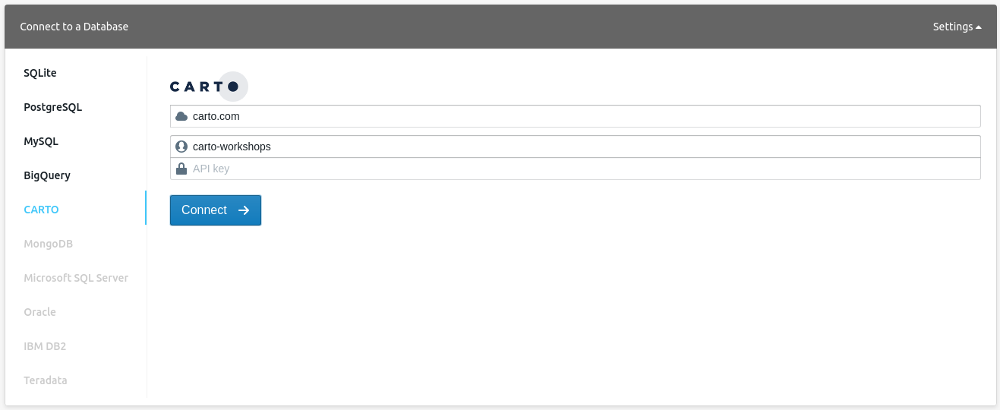

Geospatial Databases
=====================

CARTO database is [Postgres](http://postgresql.org) on this section of the workshop we cover how to leverage Postgres and [PostGIS](http://postgis.net/), its geospatial extension, to understand and manage your data. Most of this content is actually not specific to CARTO and can be applied to any other Postgres installation.

## Exercises

* [Introduction to  SQL](https://docs.google.com/a/cartodb.com/presentation/d/1LRa6HHdtUCrxl7Kh4wjgTktkigoihVekuhwH-dW5jv8/edit?usp=sharing)
* [Easy exercises with SQL](exercises/sql-easy.md)
* [Spatial SQL](exercises/sql-spatial.md)
* [Advanced Postgres & PostGIS workshop](exercises/sql-advanced.md)
* [Stored procedures and triggers examples](exercises/sql_stored_procedures.md)

## Set up

For this workshop, we will use [CARTO](https://carto.com) as a convenient way to interact with the database, which will require no installation or configuration by you. You won't even need an account; we're using public demo datasets.

As a client for this workshop, we will use a web application that can interact with CARTO: [Franchise](https://franchise.cloud/). You can access to an instance of it, with the CARTO connector enabled, here: [https://franchise.carto.io/](https://franchise.carto.io/).

From the side menu, navigate to 'CARTO', then use the following parameters to connect:

* Host name: `carto.com`
* User name: `carto-workshops`
* API key: you can leave this empty



Once connected, you can run `SELECT` queries against any public dataset from that account.

Some tables you have available to you from this account are:

* `ne_10m_populated_places_simple`: Natural Earth populated places
* `ne_110m_admin_0_countries`: Natural Earth country boundaries
* `railroad_data`: Railroad accidents in the USA
* `barcelona_building_footprints`: Barcelona blocks
* `lineas_madrid`: Madrid metro lines
* `listings_madrid`: Madrid Airbnb listings

Try entering a simple query like the one below. To run the query, type `Control+Enter` on PCs, `Command+Enter`/`Cmd+Return` on macs, or press the green `play` button in the bottom right corner of the SQL panel.

```sql
select *
  from listings_madrid
 where bathrooms >= 3
 ```

The results of your query will be displayed in a typical table view, which will allow you to explore all returned fields and rows.

 

 If you hit the small CARTO icon in the bottom right of the result panel, Franchise switches to a geographical result.

 

This map uses the [CartoCSS](https://carto.com/docs/carto-engine/cartocss/properties/) language to define how data is rendered. By default, all three geometry types (points, lines, polygons) are rendered with default symbology, defined in the panel to the left. You can, however, alter the cartoCSS at any point. After making your edits, apply them by typing `Control+Enter` or `Cmd+Enter`. You can even leverage [TurboCARTO](https://github.com/CartoDB/turbo-carto) to generate style ramps quickly. For example, if we wanted to style our points' size by the number of bathrooms at each point, we can change the default `marker-width` from this:

 ```css
 marker-width: 7;
 ```

to this:

 ```css
 marker-width: ramp([bathrooms], range(5, 20), quantiles(5));
 ```

 

Both CartoCSS and TurboCARTO are out of the scope of this training, but you can find more training materials on the [cartography section](https://github.com/CartoDB/carto-workshop/tree/master/03-cartography) of this repository.

## Resources

Other useful links:

* [PostGIS Project](http://postgis.net/) and [official docs](http://postgis.net/docs/manual-2.2/)
* [WKT encoding](https://en.wikipedia.org/wiki/Well-known_text) 
* [Modern SQL](http://modern-sql.com/slides) 
* [Use the Index, Luke](http://use-the-index-luke.com)
* [The 10 most powerful SQL queries](https://www.youtube.com/watch?v=ZLvT8lQit80) 
* [Pattern matching expressions](https://www.postgresql.org/docs/9.5/static/functions-matching.html)
* [Fill the gaps between two geometries](http://bl.ocks.org/jsanz/60050dbfe104da69f15e)
* [Join by proximity](http://bl.ocks.org/jsanz/5f7ac01cc6c720c71610c74917d821aa)
* [Jump across the Date Line](https://carto.com/blog/jets-and-datelines)
* EPSG codes databases:
  * http://epsg.io/
  * http://spatialreference.org/
* [Free your maps from Web Mercator](https://carto.com/blog/free-your-maps-web-mercator/)
* [Stored procedures that return the Antipode's point for an input geometry](https://github.com/geoinquietosvlc/antipodes-map/blob/master/pgsql/funciones.sql)

## Extra ball: Cartodbfy a table

CARTO needs some special columns, indexes, etc in order to work with tables and show them on the interface.
 For this, there is a function that is executed upon import, but that you may need to call manually if you created a table with a `CREATE TABLE` query: 

```
CREATE TABLE wb2 AS
SELECT w.*,
       count(pp.*) AS places,
       sum(pp.pop_max)  AS cities_pop
  FROM world_borders AS w
  JOIN ne_10m_populated_places_simple AS pp
    ON ST_Intersects(w.the_geom,pp.the_geom)
 GROUP BY w.cartodb_id
 ORDER BY cities_pop DESC
 LIMIT 10;
``` 

And then, 

```
SELECT CDB_CartoDBFyTable('username','wb2');
``` 

Note that your `username` is needed as first parameter if you're an organization user. 
