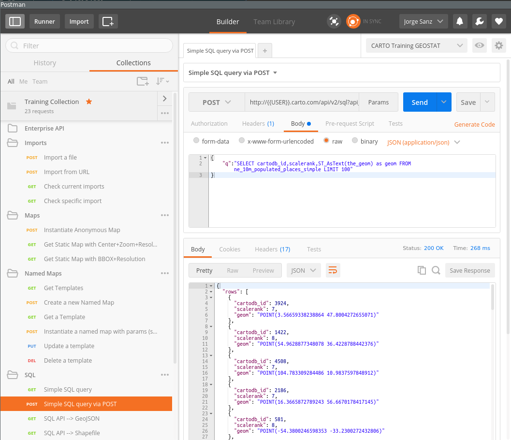

# Exploring CARTO Engine APIs 

This section covers the basic usage of main [CARTO Engine APIs](carto.com/docs). Using a software called [Postman](http://getpostman.com) you'll be able to experiment with the different APIs and see how to interact directly with the platform. This is specially useful if you are going to do it from a different environment than JavaScript, as it will be covered on the last part of this workshop.

Setting up your environment:

* Open your Postman installation (normally a Google Chrome extension)
* Install a new collection from [this link](https://raw.githubusercontent.com/ernesmb/CARTO-Engine-collection/master/CARTO_Training_Collection.postman_collection.json)
* Download the environment provided by the instructor (see the shared notes doc)

## [SQL API](https://carto.com/docs/carto-engine/sql-api/)

This is the API to interact directly with your database. You can perform not just any SELECT query but also create tables, add triggers and functions.

## [Maps API](https://carto.com/docs/carto-engine/maps-api/)

The Maps API is the rendering engine for CARTO. This API needs in essence a query and a cartographic symbology definition to render tiles to be used on your web mapping applications. When datasets are public (as in Free accounts) you can specify queries and CartoCSS directly on your call. When private datasets are involved, then you need to define a template and give it a name to be instantiated by the final users.

## [Import API](https://carto.com/docs/carto-engine/import-api/)

To upload bulk data to CARTO you need to use the Import API. This provides mechanisms to upload files or define the url from where CARTO will fetch your data and create tables on your account.
