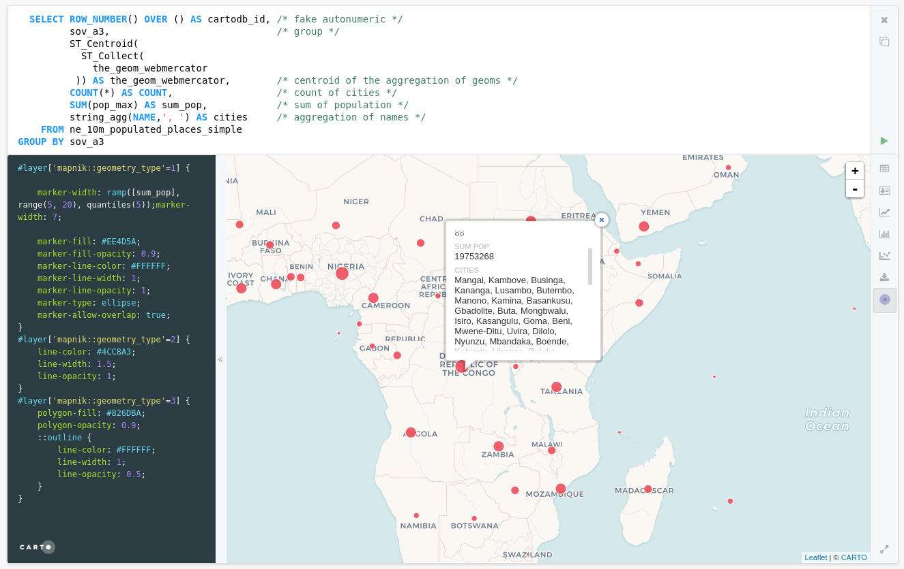
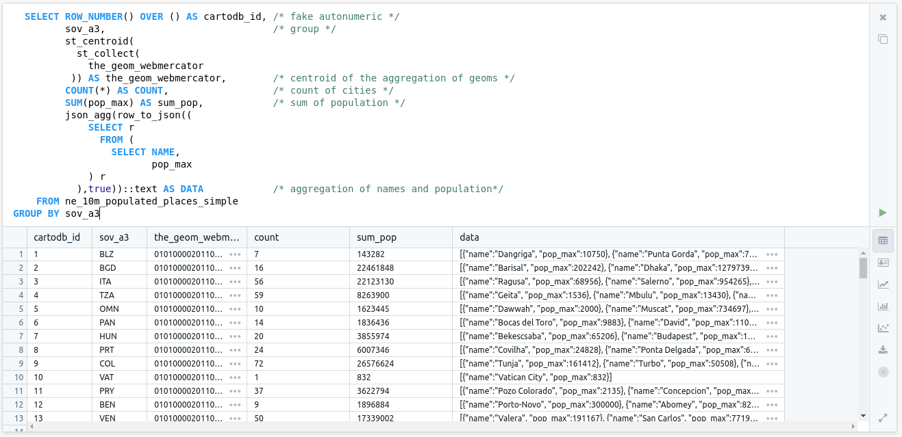
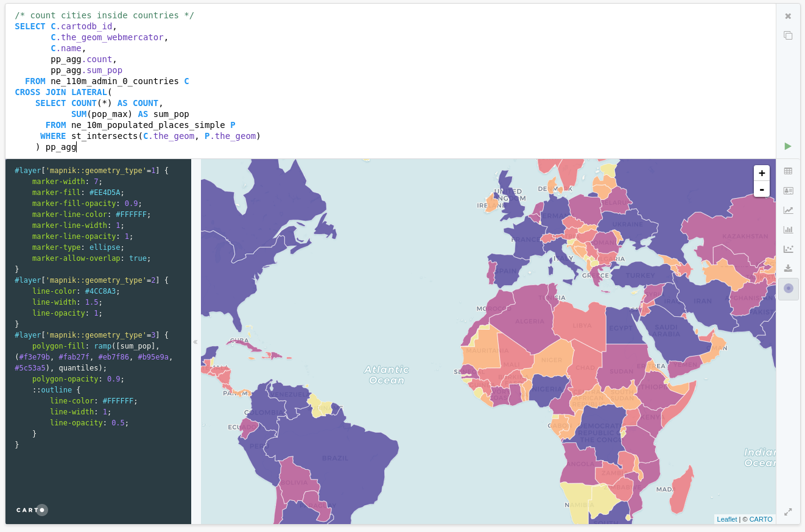
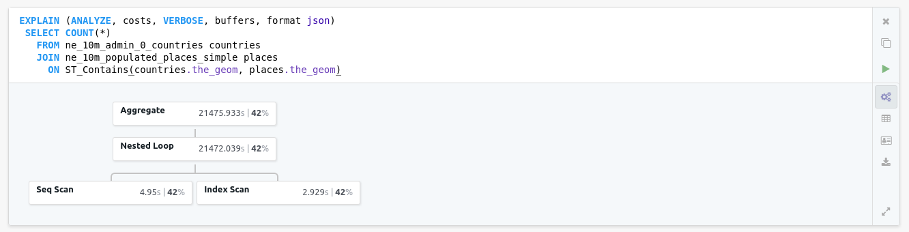
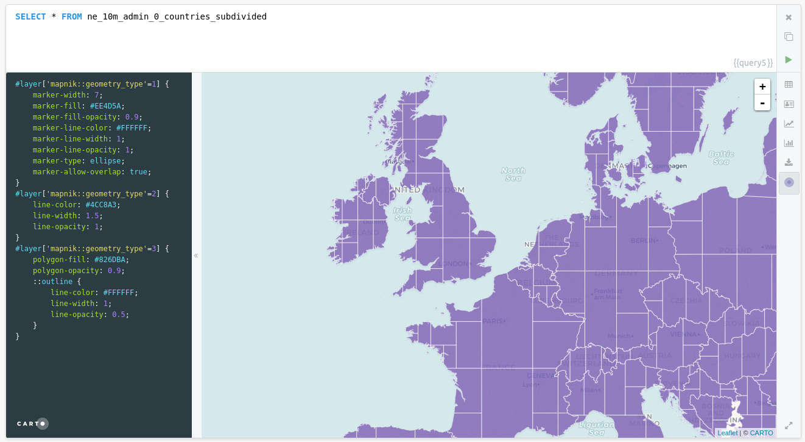
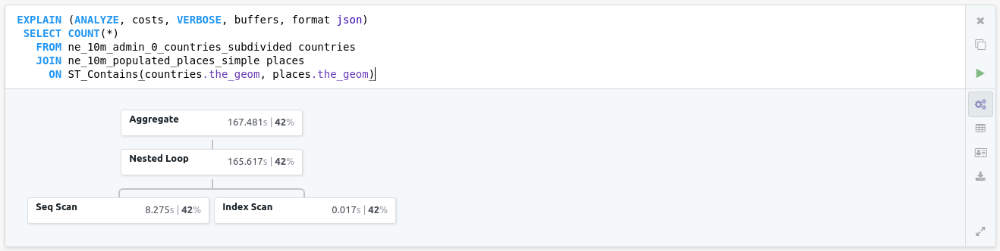
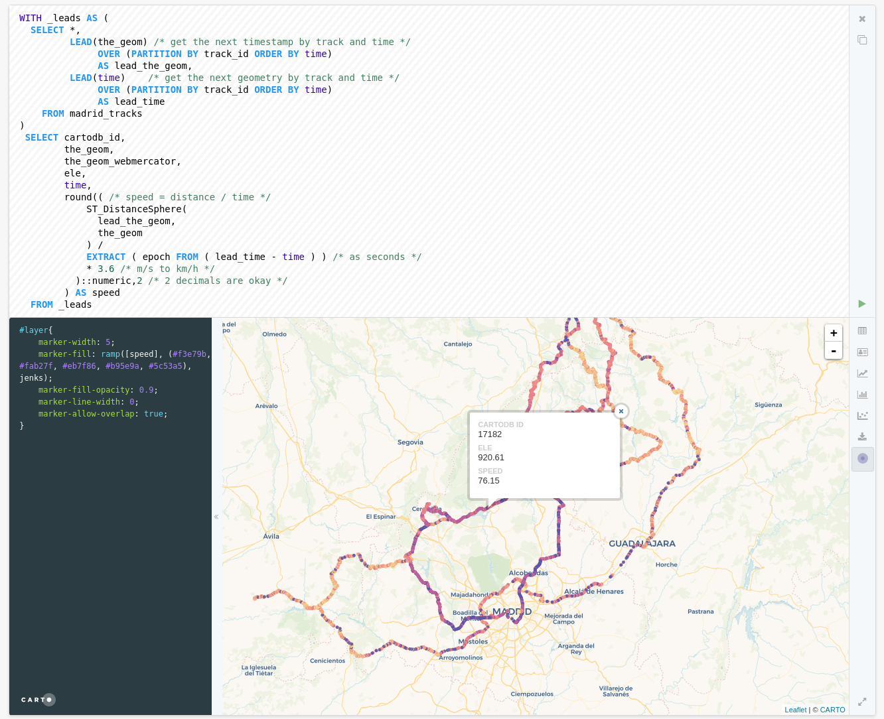
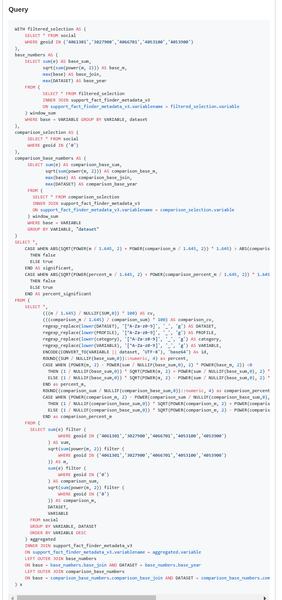
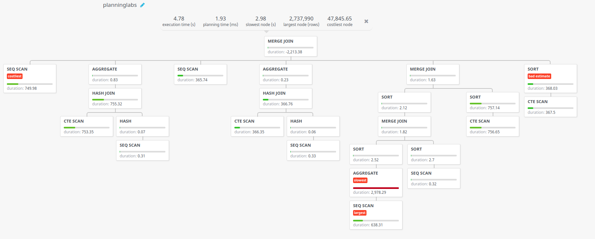
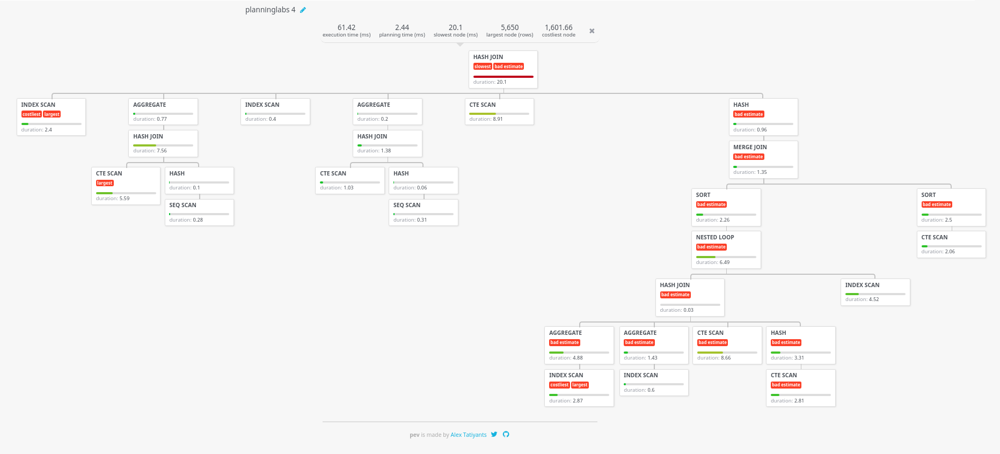

# Advanced Postgres - PostGIS workshop

This is a **one hour** training about the [Postgres database](https://www.postgresql.org/) and the [PostGIS](http://postgis.net/) extension to allow to work with geospatial information. This is not an introduction, so if you are not familiar with SQL, Postgres and PostGIS, we recommend you start with these resources:

* [SQL for non-techies](https://docs.google.com/presentation/d/1LRa6HHdtUCrxl7Kh4wjgTktkigoihVekuhwH-dW5jv8/edit#slide=id.p)
* [Simple SQL operations](./sql-easy.md)
* [Spatial SQL](./sql-spatial.md)


## Agenda 

* Set up: instructions [here](../README.md#set-up)
* Rendering one-to-many relationships
* `LATERAL`
* Subdividing
* Window Functions
* A performance advice


## Objective

The main objective of this workshop is to showcase a few features from Postgres and Postgis that are not usually seen on typical GIS applications.

If you loved this workshop and want to learn more about Postgres/PostGIS, check out:

* this [presentation](https://modern-sql.com/slides) on Modern SQL in commercial and Open Source databases.
* this [awesome blogpost](https://abelvm.github.io/sql/sql-tricks/) from Abel Vázquez on "Some little known PostgreSQl/PostGIS tips & tricks". Explore the rest of his [blog](https://abelvm.github.io/) for more great content.
* this [talk](https://vimeo.com/250498574) from Paul Ramsey on Scaling PostGIS · [slides and script](http://s3.cleverelephant.ca/2017-cdb-postgis.pdf)


## Rendering one to many relationships or clustering

 In many occasions we need to display geometries that:

 - Represent a one to many relationship such as having a stores dataset to join to a table with monthly sales reports, or a countries dataset with evolution over time of an index.
 - Represent dense datasets where we need to aggregate geometries to understand how they are distributed

 In both cases, we are displaying a geometry that has many records associated to it, while we still want to be able to see those individual records in our applications (e.g. in popups).

### Exercise: Aggregate cities

```sql
  select row_number() over () as cartodb_id, /* fake autonumeric */
         sov_a3,                             /* group */
         ST_Centroid(
           ST_Collect(
             the_geom_webmercator
          )) as the_geom_webmercator,        /* centroid of the aggregation of geoms */
         count(*) as count,                  /* count of cities */
         sum(pop_max) as sum_pop,            /* sum of population */
         string_agg(name,', ') as cities     /* aggregation of names */
    from ne_10m_populated_places_simple
group by sov_a3
```



Concatenating strings can be enough, but sometimes our data can have more complex structures, or we want to have more fields. We can leverage the support in Postgres for JavaScript objects. This is also convenient for web development.

```sql
  select row_number() over () as cartodb_id, /* fake autonumeric */
         sov_a3,                             /* group */
         st_centroid(
           st_collect(
             the_geom_webmercator
          )) as the_geom_webmercator,        /* centroid of the aggregation of geoms */
         count(*) as count,                  /* count of cities */
         sum(pop_max) as sum_pop,            /* sum of population */
         json_agg(row_to_json((
             select r
               from (
                 select name,
                        pop_max
             ) r
           ),true))::text as data            /* aggregation of names and population*/
    from ne_10m_populated_places_simple
group by sov_a3
```



We are casting the JSON field to a string using `::text` at the result of `json_agg` function. This allows displaying the result in Franchise, however in real applications your postgres client will convert it into text for you.


## `LATERAL`

In modern SQL there's a keyword to allow access the result of a query inside the next one, something like a `for loop`.

### Exercise: count points in polygons

This is a very typical scenario, where you want to count points that fall inside polygons, while also taking other calculations. We use `CROSS JOIN LATERAL` to get access to every row of the main query (countries) and for each row access different metrics. 

```sql
/* count cities inside countries */
select c.cartodb_id,
       c.the_geom_webmercator,
       c.name,
       pp_agg.count,
       pp_agg.sum_pop
  from ne_110m_admin_0_countries c
cross join lateral(
    select count(*) as count,
           sum(pop_max) as sum_pop
      from ne_10m_populated_places_simple p
     where st_intersects(c.the_geom, p.the_geom)
    ) pp_agg
```



## Subdividing

Checking points inside polygons can be very costly if those polygons have many vertices. If we try to count the number of points that are inside the a more detailed countries dataset called `ne_10m_admin_0_countries` it takes quite a lot and the query cannot be improved directly.

Franchise has a nice feature, if we prepend our query with a certain flavor of the `EXPLAIN` query, that is asking to Postgres to give details on the execution plan, it renders a nice graph of the cost of the different parts of our query.

```sql
explain (analyze, costs, verbose, buffers, format json) 
 select count(*)
   from ne_10m_admin_0_countries countries 
   join ne_10m_populated_places_simple places 
     on ST_Contains(countries.the_geom, places.the_geom)
```



This query then takes **21 seconds** to execute, it's using indexes and all the optimizations that Postgres can leverage from the data itself.

But for this question we can break our countries polygons into a different set of polygons that are simpler, but still all together cover the exactly same area.

```sql
create table ne_10m_admin_0_countries_subdivided as
      select st_subdivide(the_geom) as the_geom, 
             admin 
        from ne_10m_admin_0_countries;

create index ne_10m_admin_0_countries_subdivided_idx 
          on ne_10m_admin_0_countries_subdivided 
       using gist (the_geom);
``` 

This work was already did for you



So now if you run the same query than before:

```sql
explain (analyze, costs, verbose, buffers, format json) 
 select count(*)
   from ne_10m_admin_0_countries_subdivided countries 
   join ne_10m_populated_places_simple places 
     on ST_Contains(countries.the_geom, places.the_geom)
```



That took **167 ms** which is more than **two orders of magnitude** better!

## Window Functions

In traditional SQL, when making calculations you only had access to your row, you could not access your "neighbors". With window functions, once you define an ordering and a partition criteria, you can access rows before and after the current one. 

### Computing speed

A typical use case for window functions is computing distance and speeds given a dataset of points that represent a moving device. We have a position, a field that represents the device and a time stamp.

So we can break our problem in two steps, first we will use the window function `lead` to get the next geometry and timestamp grouping our points by `track_id` and ordering by `time`. Once we have that information we can compute the speed as the division between the distance (computed over a sphere, good enough) and the time difference.

```sql
with _leads as (
  select *,
         lead(the_geom) /* get the next timestamp by track and time */
              over (partition by track_id order by time) 
              as lead_the_geom,
         lead(time)    /* get the next geometry by track and time */
              over (partition by track_id order by time)
              as lead_time
    from madrid_tracks
)
 select cartodb_id,
        the_geom,
        the_geom_webmercator,
        ele,
        time,
        round(( /* speed = distance / time */
            ST_DistanceSphere(
              lead_the_geom,
              the_geom
            ) / 
            extract ( epoch from ( lead_time - time ) ) /* as seconds */
            * 3.6 /* m/s to km/h */
          )::numeric,2 /* 2 decimals are okay */
        ) as speed
  from _leads
```

You can use the following CartoCSS to render your points by speed

```css
#layer{
    marker-width: 5;
    marker-fill: ramp([speed], (#f3e79b, #fab27f, #eb7f86, #b95e9a, #5c53a5), jenks);
    marker-fill-opacity: 0.9;
    marker-line-width: 0;
    marker-allow-overlap: true;
}
```



## Getting better execution plans

Franchise prints the graph of the execution plan, but there's a better tool to do this task. Not long ago we received a support request asking for help on debugging the following query (reduced on purpose).



The query was **scary**, really complex, with several hierarchy levels, `WITH`, mathematical functions, groupings, etc. The `EXPLAIN` was incredibly long and complex. So we used the tool caled `Postgres Explain Visualizer`, available at http://tatiyants.com/pev.

On that website you copy your query and the execution plan in the same format Franchise asks for it and you get back a graph with way more detail on the different aspects of your query. We did that and we got this:



From that `AGGREGATE` box we detected that the big issue on that query was in fact a quite simple query:

```sql
   select sum(e) filter (
               where geoid in ('4061301','3027900','4066701','4053100','4053900')
           ) as sum, 
           sqrt(sum(power(m, 2)) filter (
               where geoid in ('4061301','3027900','4066701','4053100','4053900')
           )) as m, 
           sum(e) filter (
               where geoid in ('0')
           ) as comparison_sum, 
           sqrt(sum(power(m, 2)) filter (
               where geoid in ('0') 
           )) as comparison_m, 
           dataset, 
         variable 
    from social 
group by variable, dataset 
order by variable desc 
```

The issue here is that `FILTER` is being executed thousands of times because of the `GROUP BY`. The solution was clear, execute first those filters and then join the results.

```sql
with _filter as (
  select sum(e) as sum, 
         sqrt(sum(power(m, 2)))  as m, 
         dataset, 
         variable 
    from social
   where geoid in ('4061301','3027900','4066701','4053100','4053900')
group by variable, dataset
),
_comp as (
  select sum(e) as comparison_sum, 
         sqrt(sum(power(m, 2))) as comparison_m,
         dataset,
         variable
    from social
   where geoid in ('0')
group by variable, dataset
)
select _filter.*,
       _comp.comparison_sum,
       _comp.comparison_m
  from _filter 
  join _comp
    on _filter.dataset = _comp.dataset and
       _filter.variable = _comp.variable
```

Making that change in the original query gave the following plan, which is actually more complex but executes way faster, from 5 seconds to 61 ms.



