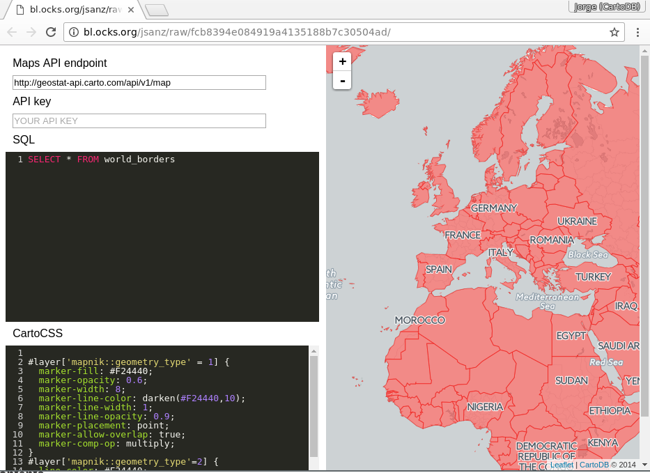
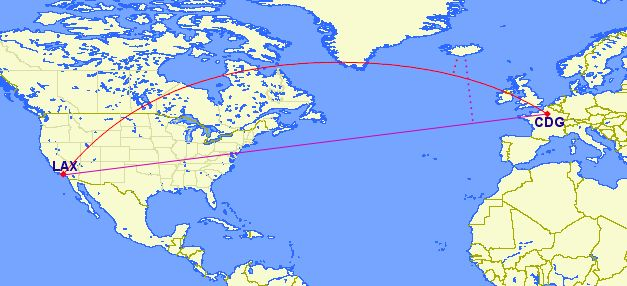

# Spatial SQL  <a name="postgis"></a>

On this section you'll have the chance to test some of the most common [PostGIS](http://postgis.net/docs/reference.html) SQL procedures. To follow this section you only need to open a browser pointing to this url: [http://bl.ocks.org/jsanz/raw/fcb8394e084919a4135188b7c30504ad/](http://bl.ocks.org/jsanz/raw/fcb8394e084919a4135188b7c30504ad/) and change the Maps API entry point to `http://carto-workshops.carto.com/api/v1/map`. Alternatively, you can load the datasets listed below from CARTO Data Library into your account and use BUILDER SQL tray to experiment.



From that point, you can place any valid query on the SQL panel that plays with the following datasets from [Natural Earth](http://www.naturalearthdata.com/)

* `ne_50m_land`
* `ne_adm0_europe`
* `ne_10m_populated_places_simple`

Over different examples we'll see how to make buffers, intersect or calculate lines between different features of those tables. You can paste the SQL presented on the panel, make changes and see how it works saving them using `Control+S` or `Command+S` depending on your operating system.

If no data shows on your map open the developer console and look for any errors. Usually when there's an error on your SQL statement the API will return a message that may help on finding the issue.

This section assumes some basic knowledge on SQL. If you need a bit more of help on the basics of this language take a look on [this workshop](../introductory/elections-workshop.html), there's a section on simple SQL queries.

## Contents

<!-- MarkdownTOC -->

- PostGIS concepts: `geometry` vs. `geography`
- `the_geom` vs. `the_geom_webmercator`
- Transform to a different projection
- Get the number of points inside a polygon
- Know wether a geometry is **within** the given range from another geometry:
- Create a **buffer** from points:
- Get the **difference** between two geometries:
- Create a **straight line** between two points:
- Create **great circles** between two points:
- Generating Grids with CDB functions
  - Rectangular grid
  - Adaptative Hexagonal grid

<!-- /MarkdownTOC -->


## PostGIS concepts: `geometry` vs. `geography`

* **`Geometry`** uses a cartesian plane to measure and store features (CRS units):

    >The basis for the PostGIS `geometry` type is a plane. The shortest path between two points on the plane is a straight line. That means calculations on geometries (areas, distances, lengths, intersections, etc) can be calculated using cartesian mathematics and straight line vectors.

* **`Geography`** uses a sphere to measure and store features (Meters):

    >The basis for the PostGIS `geography` type is a sphere. The shortest path between two points on the sphere is a great circle arc. That means that calculations on geographies (areas, distances, lengths, intersections, etc) must be calculated on the sphere, using more complicated mathematics. For more accurate measurements, the calculations must take the actual spheroidal shape of the world into account, and the mathematics becomes very complicated indeed.

More about the `geography` type can be found [here](http://workshops.boundlessgeo.com/postgis-intro/geography.html) and [here](http://postgis.net/docs/manual-1.5/ch04.html#PostGIS_Geography).




_Source: [Boundless Postgis intro](http://workshops.boundlessgeo.com/postgis-intro)_

## `the_geom` vs. `the_geom_webmercator`

* **`the_geom`** EPSG:4326. Unprojected coordinates in **decimal degrees** (Lon/Lat). WGS84 Spheroid.
* **`the_geom_webmercator`** EPSG:3857. UTM projected coordinates in **meters**. This is a conventional Coordinate Reference System, widely accepted as a 'de facto' standard in webmapping.

In CARTO, **the_geom_webmercator column is the one we see represented in the map**. Know more about projections:

* In [this tutorial](http://docs.cartodb.com/tutorials/projections/).
* [Map Projections in Wikipedia](https://en.wikipedia.org/wiki/Map_projection).
* In [this CARTO blog post](http://blog.cartodb.com/free-your-maps-web-mercator/).

Finally, remember that BUILDER needs the following columns to work correctly:

* `cartodb_id`: it has to be a column with unique values
* `the_geom`: is a geometry in `EPSG:4326` coordinate system
* `the_geom_webmercator`: is a geometry field in `EPSG:3857`


## Transform to a different projection

```sql
SELECT
  cartodb_id,
  ST_Transform(the_geom, 54030) AS the_geom_webmercator
FROM
  ne_50m_land
```

_About [working with different projections in CARTO](http://cartodb.github.io/training/intermediate/cartocss.html#projections) and [`ST_Transform`](http://postgis.net/docs/ST_Transform.html)._


## Get the number of points inside a polygon

Using `GROUP BY`:

```sql
  SELECT e.cartodb_id,
         e.admin,
         e.the_geom_webmercator,
         count(*) AS pp_count,
         sum(p.pop_max) as sum_pop
    FROM ne_adm0_europe e
    JOIN ne_10m_populated_places_simple p
      ON ST_Intersects(p.the_geom, e.the_geom)
GROUP BY e.cartodb_id
```

Using `LATERAL`:

```sql
SELECT a.cartodb_id,
       a.admin AS name,
       a.the_geom_webmercator,
       counts.number_cities AS pp_count,
       counts.sum_pop
  FROM ne_adm0_europe a
 CROSS JOIN LATERAL
  ( SELECT count(*) as number_cities,
           sum(pop_max) as sum_pop
      FROM ne_10m_populated_places_simple b
     WHERE ST_Intersects(a.the_geom, b.the_geom)
  ) AS counts
```

_About [`ST_Intersects`](http://postgis.net/docs/ST_Intersects.html) and [Lateral JOIN](http://blog.heapanalytics.com/postgresqls-powerful-new-join-type-lateral)_

----

**Note:** Add this piece of CartoCSS at the end so you have a nice coropleth map:

```css
#layer['mapnik::geometry_type'=3] {
  line-width: 0;
  polygon-fill: ramp([pp_count], cartocolor(SunsetDark), quantiles(5));
}
```

This is using the new [turbo-carto](https://carto.com/blog/styling-with-turbo-carto/) feature on CARTO to allow creating ramps from data without having to put the styles directly

----

----

**Note:** You know about the `EXPLAIN ANALYZE` function? use it to take a look on how both queries are pretty similar in terms of performance.

----


## Know wether a geometry is **within** the given range from another geometry:

```sql
SELECT a.*
  FROM ne_10m_populated_places_simple a,
       ne_10m_populated_places_simple b
 WHERE a.cartodb_id != b.cartodb_id
   AND ST_DWithin(
         a.the_geom_webmercator,
         b.the_geom_webmercator,
         150000)
   AND a.adm0name = 'Spain'
   AND b.adm0name = 'Spain'
```

In this case, we are using `the_geom_webmercator` to avoid casting to `geography` type. Calculations made with `geometry` type takes the CRS units.

Keep in mind that CRS **units in webmercator are not meters**, and they depend directly on the latitude.

_About [`ST_DWithin`](http://postgis.net/docs/ST_DWithin.html)._

## Create a **buffer** from points:

```sql
SELECT cartodb_id,
       name,
       ST_Transform(
         ST_Buffer(the_geom::geography, 250000)::geometry
         ,3857
       ) AS the_geom_webmercator
  FROM ne_10m_populated_places_simple
 WHERE name ilike 'trondheim'
```

Compare the result with

```sql
 SELECT cartodb_id,
        name,
        ST_Transform(
          ST_Buffer(the_geom, 2)
          ,3857
        ) AS the_geom_webmercator
   FROM ne_10m_populated_places_simple
  WHERE name ilike 'trondheim'
```

Why this is not a circle?

_About [`ST_Buffer`](http://postgis.net/docs/ST_Buffer.html)._

## Get the **difference** between two geometries:

```sql
SELECT a.cartodb_id,
       ST_Difference(
         a.the_geom_webmercator,
         b.the_geom_webmercator
       ) AS the_geom_webmercator
  FROM ne_50m_land a,
       ne_adm0_europe b
 WHERE b.adm0_a3 like 'ESP'
```

_About [`ST_Difference`](http://postgis.net/docs/ST_Difference.html)._

## Create a **straight line** between two points:

```sql
SELECT ST_MakeLine(
        a.the_geom_webmercator,
        b.the_geom_webmercator
      ) as the_geom_webmercator
 FROM (
        SELECT *
          FROM ne_10m_populated_places_simple
         WHERE name ILIKE 'madrid'
      ) as a,
      (
        SELECT *
          FROM ne_10m_populated_places_simple
         WHERE name ILIKE 'barcelona'
           AND adm0name ILIKE 'spain'
      ) as b
```

_About [`ST_MakeLine`](http://postgis.net/docs/ST_MakeLine.html)._

## Create **great circles** between two points:

```sql
 SELECT ST_Transform(
          ST_Segmentize(
            ST_Makeline(
              a.the_geom,
              b.the_geom
            )::geography,
            100000
          )::geometry,
        3857
        ) as the_geom_webmercator
   FROM (
          SELECT *
            FROM ne_10m_populated_places_simple
           WHERE name ILIKE 'madrid'
        ) as a,
        (
          SELECT *
            FROM ne_10m_populated_places_simple
           WHERE name ILIKE 'new york'
        ) as b
```

_About [Great Circles](http://blog.cartodb.com/jets-and-datelines/)._

## Generating Grids with CDB functions

### Rectangular grid

```sql
 SELECT row_number() over () AS cartodb_id,
        CDB_RectangleGrid(
          ST_Buffer(the_geom_webmercator,125000),
          250000,
          250000
        ) AS the_geom_webmercator
   FROM ne_adm0_europe
  WHERE adm0_a3 IN ('ITA','GBR')
```

_About [CDB_RectangleGrid](http://docs.cartodb.com/tips-and-tricks/cartodb-functions/#a-rectangle-grid)_

### Adaptative Hexagonal grid

```sql
WITH grid AS (
  SELECT row_number() over () AS cartodb_id,
         CDB_HexagonGrid(
           ST_Buffer(the_geom_webmercator, 100000),
           100000
         ) AS the_geom_webmercator
    FROM ne_adm0_europe
   WHERE adm0_a3 IN ('ESP','ITA')
)
SELECT grid.the_geom_webmercator,
       grid.cartodb_id
  FROM grid, ne_adm0_europe a
 WHERE a.adm0_a3 IN ('ESP','ITA') AND
       ST_intersects(
         grid.the_geom_webmercator,
         a.the_geom_webmercator
       )
```

_About [CDB_HexagonGrid](http://docs.cartodb.com/tips-and-tricks/cartodb-functions/#a-hexagon-grid)_

