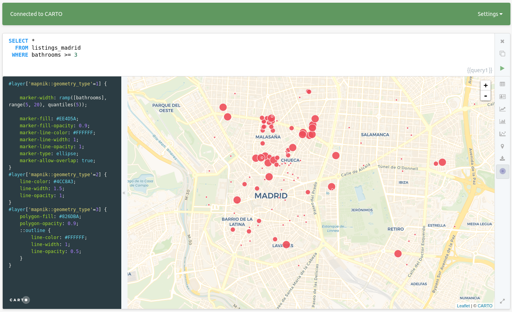

# Spatial SQL  <a name="postgis"></a>

In this section you'll have the chance to test some of the most common [PostGIS](http://postgis.net/docs/reference.html) SQL procedures.

### Set up

For this workshop, we will use [CARTO](https://carto.com) as a convenient way to interact with PostGIS, which will require no installation or configuration by you. You won't even need an account; we're using public demo datasets.

As a client for this workshop, we will use a web application that can interact with CARTO: [Franchise](https://franchise.cloud/). You can access to an instance of it, with the CARTO connector enabled, here: [https://franchise.carto.io/](https://franchise.carto.io/).

From the side menu, navigate to 'CARTO', then use the following parameters to connect:

* Host name: `carto.com`
* User name: `carto-workshops`
* API key: you can leave this empty


Once connected, you can run `SELECT` queries against any public dataset from that account.

Some tables you have available to you from this account are:

* `ne_10m_populated_places_simple`: Natural Earth populated places
* `ne_110m_admin_0_countries`: Natural Earth country boundaries
* `railroad_data`: Railroad accidents in the USA
* `barcelona_building_footprints`: Barcelona blocks
* `lineas_madrid`: Madrid metro lines
* `listings_madrid`: Madrid Airbnb listings

Try entering a simple query like the one below. To run the query, type `Control+Enter` on PCs, `Command+Enter`/`Cmd+Return` on macs, or press the green `play` button in the bottom right corner of the SQL panel.

```sql
select *
  from listings_madrid
 where bathrooms >= 3
 ```

The results of your query will be displayed in a typical table view, which will allow you to explore all returned fields and rows.

 

 If you hit the small CARTO icon in the bottom right of the result panel, Franchise switches to a geographical result.

 

This map uses the [CartoCSS](https://carto.com/docs/carto-engine/cartocss/properties/) language to define how data is rendered. By default, all three geometry types (points, lines, polygons) are rendered with default symbology, defined in the panel to the left. You can, however, alter the cartoCSS at any point. After making your edits, apply them by typing `Control+Enter` or `Cmd+Enter`. You can even leverage [TurboCARTO](https://github.com/CartoDB/turbo-carto) to generate style ramps quickly. For example, if we wanted to style our points' size by the number of bathrooms at each point, we can change the default `marker-width` from this:

 ```css
 marker-width: 7;
 ```

to this:

 ```css
 marker-width: ramp([bathrooms], range(5, 20), quantiles(5));
 ```

 

Both CartoCSS and TurboCARTO are out of the scope of this training, but you can find more training materials on the [cartography section](https://github.com/CartoDB/carto-workshop/tree/master/03-cartography) of this repository.

## Contents


## PostGIS concepts: `geometry` vs. `geography`

* **`Geometry`** uses a cartesian plane to measure and store features (CRS units):

    >The basis for the PostGIS `geometry` type is a plane. The shortest path between two points on the plane is a straight line. That means calculations on geometries (areas, distances, lengths, intersections, etc) can be calculated using cartesian mathematics and straight line vectors.

* **`Geography`** uses a sphere to measure and store features (Meters):

    >The basis for the PostGIS `geography` type is a sphere. The shortest path between two points on the sphere is a great circle arc. That means that calculations on geographies (areas, distances, lengths, intersections, etc) must be calculated on the sphere, using more complicated mathematics. For more accurate measurements, the calculations must take the actual spheroidal shape of the world into account, and the mathematics becomes very complicated indeed.

More about the `geography` type can be found [here](http://workshops.boundlessgeo.com/postgis-intro/geography.html) and [here](http://postgis.net/docs/manual-1.5/ch04.html#PostGIS_Geography).


_Source: [Boundless Postgis intro](http://workshops.boundlessgeo.com/postgis-intro)_

## `the_geom` vs. `the_geom_webmercator`

* **`the_geom`** EPSG:4326. Unprojected coordinates in **decimal degrees** (Lon/Lat). WGS84 Spheroid.
* **`the_geom_webmercator`** EPSG:3857. UTM projected coordinates in **meters**. This is a conventional Coordinate Reference System, widely accepted as a 'de facto' standard in webmapping.

In CARTO, **the_geom_webmercator column is the one we see represented in the map**. Know more about projections:

* In [this tutorial](http://docs.cartodb.com/tutorials/projections/).
* [Map Projections in Wikipedia](https://en.wikipedia.org/wiki/Map_projection).
* In [this CARTO blog post](http://blog.cartodb.com/free-your-maps-web-mercator/).

Finally, remember that BUILDER needs the following columns to work correctly:

* `cartodb_id`: it has to be a column with unique values
* `the_geom`: is a geometry in `EPSG:4326` coordinate system
* `the_geom_webmercator`: is a geometry field in `EPSG:3857`

## SQL that applies to all geometries

The following queries will work on all geometries: point, line, and polygon.

### Transforming geometries into a different projection

```sql
SELECT
  cartodb_id,
  ST_Transform(the_geom, 54030) AS the_geom_webmercator
FROM
  ne_50m_land
```

_About [working with different projections in CARTO](http://cartodb.github.io/training/intermediate/cartocss.html#projections) and [`ST_Transform`](http://postgis.net/docs/ST_Transform.html)._

_This [application](https://ramiroaznar.github.io/labs-carto-proj/) displays several popular map projections and gives some information on each._

### Translating Geometries

```sql
SELECT
  cartodb_id,
  ST_Transform(ST_Translate(the_geom,5.0,7.4), 3857) as the_geom_webmercator
FROM
  ne_50m_land
WHERE
 ST_Intersects(
   the_geom,
   ST_MakeEnvelope(-18.748169,27.571591,-13.342896,29.463514,4326)
 )
```

### Transforming Projections of Geometries

#### World Robinson

```sql
SELECT
  cartodb_id,
  ST_Transform(the_geom, 54030) AS the_geom_webmercator
FROM
  ne_50m_land
```


You can read more about how to change map projections in CARTO [here](https://carto.com/blog/free-your-maps-web-mercator/). In addition, you can check and play with map projections [here](https://ramiroaznar.github.io/labs-carto-proj/) and [here](https://bl.ocks.org/ramiroaznar/6d19c773bb2764837c285c89da984c1d).

### Buffer (ST_Buffer)

#### Simple Buffer

ST_Buffer uses the input geometry's unit of measure, which in the case of our `the_geom` is decimal degrees. In order to use meters as our buffer unit, we must cast our geometry to a geography, then back to a geometry once we have our buffer. Alternatively, if you just want to visualize you can simply use `the_geom_webmercator`, as it's unit of measure is already meters.

_About [`ST_Buffer`](http://postgis.net/docs/ST_Buffer.html)._

```sql
SELECT
  ST_Transform(
    ST_Buffer(
      the_geom::geography,
      10000*5
    )::geometry,
  3857) As the_geom_webmercator,
  1 as cartodb_id
FROM
  ne_10m_populated_places_simple
WHERE
  adm0name ILIKE 'spain'
```

#### Dissolve Buffers
```sql
SELECT
  row_number() over() as cartodb_id,
  ST_UnaryUnion(grp) as the_geom,
  st_transform(
    ST_UnaryUnion(grp)
    ,3857
  ) as the_geom_webmercator,
  ST_NumGeometries(grp) as num_geoms
FROM
  (SELECT
    UNNEST(
      ST_ClusterWithin(
        (
          ST_BUFFER(
            (the_geom::geography)
            ,10000*5
          )::geometry
        )
      ,0.0001)
    ) AS grp
  FROM ne_10m_populated_places_simple
  WHERE adm0name ILIKE 'spain') sq
```

## SQL for Points


## SQL for Polygons


## SQL for CARTO

### CDB_LatLng()

`cdb_latlng()` is a shortcut to the function `ST_SetSRID(ST_Point(),srid)`, with the default srid set as `4326`, the srid of `the_geom`. One notable difference is that `ST_Point()` takes coordinate pairs in the order of `(longitude, latitude)`, whereas `cdb_latlng()` takes coordinate pairs in the order of `(latitude, longitude)`.

```sql
SELECT
  1 as cartodb_id,
  CDB_LatLng(0,0) as the_geom,
  ST_Transform(CDB_LatLng(0, 0), 3857) as the_geom_webmercator  
  /* ST_SetSRID(ST_MakePoint(0, 0), 4326) */
```

### Grids

#### Hexagon Grids

```sql
WITH grid as (
  SELECT
    row_number() over () as cartodb_id,
    CDB_HexagonGrid(
      ST_Buffer(the_geom_webmercator, 1000000),
      10000
    ) AS the_geom_webmercator
  FROM
    world_borders
  WHERE
    name ILIKE 'spain')

SELECT
  grid.the_geom_webmercator,
  grid.cartodb_id
FROM
  grid, world_borders a
WHERE
  ST_Intersects(grid.the_geom_webmercator, a.the_geom_webmercator)
AND
  name ILIKE 'spain'
```

_About [CDB_HexagonGrid](http://docs.cartodb.com/tips-and-tricks/cartodb-functions/#a-hexagon-grid)_

#### Rectangular Grids

```sql
WITH grid as (
  SELECT
    row_number() over () as cartodb_id,
    CDB_RectangleGrid(
      ST_Buffer(the_geom_webmercator, 1000000),
      25000,
      25000
    ) AS the_geom_webmercator
  FROM
    world_borders
  WHERE
    name ILIKE 'spain')

SELECT
  grid.the_geom_webmercator,
  grid.cartodb_id
FROM
  grid, world_borders a
WHERE
  ST_Intersects(grid.the_geom_webmercator, a.the_geom_webmercator)
AND
  name ILIKE 'spain'
```

_About [CDB_RectangleGrid](http://docs.cartodb.com/tips-and-tricks/cartodb-functions/#a-rectangle-grid)_

You can read more about CARTO custom spatial queries [here](https://carto.com/docs/tips-and-tricks/carto-functions/).
