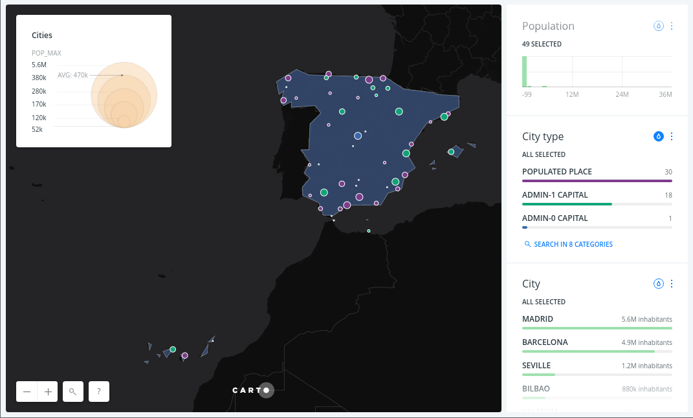
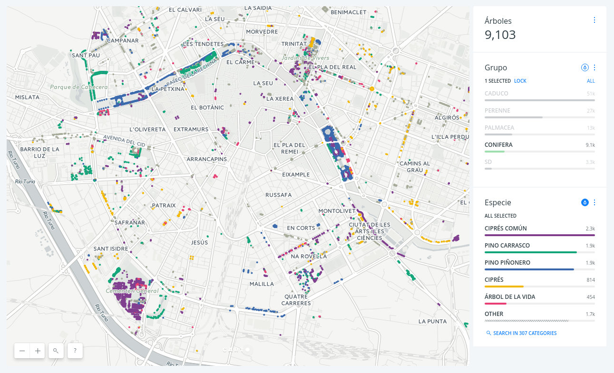
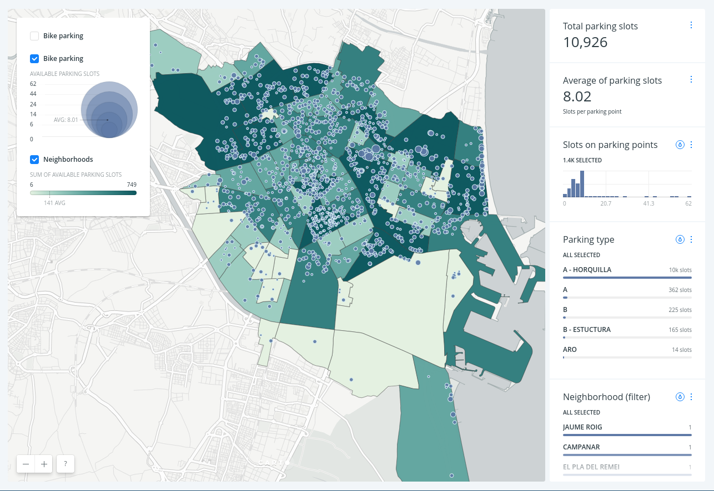

CARTO Training Course for Valencia Techfest 2017
==================================================

## [http://bit.ly/170503-carto-techfest](http://bit.ly/170503-carto-techfest)

This training was designed as a **3** hours training for [Valencia Techfest 2017](http://www.ctranspa.webs.upv.es/techfest/).

In order to access the complete training on CARTO technologies, you have to go to [the master branch](http://bit.ly/carto-workshop). The contents are separated into modules and are meant to be made sequentially going from the most basic usage for GIS and analysts up to the advanced development section for attendants with more knowledge about web mapping development and so on. Modules can be easily combined to finally make a 1 week full training but they can be also split to make a longer training with half day duration.

## Agenda

### Introduction to CARTO

- Duration: 15 minutes
- Audience: General public interested in CARTO and location intelligence.
- Content:
  * [Introduction to CARTO](https://docs.google.com/presentation/d/1vJjkaCpaC6z-fwkeh5I0vqUP_eZtAcFQM0qVmreax58/pub)

Introduction to CARTO as a platform: product positioning, general overview of the portfolio and examples of how CARTO can solve different use cases.

### Introduction to CARTO BUILDER

- Duration: 1 hour
- Audience: General public with basic knowledge on geomatics, databases and data analysis.
- Content:
  * [Introduction to CARTO BUILDER](https://docs.google.com/presentation/d/1onz0nPvOsCge9SiaCunqlevcLDs-eQCSA3nl9ecja-c/pub)
  * [Basic Demo](01-basic.md)
  * [Result](https://xurxosanz.carto.com/builder/c5a779cc-2f61-11e7-8b23-0e233c30368f/embed)

This section will cover the basics and workflows of BUILDER (CARTO's web interface) for generating cartographic data visualizations. We'll dig into new BUILDER features and some differences with old Editor. During this first part, we'll cover those aspects related to data visualizations, cartographic styles, legend's and popups definition, analysis and dashboard creation with actionable Widgets that interact with the map.

### Exercise: Valencia trees dashboard

- Duration: 30 minutes
- Audience: General public with basic knowledge on geomatics, databases and data analysis.
- Content:
  - [San Francisco tree map exercise](https://github.com/CartoDB/carto-workshop/blob/master/01-builder-visualization/exercises/sf-trees.md)
  - [Arbolado](http://gobiernoabierto.valencia.es/en/resource/?ds=arbolado&id=4dbc28fc-48d8-42fd-89fc-936febb21624) at Valencia Open Data portal.
  - [Result](https://xurxosanz.carto.com/builder/7acddb98-2f58-11e7-8edb-0ecd1babdde5/embed)

The idea of this exercise is to replicet the SF tree map using Valencia tree inventory from the city open data portal, so you create a map that allows to explore the different types of trees and their species, as well as the total number of trees. See the following screenshot to get an idea of the final result you should achieve.

### Exercise: Valencia bike parking dashboard

- Duration: 45 minutes
- Audience: General public with basic knowledge on geomatics, databases and data analysis.
- Content:
  - [Valencia bikes](02-valencia-bikes.md)
  - [Result](https://xurxosanz.carto.com/builder/e5e528b0-2f75-11e7-a6ef-0e3ebc282e83/embed)

## Q&A

- Duration: 15 minutes
- You can post (and check!) your questions in [GIS StackExchange forum adding `carto` tag](http://gis.stackexchange.com/questions/tagged/carto).

