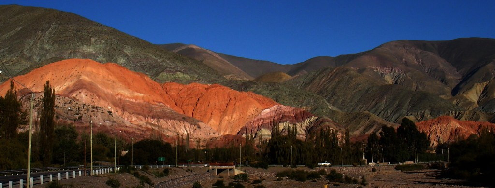
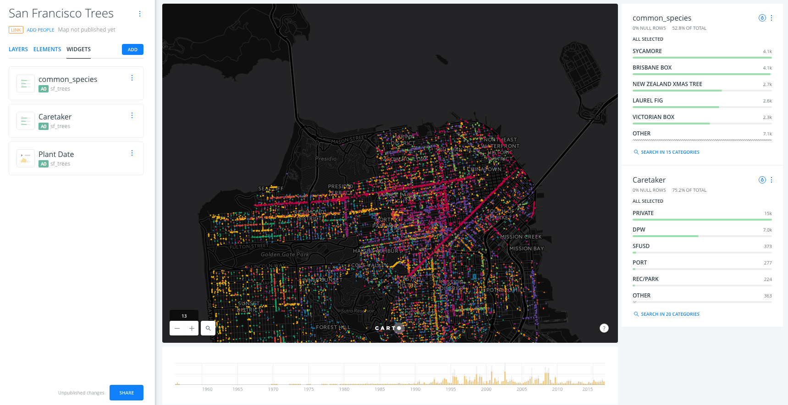
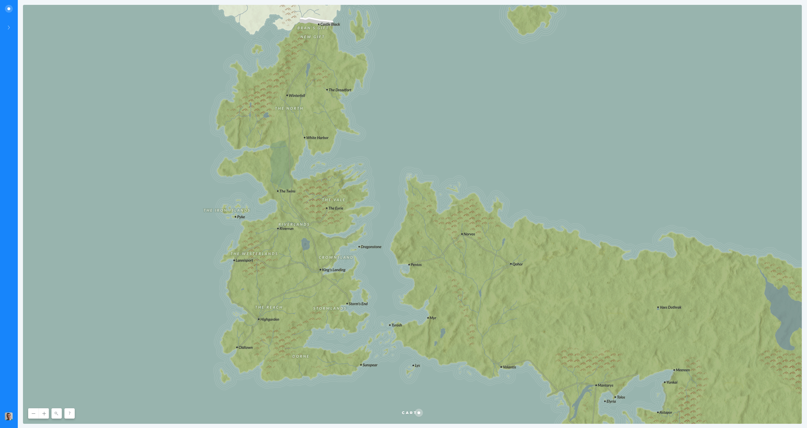

# Taller BUILDER - FOSS4G Argentina 2017

## [http://bit.ly/171024-foss4g-ar](http://bit.ly/170718-foss4g-ar)

Este training se ha diseñado para ser impartido en 4 horas durante el [FOSS4G Argentina 2017](http://www.foss4g-ar.org/).

Puedes acceder a todo nuestro material de formación en la [rama `master` de este repositorio](https://github.com/CartoDB/carto-workshop). Los contenidos están separados en diferentes módulos que van de forma incremental avanzando desde el uso más básico para todo tipo de técnicos SIG y analistas hasta desarrolladores y usuarios avanzados con conocimientos de aplicaciones web, bases de datos, desarrollo de aplicaciones móviles, etc. Los módulos se pueden combinar fácilmente para conformar hasta una semana completa de formación.

## Agenda

### Introducción a CARTO

Breve introducción a CARTO como plataforma: posicionamiento y revisión general del portfolio.

* Duración: 15 minutos
* [Introduction to CARTO](https://docs.google.com/presentation/d/1epfHq4TYhEp__WsUOtFNYGOqPtMLFwdarWr-7xCAyRE/pub)

### Introducción a CARTO BUILDER

Introducción a las principales características y elementos de interfaz de usuario de BUILDER.

* Duración: 30 minutos
* [Introduction to CARTO Builder](https://docs.google.com/presentation/d/1cvENuNqK7HoOvqcbHHATXFIBUx968yI43wFxj5MG8x4/pub).

### Ejercicio 1 de BUILDER exercise 1: Visualización de datos

El objetivo de este primer ejercicio es mostrar en un cuadro de mando (*dashboard*) los diferentes tipos de árboles de la ciudad de San Farncisco, así cómo cuándo fueron plantados.

* Duración: 60 minutos
* [San Francisco Tree Map](https://github.com/CartoDB/carto-workshop/blob/master/01-builder-visualization/exercises/sf-trees.md)

### Ejercicio 2 de BUILDER: Análisis geográfico

En este ejercicio vamos a ver cómo usar las capacidades de análisis y de creación de *dashboards* en BUILDER para determinar la localización de tiendas ficticias basadas en la localización y valor de un grupo de clientes potenciales en la ciudad de Portland.

* Duración: 60 minutos
* [Sales Territory exercise](https://github.com/CartoDB/carto-workshop/blob/master/02-builder-analysis/exercises/portland.md)

### Ejercicio 3 de BUILDER: Visualización cartográfica

En este ejercicio vamos a ir más allá de las funcionalidades de la interfaz de usuario y vamos a crear un mapa basado en las novelas de *Canción de Hielo y Fuego*.

* Duración: 60 minutos
* [Cartography exercise](https://github.com/CartoDB/carto-workshop/blob/master/03-cartography/exercises/got.md)

## Q&A
  * Duración: 15 minutos
  * Más allá del taller os invitamos a pasaros por la etiqueta `carto` de [GIS StackExchange](https://gis.stackexchange.com/questions/tagged/carto) y participar preguntando y esperamos también respondiendo :smile:.