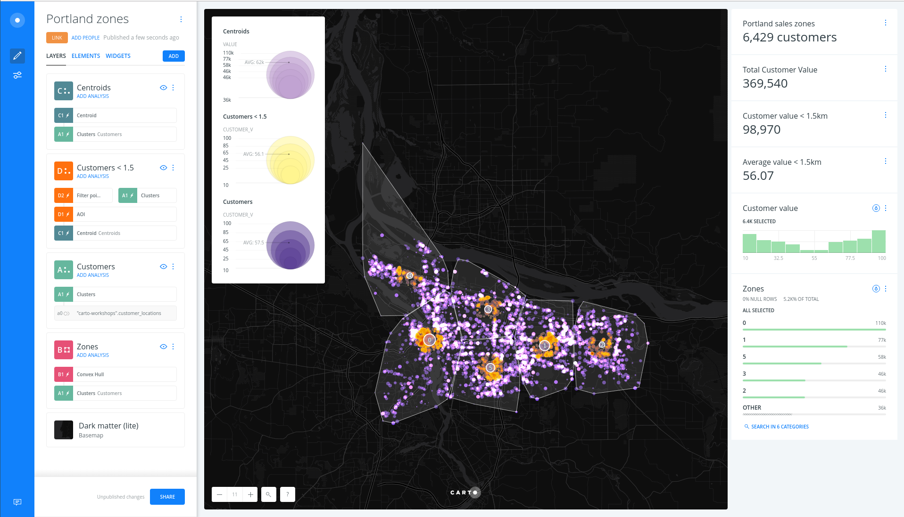
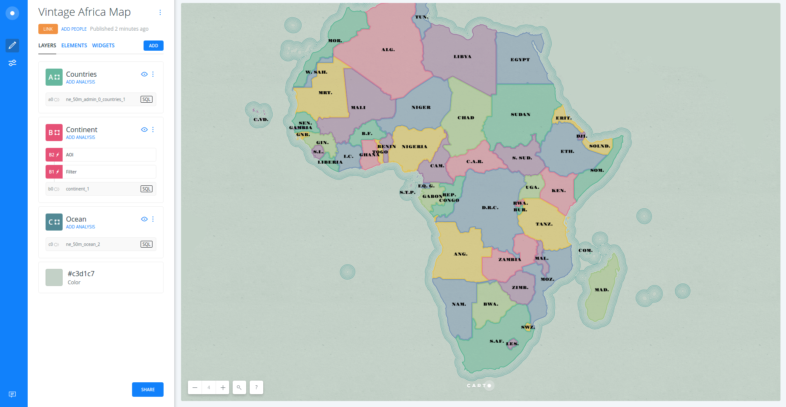

CARTO BUILDER Training for SIG LIBRE 2017
============================================

This training was designed as a 4 hours training for [11as Jornadas de SIG Libre](http://www.sigte.udg.edu/jornadassiglibre/).

In order to access the complete training on CARTO technologies, you have to go to the [master branch](https://github.com/CartoDB/carto-workshop). The contents are separated into modules and are meant to be made sequentially going from the most basic usage for GIS and analysts up to the advanced development section for attendants with more knowledge about web mapping development and so on. Modules can be easily combined to finally make a 1 week full training but they can be also split to make a longer training with half day duration.

## Agenda

### Introduction to CARTO

Introduction to CARTO as a platform: product positioning, general overview of the portfolio and examples of how CARTO can solve different use cases.

* Duration: 15 minutes
* Audience: General public interested in CARTO and location intelligence.
* Content:
  * [Introduction to CARTO](https://docs.google.com/presentation/d/1o_Mh1xdkYG0fJys_VUVh_FGehkZXOa39ZF-g62n40Q0/present?usp=sharing)

### Introduction to CARTO BUILDER

Introduction to the main BUILDER features and User Interface element.

* Duration: 30 minutes
* Content:
  * [Introduction to CARTO Builder](https://docs.google.com/presentation/d/1vbgbKqQRv5YB5T1aaTw924Q-KXocpo2tTDBZ0w1HALk/present?usp=sharing).

### BUILDER exercise 1: Data Visaulization with CARTO

* Duration: 30 minutes
* Content: To Be Defined

### BUILDER exercise 2: Geospatial Analysis

In this exercise we will see how to use CARTO analysis and widgets to find a new location to create a store depending on the location and value of the clients of Portland.

* Duration: 1 hour
* Content:
  * [Sales Territory exercise](https://github.com/CartoDB/carto-workshop/blob/master/02-builder-analysis/exercises/portland.md)

### BUILDER exercise 3: Geospatial Analysis and auto-styling

In this exercise we will apply auto-styling feature to make the invisible of our data visible.

* Duration: 30 minutes
* Content:
 * [L-train exercise](https://github.com/CartoDB/carto-workshop/blob/master/02-builder-analysis/exercises/l_line.md)

### BUILDER exercise 4: Cartography visualization

In this exercise we will go further of default UI to define cartography symbololgy and will use CartoCSS and TurboCARTO to create a beautiful map.

* Duration: 1 hour
* Content:
  * [Risk analysis exercise](https://github.com/CartoDB/carto-workshop/blob/master/02-builder-analysis/exercises/railways.md)

## Q&A
  * Duration: 15 min
  * You can post (and check!) your questions in [GIS StackExchange forum adding carto tag](https://gis.stackexchange.com/questions/tagged/carto)
