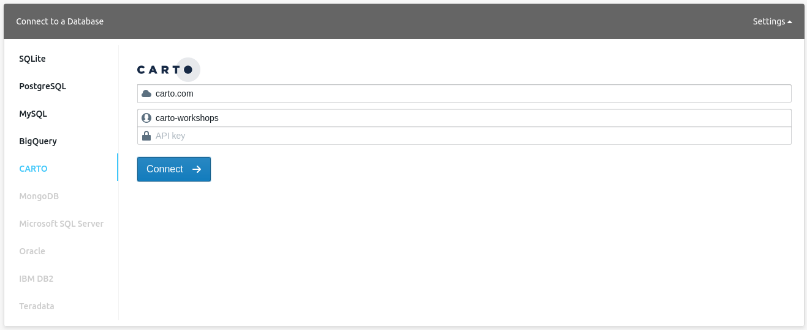
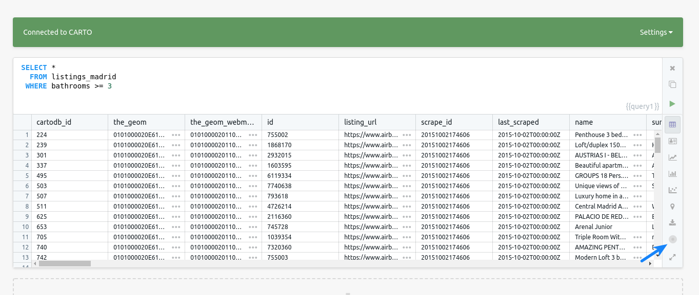
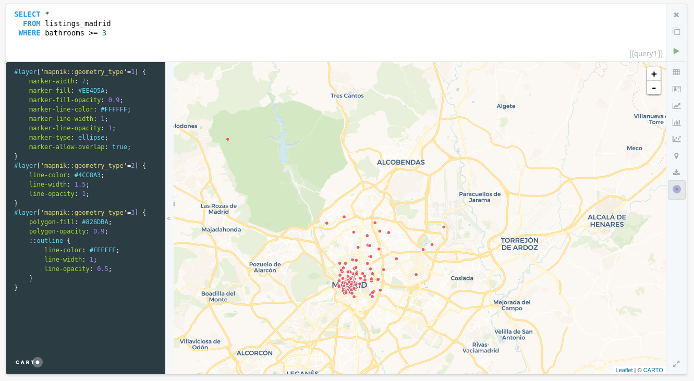
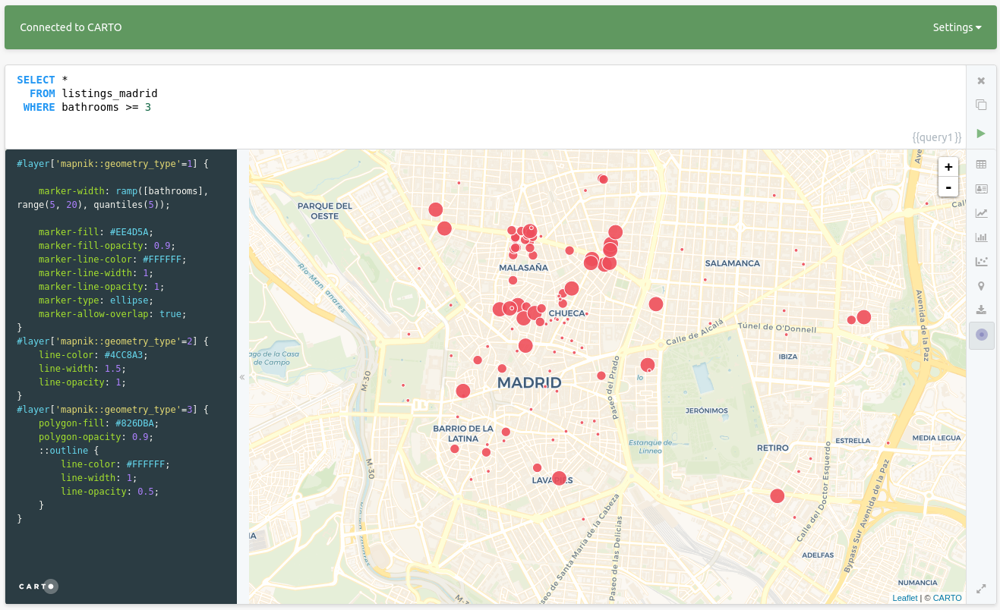
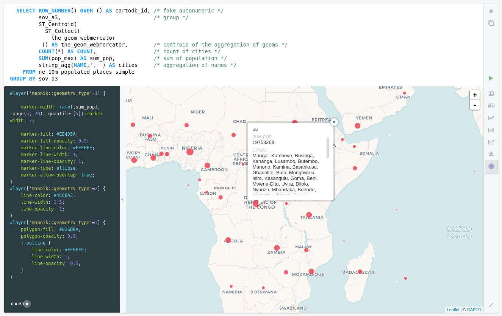
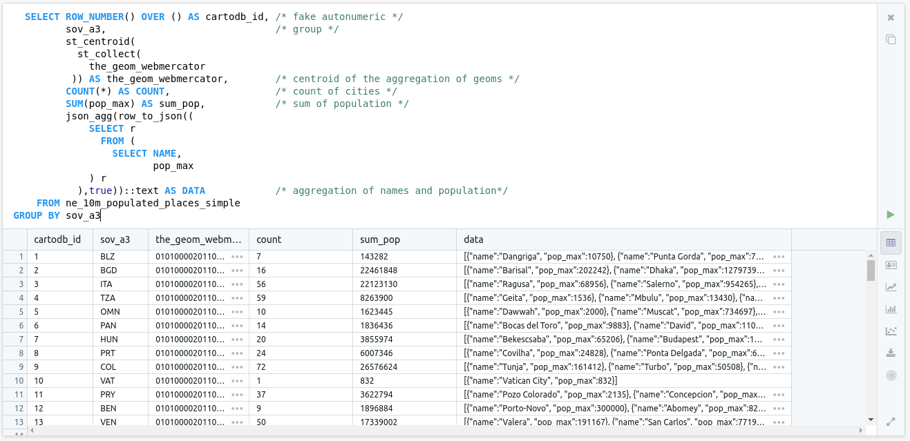

# FOSS4G UK 2018 Postgres - PostGIS workshop

 

## [http://bit.ly/180309-postgis](http://bit.ly/180309-postgis)

This is a **one hour** training about the [Postgres database](https://www.postgresql.org/) and [PostGIS](http://postgis.net/) the extension to allow to work with geospatial information. This is not an introduction so if you are not familiar with SQL, Postgres and PostGIS we recommend you to start with these resources:

* [SQL for non-techies](https://docs.google.com/presentation/d/1LRa6HHdtUCrxl7Kh4wjgTktkigoihVekuhwH-dW5jv8/edit#slide=id.p)
* [Simple SQL operations](https://github.com/CartoDB/carto-workshop/blob/master/04-database/exercises/sql-easy.md)
* [Spatial SQL](https://github.com/CartoDB/carto-workshop/blob/master/04-database/exercises/sql-spatial.md)


## Agenda

* Set up
* Functionality
* Performance

## Set up

For this workshop we will use [CARTO](https://carto.com) as a convenient way to interact with Postgres, no installation or configuration for you. You don't even need an account because we'll use some public demo datasets.

As a client for this workshop we will use a web application that can interact with CARTO, it's called [Franchise]() and you can access to an instance of it with the CARTO connector enabled here: [https://franchise.carto.io/](https://franchise.carto.io/).

Use the following parameters:

* Host name: `carto.com`
* User name: `carto-workshops`
* API key: you can leave this empty



Once connected you can run `SELECT` queries against any public dataset from that account.

Some tables you have available are:

* `ne_10m_populated_places_simple`: Natural Earth populated places
* `ne_110m_admin_0_countries`: Natural Earth country boundaries
* `railroad_data`: Railroad accidents in the USA
* `barcelona_building_footprints`: Barcelona blocks
* `lineas_madrid`: Madrid metro lines
* `listings_madrid`: Madrid Airbnb listings

You can try for example a simple query like this one and hit `Control+Enter` or the `play` button in the bottom right corner of the SQL panel.

```sql
select * 
  from listings_madrid
 where bathrooms >= 3
 ```

You'll get a typical table view of the response, that allows you to explore the different fields and rows of your query result.

 

 If you hit the small CARTO icon in the bottom right of the result panel, Franchise switches to a geographical result.

 

 This map uses the [CartoCSS](https://carto.com/docs/carto-engine/cartocss/properties/) language to define how data is rendered. By default it just accepts all three geometry types (points, lines, polygons) with a simple red symbology, but you are free to change it, just press `Control+Enter` or `Cmd+Enter` to apply the new settings. You can even leverage [TurboCARTO](https://github.com/CartoDB/turbo-carto) to generate legends quickly, for example you can render those listings by the number of bathrooms changing the default `marker-width` property by this expression:

 ```css
 marker-width: ramp([bathrooms], range(5, 20), quantiles(5));
 ```

 

 CartoCSS and TurboCARTO are out of the scope of this training, you can find more training materials on the [cartography section](https://github.com/CartoDB/carto-workshop/tree/master/03-cartography) of this repository.

 ## Functionality

 ### Rendering one to many relationships or clustering

 In many ocasions we need to display geometries that

 - Represent a one to many relationship like having a stores dataset to join to a table with monthly sales reports, or a countries dataset with evolution over time of an index.
 - Represent dense datasets where we need to aggregate geometries to understand how they are distributed

 In both cases we are displaying a geometry that has many records associated to it, but still we want to be able to see those individual records in our applications (for example on popups).

#### Exercise: Aggregate cities

```sql
  select row_number() over () as cartodb_id, /* fake autonumeric */
         sov_a3,                             /* group */
         ST_Centroid(
           ST_Collect(
             the_geom_webmercator
          )) as the_geom_webmercator,        /* centroid of the aggregation of geoms */
         count(*) as count,                  /* count of cities */
         sum(pop_max) as sum_pop,            /* sum of population */
         string_agg(name,', ') as cities     /* aggregation of names */
    from ne_10m_populated_places_simple
group by sov_a3
```



Concatenating strings can be enough, but sometimes our data can have more complex structures, or we want to have more fields. We can leverage the support in Postgres for JavaScript objects. This is actually also convenient for web development.


```sql
  select row_number() over () as cartodb_id, /* fake autonumeric */
         sov_a3,                             /* group */
         st_centroid(
           st_collect(
             the_geom_webmercator
          )) as the_geom_webmercator,        /* centroid of the aggregation of geoms */
         count(*) as count,                  /* count of cities */
         sum(pop_max) as sum_pop,            /* sum of population */
         json_agg(row_to_json((
             select r
               from (
                 select name,
                        pop_max
             ) r
           ),true))::text as data            /* aggregation of names and population*/
    from ne_10m_populated_places_simple
group by sov_a3
```



Using `::text` to allow display in Franchise, in real applications your postgres client will convert it into text for you.

