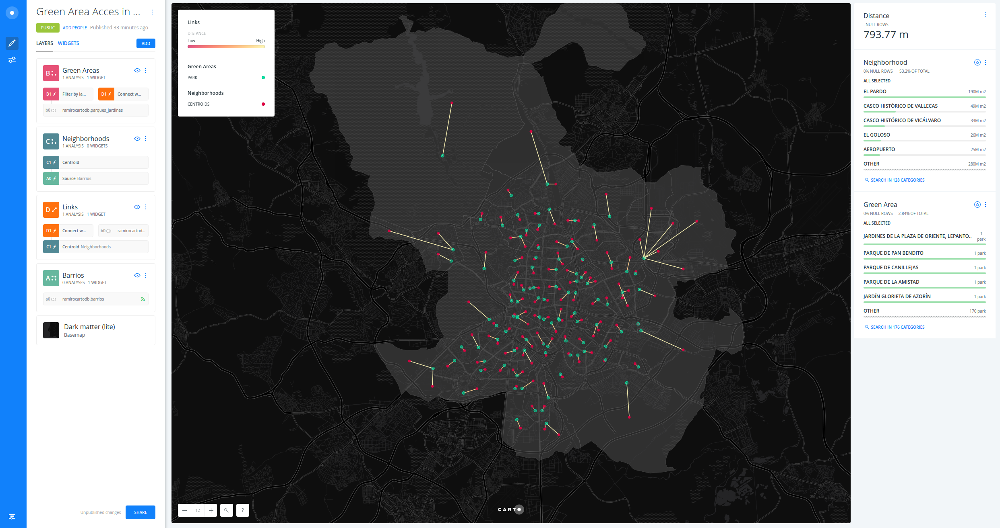

# Green Area Access in Madrid

* *Degree of Difficulty*: **
* *Goal*: detect 
* *Features Highlighted*:
  * Basic features
* *Datasests needed*:
  * Madrid neighborhoods: `barrios`. You can connect it to your account from CARTO Data Library.
  * Madrid green areas: `parques_jardines`. You can download it from [here](https://team.carto.com/u/ramirocartodb/tables/builder-demo.parques_jardines/public/table) as a csv file.

## Step-by-step tutorial

1. Create a map selecting `barrios` and `parques_jardines` you have just imported/connected to your account.
2. Rename map and layer names.
3. Add `Centroid from geometries` analysis to `barrios` layer.
4. Drag the `centroids` node out, thus creating a new layer.
5. Add `Connect with lines` analysis to `centroids` layer, setting `parques_jardines` as source and checking closest. 
6. Drag the `lines` node out.
7. Add `Filter by layer` analysis to `parques_jardines` layer, setting `lines` as source and `cartodb_id` and `closest_id` as key columns.
8. Style.
9. Add an average formula widget using `length` from `lines` layer.
10. Add two category widgets, both using `name` field from `barrios` and `parques_jardines` layers.
11. Publish.

## Result

Link: https://team.carto.com/u/ramirocartodb/builder/f1578f68-f81f-11e6-8d0e-0ecd1babdde5/embed

