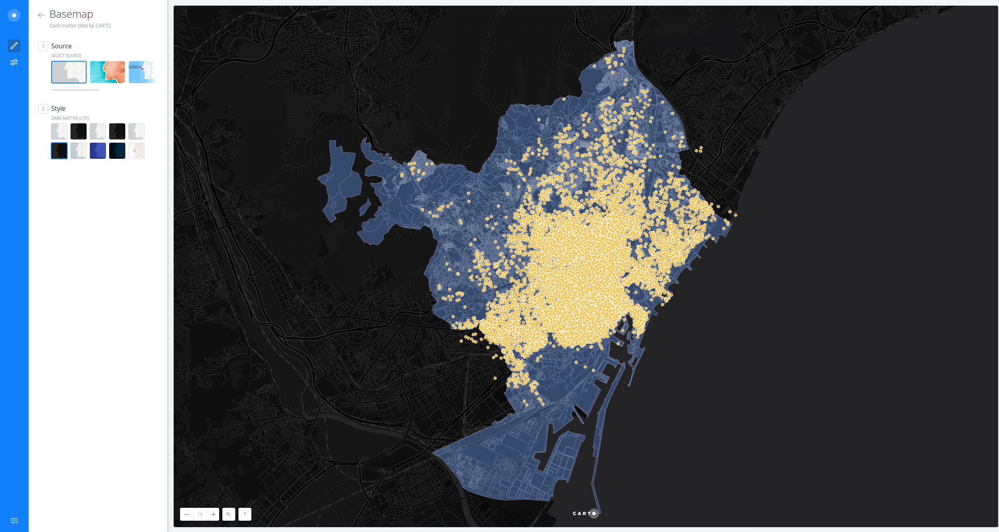
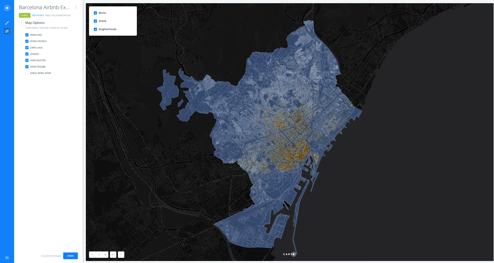
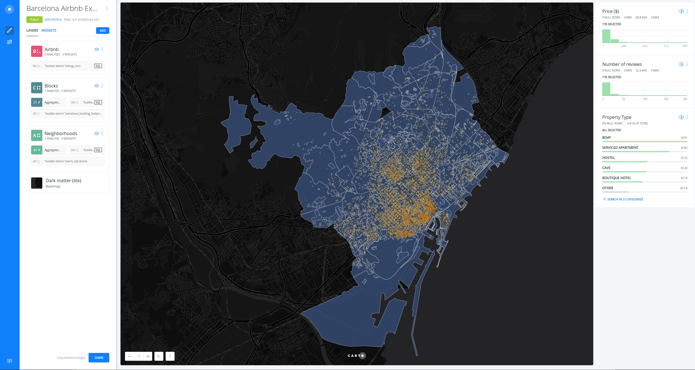

# Barcelona Airbnb Exercise

* *Degree of Difficulty*: *
* *Goal*: find those blocks and neighbourhoods with the number of Airbnb houses/rooms.
* *Features Highlighted*:
  * Data edition and filter:
    * SQL console.
    * Dynamic filtering by widgets.
    * Layer selector.
  * Data Visualization:
    * Change basemap.
    * Blending methods.
    * Style `marker-fill` by value (_choropleth_).
    * Custom legends.
  * Geospatial analysis:
    * Intersect second layer.
* *Datasests needed*:
  * Barcelona Airbnb data: `airbnb_barcelona`. You can download it from [here](https://builder-demo.carto.com/api/v2/sql?q=SELECT * FROM listings_bcn&format=csv&filename=listings_barcelona).
  * Barcelona building footprint and neighborhoods: `barcelona_building_footprint` and `barris_barcelona` can be found in CARTO Data Library.

> Barcelona Airbnb dataset was downloaded from the [Inside Airbnb](http://insideairbnb.com/get-the-data.html) website. In order to download them to your local machines, you are using [CARTO SQL API](https://carto.com/docs/carto-engine/sql-api) behind the scenes.

<hr>

## Guides

* Create a map with `airbnb_barcelona` (from your local machine), and `barcelona_building_footprint` and `barris_barcelona` datasets (from the Data Library).
* Change the map title and layer names.
* Change basemap: click on "Positron" and then select "Dark Matter (Lite)".



* Go to **`Map Options`** (the slider kind of button at the blue left sidebar), activate `LAYER SELECTOR`.
* Go back to the main menu.



* Style "Airbnb" layer. Set `marker-width` to 2, remove `STROKE` and set a `BLENDING` method such as `multiply`.
* Apply the following SQL query to the "Airbnb" layer in order to get the prize as a numeric field:

```sql
SELECT 
  *, 
  substring(price FROM '[0-9]+')::numeric as price_num 
FROM 
  listings_barcelona
```

* Add some widgets from "Airbnb" layer (`price_num`, `property_type` and `number_of_reviews`, for example). We will add widgets from the other two layers later. Edit them.
* Add `Intersect second layer` to "Blocks" and "Neighborhoods" layers. Set "Airbnb" as `INTERSECT LAYER` and `COUNT` as `OPERATION`.



* Add `n_distri` and `n_barri` widgets from "Neighborhoods" layer. Order their categories based on `count_vals` (you can use any aggregate function but `COUNT`).
* Add `ref_cadast` widget from "Blocks" layer. Order their categories based on `count_vals`. 
* Style "Blocks" and "Neighborhoods" as a choropleth. For each layer, go to the **`STYLE`** tab. Secondly, click on the `polygon-fill` color bar and select `BY VALUE`. Select `count_vals_density`. Set the number of `buckets`, color palette (but flip the colors! Lighter colors should show higher values in contrast to the dark basemap) and classification method as you wish.

> We have selected `count_vals_density` instead of `count_vals`, because when we make a choropleth map with polygon layers we need to use data which is normalized, in this case by the area.

* Edit the "Blocks" and "Neighborhoods" legends.
* Add a custom legend for "Airbnb" layer. Go to **`LEGEND`** tab, then click on `CUSTOM` and type "House/room".


* Disable "Airbnb" and "Blocks" layers view.
* Publish the map: https://team.carto.com/u/builder-demo/builder/f014ea60-030f-11e7-b3bb-0e3ebc282e83/embed


<hr>
