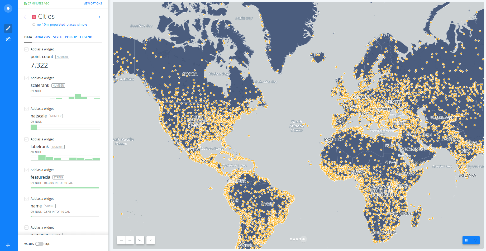
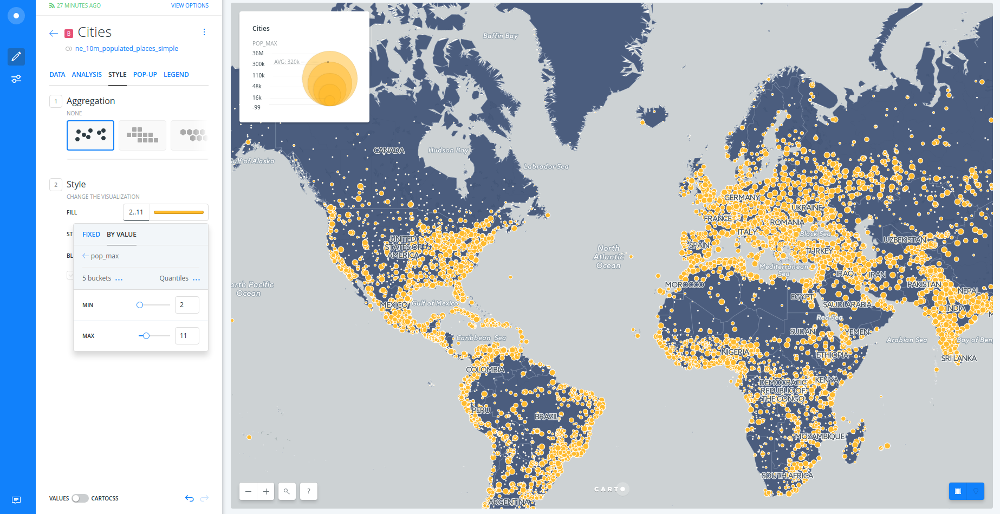
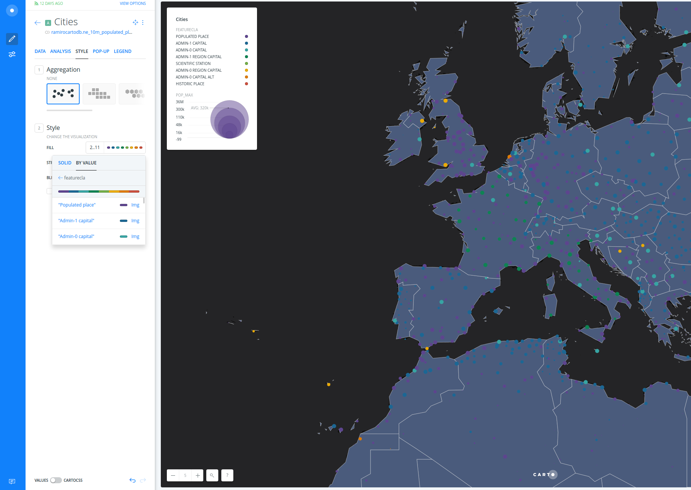
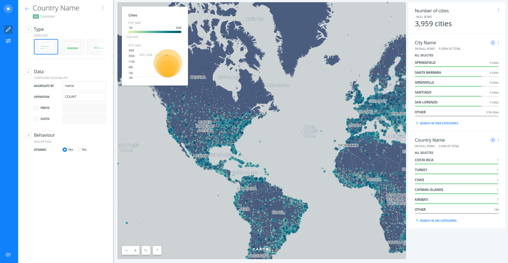

# Basic Demo

* *Degree of Difficulty*: *
* *Goal*: Getting started with CARTO BUILDER.
* *Features Highlighted*:
  * Basic features
* *Datasests needed*:
  * World borders: `world_borders`.
  * Populated places: `ne_10m_populated_places_simple`.

## Contents

<!-- MarkdownTOC -->

- 1. Create a map
- 2. Layers
- 3. Style layer
- 4. Widgets
- 5. Analysis
- 6. Publish

<!-- /MarkdownTOC -->

## 1. Getting started 

### 1.1. Create a map 

* Click on **`NEW MAP`**.
* Clik on **`SEARCH`** and type "world borders".
* Select `world_borders` dataset.
* Click on **`CREATE MAP`**.
* You can rename the map and layer title as "Countries & Cities" and "Countries" respectively, doing double click over them.

 

<figcaption>A view of BUILDER main dashboard</figcaption>

### 1.2. Layers 

* Add a new layer:
  * Click on **`ADD`**.
  * Click on **`SEARCH`** and type "populated places".
  * Select `ne_10m_populated_places_simple` dataset.
  * Click on **`ADD LAYER`**.
* You can rename the title of this new layer as "Cities".
* Click on the layer to show its components: 
  * **`DATA`**
  * **`ANALYSIS`**
  * **`STYLE`**
  * **`POP-UP`**
  * **`LEGEND`**

 

<figcaption>A view of BUILDER layer main menu</figcaption>

### 1.3. Styling 

* Create a bubble (proportional symbols) map:
  * Click on **`STYLE`**.
  * Click on point-size number.
  * Select **`BY VALUE`**.
  * Select `pop_max` column.

 

<figcaption>A view of BUILDER bubble map</figcaption>

 

* Create a chroropleth map:
  * Click on `marker-fill` column.
  * Select **`BY VALUE`**.
  * Select `pop_max` column.
  * You can customize your map further changing (and flipping) a different color palette, the number of buckets and quantification method.

 

<figcaption>A view of BUILDER bubble & choropleth map</figcaption>

 

* To learn more about how this works behind the scenes check out the CartoCSS panel.

 

* Create a bivaraite map:
  * Click on `marker-fill` column.
  * Select **`BY VALUE`**.
  * Select `featurecla` column.
  * You can customize your map further removing the line stroke or giving more transparency from the CartoCSS panel.

 

<figcaption>A view of BUILDER bivariate map</figcaption>

### 1.4. Widgets 

* Add widgets to "Cities" layer:
  * Click on **`DATA`**.
  * Select `point count` in order to show the number of cities.
  * Select `name` in order to filter by city name.
  * Click on **`EDIT`** in order to customize both widgets.
* Add widgets to "Countries" layer:
  * Click on **`LAYERS`**.
  * Click on "Countries" layer.
  * Click on **`DATA`**.
  * Select `name` in order to filter by country name.
  * Click on **`EDIT`** in order to customize both widgets.
* Now you can filter by country and city name. But as you can see cities are not filtered when filtering by their country. In order to solve this we are going to add an analysis.

 

<figcaption>A view of BUILDER widgets</figcaption>

### 1.5. Analysis 

* Go back to the main menu.
* Click on **`ADD ANALYSIS`** just below "Cities".
* Select **`Filter by layer`** analysis.
* Click on **`ADD ANALYSIS`**.
* Set the parameters as follows:
  * `FILTER BY LAYER`: "Countries".
  * `SOURCE COLUMN`: `sov_a3`.
  * `FILTER COLUMN`: `iso3`.
* Now fitering by country (for instance, Spain), you are also filtering the cities within that country. 

 

<figcaption>A view of BUILDER filtering and analysis power</figcaption>

### 1.6. Publish 

* Click on **`SHARE`**.
* Set to `LINK` or `PUBLIC`.
* Click on **`PUBLISH`**.
* Now you can share the map as link or embed.

 

<iframe width="100%" height="520" frameborder="0" src="https://team.carto.com/u/ramirocartodb/builder/23cd250b-ffd9-4267-806f-b935716eeb8c/embed" allowfullscreen webkitallowfullscreen mozallowfullscreen oallowfullscreen msallowfullscreen></iframe>

---
