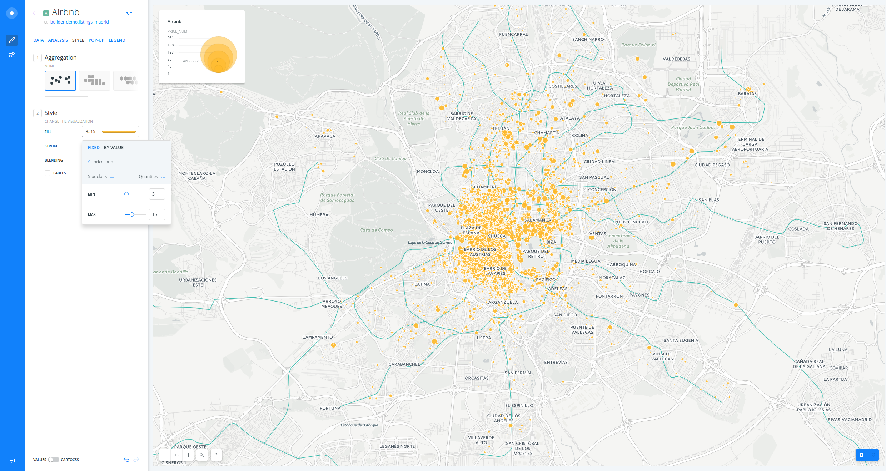

# European Coutries & Cities Demo

* *Degree of Difficulty*: *
* *Goal*: Getting started with CARTO BUILDER.
* *Features Highlighted*:
  * Basic features
  * Filter by layer analysis
* *Datasests needed*:
  * European cities: `europe_cities`. You can download it from [here](https://ramirocartodb.carto.com/api/v2/sql?q=SELECT * FROM europe_cities&format=csv&filename=europe_cities).
  * Eruopean countries: `europe_countries`. You can download it from [here](https://ramirocartodb.carto.com/api/v2/sql?q=SELECT * FROM europe_countries&format=shp&filename=europe_countries).

<br>

> Both datasets were generated from [Natural Earth Data](http://www.naturalearthdata.com/) that are freely available in CARTO Data Library. In order to download them to your local machines, you are using [CARTO SQL API](https://carto.com/docs/carto-engine/sql-api) behind the scenes.

<hr>

## Contents

<!-- MarkdownTOC -->

- 1. Create a map
- 2. Layers
- 3. Style layer
- 4. Widgets
- 5. Analysis
- 6. Publish

<!-- /MarkdownTOC -->


## 1. Getting started <a name="getting-started"></a>

### 1.1. Create a map <a name="map"></a>

* Click on **`NEW MAP`**.
* Clik on **`CONNECT DATASET`**.
* Drag and drop.
* Click on **`CREATE MAP`**.
* Click on `Don't show me this again` to avoid modals.
* You can rename the map and layer title as "European Countries & Cities" and "Countries" respectively, doing double click over them.

<br>


<figcaption>A view of BUILDER main dashboard</figcaption>

<hr>


### 1.2. Layers <a name="layers"></a>

* Add a new layer:
  * Click on **`ADD`**.
  * Clik on **`CONNECT DATASET`**.
  * Copy and paste this url `https://ramirocartodb.carto.com/api/v2/sql?q=SELECT * FROM europe_cities&format=csv` and click on **`SUBMIT`**.
  * Click on **`ADD LAYER`**.
* You can rename the title of this new layer as "Cities".
* Click on the layer to show its components: 
  * **`DATA`**: an overview of your table schema, from here you can also add widgets. If you want to have a look at your layer table, click on the table icon at the right bottom corner of BUILDER.

<br>


<figcaption>A view of BUILDER layer table mode</figcaption>

<hr>

  * **`ANALYSIS`**
  * **`STYLE`**
  * **`POP-UP`**
  * **`LEGEND`**

<br>

> Have a look at the letter and number the layer card has (`A`). This would be very useful for adding widgets and analysis.

<br>


<figcaption>A view of BUILDER layer main menu</figcaption>

<hr>

### 1.3. Styling <a name="styling"></a>

* Create a bubble (proportional symbols) map:
  * Click on **`STYLE`** tab.
  * Click on the point-size number (`7` is the default fixed value).
  * Select **`BY VALUE`**.
  * Select `city_pop` column.

<br>

> Check how the legend is dynamically generated.

<br>

<br>


<figcaption>A view of BUILDER bubble map</figcaption>

<br>

* Create a chroropleth map:
  * Go back to the main menu.
  * Click on "Countries" layer.
  * Click on **`STYLE`** tab.
  * Click on the color bar (dark blue is the default fixed color).
  * Select **`BY VALUE`**.
  * Select `country_pop_norm` column.
  * Set buckets to `7` and the classification method to `Jenks`.

<br>

> In this case, we have decided to use `country_pop_norm` instead of `country_pop` because when making a choropleth map, a good cartography practice is using normalized fields.

<br>


<figcaption>A view of BUILDER bubble & choropleth map</figcaption>

<br>

* You can customize your map further changing (and flipping) a different [CARTOcolors](https://carto.com/carto-colors/), the number of buckets and quantification method.

<br><

> To learn more about how this works behind the scenes check out the CartoCSS panel.

<hr>

### 1.4. Widgets <a name="widgets"></a>

* Add widgets to "Cities" layer:
  * Click on **`DATA`**.
  * Select `name` in order to filter by city name.
  * Click on **`EDIT`** in order to customize both widgets.
* Add widgets to "Countries" layer:
  * Click on **`LAYERS`**.
  * Click on "Countries" layer.
  * Click on **`DATA`**.
  * Select `name` in order to filter by country name.
  * Select `country_pop` in order to filter by country population.
  * Click on **`EDIT`** in order to customize both widgets.
* Now you can filter by country and city name. 

<br>

> But as you can see cities are not filtered when filtering by their country. In order to solve this we are going to add an analysis.

<br>


<figcaption>A view of BUILDER widgets</figcaption>

<hr>

### 1.5. Analysis <a name="analysis"></a>

* Go back to the main menu.
* Click on **`ADD ANALYSIS`** just below "Cities".
* Select **`Filter by layer`** analysis.
* Click on **`ADD ANALYSIS`**.
* Set the parameters as follows:
  * `FILTER BY LAYER`: "Countries".
  * `SOURCE COLUMN`: `iso3`.
  * `FILTER COLUMN`: `iso3`.
* Now fitering by country (for instance, Spain), you are also filtering the cities within that country. 

<br>


<figcaption>A view of BUILDER filtering and analysis power</figcaption>

<hr>

### 1.6. Publish <a name="publish"></a>

* Click on **`SHARE`**.
* Set to `LINK` or `PUBLIC`.
* Click on **`PUBLISH`**.
* Now you can share the map:
  * Link: https://team.carto.com/u/ramirocartodb/builder/33b48b06-fdc3-11e6-b781-0ee66e2c9693/embed
  * iframe:
	```html
	<iframe width="100%" height="520" frameborder="0" src="https://team.carto.com/u/ramirocartodb/builder/33b48b06-fdc3-11e6-b781-0ee66e2c9693/embed" allowfullscreen webkitallowfullscreen mozallowfullscreen oallowfullscreen msallowfullscreen></iframe>
	```

<br>

> Remember to update your map everythime you make a change. Then refresh your embed or website where the map is hosted to see those changes.

<br>

<hr>
