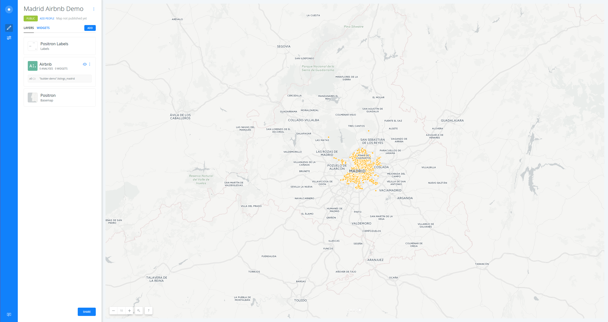
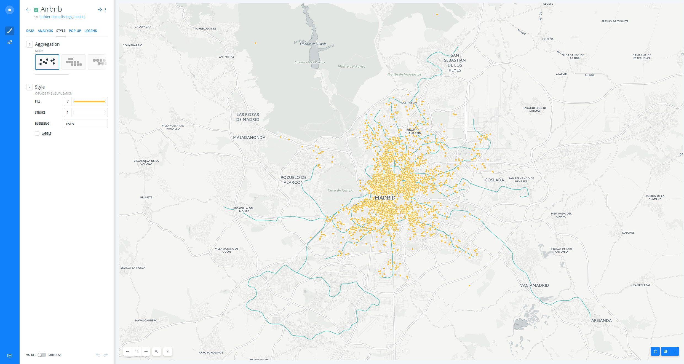
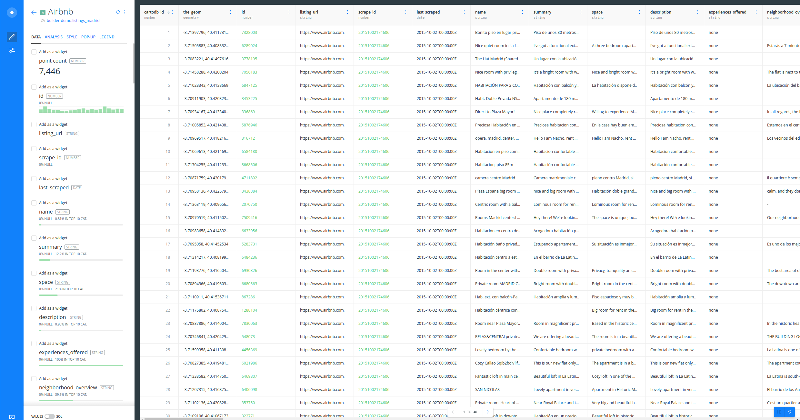
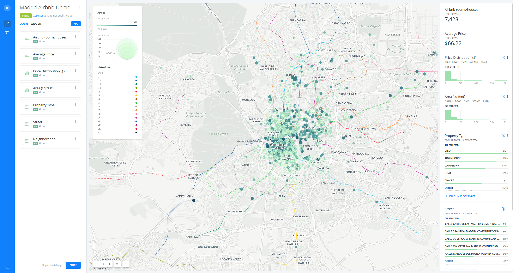
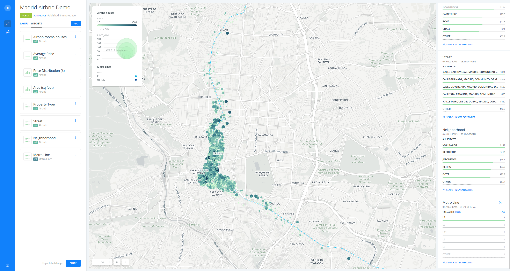

# Madrid airbnb Demo

* *Degree of Difficulty*: **
* *Goal*: Learn the wide diversity of methods to visualize and analyze point data with BUILDER.
* *Features Highlighted*:
  * Data edition and filter:
    * SQL console.
    * Dynamic filtering by widgets.
  * Data Visualization:
    * Style `marker-width` by value (_bubbles_).
    * Style `marker-fill` by value (_choropleth_).
    * CartoCSS and TurboCARTO console.
  * Geospatial analysis:
    * Create areas of influence analysis (_buffers_).
    * Filter points in polygons analysis.
* *Datasests needed*:
  * Madrid Airbnb data: `listings_madrid`. You can download it from [here](https://builder-demo.carto.com/api/v2/sql?q=SELECT * FROM listings_madrid&format=csv&filename=listings_madrid).
  * Madrid metro lines: `lineas_madrid`. You can download it from [here](https://builder-demo.carto.com/api/v2/sql?q=SELECT * FROM lineas_metro&format=shp&filename=lineas_madrid).

> Both datasets were originally downloaded from the [Inside Airbnb](http://insideairbnb.com/get-the-data.html) and [Nomecalles](http://www.madrid.org/nomecalles/DescargaBDTCorte.icm) websites, respectively. In order to download them to your local machines, you are using [CARTO SQL API](https://carto.com/docs/carto-engine/sql-api) behind the scenes.

<hr>

## Contents

1. [Create a map](#map)
2. [Layers](#layers)
3. [Data](#data)
4. [Styling](#styling)
5. [Widgets](#widgets)
6. [Analysis](#analysis)
7. [Publish](#publish)

<hr>

### 1. Create a map <a name="map"></a>

* Click on **`NEW MAP`**.
* Clik on **`CONNECT DATASET`**.
* Drag and drop `listings_madrid` file.
* Click on **`CREATE MAP`**.


<figcaption>A view of Connect Dataset main interface</figcaption>

<hr>

* Click on `Don't show me this again` to avoid modals.
* You can rename the map and layer title as "Madrid Airbnb Demo" and "Airbnb" respectively, doing double click over them.


<figcaption>A view of BUILDER main dashboard</figcaption>

<hr>


### 2. Layers <a name="layers"></a>

* Add a new layer:
  * Click on **`ADD`**.
  * Clik on **`CONNECT DATASET`**.
  * Drag and drop `lineas_madrid` file.
  * Click on **`ADD LAYER`**.
* You can rename the title of this new layer as "Metro Lines".

<br>

> You can order your layers. For instance, try to drag the "Airbnb" layer on top of the "Metro Lines" layer.

* Click on any of the layers to show its components:
  * **`DATA`** 
  * **`ANALYSIS`**
  * **`STYLE`** 
  * **`POP-UP`**
  * **`LEGEND`**


<figcaption>A view of BUILDER layer tabs</figcaption>

<br>

> Have a look at the letter and number the layer card has (`A`). This would be very useful for adding widgets and analysis.

<hr>

### 3. Data <a name="styling"></a>

* The layer `DATA` tab shows you an overview of your table schema, from here you can also add widgets. If you want to have a look at your layer table, click on the table icon at the right bottom corner of BUILDER.


<figcaption>A view of BUILDER layer table mode</figcaption>

<br>

* We can check that the `price` column contains values like `$60`. In order to remove the dollar sign and convert the field into a numeric one, we need to use the advanced mode.
* Open the SQL panel clicking the switch at the bottom left corner of BUILDER:


<figcaption>A view of BUILDER SQL panel</figcaption>

<br>

* Type the following query on your console in order to create a new numeric field called `price_num`:

```sql
SELECT 
  *, 
  substring(price FROM '[0-9]+')::numeric as price_num 
FROM 
  listings_madrid
```

<hr>

### 4. Styling <a name="styling"></a>

* In order to style our layer with this new field, click on the `STYLE` tab.
* Create a bubble (proportional symbols) map:
  * Click on **`STYLE`** tab.
  * Click on the point-size number (`7` is the default fixed value).
  * Select **`BY VALUE`**.
  * Select `price_num` column.
  * Set buckets to `7` and the classification method to `Jenks`.
  * Change the `min` to `3` and `max` to `15`
<br>

> Check how the legend is dynamically generated.


<figcaption>A view of BUILDER bubble map</figcaption>

<br>

* Create a chroropleth map:
  * Go back to the main menu.
  * Click on "Countries" layer.
  * Click on **`STYLE`** tab.
  * Click on the color bar (dark blue is the default fixed color).
  * Select **`BY VALUE`**.
  * Select `price_num` column.
  * Set buckets to `7` and the classification method to `Jenks`.
  * Last, remove the `STROKE`.


<figcaption>A view of BUILDER bubble & choropleth map</figcaption>

<br>

* You can customize your map further changing (and flipping) a different [CARTOcolors](https://carto.com/carto-colors/), the number of buckets and quantification method.

<br>

> To learn more about how this works behind the scenes check out the CartoCSS panel.

<hr>

### 5. Widgets <a name="widgets"></a>

* Add widgets to "Cities" layer:
  * Click on **`DATA`**.
  * Select `name` in order to filter by city name.
  * Click on **`EDIT`** in order to customize both widgets.
* Add widgets to "Countries" layer:
  * Click on **`LAYERS`**.
  * Click on "Countries" layer.
  * Click on **`DATA`**.
  * Select `name` in order to filter by country name.
  * Select `country_pop` in order to filter by country population.
  * Click on **`EDIT`** in order to customize both widgets.
* Now you can filter by country and city name. 

<br>

> But as you can see cities are not filtered when filtering by their country. In order to solve this we are going to add an analysis.


<figcaption>A view of BUILDER widgets</figcaption>

<hr>

### 6. Analysis <a name="analysis"></a>

* Go back to the main menu.
* Click on **`ADD ANALYSIS`** just below "Cities".
* Select **`Filter by layer`** analysis.
* Click on **`ADD ANALYSIS`**.
* Set the parameters as follows:
  * `FILTER BY LAYER`: "Countries".
  * `SOURCE COLUMN`: `iso3`.
  * `FILTER COLUMN`: `iso3`.
* Now fitering by country (for instance, Spain), you are also filtering the cities within that country. 


<figcaption>A view of BUILDER filtering and analysis power</figcaption>

<hr>

### 7. Publish <a name="publish"></a>

* Click on **`SHARE`**.
* Set to `LINK` or `PUBLIC`.
* Click on **`PUBLISH`**.
* Now you can share the map:
  * Link: https://team.carto.com/u/ramirocartodb/builder/33b48b06-fdc3-11e6-b781-0ee66e2c9693/embed
  * iframe: `<iframe width="100%" height="520" frameborder="0" src="https://team.carto.com/u/ramirocartodb/builder/33b48b06-fdc3-11e6-b781-0ee66e2c9693/embed" allowfullscreen webkitallowfullscreen mozallowfullscreen oallowfullscreen msallowfullscreen></iframe>`

> Remember to update your map everythime you make a change. Then refresh your embed or website where the map is hosted to see those changes.


<hr>
