# Basic Demo

* *Degree of Difficulty*: *
* *Goal*: what US counties have higher risk for insuring railroad companies.
* *Features Highlighted*:
  * Widgets: Category, Formula and Time Series.
  * Analysis: Intersect, Outliers & Cluster analysis.
* *Datasests needed*:
  * Railroad accidents (*dot_rail_safety_data*): download it [from the `builder-demo` CARTO account](https://team.carto.com/u/ramirocartodb/tables/builder-demo.dot_rail_safety_data_1/public/map?redirected=true) and import it into CARTO from your local machine.
  * US counties (*cb_2013_us_county_500k*): search and connect via Data Library.

## Contents

<!-- MarkdownTOC -->

- 1. Import and create a map
- 2. Style layer
- 3. Add widgets
- 4. Add US counties layer, start the analysis
- 5. Continue the analysis, get outliers and clusters
- 6. Share and export your results

<!-- /MarkdownTOC -->

## 1. Import and create a map

* Import the *dot_rail_safety_data* csv file into your dataset dashboard.
* Create a new map with it
* You should have a dashboard like this:

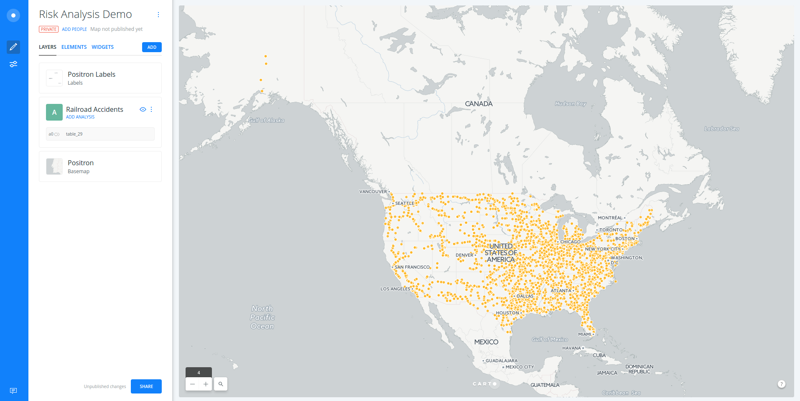

## 2. Style layer

* *FILL*: click on the marker size, select *BY VALUE*, set `total_damage` as the variable and choose a color.
* Change the *STROKE* to `0`.
* Click the slider button from *VALUES* to *CARTOCSS*. With the CartoCSS panel advanced users are allowed to layer style in a more precise way.

> Switch to the CartoCSS view and check how the quantitative map has been defined. You'll see a `ramp()` function. This is TurboCarto, our CartoCSS pre-processor that helps creating parametric symbolization based on column values. Learn more about TurboCarto in this [awesome blog post](https://carto.com/blog/styling-with-turbo-carto/) by our senior cartographer [Mamata Akella](https://mamataakella.carto.com).

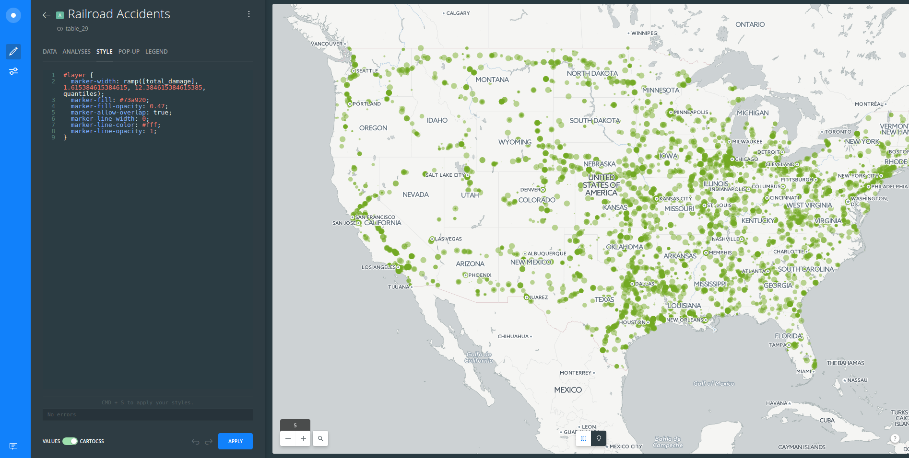

## 3. Add widgets

### 3. 1. Back to the main menu, select *WIDGETS*

* *ADD WIDGET*:
  * *Railroad Companies Category Widget*: select *CATEGORY*, choose *railroad*, and click on *CONTINUE*. In order to rename the widget, come back to the list of widgets and double click on the name and rename it as *Railroad Companies*.
    * Take a look on how CARTO Builder sets a connection between vizualization and widgets. This connection is bidirectional, the map changes widgets values and clicking on categories changes the map.
    * Click on the *Auto style* droplet button to see how each dot is colored according to its category.
    * Disable the *Auto style* to come back to the default visualization.

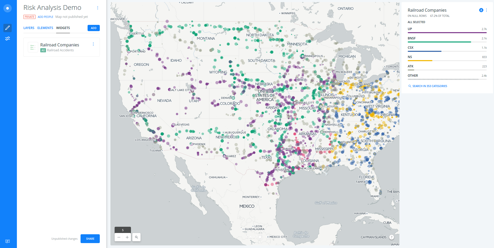

* *Total Damage Formula Widget*: select *FORMULA*, choose *total_damage*, and click on *CONTINUE* and set *OPERATION* to *SUM* and add `$` as *PREFIX*. In order to rename the widget, come back to the list of widgets and double click on the name and rename it as *Total damage*.
    * Again, experimient with the connection between visualization and widgets.
    * Try to filter by company and see how the total damage widget is updated automatically.
    * Change the order of the widgets, you can prioritize visually one over another.

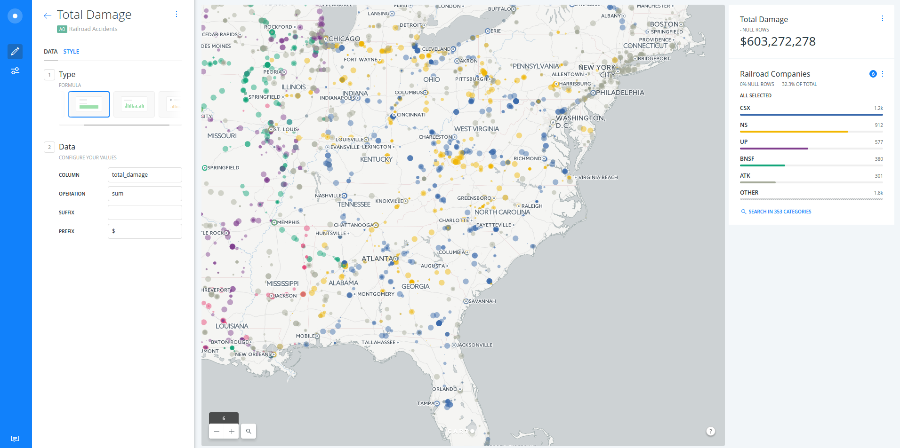

* *Date Time Series Widget*: select *TIME SERIES*, choose *date*, and click on *CONTINUE* in order to rename the widget.

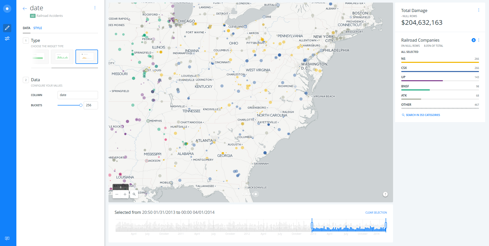

## 4. Add US counties layer, start the analysis

### 4. 1. Back to *LAYERS* pane on Builder user interface, then *ADD*

* Click on *DATA LIBRARY*, type `counties` on the *SEARCH* bar, select the  *cb_2013_us_county_500k* dataset and finally, click on *ADD LAYER*.
* Rename the new layer to "US Counties".

### 4. 2. Click on *US Counties* layer, *ANALYSES*, *ADD ANALYSIS*

* Select *Intersect second layer*: this analysis performs a spatial intersection and aggregates the geometry values from the target layer that intersect with the geometry of the source layer..
  * Select "Railroad accidents" as *TARGET LAYER* and `SUM(total_damage)` as *OPERATION*. Apply.
  * When the analysis is done, an explanatory pop-up will appear. Click on *DONE*.

> **Warning**: if you have not run this analysis before, you could encounter a well known bug. This consist on that instead of polygons, you get points. You can get the right geometry changing the style of the layer.

* First, using the map take a look on the results of the analysis: only the counties overlapping with data points are showed. Secondly, go to the dataset view to show the new column created with the previous analysis, `sum_total_damage`.

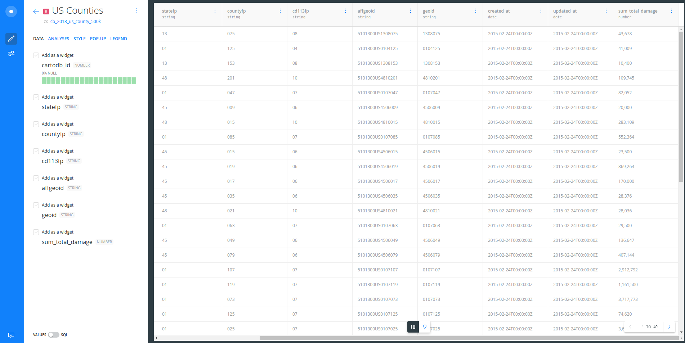

* *Sum Total Damage Histogram Widget*: from the same *DATA* section, click the *Add as a widget* checkbox of the *sum_total_damage* field and *EDIT*. This will create a new histogram widget. Set the buckets to `7` and rename it as *Sum Total Damage*.

* Use the autostyling and removing the visibility of the *Railroad accidents* layer. Remove auto style again. Go back to the main menu.

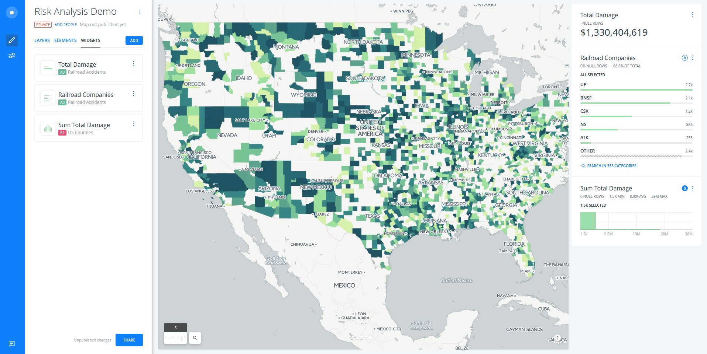

## 5. Continue the analysis, get outliers and clusters

### 5. 1. Click on *ADD ANALYSIS* just below *US Counties*

* Select *Detect outliers and clusters*: this analysis finds areas in your data where clusters of high values or low values exist, as well as areas which are dissimilar from their neighbors.
  * Select `sum_total_damage` as *TARGET COLUMN* and leave the rest of parameters with the default values. *APPLY*.
  * Again, when the analysis is done, an explanatory window will pop up. Click on *DONE*.

* First, using the map show the viewer the results of the analysis: only the counties considered by the analysis as outliers or clusters are showed. Secondly, go to the dataset view to show the new columns created with the previous analysis, `quad` is the more interesting column because it contains the groups resulting from the analysis:

* `HH` and `LL`: clusters of high or low values surrounded by similar values
* `HL` and `LH`: outliers of high or low values surrounded by opposite values

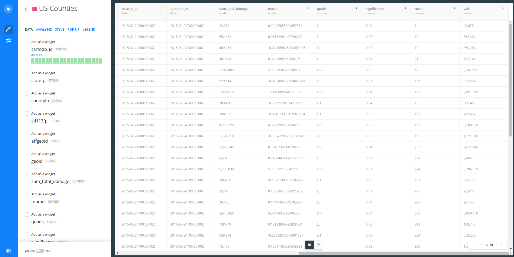

* We are going to add a last widget, *Sum Total Damage Histogram Widget*: click on *WIDGETS*, *ADD*, *Category* and select *quads*. *CONTINUE*. Rename it as *Groups*.

* Filter by `HH` and `HL` counties. Those are counties with high value of total damage surrounded by counties with also high values, and counties with high value of total damage surrounded by counties with low values. Click on the autostyling droplet to better distinguish them. Remove the autostyle.

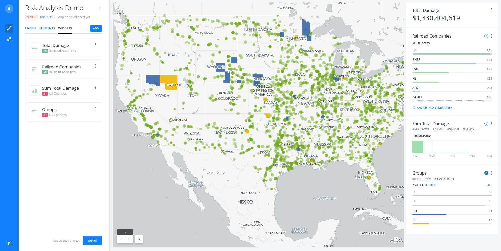

## 6. Share and export your results

### 6. 1. Back to *LAYERS* pane in Builder interface, click the three dots button to open *US Counties* layer menu.

* Select *Export data*, choose *CSV*.
* Open (with Excel or another similar software) the csv file you just download *US_Counties.csv*. Collapse `the_geom` column. You should have 39 counties/rows, containing only `HH` and `HL` values.

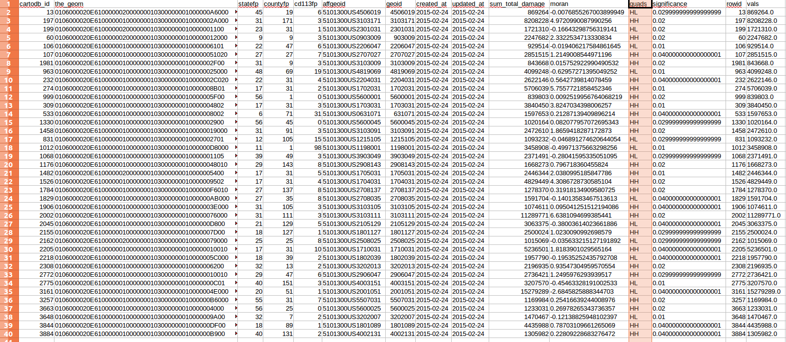

### 6. 2. Back to the main menu, show the publish dialogs

* Below the map title it should show *PRIVATE*, *ADD PEOPLE* and *Map not published yet*. Let's change that.
  * First, click on *PRIVATE*, and again. Select *Link*.
  * Secondly, click on *SHARE* (at the bottom of the *LAYERS* pane). Click on *PUBLISH*, and then *DONE*.
  * Get the link and past it into your browser.

> The dashboard should show your *Railroad accidents* as green dots with sizes depending on the total damage. In addition, all the groups of counties will be displayed. This is because the filters and auto styling you did, it is not applied. Finally, you will have four widgets but in different order.

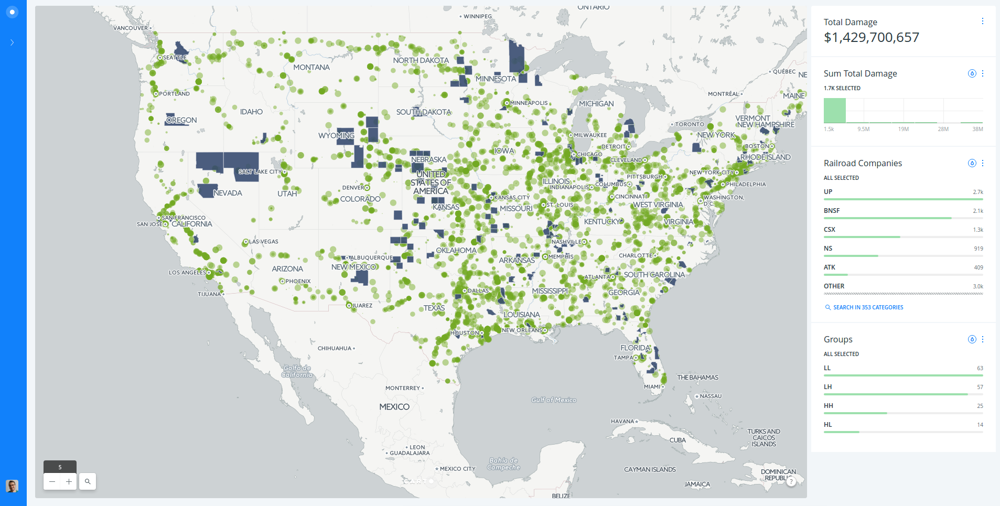

* Back to the main menu, click on *US Counties* layer. Go to the *STYLE* tab. Style the layer with a *FILL* styled *BY VALUE*. Select `quads` as variable and choose a couple of colors that can be easily distinguished.
* Click again on *SHARE* and now in *UPDATE*.
* Now if you go back to your browser tab where you have pasted the link nothing has changed. But if you refresh the page, voilá! The colors have been modified.

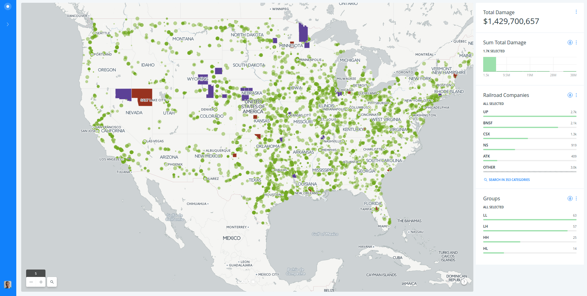

